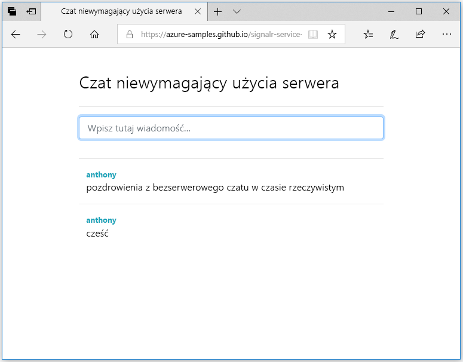

## Uruchamianie aplikacji internetowej

1. Dla Twojej wygody w witrynie GitHub umieszczono przykładową, jednostronicową aplikację internetową. W przeglądarce otwórz stronę [https://azure-samples.github.io/signalr-service-quickstart-serverless-chat/demo/chat-v2/](https://azure-samples.github.io/signalr-service-quickstart-serverless-chat/demo/chat-v2/).

    > [!NOTE]
    > Źródło pliku HTML znajduje się w [/docs/demo/chat-v2/index.html](https://github.com/Azure-Samples/signalr-service-quickstart-serverless-chat/blob/master/docs/demo/chat-v2/index.html).

1. Po wyświetleniu monitu dla funkcji aplikacji podstawowy adres URL, wprowadź `http://localhost:7071`.

1. Po wyświetleniu monitu wprowadź nazwę użytkownika.

1. Aplikacja internetowa wywołuje funkcję *GetSignalRInfo* w aplikacji funkcji, aby pobrać informacje o połączeniu w celu nawiązania połączenia z usługą Azure SignalR Service. Po nawiązaniu połączenia zostanie wyświetlone pole wprowadzania komunikatu czatu.

1. Wpisz komunikat, a następnie naciśnij klawisz Enter. Aplikacja wysyła komunikat do funkcji *SendMessage* w aplikacji Azure Function, która następnie używa powiązania danych wyjściowych usługi SignalR, aby rozpowszechnić komunikat do wszystkich połączonych klientów. Jeśli wszystko działa prawidłowo, komunikat powinien pojawić się w aplikacji.

    

1. Otwórz inne wystąpienie aplikacji internetowej w innym oknie przeglądarki. Zobaczysz, że wszystkie wysłane komunikaty pojawią się we wszystkich wystąpieniach aplikacji.

> [!IMPORTANT]
> Ponieważ ta strona jest obsługiwana przy użyciu protokołu HTTPS, ale lokalne środowisko uruchomieniowe usługi Azure Functions jest przy użyciu protokołu HTTP, domyślnie, przeglądarki (np. Firefox) mogą wymusić zasady zawartością mieszaną które blokuje żądania strony sieci web funkcji. Aby rozwiązać ten problem, należy użyć przeglądarki, która nie ma tego ograniczenia, lub uruchomić lokalny serwer HTTP, takich jak [serwer http](https://www.npmjs.com/package/http-server) w */docs/demo/chat-v2* katalogu. Upewnij się, dodano źródło `CORS` w *local.settings.json*.