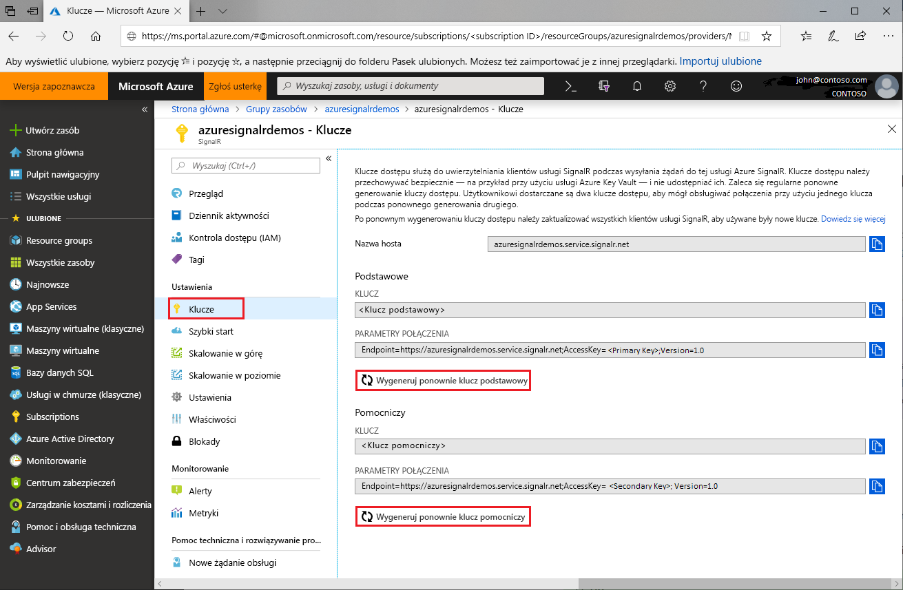

# Wymiana kluczy dostępu do usługi Azure SignalR Service

Każde wystąpienie usługi Azure SignalR Service ma parę kluczy dostępu: klucz podstawowy i pomocniczy. Są one używane do uwierzytelniania klientów SignalR podczas wysyłania żądań do usługi. Klucze są skojarzone z adresem URL punktu końcowego wystąpienia. Należy dbać o bezpieczeństwo kluczy i wymieniać je regularnie. Otrzymujesz dwa klucze dostępu, więc możesz obsługiwać połączenia przy użyciu jednego klucza, a w tym czasie ponownie generować drugi.

## Dlaczego należy wymieniać klucze dostępu?

Ze względów bezpieczeństwa i w celu spełnienia wymagań zgodności zaleca się, aby deweloperzy rutynowo wymieniali klucze dostępu.

## Jak ponownie wygenerować klucze dostępu?

1. Przejdź do witryny [ Azure Portal](https://portal.azure.com/) i zaloguj się przy użyciu swoich poświadczeń.

1. Znajdź sekcję **Klucze** dotyczącą wystąpienia usługi Azure SignalR Service, dla którego chcesz ponownie wygenerować klucze.

1. Kliknij przycisk **Klucze** w menu nawigacji.

1. Kliknij przycisk **Wygeneruj ponownie klucz podstawowy** lub **Wygeneruj ponownie klucz pomocniczy**.

Nowy klucz i odpowiadające mu parametry połączenia zostaną utworzone i wyświetlone.

 

Można również ponownie wygenerować klucze przy użyciu [interfejsu wiersza polecenia platformy Azure](/cli/azure/ext/signalr/signalr/key?view=azure-cli-latest#ext-signalr-az-signalr-key-renew).

## Aktualizowanie konfiguracji za pomocą nowych parametrów połączenia

1. Skopiuj nowo wygenerowane parametry połączenia.

1. Zaktualizuj wszystkie konfiguracje do użycia nowych parametrów połączenia.

1. Uruchom ponownie aplikację, jeśli będzie to potrzebne.

## Wymuszone ponowne generowanie klucza dostępu

Usługa Azure SignalR Service może w niektórych sytuacjach wymuszać obowiązkowe ponowne generowanie klucza dostępu. Usługa powiadomi klientów za pośrednictwem poczty e-mail i powiadomienia w portalu. Jeśli otrzymasz taką wiadomość lub wystąpi błąd usługi ze względu na klucz dostępu, wymień klucze, wykonując czynności przedstawione w tym przewodniku.

## Następne kroki

Zaleca się regularnie wymienianie kluczy dostępu jako dobrą praktykę w zakresie zabezpieczeń.

W tym przewodniku opisano sposób ponownego generowania kluczy dostępu. Przejdź do następnych samouczków dotyczących uwierzytelniania przy użyciu standardu OAuth lub usługi Azure Functions.

> [!div class="nextstepaction"]
> [Integracja z tożsamością platformy ASP.NET Core](./signalr-authenticate-oauth.md)

> [!div class="nextstepaction"]
> [Kompilowanie bezserwerowej aplikacji w czasie rzeczywistym przy użyciu uwierzytelniania](./signalr-authenticate-azure-functions.md)