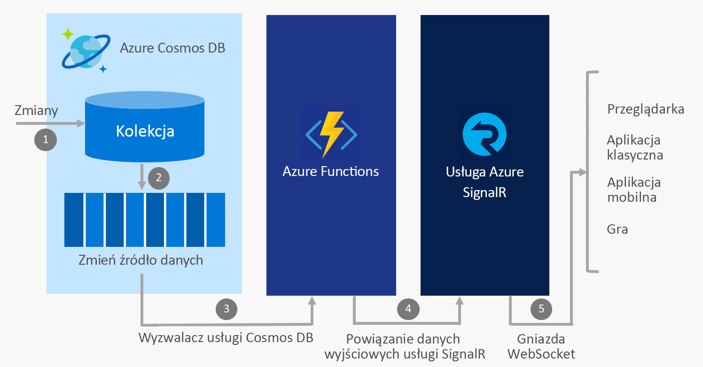

# Tworzenie aplikacji czasu rzeczywistego za pomocą usług Azure Functions i Azure SignalR

Usługi Azure SignalR Service i Azure Functions są w pełni zarządzanymi, wysoce skalowalnymi usługami, które pozwalają skoncentrować się na tworzeniu aplikacji zamiast na zarządzaniu infrastrukturą, dlatego często używa się ich razem, aby zapewnić komunikację w czasie rzeczywistym w środowisku bezserwerowym.

## Integrowanie komunikacji w czasie rzeczywistym z usługami platformy Azure

Usługa Azure Functions umożliwia pisanie kodu w [kilku językach](../azure-functions/supported-languages.md), w tym w językach JavaScript, C# i Java, który wyzwala się przy każdym wystąpieniu zdarzenia w chmurze. Przykładowe zdarzenia to:

* Żądania HTTP i elementu webhook
* Czasomierze okresowe
* Zdarzenia z usług platformy Azure, takich jak:
    - Event Grid
    - Event Hubs
    - Service Bus
    - Zestawienia zmian w usłudze Cosmos DB
    - Magazyn — obiekty blob i kolejki
    - Łączniki usługi Logic Apps, takie jak Salesforce i SQL Server

Używając usługi Azure Functions do zintegrowania tych zdarzeń z usługą Azure SignalR Service, masz możliwość powiadamiania tysięcy klientów przy każdym wystąpieniu zdarzenia.

Niektóre typowe scenariusze dla bezserwerowej obsługi wiadomości w czasie rzeczywistym, które można zaimplementować przy użyciu usług Azure Functions i SignalR Service, obejmują:

* Wizualizowanie danych telemetrycznych z urządzenia IoT na mapie lub pulpicie nawigacyjnym w czasie rzeczywistym
* Aktualizowanie danych w aplikacji podczas aktualizacji dokumentów w usłudze Cosmos DB
* Wysyłanie powiadomień w aplikacji podczas tworzenia nowych zamówień w usłudze Salesforce

## Powiązania usługi SignalR Service dla usługi Azure Functions

Powiązania usługi SignalR dla usługi Azure Functions umożliwiają aplikacji Azure Functions publikowanie komunikatów do klientów połączonych z usługą SignalR. Klienci mogą łączyć się z usługą za pomocą zestawu SDK klienta usługi SignalR, który jest dostępny w językach .NET, JavaScript i Java — kolejne języki zostaną dodane wkrótce.

### Przykładowy scenariusz

Przykładem przedstawiającym sposób użycia powiązania usługi SignalR Service jest użycie usługi Azure Functions do integracji z usługą Azure Cosmos DB i SignalR Service w celu wysyłania komunikatów w czasie rzeczywistym, gdy nowe zdarzenia wystąpią w zestawieniu zmian usługi Cosmos DB.

1. Zmiana zostaje wprowadzona w kolekcji usługi Cosmos DB
2. Zdarzenie zmiany jest przekazywane do zestawienia zmian usługi Cosmos DB
3. Usługa Azure Functions jest wyzwalana przez zdarzenie zmiany przy użyciu wyzwalacza usługi Cosmos DB
4. Powiązanie danych wyjściowych usługi SignalR Service publikuje komunikat dla usługi SignalR Service
5. Usługa SignalR Service publikuje komunikat dla wszystkich połączonych klientów

### Uwierzytelnianie i użytkownicy

Usługa SignalR Service pozwala wysyłać komunikaty do wszystkich klientów lub tylko podzbioru klientów, na przykład należących do jednego użytkownika. Powiązania usługi SignalR Service dla usługi Azure Functions można łączyć z uwierzytelnianiem usługi App Service w celu uwierzytelniania użytkowników za pomocą dostawców, takich jak usługa Azure Active Directory, Facebook lub Twitter. Następnie można wysłać komunikaty bezpośrednio do tych uwierzytelnionych użytkowników.

## Następne kroki

W tym artykule omówiono sposób użycia usługi Azure Functions z usługą SignalR Service w celu włączenia szerokiej gamy scenariuszy dotyczących bezserwerowego przesyłania komunikatów w czasie rzeczywistym. Zapoznaj się z poniższymi przewodnikami Szybki start, aby dowiedzieć się więcej.

* [Szybki start: aplikacja bezserwerowa w usłudze Azure SignalR Service — C#](signalr-quickstart-azure-functions-csharp.md)
* [Szybki start: aplikacja bezserwerowa w usłudze Azure SignalR Service — JavaScript](signalr-quickstart-azure-functions-javascript.md)

