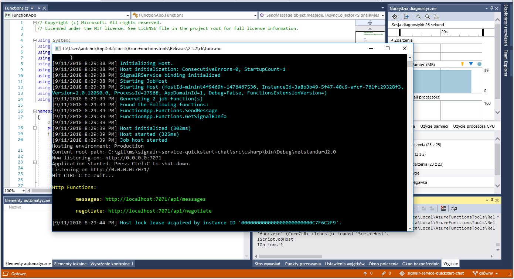

# <a name="quickstart-create-a-chat-room-with-azure-functions-and-signalr-service-using-c"></a>Szybki start: tworzenie pokoju rozmów z usługą Azure Functions i SignalR Service przy użyciu języka C\#

Usługa Azure SignalR Service umożliwia łatwe dodawanie funkcji czasu rzeczywistego do aplikacji. Usługa Azure Functions to bezserwerowa platforma, która pozwala uruchamiać kod bez zarządzania jakąkolwiek infrastrukturą. W tym przewodniku Szybki start dowiesz się, jak utworzyć bezserwerową aplikację czatu w czasie rzeczywistym za pomocą usług SignalR Service i Functions.

## <a name="prerequisites"></a>Wymagania wstępne

Jeśli nie masz jeszcze zainstalowanej programu Visual Studio 2019, możesz pobrać **bezpłatną** [wersję programu Visual Studio 2019 Community Edition](https://www.visualstudio.com/downloads/)i korzystać z niej. Podczas instalacji programu Visual Studio upewnij się, że jest włączona opcja **Programowanie na platformie Azure**.

Ten samouczek można również uruchomić w wierszu polecenia (macOS, Windows lub Linux) przy użyciu [narzędzia Azure Functions Core Tools (v2),](https://github.com/Azure/azure-functions-core-tools#installing)zestawu [.NET Core SDK](https://dotnet.microsoft.com/download)i ulubionego edytora kodu.

[!INCLUDE [quickstarts-free-trial-note](../../includes/quickstarts-free-trial-note.md)]

## <a name="log-in-to-azure"></a>Zaloguj się do platformy Azure.

Zaloguj się do witryny Azure Portal pod adresem <https://portal.azure.com/> przy użyciu danych konta Azure.

[!INCLUDE [Create instance](includes/signalr-quickstart-create-instance.md)]

[!INCLUDE [Clone application](includes/signalr-quickstart-clone-application.md)]

## <a name="configure-and-run-the-azure-function-app"></a>Konfigurowanie i uruchamianie aplikacji funkcji platformy Azure

1. Uruchom program Visual Studio (lub inny edytor kodu) i otwórz rozwiązanie w folderze *src/chat/csharp* sklonowanego repozytorium.

1. W przeglądarce z otwartą witryną Azure Portal potwierdź, że wdrożone wcześniej wystąpienie usługi SignalR Service zostało pomyślnie utworzone, wyszukując jego nazwę w polu wyszukiwania w górnej części witryny. Wybierz wystąpienie, aby je otworzyć.

    

1. Wybierz pozycję **Klucze**, aby wyświetlić parametry połączenia dla wystąpienia usługi SignalR Service.

1. Zaznacz i skopiuj podstawowe parametry połączenia.

1. W programie Visual Studio w Eksploratorze rozwiązań zmień nazwę pliku *local.settings.sample.json* na *local.settings.json*.

1. W pliku **local.settings.json** wklej parametry połączenia jako wartość ustawienia **AzureSignalRConnectionString**. Zapisz plik.

1. Otwórz plik **Functions.cs**. W tej aplikacji funkcji znajdują się dwie funkcje wyzwalane przez protokół HTTP:

    - **GetSignalRInfo** — ta funkcja generuje i zwraca informacje o prawidłowym połączeniu przy użyciu danych wejściowych powiązania *SignalRConnectionInfo*.
    - **SendMessage** — ta funkcja otrzymuje wiadomość rozmowy w treści żądania i używa powiązania danych wyjściowych usługi *SignalR* do rozpowszechnienia komunikatu do wszystkich połączonych aplikacji klienckich.

1. Użyj jednej z następujących opcji, aby uruchomić aplikację funkcji platformy Azure lokalnie.

    - **Visual Studio:** W menu *debugowania* wybierz polecenie *Rozpocznij debugowanie,* aby uruchomić aplikację.

        

    - **Wiersz polecenia:** Wykonaj następujące polecenie, aby uruchomić hosta funkcji.

        ```bash
        func start
        ```

[!INCLUDE [Run web application](includes/signalr-quickstart-run-web-application.md)]

[!INCLUDE [Cleanup](includes/signalr-quickstart-cleanup.md)]

## <a name="next-steps"></a>Następne kroki

W tym przewodniku Szybki start została skusiła i uruchomiła aplikację bezserwerową w programie Visual Studio. W dalszej kolejności zapoznaj się ze sposobem opracowywania i wdrażania funkcji usługi Azure Functions za pomocą programu Visual Studio.

> [!div class="nextstepaction"]
> [Opracowywanie funkcji usługi Azure Functions przy użyciu programu Visual Studio](../azure-functions/functions-develop-vs.md)