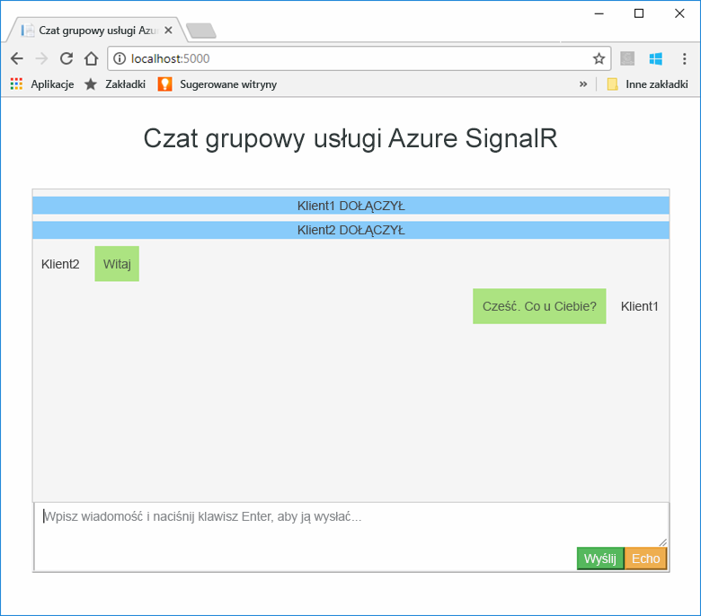
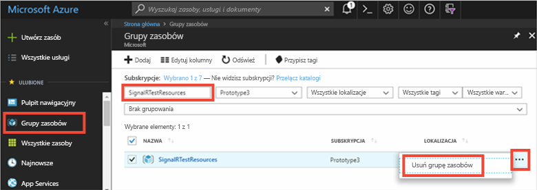

# <a name="quickstart-create-a-chat-room-by-using-signalr-service"></a>Szybki start: Tworzenie pokoju rozmów za pomocą usługi SignalR


Usługa Azure SignalR Service to usługa platformy Azure, która ułatwia deweloperom tworzenie aplikacji internetowych z funkcjami działającymi w czasie rzeczywistym. Usługa ta jest oparta na [SignalR dla ASP.NET Core 2.1,](https://docs.microsoft.com/aspnet/core/signalr/introduction?view=aspnetcore-2.1)ale obsługuje również [SignalR dla ASP.NET Core 3.0.](https://docs.microsoft.com/aspnet/core/signalr/introduction?view=aspnetcore-3.0)

W tym artykule pokazano, jak rozpocząć pracę z usługą Azure SignalR Service. W tym przewodniku Szybki start utworzysz aplikację czatu przy użyciu aplikacji sieci web ASP.NET Core MVC. Ta aplikacja nawiąże połączenie z zasobem usługi Azure SignalR Service, aby umożliwić aktualizacje zawartości w czasie rzeczywistym. Aplikacja internetowa będzie obsługiwać lokalnie i łączyć się z wieloma klientami przeglądarki. Każdy klient będzie mógł wypychać aktualizacje zawartości do innych klientów. 

Do wykonania kroków tego przewodnika Szybki start możesz użyć dowolnego edytora kodu. Jedną z opcji jest [Visual Studio Code](https://code.visualstudio.com/), który jest dostępny na platformach Windows, macOS i Linux.

Kod dla tego samouczka jest dostępny do pobrania w [repozytorium GitHub o nazwie AzureSignalR-samples](https://github.com/aspnet/AzureSignalR-samples/tree/master/samples/ChatRoom). Ponadto można utworzyć zasoby platformy Azure używane w tym przewodniku Szybki start, wykonując tworzenie [skryptu usługi SignalR](scripts/signalr-cli-create-service.md).

[!INCLUDE [quickstarts-free-trial-note](../../includes/quickstarts-free-trial-note.md)]


## <a name="prerequisites"></a>Wymagania wstępne

* Zainstaluj pakiet [.NET Core SDK](https://www.microsoft.com/net/download/windows).
* Pobrane lub sklonowane repozytorium GitHub [AzureSignalR-sample](https://github.com/aspnet/AzureSignalR-samples) 

## <a name="create-an-azure-signalr-resource"></a>Tworzenie zasobu usługi Azure SignalR

[!INCLUDE [azure-signalr-create](../../includes/signalr-create.md)]

## <a name="create-an-aspnet-core-web-app"></a>Tworzenie aplikacji internetowej ASP.NET Core

W tej sekcji można użyć [interfejsu wiersza polecenia .NET Core (CLI)](https://docs.microsoft.com/dotnet/core/tools/) do utworzenia projektu aplikacji sieci web ASP.NET Core MVC. Zaletą korzystania z interfejsu wiersza polecenia .NET Core w programie Visual Studio jest to, że jest on dostępny na platformach Windows, macOS i Linux. 

1. Utwórz folder dla projektu. Ten przewodnik Szybki start używa folderu *E:\Testing\chattest.*

2. Aby utworzyć projekt, uruchom następujące polecenie w nowym folderze:

        dotnet new mvc


## <a name="add-secret-manager-to-the-project"></a>Dodawanie narzędzia Secret Manager do projektu

W tej sekcji dodasz [narzędzie Secret Manager](https://docs.microsoft.com/aspnet/core/security/app-secrets) do projektu. Narzędzie Secret Manager przechowuje poufne dane do pracy deweloperskich poza drzewem projektu. Takie podejście pomaga zapobiegać przypadkowemu udostępnianiu wpisów tajnych aplikacji w kodzie źródłowym.

1. Otwórz plik *csproj*. Dodaj element `DotNetCliToolReference`, aby uwzględnić narzędzia *Microsoft.Extensions.SecretManager.Tools*. Dodaj również `UserSecretsId` element, jak pokazano w poniższym kodzie dla *chattest.csproj*i zapisz plik.

    ```xml
    <Project Sdk="Microsoft.NET.Sdk.Web">
    <PropertyGroup>
        <TargetFramework>netcoreapp2.0</TargetFramework>
        <UserSecretsId>SignalRChatRoomEx</UserSecretsId>
    </PropertyGroup>
    <ItemGroup>
        <PackageReference Include="Microsoft.AspNetCore.All" Version="2.0.0" />
    </ItemGroup>
    <ItemGroup>
        <DotNetCliToolReference Include="Microsoft.VisualStudio.Web.CodeGeneration.Tools" Version="2.0.0" />
        <DotNetCliToolReference Include="Microsoft.Extensions.SecretManager.Tools" Version="2.0.0" />
    </ItemGroup>
    </Project>    
    ```

## <a name="add-azure-signalr-to-the-web-app"></a>Dodawanie usługi Azure SignalR do aplikacji internetowej

1. Dodaj odwołanie do `Microsoft.Azure.SignalR` pakietu NuGet, uruchamiając następujące polecenie:

        dotnet add package Microsoft.Azure.SignalR

2. Uruchom następujące polecenie, aby przywrócić pakiety dla projektu:

        dotnet restore

3. Dodaj wpis tajny o nazwie *Azure:SignalR:ConnectionString* do narzędzia Secret Manager. 

    Ten wpis tajny będzie zawierać parametry połączenia umożliwiające dostęp do zasobu usługi SignalR Service. *Azure:SignalR:ConnectionString* jest domyślnym kluczem konfiguracji, który SignalR szuka do ustanowienia połączenia. Zastąp wartość w poniższym poleceniu ciągiem połączenia dla zasobu usługi SignalR.

    To polecenie należy uruchomić w tym samym katalogu co plik *csproj.*

    ```
    dotnet user-secrets set Azure:SignalR:ConnectionString "<Your connection string>"    
    ```

    Tajny menedżer będzie używany tylko do testowania aplikacji sieci web, gdy jest hostowana lokalnie. W późniejszym samouczku wdrożysz aplikację internetową czatu na platformie Azure. Po wdrożeniu aplikacji sieci web na platformie Azure użyjesz ustawienia aplikacji zamiast przechowywania ciągu połączenia z Menedżerem tajnym.

    Ten klucz tajny jest dostępny za pomocą interfejsu API konfiguracji. Dwukropek (:) działa w nazwie konfiguracji z interfejsem API konfiguracji na wszystkich obsługiwanych platformach. Zobacz [Konfiguracja według środowiska](https://docs.microsoft.com/aspnet/core/fundamentals/configuration/index?tabs=basicconfiguration&view=aspnetcore-2.0). 


4. Otwórz *Startup.cs* i zaktualizuj `ConfigureServices` metodę używania usługi `services.AddSignalR().AddAzureSignalR()` Azure SignalR, wywołując metodę tylko dla ASP.NET Core 2:

    ```csharp
    public void ConfigureServices(IServiceCollection services)
    {
        services.AddMvc();
        services.AddSignalR().AddAzureSignalR();
    }
    ```
    W przypadku ASP.NET Core 3+ nie ma `ConfigureServices` potrzeby zmiany metody.

    Nie przekazując parametru do `AddAzureSignalR()`programu , ten kod używa domyślnego klucza konfiguracji dla ciągu połączenia zasobu usługi SignalR. Domyślny klucz konfiguracji to *Azure:SignalR:ConnectionString*.

5. Również w *Startup.cs*, zaktualizować `Configure` metodę, zastępując `app.UseStaticFiles()` wywołanie następującym kodem i zapisz plik, tylko dla ASP.NET Core 2.

    ```csharp
    app.UseFileServer();
    app.UseAzureSignalR(routes =>
    {
        routes.MapHub<Chat>("/chat");
    });
    ```            
    W przypadku ASP.NET Core 3+ zastąp powyższy kod:

    ```csharp
    app.UseFileServer();
    app.UseRouting();
    app.UseAuthorization();

    app.UseEndpoints(routes =>
    {
        routes.MapHub<Chat>("/chat");
    });
    ```

### <a name="add-a-hub-class"></a>Dodawanie klasy centrum

W SignalR koncentrator jest podstawowym składnikiem, który udostępnia zestaw metod, które mogą być wywoływane z klienta. W tej sekcji klasa centrum jest definiowania za pomocą dwóch metod: 

* `Broadcast`: ta metoda rozgłasza komunikat do wszystkich klientów.
* `Echo`: ta metoda wysyła komunikat z powrotem do elementu wywołującego.

Obie metody `Clients` używają interfejsu, który zapewnia ASP.NET Core SignalR SDK. Ten interfejs zapewnia dostęp do wszystkich połączonych klientów, dzięki czemu można wypychać zawartość do klientów.

1. W katalogu projektu dodaj nowy folder o nazwie *Hub*. Dodaj nowy plik kodu centrum o nazwie *Chat.cs* do nowego folderu.

2. Dodaj następujący kod, aby *Chat.cs,* aby zdefiniować klasę centrum i zapisać plik. 

    Zaktualizuj przestrzeń nazw dla tej klasy, jeśli została użyta nazwa projektu inna niż *chattest*.

    ```csharp
    using Microsoft.AspNetCore.SignalR;

    namespace chattest
    {

        public class Chat : Hub
        {
            public void BroadcastMessage(string name, string message)
            {
                Clients.All.SendAsync("broadcastMessage", name, message);
            }

            public void Echo(string name, string message)
            {
                Clients.Client(Context.ConnectionId).SendAsync("echo", name, message + " (echo from server)");
            }
        }
    }
    ```

### <a name="add-the-client-interface-for-the-web-app"></a>Dodawanie interfejsu klienta dla aplikacji sieci Web

Interfejs użytkownika klienta dla tej aplikacji pokoju rozmów będzie składać się z HTML i JavaScript w pliku o nazwie *index.html* w katalogu *wwwroot.*

Skopiuj plik *index.html,* folder *css* i folder *skryptów* z folderu *wwwroot* [repozytorium przykładów](https://github.com/aspnet/AzureSignalR-samples/tree/master/samples/ChatRoom/wwwroot). Wklej je do folderu *wwwroot* projektu.

Oto główny kod *index.html:* 

```javascript
var connection = new signalR.HubConnectionBuilder()
                            .withUrl('/chat')
                            .build();
bindConnectionMessage(connection);
connection.start()
    .then(function () {
        onConnected(connection);
    })
    .catch(function (error) {
        console.error(error.message);
    });
```    

Kod w *index.html* wywołuje, `HubConnectionBuilder.build()` aby nawiązać połączenie HTTP do zasobu Azure SignalR.

Jeśli połączenie zostanie nawiązane pomyślnie, zostanie przekazane do metody `bindConnectionMessage`, która dodaje procedury obsługi zdarzeń dla przychodzących wypchnięć zawartości do klienta. 

Metoda `HubConnection.start()` uruchamia komunikację z centrum. Następnie `onConnected()` dodaje program obsługi zdarzeń przycisku. Te procedury obsługi używają połączenia w celu umożliwienia temu klientowi wpychania aktualizacji zawartości do wszystkich połączonych klientów.

## <a name="add-a-development-runtime-profile"></a>Dodawanie profilu środowiska uruchomieniowego programowania

W tej sekcji dodasz środowisko wykonawcze rozwoju dla ASP.NET Core. Aby uzyskać więcej informacji, zobacz [Praca z wieloma środowiskami w ASP.NET Core](https://docs.microsoft.com/aspnet/core/fundamentals/environments).

1. Utwórz folder o nazwie *Właściwości* w projekcie.

2. Dodaj nowy plik o nazwie *launchSettings.json* do folderu z następującą zawartością i zapisz plik.

    ```json
    {
        "profiles" : 
        {
            "ChatRoom": 
            {
                "commandName": "Project",
                "launchBrowser": true,
                "environmentVariables": 
                {
                    "ASPNETCORE_ENVIRONMENT": "Development"
                },
                "applicationUrl": "http://localhost:5000/"
            }
        }
    }
    ```


## <a name="build-and-run-the-app-locally"></a>Lokalne kompilowanie i uruchamianie aplikacji

1. Aby utworzyć aplikację przy użyciu interfejsu wiersza polecenia .NET Core, uruchom następujące polecenie w powłoce poleceń:

        dotnet build

2. Po pomyślnym zakończeniu kompilacji uruchom następujące polecenie, aby uruchomić aplikację sieci web lokalnie:

        dotnet run

    Aplikacja będzie hostowana lokalnie na porcie 5000, zgodnie z konfiguracją w naszym profilu środowiska wykonawczego programu rozwoju:

        E:\Testing\chattest>dotnet run
        Hosting environment: Development
        Content root path: E:\Testing\chattest
        Now listening on: http://localhost:5000
        Application started. Press Ctrl+C to shut down.    

3. Otwórz dwa okna przeglądarki. W każdej przeglądarce `http://localhost:5000`przejdź do pliku . Zostanie wyświetlony monit o podanie imienia i nazwiska. Wprowadź nazwę klienta dla obu klientów i testuj zawartość wiadomości wypychania między obu klientów za pomocą przycisku **Wyślij.**

    


## <a name="clean-up-resources"></a>Oczyszczanie zasobów

Jeśli przejdziesz do następnego samouczka, możesz zachować zasoby utworzone w tym przewodniku Szybki start i ponownie ich użyć.

Jeśli skończysz z przykładową aplikacją szybki start, możesz usunąć zasoby platformy Azure utworzone w tym przewodniku Szybki start, aby uniknąć opłat. 

> [!IMPORTANT]
> Usunięcie grupy zasobów jest nieodwracalne i obejmuje wszystkie zasoby w tej grupie. Uważaj, aby nie usunąć przypadkowo niewłaściwych zasobów lub niewłaściwej grupy zasobów. Jeśli utworzono zasoby do obsługi tego przykładu w istniejącej grupie zasobów, która zawiera zasoby, które chcesz zachować, można usunąć każdy zasób indywidualnie z jego bloku zamiast usuwania grupy zasobów.
> 
> 

Zaloguj się do witryny [Azure Portal](https://portal.azure.com) i wybierz pozycję **Grupy zasobów**.

W polu tekstowym **Filtruj według nazwy** wpisz nazwę grupy zasobów. W instrukcjach dla tego przewodnika Szybki start używana była grupa zasobów o nazwie *SignalRTestResources*. W grupie zasobów na liście wyników wybierz wielokropek (**...**) > **Usuń grupę zasobów**.

   



Zobaczysz prośbę o potwierdzenie usunięcia grupy zasobów. Wprowadź nazwę grupy zasobów, aby potwierdzić, a następnie wybierz pozycję **Usuń**.
   
Po krótkim czasie grupa zasobów i wszystkie jej zasoby zostaną usunięte.


## <a name="next-steps"></a>Następne kroki

W tym przewodniku Szybki start utworzono nowy zasób usługi Azure SignalR. Następnie użyto go z aplikacją sieci web ASP.NET Core do wypychania aktualizacji zawartości w czasie rzeczywistym do wielu połączonych klientów. Aby dowiedzieć się więcej na temat korzystania z usługi Azure SignalR, przejdź do samouczka, który demonstruje uwierzytelnianie.

> [!div class="nextstepaction"]
> [Uwierzytelnianie w usłudze Azure SignalR Service](./signalr-concept-authenticate-oauth.md)


