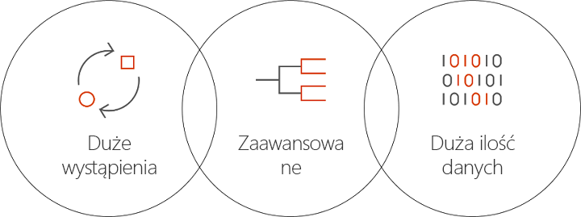

# Czym jest usługa Batch AI na platformie Azure?
Batch AI to zarządzana usługa, która umożliwia naukowcom zajmującym się danymi oraz badaczom sztucznej inteligencji szkolenie modeli sztucznej inteligencji i innych modeli uczenia maszynowego w klastrach z maszynami wirtualnymi platformy Azure, w tym maszynami wirtualnymi z obsługą procesorów GPU. Użytkownik opisuje wymagania dotyczące zadania, miejsce wyszukiwania danych wejściowych oraz miejsce przechowywania danych wyjściowych, a usługa Batch AI zajmuje się resztą.  
 
## Dlaczego warto korzystać z usługi Batch AI? 
Tworzenie zaawansowanych algorytmów sztucznej inteligencji to proces iteracyjny wymagający dużych nakładów w zakresie obliczeń. Naukowcy zajmujący się danymi oraz badacze sztucznej inteligencji pracują z coraz większymi zestawami danych. Opracowują modele o większej liczbie warstw, korzystając z wielu eksperymentów w zakresie projektowania sieci i bardzo szczegółowego dostosowywania parametrów. Efektywne działania w tym zakresie wymagają wielu procesorów CPU lub GPU na model, równoległego uruchamiania eksperymentów oraz zapewnienia udostępnionego magazynu do przechowywania danych szkoleniowych, dzienników i danych wyjściowych modelu.   
 

Naukowcy zajmujący się danymi i badacze sztucznej inteligencji to eksperci w swoich dziedzinach, niemniej problem może stanowić zarządzanie infrastrukturą w odpowiedniej skali. Opracowywanie sztucznej inteligencji w skali wymaga wielu zadań związanych z infrastrukturą, takich jak aprowizacja klastrów maszyn wirtualnych, instalowanie oprogramowania i kontenerów, prace związane z kolejkowaniem, ustalanie priorytetów i harmonogramów zadań, obsługa błędów, dystrybuowanie danych, udostępnianie wyników, skalowanie zasobów w ramach zarządzania kosztami oraz integrowanie z narzędziami i przepływami pracy. Usługa Batch AI zajmuje się tymi zadaniami. 
 
## Co to jest Batch AI? 

Usługa Batch AI zapewnia zarządzanie zasobami oraz planowanie zadań specjalnie na potrzeby szkolenia i testowania sztucznej inteligencji. Do najważniejszych możliwości należą: 

* Uruchamianie długoterminowych zadań wsadowych, eksperymenty iteracyjne oraz szkolenie interaktywne 
* Automatyczne lub ręczne skalowanie klastrów maszyn wirtualnych przy użyciu procesorów GPU lub CPU 
* Konfigurowanie komunikacji SSH pomiędzy maszynami wirtualnymi i na potrzeby dostępu zdalnego 
* Obsługa wszelkich struktur uczenia głębokiego lub uczenia maszynowego, ze zoptymalizowaną konfiguracją dla popularnych zestawów narzędzi, np. [Microsoft Cognitive Toolkit](https://github.com/Microsoft/CNTK) (CNTK), [TensorFlow](https://www.tensorflow.org/) i [Chainer](https://chainer.org/) 
* Kolejki zadań oparte na priorytetach umożliwiające udostępnianie klastrów oraz wykorzystywanie maszyn wirtualnych o niskim priorytecie i rezerwacji platformy Azure  
* Elastyczne opcje magazynowania obejmujące usługę Azure Files i zarządzany serwer NFS 
* Instalowanie zdalnych udziałów plików na maszynie wirtualnej i w opcjonalnym kontenerze 
* Zapewnianie stanu zadań oraz ponownego uruchamiania w przypadku awarii maszyny wirtualnej 
* Dostęp do dzienników danych wyjściowych, stdout, stderr i modeli, w tym przesyłanych strumieniowo z usługi Azure Storage 
* [Interfejs wiersza polecenia](/cli/azure) (CLI) platformy Azure, zestawy SDK dla języków [Python](https://github.com/Azure/azure-sdk-for-python), [C#](https://www.nuget.org/packages/Microsoft.Azure.Management.BatchAI/1.0.0-preview) i Java, monitorowanie w witrynie Azure Portal oraz integracja z narzędziami Microsoft AI 

Zestaw SDK usługi Batch AI obsługuje pisanie skryptów lub aplikacji na potrzeby zarządzania potokami szkolenia oraz integracji z narzędziami. Zestaw SDK obecnie zapewnia interfejsy API dla języków Python, C# i Java oraz interfejs API REST.  
 

Usługa Batch AI używa usługi Azure Resource Manager do operacji na płaszczyźnie kontroli (create, list, get, delete). Usługa Azure Active Directory jest używana do uwierzytelniania i kontroli dostępu opartej na rolach.  
 
## Jak używać usługi Batch AI 

Aby użyć usługi Batch AI, należy zdefiniować *klastry* i *zadania* oraz nimi zarządzać. 

 
**Klastry** opisują wymagania dotyczące obliczeń: 
* Region świadczenia usługi Azure, w którym ma nastąpić uruchomienie 
* Rodzina i rozmiar maszyny wirtualnej do użycia — na przykład maszyna wirtualna NC24 VM, która zawiera 4 procesory GPU NVIDIA K80 
* Liczba maszyn wirtualnych lub minimalna i maksymalna liczba na potrzeby skalowania automatycznego 
* Obraz maszyny wirtualnej — na przykład Ubuntu 16.04 LTS lub [maszyna wirtualna do uczenia głębokiego firmy Microsoft](https://azuremarketplace.microsoft.com/marketplace/apps/microsoft-ads.dsvm-deep-learning)
* Wszelkie woluminy zdalnych udziałów plików do zainstalowania — np. z usługi Azure Files lub serwera NFS zarządzanego przez usługę Batch AI 
* Nazwa użytkownika i klucz SSH lub hasło do skonfigurowania na maszynach wirtualnych w celu włączenia interaktywnego logowania na potrzeby debugowania  
 

**Zadania** opisują następujące elementy: 
* Klaster i region do użycia 
* Liczbę maszyn wirtualnych dla zadania 
* Katalogi wejściowe i wyjściowe do przekazania do zadania podczas uruchomienia. Typowo używany jest udostępniony system plików zainstalowany podczas konfiguracji klastra 
* Opcjonalny kontener do uruchomienia oprogramowania lub skryptu instalacji 
* Konfiguracja właściwa dla struktury sztucznej inteligencji lub wiersz polecenia i parametry na potrzeby uruchamiania zadania 
 

Rozpocznij pracę przy użyciu usługi Batch AI z [interfejsem wiersza polecenia platformy Azure](/cli/azure) oraz plikami konfiguracyjnymi dla klastrów i zadań. Użyj tej metody, aby szybko utworzyć klaster w razie potrzeby i uruchamiać zadania, aby eksperymentować z projektem sieci lub hiper parametrami.  
 

Usługa Batch AI ułatwia równoległe pracowanie z wieloma procesorami GPU. Kiedy zadania należy skalować w wielu procesorach GPU, usługa Batch AI konfiguruje bezpieczną łączność sieciową pomiędzy maszynami wirtualnymi. W przypadku użycia standardu InfiniBand usługa Batch AI konfiguruje sterowniki i uruchamia MPI w węzłach w zadaniu.  

## Zarządzanie danymi
Usługa Batch AI zapewnia elastyczne opcje obsługi skryptów szkolenia, danych i danych wyjściowych:
  
* Użyj **dysku lokalnego** na potrzeby wczesnych eksperymentów i mniejszych zestawów danych. W tym scenariuszu możesz nawiązać połączenie z maszyną wirtualną za pośrednictwem protokołu SSH, aby edytować skrypty i odczytywać dzienniki. 

* Użyj usługi **Azure Files**, aby udostępniać dane szkoleniowe w wielu zadaniach, a także przechowywać dzienniki danych wyjściowych i modele w jednym miejscu. 

* Skonfiguruj **serwer NFS**, aby obsługiwać większe skale danych i maszyny wirtualne na potrzeby szkolenia. Usługa Batch AI może skonfigurować serwer NFS jako specjalny typ klastra z dyskami z kopiami zapasowymi w usłudze Azure Storage. 
 
* **Równoległy system plików** zapewnia dalszą skalowalność na potrzeby danych i szkolenia równoległego. Usługa Batch AI nie zarządza równoległymi systemami plików, ale dostępne są przykładowe szablony wdrożenia dla rozwiązań Lustre, Gluster i BeeGFS.  

## Następne kroki

* Rozpocznij tworzenie pierwszego zadania szkoleniowego Batch AI przy użyciu [interfejsu wiersza polecenia platformy Azure](quickstart-cli.md) lub języka [Python](quickstart-python.md).
* Sprawdź przykładowe [przepisy na szkolenie](https://github.com/Azure/BatchAI) dla różnych platform.

