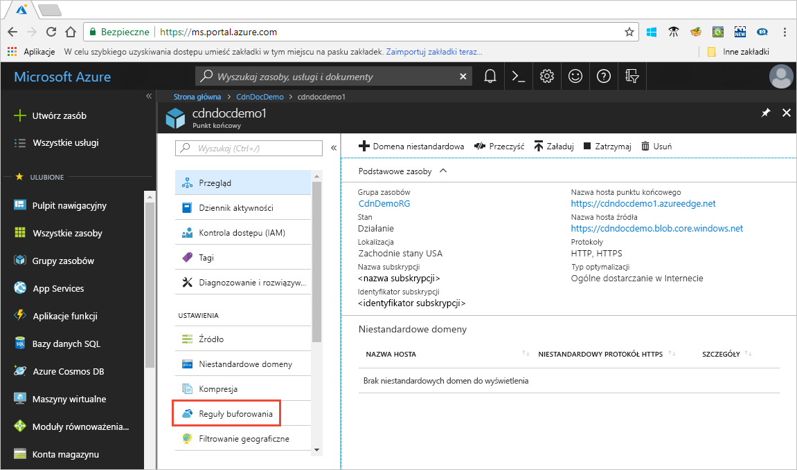

# Sterowanie zachowaniem Azure CDN buforowania przy użyciu reguł buforowania

> [!NOTE] 
> Reguły buforowania są dostępne tylko dla **Azure CDN Standard from Verizon** i **Azure CDN Standard from Akamai** profile. Aby uzyskać **Azure CDN z profilów firmy Microsoft** , należy użyć [standardowego aparatu reguł](cdn-standard-rules-engine-reference.md) dla **Azure CDN Premium w** profilach Verizon, należy użyć [aparatu reguł Verizon w warstwie Premium](cdn-rules-engine.md) w portalu **zarządzania** , aby uzyskać podobną funkcjonalność.
 
Usługa Azure Content Delivery Network (CDN) oferuje dwa sposoby kontrolowania sposobu buforowania plików: 

- Reguły buforowania: w tym artykule opisano, jak można użyć reguł buforowania usługi Content Delivery Network (CDN) w celu ustawienia lub zmodyfikowania domyślnego zachowania wygaśnięcia pamięci podręcznej zarówno globalnie, jak i z warunkami niestandardowymi, takimi jak ścieżka URL i rozszerzenie pliku. Usługa Azure CDN oferuje dwa typy reguł buforowania:

   - Globalne reguły buforowania: można ustawić jedną globalną regułę buforowania dla każdego punktu końcowego w profilu, co wpłynie na wszystkie żądania do punktu końcowego. Globalna reguła buforowania zastępuje wszelkie nagłówki dyrektywy pamięci podręcznej HTTP, jeśli zostały one ustawione.

   - Niestandardowe reguły buforowania: można skonfigurować co najmniej jedną niestandardową regułę buforowania dla każdego punktu końcowego w profilu. Niestandardowe reguły buforowania pasują do określonych ścieżek i rozszerzeń plików, są przetwarzane kolejno i zastępują globalną regułę buforowania, jeśli została ustawiona. 

- Buforowanie ciągu zapytania: można dostosować sposób, w jaki Azure CDN traktuje buforowanie dla żądań z ciągami zapytań. Aby uzyskać więcej informacji, zobacz [Azure CDN sterowania zachowaniem buforowania przy użyciu ciągów zapytań](cdn-query-string.md). Jeśli plik nie jest w pamięci podręcznej, ustawienie buforowania ciągu zapytania nie ma wpływu na reguły buforowania i domyślne zachowania sieci CDN.

Aby uzyskać informacje dotyczące domyślnego zachowania buforowania i nagłówków dyrektywy buforowania, zobacz [jak działa buforowanie](cdn-how-caching-works.md). 

## Uzyskiwanie dostępu do reguł buforowania Azure CDN

1. Otwórz Azure Portal, wybierz profil CDN, a następnie wybierz punkt końcowy.

2. W lewym okienku w obszarze Ustawienia zaznacz pole **Reguły buforowania**.

   

   Zostanie wyświetlona strona **Reguły buforowania**.

   

## Ustawienia zachowania buforowania
W przypadku globalnych i niestandardowych reguł buforowania można określić następujące ustawienia **zachowania buforowania** :

- **Obejście pamięci podręcznej**: nie Buforuj i Ignoruj buforów dostarczonych przez pochodzenie.

- **Zastąpienie**: ignorowanie czasu trwania pamięci podręcznej dostarczonej przez Źródło; Zamiast tego użyj dostarczonego czasu trwania pamięci podręcznej. Nie spowoduje to przesłonięcia kontroli pamięci podręcznej: nie-cache.

- **Ustaw, jeśli brak**: honorowanie dostarczonej przez źródło nagłówka dyrektywy, jeśli istnieją; w przeciwnym razie należy użyć podanego czasu trwania pamięci podręcznej.

## Czas wygaśnięcia pamięci podręcznej
W przypadku globalnych i niestandardowych reguł buforowania można określić czas wygaśnięcia pamięci podręcznej w dniach, godzinach, minutach i sekundach:

- W przypadku **przesłonięcia** i ustawienia w **przypadku braku** ustawień **zachowania buforowania** prawidłowy czas trwania pamięci podręcznej wynosi od 0 sekund do 366 dni. W przypadku wartości 0 sekund Usługa CDN buforuje zawartość, ale należy ponownie zweryfikować każde żądanie z serwerem pochodzenia.

- W przypadku ustawienia **Pomiń pamięć** podręczną wartość czasu trwania pamięci podręcznej jest automatycznie ustawiana na 0 sekund i nie można jej zmienić.

## Warunki dopasowania niestandardowych reguł buforowania

W przypadku niestandardowych reguł pamięci podręcznej dostępne są dwa warunki dopasowania:
 
- **Ścieżka**: ten warunek jest zgodny ze ścieżką adresu URL, z wyłączeniem nazwy domeny i obsługuje symbol wieloznaczny (\*). Na przykład _/myfile.html_, _/My/folder/*_ i _/My/images/*. jpg_. Maksymalna długość to 260 znaków.

- **Rozszerzenie**: ten warunek dopasowuje rozszerzenie pliku żądanego pliku. Można podać listę rozszerzeń plików rozdzielanych przecinkami. Na przykład _jpg_, _MP3_lub _PNG_. Maksymalna liczba rozszerzeń to 50, a maksymalna liczba znaków na rozszerzenie to 16. 

## Kolejność przetwarzania reguły globalnej i niestandardowej
Globalne i niestandardowe reguły buforowania są przetwarzane w następującej kolejności:

- Globalne reguły buforowania mają pierwszeństwo przed domyślnym zachowaniem buforowania usługi CDN (ustawienia nagłówka w formacie HTTP cache-dyrektywy). 

- Niestandardowe reguły buforowania mają pierwszeństwo przed globalnymi regułami buforowania, gdy mają zastosowanie. Niestandardowe reguły buforowania są przetwarzane w kolejności od góry do dołu. Oznacza to, że jeśli żądanie pasuje do obu warunków, reguły znajdujące się u dołu listy mają pierwszeństwo przed regułami w górnej części listy. W związku z tym należy umieścić bardziej szczegółowe reguły w dolnej części listy.

**Przykład**:
- Globalna reguła buforowania: 
   - Zachowanie buforowania: **przesłonięcie**
   - Czas wygaśnięcia pamięci podręcznej: 1 dzień

- Niestandardowa reguła buforowania #1:
   - Warunek dopasowania: **ścieżka**
   - Wartość dopasowania: _/Home/*_
   - Zachowanie buforowania: **przesłonięcie**
   - Czas wygaśnięcia pamięci podręcznej: 2 dni

- Niestandardowa reguła buforowania #2:
   - Warunek dopasowania: **rozszerzenie**
   - Dopasuj wartość: _. html_
   - Zachowanie buforowania: **Ustaw, jeśli brakuje**
   - Czas wygaśnięcia pamięci podręcznej: 3 dni

Gdy te reguły są ustawione, żądanie dla _nazwy hosta&lt;punktu końcowego&gt;_ . azureedge.net/home/index.html wyzwala niestandardową regułę buforowania #2, która jest ustawiona na: **Ustaw, jeśli brakuje** i 3 dni. W związku z tym, jeśli plik *index. html* ma `Cache-Control` lub `Expires` nagłówki HTTP, są one honorowane; w przeciwnym razie, jeśli te nagłówki nie są ustawione, plik jest buforowany przez 3 dni.

> [!NOTE] 
> Pliki przechowywane w pamięci podręcznej przed zmianą reguły utrzymują ustawienia czasu trwania pamięci podręcznej. Aby zresetować ich okresy istnienia pamięci podręcznej, należy [przeczyścić plik](cdn-purge-endpoint.md). 
>
> Azure CDN zmiany konfiguracji mogą zająć trochę czasu w sieci: 
> - W przypadku profili usługi **Azure CDN Standard from Akamai** propagacja zwykle trwa mniej niż jedną minutę. 
> - W przypadku **Azure CDN standardowych z profilów Verizon** Propagacja zwykle kończy się w ciągu 10 minut.  
>

## Zobacz też

- [Jak działa buforowanie](cdn-how-caching-works.md)
- [Samouczek: ustawianie reguł buforowania usługi Azure CDN](cdn-caching-rules-tutorial.md)
