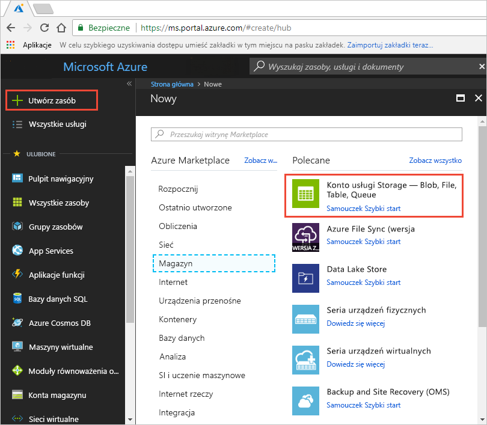
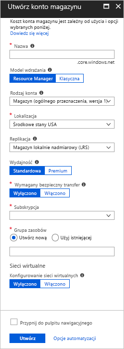
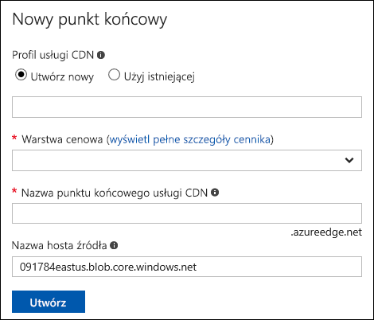
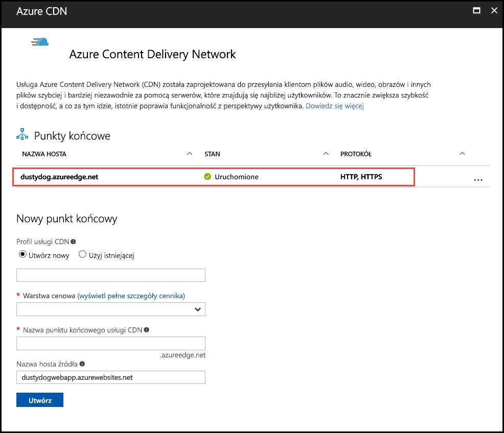
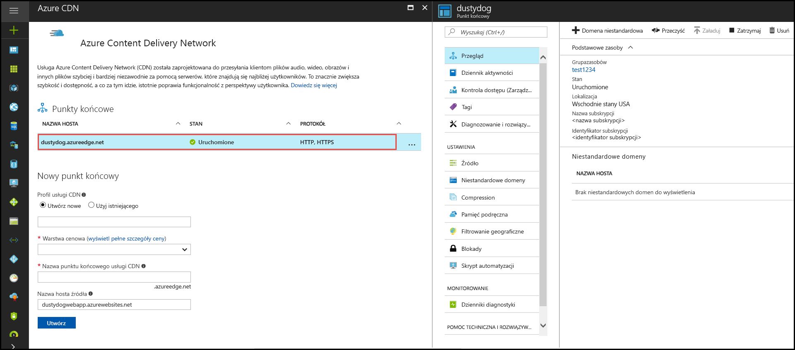

# Przewodnik Szybki start — integracja konta magazynu platformy Azure z usługą Azure CDN
W tym przewodniku Szybki start włączysz usługę [Azure Content Delivery Network (CDN)](cdn-overview.md), aby buforować zawartość z magazynu Azure. Usługa Azure CDN oferuje deweloperom globalne rozwiązanie umożliwiające dostarczanie zawartości z wysoką przepustowością. Może buforować obiekty blob oraz zawartość statyczną wystąpień obliczeniowych na węzłach fizycznych w Stanach Zjednoczonych, Europie, Azji, Australii i Ameryce Południowej.

[!INCLUDE [quickstarts-free-trial-note](../../includes/quickstarts-free-trial-note.md)]

## Logowanie do witryny Azure Portal
Zaloguj się w witrynie [Azure Portal](https://portal.azure.com) przy użyciu konta platformy Azure.

## Tworzenie konta magazynu
Poniższa procedura umożliwia utworzenie nowego konta magazynu dla subskrypcji platformy Azure. Konto magazynu zapewnia dostęp do usług Azure Storage. Konto magazynu reprezentuje najwyższy poziom przestrzeni nazw do uzyskiwania dostępu do poszczególnych składników usługi Azure Storage: Azure Blob Storage, Queue Storage oraz Table Storage. Aby uzyskać więcej informacji, zobacz [Wprowadzenie do usługi Microsoft Azure Storage](../storage/common/storage-introduction.md).

Aby utworzyć konto magazynu, musisz być administratorem usługi albo współadministratorem subskrypcji skojarzonej.

Do utworzenia konta magazynu, m.in. w witrynie Azure Portal i programie PowerShell, można użyć kilku metod. Ten przewodnik Szybki start przedstawia, jak używać witryny Azure Portal.   

**Aby utworzyć konto magazynu dla subskrypcji platformy Azure**

1. W witrynie Azure Portal w lewym górnym rogu wybierz pozycję **Utwórz zasób**. 

    Zostanie wyświetlone okienko **Nowy**.

2. Wybierz pozycję **Storage**, a następnie wybierz pozycję **Konto usługi Storage — Blob, File, Table, Queue**.
    
    

    Zostanie wyświetlone okienko **Utwórz konto magazynu**.   

    

3. W polu **Nazwa** wpisz nazwę poddomeny. Ten wpis może zawierać od 3 do 24 znaków (tylko małe litery i cyfry).
   
    Ta wartość staje się nazwą hosta w identyfikatorze URI, która jest wykorzystywana do adresowania zasobów blob, kolejki lub tabeli odpowiadających subskrypcji. Aby adresować zasób kontenera w magazynie obiektów blob, użyj identyfikatora URI w następującym formacie:
   
    http:// *&lt;StorageAcountLabel&gt;* .blob.core.windows.net/ *&lt;mycontainer&gt;*

    gdzie *&lt;StorageAccountLabel&gt;* odwołuje się do wartości wprowadzonej w polu **Nazwa**.
   
    > [!IMPORTANT]    
    > Etykieta adresu URL tworzy poddomenę identyfikatora URI konta magazynu i musi być unikatowa wśród wszystkich usług hostowanych na platformie Azure.
   
    Ta wartość jest także używana jako nazwa konta magazynu w portalu lub w przypadku uzyskiwania programowego dostępu do konta.
    
4. Dla pozostałych ustawień należy użyć wartości podanych w poniższej tabeli:

    | Ustawienie  | Wartość |
    | -------- | ----- |
    | **Model wdrażania** | Użyj wartości domyślnej. |
    | **Rodzaj konta** | Użyj wartości domyślnej. |
    | **Lokalizacja**    | Z listy rozwijanej wybierz pozycję **Środkowe stany USA**. |
    | **Replikacja** | Użyj wartości domyślnej. |
    | **Wydajność** | Użyj wartości domyślnej. |
    | **Wymagany bezpieczny transfer** | Użyj wartości domyślnej. |
    | **Subskrypcja** | Z listy rozwijanej wybierz subskrypcję platformy Azure. |
    | **Grupa zasobów** | Wybierz pozycję **Utwórz nowy**, a następnie jako nazwę grupy zasobów wprowadź *my-resource-group-123*. Ta nazwa musi być unikatowa w skali globalnej. Jeśli jest już używana, możesz wprowadzić inną nazwę lub wybrać pozycję **Użyj istniejącej** i wybrać wartość **my-resource-group-123** z listy rozwijanej.  Aby uzyskać informacje na temat grup zasobów, zobacz [Omówienie usługi Azure Resource Manager](../azure-resource-manager/management/overview.md#resource-groups).| 
    | **Konfigurowanie sieci wirtualnych** | Użyj wartości domyślnej. |  
    
5. Wybierz pozycję **Przypnij do pulpitu nawigacyjnego**, aby zapisać konto magazynu na pulpicie nawigacyjnym po jego utworzeniu.
    
6. Wybierz pozycję **Utwórz**. Tworzenie konta magazynu może potrwać kilka minut.

## Włączanie usługi Azure CDN dla konta magazynu

Usługę Azure CDN dla konta magazynu można włączyć bezpośrednio z konta magazynu. wysJeśli chcesz określić zaawansowane ustawienia konfiguracji dla punktu końcowego usługi CDN, takie jak [optymalizacja pobierania dużych plików](cdn-optimization-overview.md#large-file-download), możesz zamiast tego użyć [rozszerzenia usługi Azure CDN](cdn-create-new-endpoint.md), aby utworzyć punkt końcowy i profil usługi CDN.

1. Wybierz konto magazynu z pulpitu nawigacyjnego, a następnie wybierz opcję **Azure CDN** w lewym okienku. Jeśli przycisk **Azure CDN** przycisk nie jest od razu widoczny, aby go znaleźć, możesz wprowadzić CDN w polu **wyszukiwania** w lewym okienku.
    
    Zostanie wyświetlona strona **Azure CDN**.

    
    
2. Utwórz nowy punkt końcowy, wprowadzając wymagane informacje określone w poniższej tabeli:

    | Ustawienie  | Wartość |
    | -------- | ----- |
    | **Profil CDN** | Wybierz pozycję **Utwórz nową** i wprowadź nazwę profilu, na przykład *My-CDN-profile-123*. Ta nazwa musi być unikatowa w skali globalnej.  |
    | **Warstwa cenowa** | Z listy rozwijanej wybierz pozycję **Verizon — Standardowa**. |
    | **Nazwa punktu końcowego usługi CDN** | Wprowadź nazwę hosta punktu końcowego, na przykład *My-Endpoint-123*. Ta nazwa musi być unikatowa w skali globalnej. Ta nazwa jest używana do uzyskiwania dostępu do buforowanych zasobów w domenie _&lt;nazwa punktu końcowego&gt;_ .azureedge.net. |
    | **Nazwa hosta źródła** | Domyślnie nowy punkt końcowy CDN używa jako nazwy serwera pochodzenia nazwy hosta konta magazynu. |

3. Wybierz pozycję **Utwórz**. Po utworzeniu punktu końcowego zostanie on wyświetlony na liście punktów końcowych.

    

## Włączanie dodatkowych funkcji CDN
Na stronie **Azure CDN** konta magazynu wybierz z listy punkt końcowy usługi CDN, aby otworzyć stronę konfiguracji punktu końcowego usługi CDN. Na tej stronie można włączyć dodatkowe funkcje CDN dla dostarczania, np. [kompresję](cdn-improve-performance.md), [buforowanie ciągów zapytań](cdn-query-string.md) i [filtrowanie geograficznie](cdn-restrict-access-by-country.md). 
    

## Włączanie sygnatury dostępu współdzielonego
Jeśli chcesz przyznać ograniczony dostęp do prywatnych kontenerów magazynu, możesz użyć funkcji sygnatury dostępu współdzielonego konta usługi Azure Storage. Sygnatura dostępu współdzielonego to identyfikator URI, który zapewnia ograniczone prawa dostępu do zasobów usługi Azure Storage bez ujawniania klucza konta. Aby uzyskać więcej informacji, zobacz [Using Azure CDN with SAS](cdn-sas-storage-support.md) (Używanie usługi Azure CDN z sygnaturą dostępu współdzielonego).

## Uzyskiwanie dostępu do zawartości usługi CDN
Aby uzyskać dostęp do zawartości w pamięci podręcznej w sieci CDN, użyj adresu URL sieci CDN w portalu. Adres buforowanego obiektu blob ma następujący format:

http://<*EndpointName*\>.azureedge.net/<*myPublicContainer*\>/<*BlobName*\>

> [!NOTE]
> Po włączeniu dostępu usługi Azure CDN do konta magazynu wszystkie publicznie dostępne obiekty kwalifikują się do buforowania POP w sieci CDN. Jeśli zmodyfikujesz obiekt, który jest aktualnie w pamięci podręcznej w sieci CDN, nowa zawartość nie będzie dostępna za pośrednictwem usługi Azure CDN, dopóki usługa Azure CDN nie odświeży zawartości po wygaśnięciu okresu czasu wygaśnięcia zawartości w pamięci podręcznej.

## Usuwanie zawartości z usługi Azure CDN
Jeśli nie chcesz już buforować obiektu w usłudze Azure CDN, możesz wykonać jedną z następujących czynności:

* Ustaw kontener jako prywatny, a nie publiczny. Aby uzyskać więcej informacji, zobacz [Zarządzanie dostępem anonimowym w trybie odczytu do kontenerów i obiektów blob](../storage/blobs/storage-manage-access-to-resources.md).
* Wyłącz lub usuń punkt końcowy usługi CDN przy użyciu witryny Azure Portal.
* Zmodyfikuj usługę hostowaną w taki sposób, aby nie odpowiadała już na żądania dla obiektu.

Obiekt, który jest już buforowany w usłudze Azure CDN, pozostaje w pamięci podręcznej, dopóki nie zakończy się okres czasu wygaśnięcia dla obiektu lub dopóki punkt końcowy nie zostanie [przeczyszczony](cdn-purge-endpoint.md). Po zakończeniu okresu czasu wygaśnięcia usługa Azure CDN określa, czy punkt końcowy usługi CDN jest nadal ważny i czy obiekt jest nadal anonimowo dostępny. Jeżeli tak nie jest, obiekt nie będzie już buforowany.

## Oczyszczanie zasobów
W poprzednich krokach utworzono profil i punkt końcowy usługi CDN w grupie zasobów. Zapisz te zasoby, jeśli chcesz przejść do sekcji [Następne kroki](#next-steps) i dowiedzieć się, jak dodać domenę niestandardową do punktu końcowego. Jeśli jednak nie będziesz już potrzebować tych zasobów w przyszłości, możesz je usunąć przez usunięcie grupy zasobów, unikając w ten sposób dodatkowych opłat:

1. W menu znajdującym się po lewej stronie w witrynie Azure Portal wybierz pozycję **Grupy zasobów**, a następnie wybierz pozycję **my-resource-group-123**.

2. Na stronie **Grupa zasobów** wybierz pozycję **Usuń grupę zasobów**, wprowadź ciąg *my-resource-group-123* w polu tekstowym, a następnie wybierz pozycję **Usuń**.

    Ta akcja spowoduje usunięcie grupy zasobów, profilu i punktu końcowego, które utworzono w tym przewodniku Szybki start.

3. Aby usunąć konto magazynu, wybierz je z pulpitu nawigacyjnego, a następnie wybierz opcję **Usuń** z górnego menu.

## Następne kroki
Aby dowiedzieć się więcej na temat dodawania domeny niestandardowej i włączania protokołu HTTP w punkcie końcowym usługi CDN, zapoznaj się z następującym samouczkiem:

> [!div class="nextstepaction"]
> [Samouczek: uzyskiwanie dostępu do obiektów blob magazynu w domenie niestandardowej usługi Azure CDN za pośrednictwem protokołu HTTPS](cdn-storage-custom-domain-https.md)

