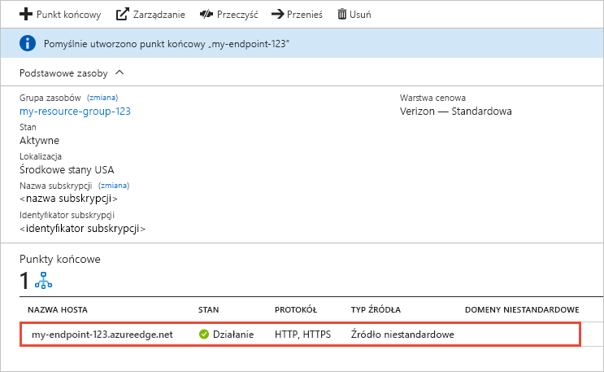

# Tworzenie punktu końcowego usługi Azure CDN
W tym artykule opisano wszystkie ustawienia dotyczące tworzenia [Azure Content Delivery Network (CDN)](cdn-overview.md) punktu końcowego w istniejący profil usługi CDN. Po utworzeniu profilu i punktu końcowego, można uruchomić dostarczania zawartości do klientów. Aby uzyskać szybki start dotyczące tworzenia profilu i punktu końcowego, zobacz [Szybki Start: tworzenie profilu i punktu końcowego usługi Azure CDN](cdn-create-new-endpoint.md).

## Wymagania wstępne
Zanim będzie można utworzyć punktu końcowego usługi CDN, musisz mieć utworzone co najmniej jeden profil CDN, który może zawierać jeden lub więcej punktów końcowych usługi CDN. Do organizowania punktów końcowych usługi CDN według domeny internetowej, aplikacji internetowej lub innych kryteriów można używać wielu profilów. Ponieważ cennikiem sieci CDN została zastosowana na poziomie profilu CDN, należy utworzyć wiele profilów CDN, jeśli chcesz używać różnych warstw cenowych sieć CDN systemu Azure. Aby utworzyć profil usługi CDN, zobacz [Utwórz nowy profil CDN](cdn-create-new-endpoint.md#create-a-new-cdn-profile).

## Logowanie do witryny Azure Portal
Zaloguj się w witrynie [Azure Portal](https://portal.azure.com) przy użyciu konta platformy Azure.

## Tworzenie nowego punktu końcowego usługi CDN

1. W witrynie [Azure Portal](https://portal.azure.com) przejdź do swojego profilu CDN. Być może został on przypięty do pulpitu nawigacyjnego w poprzednim kroku. Jeśli nie, możesz go znaleźć, wybierając kolejno pozycje **Wszystkie usługi** i **Profile CDN**. W okienku **Profile CDN** wybierz profil, do którego planujesz dodać punkt końcowy. 
   
    Zostanie wyświetlone okienko profilu CDN.

2. Wybierz pozycję **Punkt końcowy**.
   
    
   
    Zostanie wyświetlona strona **Dodawanie punktu końcowego**.
   
    

3. W polu **Nazwa** wprowadź unikatową nazwę nowego punktu końcowego CDN. Ta nazwa jest używana do dostępu do buforowanych zasobów w domenie  _\<nazwapunktukoncowego >_. azureedge.net.

4. Aby uzyskać **typ źródła**, wybierz jedną z następujących typów źródła: 
   - **Magazyn** dla usługi Azure Storage
   - **Usługa w chmurze** usług Azure Cloud Services
   - **Aplikacja sieci Web** dla aplikacji sieci Web platformy Azure
   - **Źródło niestandardowe** dla innego publicznie dostępnego źródła sieci web serwera (hostowanego na platformie Azure lub gdziekolwiek indziej)

5. Aby uzyskać **nazwa hosta źródła**wybierz lub wprowadź domenę źródła serwera. Lista rozwijana zawiera listę wszystkich serwerów dostępne źródła typu określonego w kroku 4. W przypadku wybrania **Źródło niestandardowe** jako typu źródła wprowadź domenę źródła niestandardowego serwera.
    
6. Aby uzyskać **ścieżka do źródła**, wprowadź ścieżkę do zasobów, które mają być buforowane. Aby umożliwić buforowanie dowolnego zasobu w domenie określonej w kroku 5, pozostaw to ustawienie puste.
    
7. W polu **Nagłówek hosta źródła** wprowadź nagłówek hosta, który usługa Azure CDN ma wysłać z każdym żądaniem, lub pozostaw wartość domyślną.
   
   > [!NOTE]
   > Niektóre typy źródeł, takie jak usługi Azure Storage i Web Apps, wymagają, aby nagłówek hosta był zgodny z domeną źródła. Pozostaw wartość domyślną, chyba że masz źródło, które wymaga nagłówka hosta innego niż jego domena.
   > 
    
8. Aby uzyskać **protokołu** i **port źródła**, Określ protokoły i porty na potrzeby dostępu do zasobów na serwerze źródłowym. Należy wybrać co najmniej jeden protokół (HTTP lub HTTPS). Użyj domeny udostępnionej do sieci CDN (_\<nazwapunktukoncowego >_. azureedge.net) Aby uzyskać dostęp do zawartości HTTPS. 
   
   > [!NOTE]
   > **Port źródła** wartość określa tylko port punktu końcowego używa w celu pobrania informacji z serwera pochodzenia. Sam punkt końcowy jest dostępny dla klientów końcowych tylko na domyślnych portach HTTP i HTTPS (80 i 443), niezależnie od wartości **Port źródła**.  
   > 
   > Punkty końcowe w profilach usługi **Azure CDN from Akamai** nie zezwalają na pełny zakres portów TCP dla portów źródeł. Lista niedozwolonych portów źródłowych znajduje się w artykule [Azure CDN from Akamai Allowed Origin Ports](/previous-versions/azure/mt757337(v=azure.100)) (Azure CDN from Akamai — dozwolone porty źródłowe).  
   > 
   > Obsługa protokołu HTTPS dla domen niestandardowych usługi Azure CDN nie jest obsługiwana w **Azure CDN from Akamai** produktów. Aby uzyskać więcej informacji, zobacz [Konfigurowanie protokołu HTTPS w domenie niestandardowej usługi Azure CDN](cdn-custom-ssl.md).
    
9. Aby uzyskać **zoptymalizowane pod kątem**, wybierz typ optymalizacji, który najlepiej odpowiada scenariusza i typu zawartości, który ma punkt końcowy, aby dostarczać. Aby uzyskać więcej informacji, zobacz [optymalizacji usługi Azure CDN dla typu dostarczania zawartości](cdn-optimization-overview.md).

    Następujące ustawienia typu optymalizacji są obsługiwane, zależnie od typu profilu:
    - **Usługa Azure CDN Standard from Microsoft** profilów:
       - [**Ogólne dostarczanie w Internecie**](cdn-optimization-overview.md#general-web-delivery)

    - **Usługa Azure CDN Standard from Verizon** i **Azure CDN Premium from Verizon** profilów:
       - [**Ogólne dostarczanie w Internecie**](cdn-optimization-overview.md#general-web-delivery)
       - [**Przyspieszanie witryn dynamicznych**](cdn-optimization-overview.md#dynamic-site-acceleration)

    - **Usługa Azure CDN Standard from Akamai** profilów:
       - [**Ogólne dostarczanie w Internecie**](cdn-optimization-overview.md#general-web-delivery)
       - [**Ogólne transmisje strumieniowe multimediów**](cdn-optimization-overview.md#general-media-streaming)
       - [**Wideo strumieniowe multimediów na żądanie**](cdn-optimization-overview.md#video-on-demand-media-streaming)
       - [**Pobieranie dużych plików**](cdn-optimization-overview.md#large-file-download)
       - [**Przyspieszanie witryn dynamicznych**](cdn-optimization-overview.md#dynamic-site-acceleration)

10. Wybierz pozycję **Dodaj**, aby utworzyć nowy punkt końcowy.
   
    Po utworzeniu punktu końcowego zostanie on wyświetlony na liście punktów końcowych dla profilu.
    
    
    
    Punkt końcowy nie jest natychmiast dostępny do użycia, ponieważ propagacja rejestracji zajmuje trochę czasu: 
    - W przypadku profili usługi **Azure CDN Standard from Microsoft** propagacja zwykle trwa do 10 minut. 
    - W przypadku profili usługi **Azure CDN Standard from Akamai** propagacja zwykle trwa mniej niż jedną minutę. 
    - W przypadku profili usługi **Azure CDN Standard from Verizon** oraz usługi **Azure CDN Premium from Verizon** propagacja zwykle trwa do 90 minut. 
   
    Jeśli spróbujesz użyć nazwy domeny usługi CDN przed zakończeniem propagacji konfiguracji punktu końcowego do serwerów (POP) typu "punktu obecność", może pojawić się odpowiedzi HTTP 404. Jeśli minęło kilka godzin od czasu utworzenia punktu końcowego, a nadal otrzymujesz stan odpowiedzi 404, zobacz [Rozwiązywanie problemów z usługi Azure CDN punktów końcowych, które zwracają kod stanu 404](cdn-troubleshoot-endpoint.md).

## Oczyszczanie zasobów
Aby usunąć punkt końcowy, gdy nie jest już potrzebny, zaznacz go, a następnie wybierz pozycję **Usuń**. 

## Kolejne kroki
Aby dowiedzieć się więcej na temat domen niestandardowych, przejdź do samouczka dla dodawania domeny niestandardowej do punktu końcowego usługi CDN.

> [!div class="nextstepaction"]
> [Dodawanie domeny niestandardowej](cdn-map-content-to-custom-domain.md)

