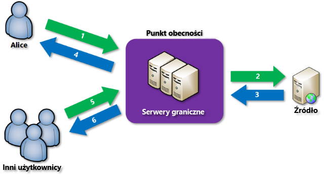

# Co to jest sieć dostarczania zawartości na platformie Azure?
Sieć dostarczania zawartości (CDN, content delivery network) to rozproszona sieć serwerów, które pozwalają wydajnie dostarczać użytkownikom zawartość internetową. Sieci CDN umożliwiają przechowywanie buforowanej zawartości na serwerach brzegowych w lokalizacjach punktu obecności (POP, Point-of-Presence), które znajdują się blisko użytkowników końcowych, co pozwala zminimalizować opóźnienie. 

Usługa Azure Content Delivery Network (CDN) oferuje deweloperom globalne rozwiązanie umożliwiające szybkie dostarczanie użytkownikom zawartości wymagającej wysokiej przepustowości przez zapisywanie zawartości w pamięci podręcznej w węzłach fizycznych strategicznie rozmieszczonych na całym świecie. Usługa Azure CDN może również przyspieszyć zawartość dynamiczną, której nie można buforować, wykorzystując różne optymalizacje sieci przy użyciu punktów POP w sieci CDN. Na przykład optymalizację trasy, aby obejść protokół BGP (Border Gateway Protocol).

Zalety używania usługi Azure CDN do dostarczania zasobów witryn internetowych obejmują:

* Lepszą wydajność i ulepszone środowisko użytkowników końcowych, zwłaszcza w przypadku korzystania z aplikacji, które wymagają wielu rund do załadowania zawartości.
* Duże skalowanie, aby lepiej obsługiwać natychmiastowe wysokie obciążenie, na przykład na początku zdarzenia uruchamiania produktu.
* Dystrybucję żądań użytkowników i obsługę zawartości bezpośrednio z serwerów brzegowych, dzięki czemu do serwera pochodzenia jest wysyłanych mniej danych.

Aby wyświetlić listę bieżących lokalizacji węzłów usługi CDN, zobacz [Lokalizacje POP usługi Azure CDN](cdn-pop-locations.md).

## Jak to działa

1. Użytkownik (Alice) żąda pliku (nazywanego również zasobem) przy użyciu adresu URL ze specjalną nazwą domeny, taką jak _&lt;nazwa punktu końcowego&gt;_ .azureedge.net. Ta nazwa może być nazwą hosta punktu końcowego lub domeną niestandardową. System DNS kieruje żądanie do lokalizacji POP o najwyższej wydajności — zwykle jest to punkt POP znajdujący się geograficznie najbliżej użytkownika.
    
2. Jeśli żaden serwer brzegowy w punkcie POP nie ma pliku w swojej pamięci podręcznej, punkt POP żąda pliku z serwera pochodzenia. Serwerem pochodzenia może być aplikacja internetowa platformy Azure, usługa Azure Cloud Service, konto usługi Azure Storage lub dowolny publicznie dostępny serwer internetowy.
   
3. Serwer pochodzenia zwraca plik do serwera brzegowego w punkcie POP.
    
4. Serwer brzegowy w punkcie POP zapisuje plik w pamięci podręcznej i zwraca go do pierwotnego obiektu żądającego (Alice). Plik pozostaje w pamięci podręcznej na serwerze brzegowym w punkcie POP do momentu upłynięcia czasu wygaśnięcia (TTL, time-to-live) podanego w jego nagłówkach HTTP. Jeśli serwer pochodzenia nie określił czasu wygaśnięcia, domyślnie wynosi on siedem dni.
    
5. Kolejni użytkownicy mogą następnie żądać tego samego pliku przy użyciu tego samego adresu URL, którego użyła Alice, oraz mogą zostać skierowani do tego samego punktu POP.
    
6. Jeśli czas wygaśnięcia pliku nie upłynął, serwer brzegowy punktu POP zwróci plik bezpośrednio z pamięci podręcznej. Ten proces prowadzi do krótszego czasu reakcji w środowisku użytkownika.

## Wymagania
Aby korzystać z usługi Azure CDN, musisz być właścicielem co najmniej jednej subskrypcji platformy Azure. Musisz także utworzyć co najmniej jeden profil CDN, który jest kolekcją punktów końcowych usługi CDN. Każdy punkt końcowy usługi CDN reprezentuje określoną konfigurację dostępu i zachowania dostarczania zawartości. Do organizowania punktów końcowych usługi CDN według domeny internetowej, aplikacji internetowej lub innych kryteriów można używać wielu profilów. Ponieważ [ceny usługi Azure CDN](https://azure.microsoft.com/pricing/details/cdn/) są stosowane na poziomie profilu CDN, musisz utworzyć wiele profilów CDN, jeśli chcesz używać różnych warstw cenowych. Aby uzyskać informacje o strukturze rozliczeń za usługę Azure CDN, zobacz temat [Omówienie rozliczania za usługę Azure CDN](cdn-billing.md).

### Ograniczenia
Każda subskrypcja platformy Azure ma limity domyślne dla następujących zasobów:
 - Liczba profilów CDN, które można utworzyć.
 - Liczba punktów końcowych, które można utworzyć w profilu CDN. 
 - Liczba domen niestandardowych, które można zamapować na punkt końcowy.

Aby dowiedzieć się więcej o limitach subskrypcji usługi CDN, zobacz [Limity usługi CDN](https://docs.microsoft.com/azure/azure-subscription-service-limits).
    
## Funkcje usługi Azure CDN
Usługa Azure CDN oferuje następujące kluczowe funkcje:

- [Przyspieszanie witryn dynamicznych](cdn-dynamic-site-acceleration.md)
- [Reguły buforowania sieci CDN](cdn-caching-rules.md)
- [Obsługa domen niestandardowych HTTPS](cdn-custom-ssl.md)
- [Dzienniki diagnostyczne platformy Azure](cdn-azure-diagnostic-logs.md)
- [Kompresja plików](cdn-improve-performance.md)
- [Filtrowanie geograficzne](cdn-restrict-access-by-country.md)

Aby uzyskać pełną listę funkcji obsługiwanych przez każdy produkt Azure CDN, zobacz [Porównanie funkcji produktów Azure CDN](cdn-features.md).

## Następne kroki
- Aby zacząć korzystać z usługi CDN, zobacz [Tworzenie punktu końcowego i profilu usługi Azure CDN](cdn-create-new-endpoint.md).
- Zarządzaj punktami końcowymi usługi CDN za pomocą witryny [Microsoft Azure Portal](https://portal.azure.com) lub programu [PowerShell](cdn-manage-powershell.md).
- Dowiedz się, jak zautomatyzować usługę Azure CDN przy użyciu platformy [.NET](cdn-app-dev-net.md) lub [Node.js](cdn-app-dev-node.md).
- Aby zobaczyć usługę Azure CDN w akcji, obejrzyj [filmy wideo dotyczące usługi Azure CDN](https://azure.microsoft.com/resources/videos/index/?services=cdn&sort=newest).
- Aby dowiedzieć się więcej o najnowszych funkcjach usługi Azure CDN, odwiedź [blog usługi Azure CDN](https://azure.microsoft.com/blog/tag/azure-cdn/).
