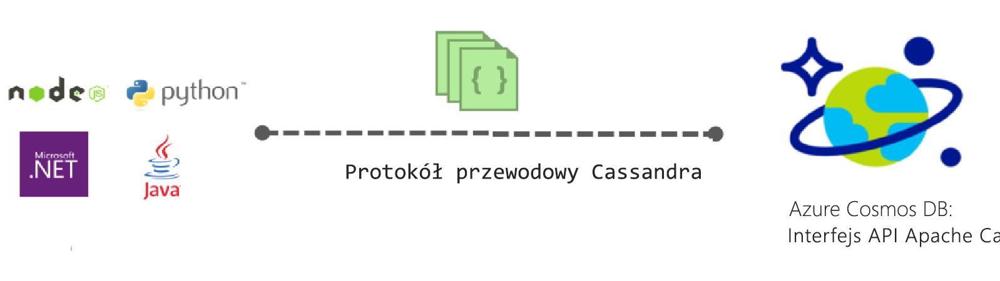
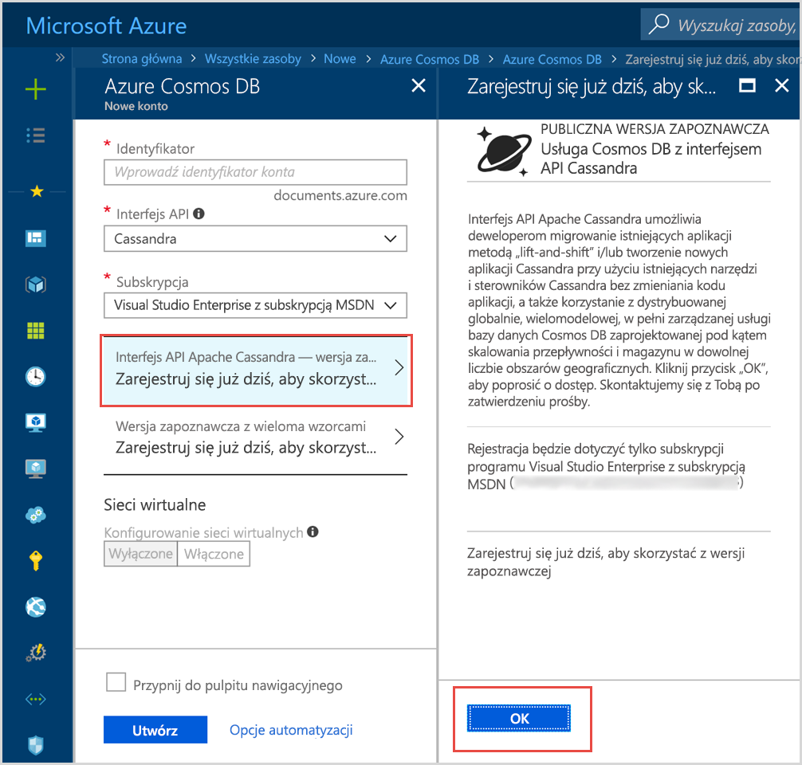

# Wprowadzenie do usługi Azure Cosmos DB: interfejs API Apache Cassandra

Azure Cosmos DB oferuje interfejs API Cassandra (w wersji zapoznawczej) dla aplikacji pisanych na potrzeby platformy Apache Cassandra, które wymagają funkcji warstwy Premium, takich jak:

* [Możliwość skalowania rozmiaru i przepływności magazynu](partition-data.md).
* [Gotowa do użycia funkcja dystrybucji globalnej](distribute-data-globally.md)
* Opóźnienie rzędu kilku milisekund na poziomie 99. percentyla.
* [Pięć dokładnie zdefiniowanych poziomów spójności](consistency-levels.md)
* [Automatycznie indeksowanie danych](http://www.vldb.org/pvldb/vol8/p1668-shukla.pdf) bez konieczności zarządzania schematami i indeksami. 
* Gwarantowana wysoka dostępność, a wszystko to uwzględnione we [wiodących w branży umowach SLA](https://azure.microsoft.com/support/legal/sla/cosmos-db/)

## Co to jest interfejs API Apache Cassandra usługi Azure Cosmos DB?

Usługa Azure Cosmos DB może być używana jako magazyn danych dla aplikacji napisanych dla na potrzeby usługi [Apache Cassandra](https://cassandra.apache.org/) dzięki zastosowaniu interfejsu API Apache Cassandra. Oznacza to, że używając istniejących [licencjonowanych sterowników Apache zgodnych z językiem CQLv4](https://cassandra.apache.org/doc/latest/getting_started/drivers.html?highlight=driver), aplikacja napisana dla platformy Cassandra może teraz komunikować się z interfejsem API Cassandra usługi Azure Cosmos DB. W wielu przypadkach można przełączyć się z platformy Apache Cassandra do interfejsu API Apache Cassandra usługi Azure Cosmos DB, zmieniając po prostu parametry połączenia. Dzięki tej funkcji można w prosty sposób kompilować i uruchamiać aplikacje bazy danych interfejsu API Cassandra w chmurze platformy Azure przy użyciu globalnej dystrybucji i [kompleksowych, wiodących w branży umów SLA](https://azure.microsoft.com/support/legal/sla/cosmos-db), używając znanych umiejętności i narzędzi interfejsu API Cassandra.

Interfejs API Cassandra pozwala na interakcję z danymi przechowywanymi w usłudze Azure Cosmos DB za pomocą narzędzi opartych na języku Cassandra Query Language (takich jak CQLSH) i sterowników klienta platformy Cassandra, które już znasz. 

## Jakie są zalety korzystania z interfejsu API Apache Cassandra dla usługi Azure Cosmos DB?

**Brak zarządzania operacjami**: jako usługa w pełni zarządzana Azure Cosmos DB gwarantuje, że administratorzy interfejsu API Cassandra nie muszą martwić się o zarządzanie wieloma ustawieniami plików systemu operacyjnego, maszyny JVM i yaml, ich monitorowanie oraz wzajemne oddziaływanie. Usługa Azure Cosmos DB umożliwia monitorowanie przepływności, opóźnienia, magazynu i dostępności oraz alertów z możliwością konfigurowania. 

**Zarządzanie wydajnością**: usługa Azure Cosmos DB oferuje gwarantowane przez umowę SLA operacje odczytu i zapisu o małych opóźnieniach na poziomie 99. percentyla. Użytkownicy nie muszą martwić się o to, że odpowiednio skonstruowane umowy SLA dotyczące odczytu i zapisu będą zawierać wysokie ogólne koszty operacyjne. Obejmują one zazwyczaj planowanie kompaktowania, zarządzanie reliktami, ustawianie filtrów Blooma oraz zwłokę replik. Usługa Azure Cosmos DB przejmuje zadania zarządzania tymi problemami i pozwala użytkownikom skoncentrować się na dostarczanych aplikacjach.

**Automatyczne indeksowanie**: usługa Azure Cosmos DB automatycznie indeksuje wszystkie kolumny tabeli w bazie danych interfejsu API Cassandra. Usługa Azure Cosmos DB nie wymaga tworzenia indeksów pomocniczych w celu przyspieszenia działania zapytań. Oferuje ona małe opóźnienia środowiska odczytu i zapisu podczas wykonywania spójnego automatycznego indeksowania. 

**Możliwość używania istniejącego kodu i narzędzi**: usługa Azure Cosmos DB udostępnia zgodność na poziomie protokołu przewodowego z istniejącymi zestawami SDK i narzędziami. Dzięki tej zgodności można używać istniejącej bazy kodu z interfejsem API Cassandra usługi Azure Cosmos DB w przypadku uproszczonych zmian.

**Elastyczność przepływności i magazynu**: platforma Azure Cosmos oferuje elastyczność gwarantowanej przepustowości w regionach za pośrednictwem prostych operacji portalu, programu PowerShell lub interfejsu wiersza polecenia. W miarę wzrostu aplikacji tabele usługi Azure Cosmos DB można bezproblemowo elastycznie skalować z przewidywalną wydajnością. Usługa Azure Cosmos DB obsługuje tabele interfejsu API Cassandra, które można skalować do praktycznie nieograniczonych rozmiarów magazynu. 

**Globalna dystrybucja i dostępność**: usługa Azure Cosmos DB oferuje możliwość dystrybuowania danych w regionach platformy Azure, dzięki czemu użytkownicy mogą pracować w środowisku o małych opóźnieniach, które jednocześnie gwarantuje dostępność. Usługa Azure Cosmos DB zapewnia dostępność przez 99,99% czasu w obrębie regionu oraz dostępność odczytu przez 99,999% czasu w regionach bez ogólnych kosztów operacji. Usługa Azure Cosmos DB jest dostępna w ponad 30 [regionach świadczenia usług platformy Azure](https://azure.microsoft.com/regions/services/). Dowiedz się więcej z artykułu [Distribute data globally](distribute-data-globally.md) (Globalna dystrybucja danych). 

**Wybór spójności**: usługa Azure Cosmos DB oferuje możliwość wyboru spośród pięciu dobrze zdefiniowanych poziomów spójności w celu osiągnięcia optymalnego kompromisu między wydajnością a spójnością. Te poziomy spójności to: silne, powiązana nieaktualność, sesja, spójny prefiks i ostateczne. Te szczegółowe, dokładnie zdefiniowane poziomy spójności umożliwiają deweloperowi ustalanie optymalnych kompromisów między spójnością, dostępnością i opóźnieniem. Aby dowiedzieć się więcej, zobacz [Maksymalizowanie dostępności i wydajności za pomocą poziomów spójności](consistency-levels.md). 

**Klasa korporacyjna**: usługa Azure Cosmos DB udostępnia [certyfikaty zgodności](https://www.microsoft.com/trustcenter), aby zapewnić użytkownikom możliwość bezpiecznego korzystania z platformy. Usługa Azure Cosmos DB oferuje również szyfrowanie danych magazynowanych i w ruchu, zaporę adresów IP oraz dzienniki inspekcji na potrzeby działań płaszczyzny sterowania.  

## Utwórz konto teraz 

Jeśli masz już subskrypcję platformy Azure, możesz utworzyć konto, aby dołączyć do programu interfejsu API Cassandra (wersja zapoznawcza) w witrynie [Azure Portal](https://aka.ms/cosmosdb-cassandra-signup).  Jeśli jesteś nowym użytkownikiem platformy Azure, utwórz konto [bezpłatnej wersji próbnej](https://azure.microsoft.com/free), aby uzyskać bezpłatny dostęp do usługi Azure Cosmos DB przez 12 miesięcy. Wykonaj poniższe kroki, aby zażądać dostępu do programu interfejsu API Cassandra (wersja zapoznawcza).

1. W witrynie [Azure Portal](https://portal.azure.com) kliknij kolejno pozycje **Utwórz zasób** > **Bazy danych** > **Azure Cosmos DB**. 

2. Na stronie Nowe konto wybierz pozycję **Cassandra** w polu interfejsu API. 

3. W polu **Subskrypcja** wybierz subskrypcję platformy Azure, której chcesz używać na potrzeby tego konta.

4. Kliknij pozycję **Zarejestruj się już dziś, aby skorzystać z wersji zapoznawczej**.

    

3. W okienku Zarejestruj się już dziś, aby skorzystać z wersji zapoznawczej kliknij przycisk **OK**. 

    Po przesłaniu żądania stan zmieni się na **Oczekuje na zatwierdzenie** w okienku nowego konta. 

Po przesłaniu żądania poczekaj na powiadomienie e-mail informujące o tym, że żądanie zostało zatwierdzone. Ze względu na dużą liczbę żądań otrzymasz powiadomienie w ciągu tygodnia. Do ukończenia żądania nie jest wymagane utworzenie biletu pomocy technicznej. Żądania będą przeglądane w kolejności, w której zostały odebrane. 

## Jak zacząć
Po dołączeniu do programu wersji zapoznawczej wykonaj zadania z przewodników Szybki start interfejsu API Cassandra, aby utworzyć aplikację przy użyciu interfejsu API Cassandra:

* [Szybki start: tworzenie aplikacji internetowej bazy danych Cassandra przy użyciu platformy Node.js i usługi Azure Cosmos DB](create-cassandra-nodejs.md)
* [Szybki start: tworzenie aplikacji internetowej bazy danych Cassandra przy użyciu języka Java i usługi Azure Cosmos DB](create-cassandra-java.md)
* [Szybki start: tworzenie aplikacji internetowej bazy danych Cassandra przy użyciu platformy .NET i usługi Azure Cosmos DB](create-cassandra-dotnet.md)
* [Szybki start: tworzenie aplikacji internetowej bazy danych Cassandra przy użyciu języka Python i usługi Azure Cosmos DB](create-cassandra-python.md)

## Następne kroki

Informacje o interfejsie API Cassandra usługi Azure Cosmos DB zostały zintegrowane z ogólną dokumentacją usługi Azure Cosmos DB, ale poniżej przedstawiono kilka wskazówek, które ułatwią Ci rozpoczęcie pracy:

* Postępuj zgodnie z instrukcjami z [przewodników Szybki start](create-cassandra-nodejs.md), aby utworzyć konto i nową aplikację przy użyciu przykładu usługi Git
* Postępuj zgodnie z instrukcjami z [samouczka](tutorial-develop-cassandra-java.md), aby programowo utworzyć nową aplikację.
* Postępuj zgodnie z instrukcjami z [samouczka importowania danych bazy danych Cassandra](cassandra-import-data.md), aby zaimportować istniejące dane do usługi Azure Cosmos DB.
* Przeczytaj [często zadawane pytania](faq.md#cassandra).
