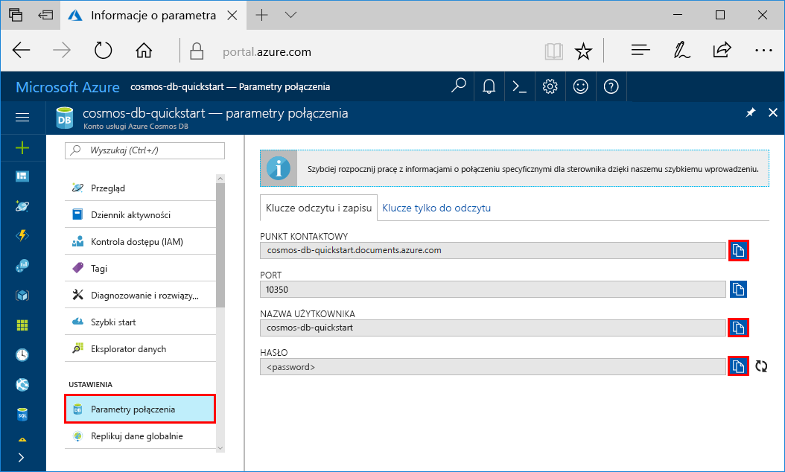

# <a name="quickstart-build-a-cassandra-app-with-java-sdk-and-azure-cosmos-db"></a>Szybki start: Tworzenie aplikacji Cassandra przy użyciu zestawu SDK języka Java i usługi Azure Cosmos DB

> [!div class="op_single_selector"]
> * [.NET](create-cassandra-dotnet.md)
> * [Java](create-cassandra-java.md)
> * [Node.js](create-cassandra-nodejs.md)
> * [Python](create-cassandra-python.md)
>  

W tym przewodniku Szybki start przedstawiono używanie języka Java i [interfejsu API bazy danych Cassandra](cassandra-introduction.md) w usłudze Azure Cosmos DB do tworzenia aplikacji profilów przez sklonowanie przykładu z serwisu GitHub. W tym przewodniku Szybki start pokazano również sposób tworzenia konta usługi Azure Cosmos DB przy użyciu witryny internetowej Azure Portal.

Azure Cosmos DB to rozproszona globalnie, wielomodelowa usługa bazy danych firmy Microsoft. Dzięki wykorzystaniu globalnego rozproszenia i możliwości skalowania w poziomie w usłudze Azure Cosmos DB można szybko tworzyć i za pomocą zapytań badać bazy danych dokumentów, tabel, par klucz/wartość i grafowe. 

## <a name="prerequisites"></a>Wymagania wstępne

[!INCLUDE [quickstarts-free-trial-note](../../includes/quickstarts-free-trial-note.md)] Można też [bezpłatnie wypróbować usługę Azure Cosmos DB](https://azure.microsoft.com/try/cosmosdb/) bez subskrypcji platformy Azure — nie wymaga to opłat ani zobowiązań.

Potrzebne są też następujące elementy:

* [Zestaw Java Development Kit (JDK) 1.7+](https://aka.ms/azure-jdks)
    * W systemie Ubuntu uruchom polecenie `apt-get install default-jdk`, aby zainstalować zestaw JDK.
    * Upewnij się, że zmienna środowiskowa JAVA_HOME wskazuje folder, w którym zainstalowano zestaw JDK.
* [Pobierz](https://maven.apache.org/download.cgi) i [zainstaluj](https://maven.apache.org/install.html) archiwum binarne [Maven](https://maven.apache.org/)
    * W systemie Ubuntu możesz uruchomić polecenie `apt-get install maven`, aby zainstalować narzędzie Maven.
* [Usługa Git](https://www.git-scm.com/)
    * W systemie Ubuntu możesz uruchomić polecenie `sudo apt-get install git`, aby zainstalować usługę Git.

## <a name="create-a-database-account"></a>Tworzenie konta bazy danych

Przed utworzeniem bazy danych dokumentów musisz utworzyć konto bazy danych Cassandra z użyciem usługi Azure Cosmos DB.

[!INCLUDE [cosmos-db-create-dbaccount-cassandra](../../includes/cosmos-db-create-dbaccount-cassandra.md)]

## <a name="clone-the-sample-application"></a>Klonowanie przykładowej aplikacji

Teraz przejdźmy do pracy z kodem. Sklonujemy aplikację bazy danych Cassandra z serwisu GitHub, ustawimy parametry połączenia i uruchomimy ją. Zobaczysz, jak łatwo jest pracować programowo z danymi. 

1. Otwórz wiersz polecenia. Utwórz nowy folder o nazwie `git-samples`. Następnie zamknij wiersz polecenia.

    ```bash
    md "C:\git-samples"
    ```

2. Otwórz okno terminalu usługi Git, na przykład git bash, i użyj polecenia `cd`, aby przejść do nowego folderu instalacji aplikacji przykładowej.

    ```bash
    cd "C:\git-samples"
    ```

3. Uruchom następujące polecenie w celu sklonowania przykładowego repozytorium. To polecenie tworzy kopię przykładowej aplikacji na komputerze.

    ```bash
    git clone https://github.com/Azure-Samples/azure-cosmos-db-cassandra-java-getting-started.git
    ```

## <a name="review-the-code"></a>Przeglądanie kodu

Ten krok jest opcjonalny. Jeśli chcesz dowiedzieć się, jak kod tworzy zasoby bazy danych, możesz przejrzeć poniższe fragmenty kodu. W przeciwnym razie możesz od razu przejść do sekcji [Aktualizowanie parametrów połączenia](#update-your-connection-string). Wszystkie fragmenty kodu są pobierane z pliku `src/main/java/com/azure/cosmosdb/cassandra/util/CassandraUtils.java`.  

* Ustawiany jest host bazy danych Cassandra oraz port, nazwa użytkownika, hasło i opcje protokołu SSL. Informacje o parametrach połączenia pochodzą ze strony parametrów połączenia w witrynie Azure Portal.

   ```java
   cluster = Cluster.builder().addContactPoint(cassandraHost).withPort(cassandraPort).withCredentials(cassandraUsername, cassandraPassword).withSSL(sslOptions).build();
   ```

* Obiekt `cluster` łączy się z interfejsem API bazy danych Cassandra w usłudze Azure Cosmos DB i zwraca sesję umożliwiającą uzyskanie dostępu.

    ```java
    return cluster.connect();
    ```

Poniższe fragmenty kodu pochodzą z pliku `src/main/java/com/azure/cosmosdb/cassandra/repository/UserRepository.java`.

* Utwórz nową przestrzeń kluczy.

    ```java
    public void createKeyspace() {
        final String query = "CREATE KEYSPACE IF NOT EXISTS uprofile WITH replication = {'class': 'SimpleStrategy', 'replication_factor': '3' } ";
        session.execute(query);
        LOGGER.info("Created keyspace 'uprofile'");
    }
    ```

* Utwórz nową tabelę.

   ```java
   public void createTable() {
        final String query = "CREATE TABLE IF NOT EXISTS uprofile.user (user_id int PRIMARY KEY, user_name text, user_bcity text)";
        session.execute(query);
        LOGGER.info("Created table 'user'");
   }
   ```

* Wstaw jednostki użytkowników przy użyciu obiektu przygotowanej instrukcji.

    ```java
    public PreparedStatement prepareInsertStatement() {
        final String insertStatement = "INSERT INTO  uprofile.user (user_id, user_name , user_bcity) VALUES (?,?,?)";
        return session.prepare(insertStatement);
    }

    public void insertUser(PreparedStatement statement, int id, String name, String city) {
        BoundStatement boundStatement = new BoundStatement(statement);
        session.execute(boundStatement.bind(id, name, city));
    }
    ```

* Wyślij zapytanie w celu pobrania informacji o wszystkich użytkownikach.

    ```java
   public void selectAllUsers() {
        final String query = "SELECT * FROM uprofile.user";
        List<Row> rows = session.execute(query).all();

        for (Row row : rows) {
            LOGGER.info("Obtained row: {} | {} | {} ", row.getInt("user_id"), row.getString("user_name"), row.getString("user_bcity"));
        }
    }
    ```

* Wyślij zapytanie w celu pobrania informacji o jednym użytkowniku.

    ```java
    public void selectUser(int id) {
        final String query = "SELECT * FROM uprofile.user where user_id = 3";
        Row row = session.execute(query).one();

        LOGGER.info("Obtained row: {} | {} | {} ", row.getInt("user_id"), row.getString("user_name"), row.getString("user_bcity"));
    }
    ```

## <a name="update-your-connection-string"></a>Aktualizowanie parametrów połączenia

Teraz wróć do witryny Azure Portal, aby uzyskać informacje o parametrach połączenia i skopiować je do aplikacji. Szczegóły parametrów połączenia umożliwiają aplikacji komunikowanie się z hostowaną bazą danych.

1. W witrynie [Azure Portal](https://portal.azure.com/) wybierz pozycję **Parametry połączenia**. 

    

2. Użyj przycisku  po prawej stronie ekranu, aby skopiować wartość PUNKT KONTAKTOWY.

3. Otwórz plik `config.properties` z folderu `C:\git-samples\azure-cosmosdb-cassandra-java-getting-started\java-examples\src\main\resources`. 

3. Wklej wartość PUNKT KONTAKTOWY z portalu do lokalizacji `<Cassandra endpoint host>` w wierszu 2.

    Wiersz 2 pliku config.properties powinien teraz wyglądać podobnie do: 

    `cassandra_host=cosmos-db-quickstart.cassandra.cosmosdb.azure.com`

3. Wróć do portalu i skopiuj wartość NAZWA UŻYTKOWNIKA. Wklej wartość NAZWA UŻYTKOWNIKA z portalu do lokalizacji `<cassandra endpoint username>` w wierszu 4.

    Wiersz 4 pliku config.properties powinien teraz wyglądać podobnie do: 

    `cassandra_username=cosmos-db-quickstart`

4. Wróć do portalu i skopiuj wartość HASŁO. Wklej wartość HASŁO z portalu do lokalizacji `<cassandra endpoint password>` w wierszu 5.

    Wiersz 5 pliku config.properties powinien teraz wyglądać podobnie do: 

    `cassandra_password=2Ggkr662ifxz2Mg...==`

5. Jeśli chcesz użyć określonego certyfikatu SSL, w wierszu 6 zamień wartość `<SSL key store file location>` na lokalizację certyfikatu SSL. Jeśli wartość nie zostanie podana, będzie używany certyfikat JDK zainstalowany w lokalizacji <JAVA_HOME>/jre/lib/security/cacerts. 

6. Jeśli został zmieniony wiersz 6 w celu użycia określonego certyfikatu SSL, zaktualizuj wiersz 7, aby użyć hasła dla tego certyfikatu. 

7. Zapisz plik `config.properties`.

## <a name="run-the-java-app"></a>Uruchamianie aplikację języka Java

1. W oknie terminalu usługi git wpisz polecenie `cd` i przejdź do folderu `azure-cosmosdb-cassandra-java-getting-started\java-examples`.

    ```git
    cd "C:\git-samples\azure-cosmosdb-cassandra-java-getting-started\java-examples"
    ```

2. W oknie terminalu usługi Git użyj poniższego polecenia, aby wygenerować plik `cosmosdb-cassandra-examples.jar`.

    ```git
    mvn clean install
    ```

3. W oknie terminalu usługi Git uruchom następujące polecenie, aby uruchomić aplikację języka Java.

    ```git
    java -cp target/cosmosdb-cassandra-examples.jar com.azure.cosmosdb.cassandra.examples.UserProfile
    ```

    W oknie terminalu zostaną wyświetlone powiadomienia o utworzeniu przestrzeni kluczy i tabeli. Następnie zostaną wybrani i zwróceni wszyscy użytkownicy w tabeli oraz pojawią się dane wyjściowe, po czym zostanie wybrany wiersz według identyfikatora i pojawi się wartość.  

    Naciśnij klawisze CTRL+C, aby zatrzymać wykonywanie programu i zamknąć okno konsoli.

4. W witrynie Azure Portal otwórz **Eksploratora danych**, aby wykonywać zapytania oraz modyfikować te nowe dane i pracować z nimi. 

    

## <a name="review-slas-in-the-azure-portal"></a>Przeglądanie umów SLA w witrynie Azure Portal

[!INCLUDE [cosmosdb-tutorial-review-slas](../../includes/cosmos-db-tutorial-review-slas.md)]

## <a name="clean-up-resources"></a>Oczyszczanie zasobów

[!INCLUDE [cosmosdb-delete-resource-group](../../includes/cosmos-db-delete-resource-group.md)]

## <a name="next-steps"></a>Kolejne kroki

W tym przewodniku Szybki start wyjaśniono sposób tworzenia konta usługi Azure Cosmos DB, bazy danych Cassandra i kontenera za pomocą Eksploratora danych oraz uruchamianie aplikacji w celu wykonania tych samych czynności w sposób programowy. Teraz możesz zaimportować dodatkowe dane do kontenera usługi Azure Cosmos DB. 

> [!div class="nextstepaction"]
> [Importowanie danych bazy danych Cassandra do usługi Azure Cosmos DB](cassandra-import-data.md)
