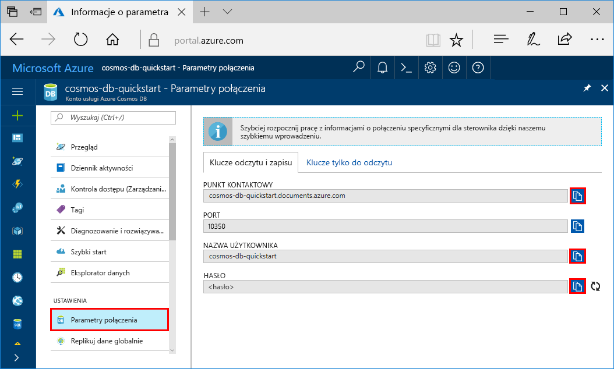
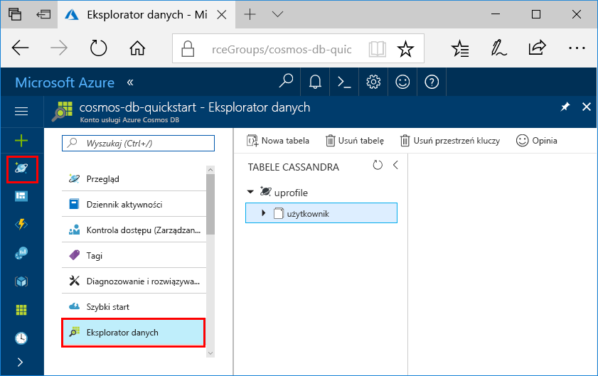

# <a name="quickstart-build-a-cassandra-app-with-nodejs-sdk-and-azure-cosmos-db"></a>Szybki start: tworzenie aplikacji Cassandra za pomocą zestawów SDK node.js i usługi Azure Cosmos DB

> [!div class="op_single_selector"]
> * [.NET](create-cassandra-dotnet.md)
> * [Java](create-cassandra-java.md)
> * [Node.js](create-cassandra-nodejs.md)
> * [Python](create-cassandra-python.md)
>  

W tym przewodniku Szybki start utworzysz konto interfejsu API usługi Azure Cosmos DB Cassandra i użyj aplikacji Cassandra Node.js sklonowanej z usługi GitHub w celu utworzenia bazy danych i kontenera Cassandra. Usługa Azure Cosmos DB to wielomodelowa usługa bazy danych, która umożliwia szybkie tworzenie i wykonywanie zapytań o bazy danych dokumentów, tabeli, wartości klucza i wykresów z możliwościami dystrybucji globalnej i skali poziomej.

## <a name="prerequisites"></a>Wymagania wstępne

[!INCLUDE [quickstarts-free-trial-note](../../includes/quickstarts-free-trial-note.md)] Można też [bezpłatnie wypróbować usługę Azure Cosmos DB](https://azure.microsoft.com/try/cosmosdb/) bez subskrypcji platformy Azure — nie wymaga to opłat ani zobowiązań.

Potrzebne są też następujące elementy:
* [Node.js](https://nodejs.org/dist/v0.10.29/x64/node-v0.10.29-x64.msi) w wersji 0.10.29 lub nowszej
* [Git](https://git-scm.com/)

## <a name="create-a-database-account"></a>Tworzenie konta bazy danych

Przed utworzeniem bazy danych dokumentów musisz utworzyć konto bazy danych Cassandra z użyciem usługi Azure Cosmos DB.

[!INCLUDE [cosmos-db-create-dbaccount-cassandra](../../includes/cosmos-db-create-dbaccount-cassandra.md)]

## <a name="clone-the-sample-application"></a>Klonowanie przykładowej aplikacji

Teraz sklonujemy aplikację interfejsu API Apache Cassandra z usługi GitHub, ustawimy parametry połączenia i uruchomimy ją. Zobaczysz, jak łatwo jest pracować programowo z danymi. 

1. Otwórz wiersz polecenia. Utwórz nowy folder o nazwie `git-samples`. Następnie zamknij wiersz polecenia.

    ```bash
    md "C:\git-samples"
    ```

2. Otwórz okno terminalu usługi Git, na przykład git bash. Użyj polecenia `cd`, aby przejść do nowego folderu w celu zainstalowania przykładowej aplikacji.

    ```bash
    cd "C:\git-samples"
    ```

3. Uruchom następujące polecenie w celu sklonowania przykładowego repozytorium. To polecenie tworzy kopię aplikacji przykładowej na komputerze.

    ```bash
    git clone https://github.com/Azure-Samples/azure-cosmos-db-cassandra-nodejs-getting-started.git
    ```

## <a name="review-the-code"></a>Przeglądanie kodu

Ten krok jest opcjonalny. Jeśli chcesz dowiedzieć się, jak kod tworzy zasoby bazy danych, możesz przejrzeć poniższe fragmenty kodu. Fragmenty kodu są pobierane z pliku `uprofile.js` z folderu `C:\git-samples\azure-cosmos-db-cassandra-nodejs-getting-started`. W przeciwnym razie możesz od razu przejść do sekcji [Aktualizacja parametrów połączenia](#update-your-connection-string). 

* Nazwa użytkownika i hasło zostały ustawione przy użyciu strony parametrów połączenia w witrynie Azure Portal. Element `path\to\cert` zawiera ścieżkę do certyfikatu X509. 

   ```javascript
   var ssl_option = {
        cert : fs.readFileSync("path\to\cert"),
        rejectUnauthorized : true,
        secureProtocol: 'TLSv1_2_method'
        };
   const authProviderLocalCassandra = new cassandra.auth.PlainTextAuthProvider(config.username, config.password);
   ```

* Element `client` jest inicjowany przy użyciu informacji contactPoint. Dane contactPoint są pobierane z witryny Azure Portal.

    ```javascript
    const client = new cassandra.Client({contactPoints: [config.contactPoint], authProvider: authProviderLocalCassandra, sslOptions:ssl_option});
    ```

* Element `client` łączy się z interfejsem API bazy danych Cassandra w usłudze Azure Cosmos DB.

    ```javascript
    client.connect(next);
    ```

* Tworzona jest nowa przestrzeń kluczy.

    ```javascript
    function createKeyspace(next) {
        var query = "CREATE KEYSPACE IF NOT EXISTS uprofile WITH replication = {\'class\': \'NetworkTopologyStrategy\', \'datacenter1\' : \'1\' }";
        client.execute(query, next);
        console.log("created keyspace");    
  }
    ```

* Tworzona jest nowa tabela.

   ```javascript
   function createTable(next) {
    var query = "CREATE TABLE IF NOT EXISTS uprofile.user (user_id int PRIMARY KEY, user_name text, user_bcity text)";
        client.execute(query, next);
        console.log("created table");
   },
   ```

* Wstawiane są jednostki klucz-wartość.

    ```javascript
        function insert(next) {
            console.log("\insert");
            const arr = ['INSERT INTO  uprofile.user (user_id, user_name , user_bcity) VALUES (1, \'AdrianaS\', \'Seattle\')',
                        'INSERT INTO  uprofile.user (user_id, user_name , user_bcity) VALUES (2, \'JiriK\', \'Toronto\')',
                        'INSERT INTO  uprofile.user (user_id, user_name , user_bcity) VALUES (3, \'IvanH\', \'Mumbai\')',
                        'INSERT INTO  uprofile.user (user_id, user_name , user_bcity) VALUES (4, \'IvanH\', \'Seattle\')',
                        'INSERT INTO  uprofile.user (user_id, user_name , user_bcity) VALUES (5, \'IvanaV\', \'Belgaum\')',
                        'INSERT INTO  uprofile.user (user_id, user_name , user_bcity) VALUES (6, \'LiliyaB\', \'Seattle\')',
                        'INSERT INTO  uprofile.user (user_id, user_name , user_bcity) VALUES (7, \'JindrichH\', \'Buenos Aires\')',
                        'INSERT INTO  uprofile.user (user_id, user_name , user_bcity) VALUES (8, \'AdrianaS\', \'Seattle\')',
                        'INSERT INTO  uprofile.user (user_id, user_name , user_bcity) VALUES (9, \'JozefM\', \'Seattle\')'];
            arr.forEach(element => {
            client.execute(element);
            });
            next();
        },
    ```

* Zapytanie o pobranie wszystkich wartości kluczy.

    ```javascript
        function selectAll(next) {
            console.log("\Select ALL");
            var query = 'SELECT * FROM uprofile.user';
            client.execute(query, function (err, result) {
            if (err) return next(err);
            result.rows.forEach(function(row) {
                console.log('Obtained row: %d | %s | %s ',row.user_id, row.user_name, row.user_bcity);
            }, this);
            next();
            });
        },
    ```  
    
* Zapytanie o pobranie pary klucz-wartość.

    ```javascript
        function selectById(next) {
            console.log("\Getting by id");
            var query = 'SELECT * FROM uprofile.user where user_id=1';
            client.execute(query, function (err, result) {
            if (err) return next(err);
            result.rows.forEach(function(row) {
                console.log('Obtained row: %d | %s | %s ',row.user_id, row.user_name, row.user_bcity);
            }, this);
            next();
            });
        }
    ```  

## <a name="update-your-connection-string"></a>Aktualizowanie parametrów połączenia

Teraz wróć do witryny Azure Portal, aby uzyskać informacje o parametrach połączenia i skopiować je do aplikacji. Parametry połączenia umożliwiają aplikacji komunikowanie się z hostowaną bazą danych.

1. Na swoim koncie usługi Azure Cosmos DB w [portalu Azure](https://portal.azure.com/)wybierz pozycję **Parametry połączenia**. 

    Użyj przycisku  po prawej stronie ekranu, aby skopiować górną wartość, PUNKT KONTAKTOWY.

    

2. Otwórz plik `config.js`. 

3. Wklej wartość PUNKT KONTAKTOWY z portalu do lokalizacji `<FillMEIN>` w wierszu 4.

    Wiersz 4 powinien teraz wyglądać podobnie do: 

    `config.contactPoint = "cosmos-db-quickstarts.cassandra.cosmosdb.azure.com:10350"`

4. Skopiuj wartość NAZWA UŻYTKOWNIKA z portalu do lokalizacji `<FillMEIN>` w wierszu 2.

    Wiersz 2 powinien teraz wyglądać podobnie do: 

    `config.username = 'cosmos-db-quickstart';`
    
5. Skopiuj wartość HASŁO z portalu do lokalizacji `<FillMEIN>` w wierszu 3.

    Wiersz 3 powinien teraz wyglądać podobnie do:

    `config.password = '2Ggkr662ifxz2Mg==';`

6. Zapisz plik `config.js`.
    
## <a name="use-the-x509-certificate"></a>Używanie certyfikatu X509

1. Pobierz certyfikat Baltimore CyberTrust Root [https://cacert.omniroot.com/bc2025.crt](https://cacert.omniroot.com/bc2025.crt)lokalnie z . Zmień rozszerzenie nazwy tego pliku na `.cer`.

   Certyfikat ma numer seryjny `02:00:00:b9` i odcisk palca SHA1 `d4🇩🇪20:d0:5e:66:fc:53:fe:1a:50:88:2c:78:db:28:52:ca:e4:74`.

2. Otwórz plik `uprofile.js` i zmień wartość parametru `path\to\cert`, aby wskazywał nowy certyfikat.

3. Zapisz plik `uprofile.js`.

> [!NOTE]
> Jeśli w kolejnych krokach wystąpi błąd związany z certyfikatem i jest uruchomiony na komputerze z systemem Windows, upewnij się, że postępuje proces poprawnego konwertowania pliku crt do poniższego formatu .cer firmy Microsoft.
> 
> Kliknij dwukrotnie plik crt, aby otworzyć go na ekranie certyfikatu. 
>
> 
>
> Naciśnij przycisk Dalej w Kreatorze certyfikatów. Wybierz bazę-64 zakodowaną X.509 (. CER), a następnie Dalej.
>
> 
>
> Wybierz opcję Przeglądaj (aby zlokalizować miejsce docelowe) i wpisz nazwę pliku.
> Wybierz pozycję Dalej, a następnie zakończono.
>
> Teraz powinien mieć poprawnie sformatowany plik .cer. Upewnij się, `uprofile.js` że ścieżka w punktach do tego pliku.

## <a name="run-the-nodejs-app"></a>Uruchamianie aplikacji Node.js

1. W oknie terminala git upewnij się, że znajdujesz się w przykładowym katalogu, który został sklonowany wcześniej:

    ```bash
    cd azure-cosmos-db-cassandra-nodejs-getting-started
    ```

2. Uruchom, `npm install` aby zainstalować wymagane moduły npm.

3. Uruchom polecenie `node uprofile.js`, aby uruchomić aplikację Node.

4. W wierszu polecenia sprawdź, czy wyniki są zgodne z oczekiwaniami.

    

    Naciśnij klawisze CTRL+C, aby zatrzymać wykonywanie programu i zamknąć okno konsoli. 

5. W witrynie Azure Portal otwórz **Eksploratora danych**, aby wykonywać zapytania oraz modyfikować te nowe dane i pracować z nimi. 

     

## <a name="review-slas-in-the-azure-portal"></a>Przeglądanie umów SLA w witrynie Azure Portal

[!INCLUDE [cosmosdb-tutorial-review-slas](../../includes/cosmos-db-tutorial-review-slas.md)]

## <a name="clean-up-resources"></a>Oczyszczanie zasobów

[!INCLUDE [cosmosdb-delete-resource-group](../../includes/cosmos-db-delete-resource-group.md)]

## <a name="next-steps"></a>Następne kroki

W tym przewodniku Szybki start dowiesz się, jak utworzyć konto usługi Azure Cosmos DB za pomocą interfejsu API Cassandra i uruchomić aplikację Cassandra Node.js, która tworzy bazę danych i kontener Cassandra. Teraz można importować dodatkowe dane do konta usługi Azure Cosmos DB. 

> [!div class="nextstepaction"]
> [Importowanie danych bazy danych Cassandra do usługi Azure Cosmos DB](cassandra-import-data.md)