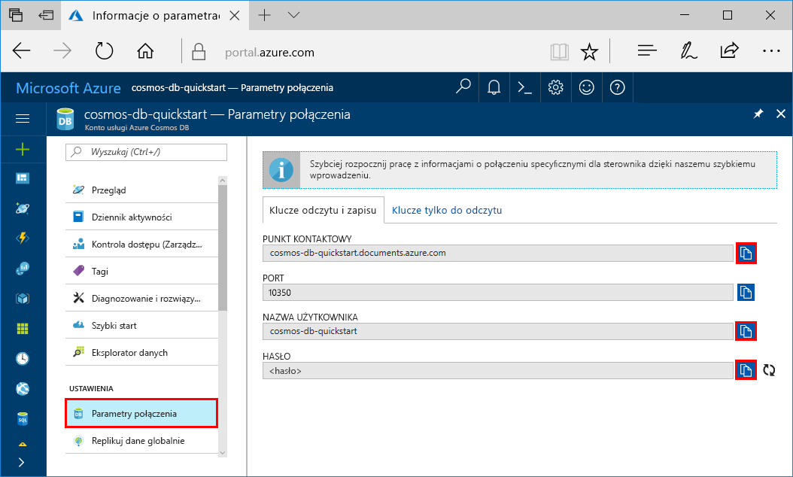
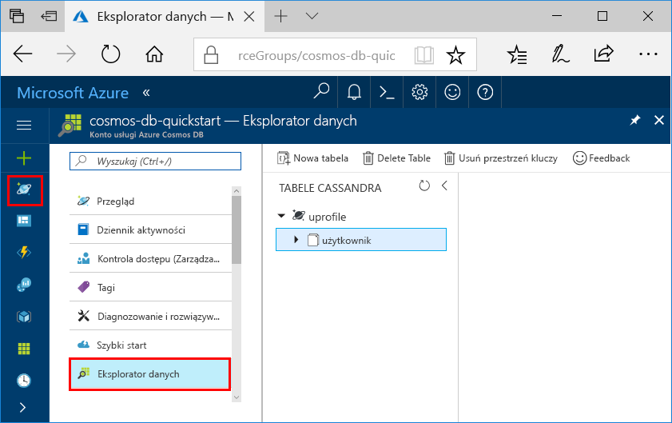

# <a name="quickstart-build-a-cassandra-app-with-python-sdk-and-azure-cosmos-db"></a>Szybki Start: Tworzenie aplikacji Cassandra za pomocą zestawu SDK języka Python i Azure Cosmos DB

> [!div class="op_single_selector"]
> * [.NET](create-cassandra-dotnet.md)
> * [Java](create-cassandra-java.md)
> * [Node.js](create-cassandra-nodejs.md)
> * [Python](create-cassandra-python.md)
>  

W tym przewodniku szybki start utworzysz konto Azure Cosmos DB interfejs API Cassandra i używasz aplikacji Cassandra Python sklonowanej z usługi GitHub w celu utworzenia Cassandra bazy danych i kontenera. Azure Cosmos DB to wielomodelowa usługa bazy danych, która pozwala szybko tworzyć i wysyłać zapytania dotyczące dokumentów, tabel, kluczy i wartościowych baz danych przy użyciu dystrybucji globalnej i możliwości skalowania w poziomie.

## <a name="prerequisites"></a>Wymagania wstępne

- Konto platformy Azure z aktywną subskrypcją. [Utwórz je bezpłatnie](https://azure.microsoft.com/free/?ref=microsoft.com&utm_source=microsoft.com&utm_medium=docs&utm_campaign=visualstudio). Lub [Wypróbuj bezpłatnie Azure Cosmos DB](https://azure.microsoft.com/try/cosmosdb/) bez subskrypcji platformy Azure.
- [Python 2.7.14 + lub 3.4 +](https://www.python.org/downloads/).
- [Git](https://git-scm.com/downloads).
- [Sterownik języka Python dla oprogramowania Apache Cassandra](https://github.com/datastax/python-driver).

## <a name="create-a-database-account"></a>Tworzenie konta bazy danych

Przed utworzeniem bazy danych dokumentów musisz utworzyć konto bazy danych Cassandra z użyciem usługi Azure Cosmos DB.

[!INCLUDE [cosmos-db-create-dbaccount-cassandra](../../includes/cosmos-db-create-dbaccount-cassandra.md)]

## <a name="clone-the-sample-application"></a>Klonowanie przykładowej aplikacji

Teraz sklonujemy aplikację interfejsu API Apache Cassandra z usługi GitHub, ustawimy parametry połączenia i uruchomimy ją. Zobaczysz, jak łatwo jest pracować programowo z danymi. 

1. Otwórz wiersz polecenia. Utwórz nowy folder o nazwie `git-samples`. Następnie zamknij wiersz polecenia.

    ```bash
    md "C:\git-samples"
    ```

2. Otwórz okno terminalu usługi Git, na przykład git bash, i użyj polecenia `cd`, aby przejść do nowego folderu instalacji aplikacji przykładowej.

    ```bash
    cd "C:\git-samples"
    ```

3. Uruchom następujące polecenie w celu sklonowania przykładowego repozytorium. To polecenie tworzy kopię przykładowej aplikacji na komputerze.

    ```bash
    git clone https://github.com/Azure-Samples/azure-cosmos-db-cassandra-python-getting-started.git
    ```

## <a name="review-the-code"></a>Przeglądanie kodu

Ten krok jest opcjonalny. Jeśli chcesz dowiedzieć się, jak kod tworzy zasoby bazy danych, możesz przejrzeć poniższe fragmenty kodu. Wszystkie fragmenty kodu pochodzą z pliku *pyquickstart.py* . W przeciwnym razie możesz od razu przejść do sekcji [Aktualizacja parametrów połączenia](#update-your-connection-string). 

* Nazwa użytkownika i hasło zostały ustawione przy użyciu strony parametrów połączenia w witrynie Azure Portal. Element `path\to\cert` zawiera ścieżkę do certyfikatu X509. 

   ```python
    ssl_opts = {
            'ca_certs': 'path\to\cert',
            'ssl_version': ssl.PROTOCOL_TLSv1_2
            }
    auth_provider = PlainTextAuthProvider( username=cfg.config['username'], password=cfg.config['password'])
    cluster = Cluster([cfg.config['contactPoint']], port = cfg.config['port'], auth_provider=auth_provider, ssl_options=ssl_opts)
    session = cluster.connect()
   
   ```

* Element `cluster` jest inicjowany przy użyciu informacji contactPoint. Dane contactPoint są pobierane z witryny Azure Portal.

    ```python
   cluster = Cluster([cfg.config['contactPoint']], port = cfg.config['port'], auth_provider=auth_provider)
    ```

* Element `cluster` łączy się z interfejsem API bazy danych Cassandra w usłudze Azure Cosmos DB.

    ```python
    session = cluster.connect()
    ```

* Tworzona jest nowa przestrzeń kluczy.

    ```python
   session.execute('CREATE KEYSPACE IF NOT EXISTS uprofile WITH replication = {\'class\': \'NetworkTopologyStrategy\', \'datacenter1\' : \'1\' }')
    ```

* Tworzona jest nowa tabela.

   ```
   session.execute('CREATE TABLE IF NOT EXISTS uprofile.user (user_id int PRIMARY KEY, user_name text, user_bcity text)');
   ```

* Wstawiane są jednostki klucz-wartość.

    ```Python
    insert_data = session.prepare("INSERT INTO  uprofile.user  (user_id, user_name , user_bcity) VALUES (?,?,?)")
    session.execute(insert_data, [1,'Lybkov','Seattle'])
    session.execute(insert_data, [2,'Doniv','Dubai'])
    session.execute(insert_data, [3,'Keviv','Chennai'])
    session.execute(insert_data, [4,'Ehtevs','Pune'])
    session.execute(insert_data, [5,'Dnivog','Belgaum'])
    ....
    
    ```

* Zapytanie o pobranie wszystkich wartości kluczy.

    ```Python
    rows = session.execute('SELECT * FROM uprofile.user')
    ```  
    
* Zapytanie o pobranie pary klucz-wartość.

    ```Python
    
    rows = session.execute('SELECT * FROM uprofile.user where user_id=1')
    ```  

## <a name="update-your-connection-string"></a>Aktualizowanie parametrów połączenia

Teraz wróć do witryny Azure Portal, aby uzyskać informacje o parametrach połączenia i skopiować je do aplikacji. Parametry połączenia umożliwiają aplikacji komunikowanie się z hostowaną bazą danych.

1. Na koncie Azure Cosmos DB w [Azure Portal](https://portal.azure.com/)wybierz pozycję **Parametry połączenia**. 

    Użyj przycisku  po prawej stronie ekranu, aby skopiować górną wartość, PUNKT KONTAKTOWY.

    

2. Otwórz plik *config.py* . 

3. Wklej wartość PUNKT KONTAKTOWY z portalu do lokalizacji `<FILLME>` w wierszu 10.

    Wiersz 10 powinien teraz wyglądać podobnie do: 

    `'contactPoint': 'cosmos-db-quickstarts.cassandra.cosmosdb.azure.com:10350'`

4. Skopiuj wartość NAZWA UŻYTKOWNIKA z portalu do lokalizacji `<FILLME>` w wierszu 6.

    Wiersz 6 powinien teraz wyglądać podobnie do: 

    `'username': 'cosmos-db-quickstart',`
    
5. Skopiuj wartość HASŁO z portalu do lokalizacji `<FILLME>` w wierszu 8.

    Wiersz 8 powinien teraz wyglądać podobnie do:

    `'password' = '2Ggkr662ifxz2Mg==`';`

6. Zapisz plik *config.py* .
    
## <a name="use-the-x509-certificate"></a>Używanie certyfikatu X509

1. Pobierz na komputer lokalny certyfikat Baltimore CyberTrust Root spod adresu [https://cacert.omniroot.com/bc2025.crt](https://cacert.omniroot.com/bc2025.crt). Zmień nazwę pliku przy użyciu rozszerzenia pliku *CER*.

   Certyfikat ma numer seryjny `02:00:00:b9` i odcisk palca SHA1 `d4🇩🇪20:d0:5e:66:fc:53:fe:1a:50:88:2c:78:db:28:52:ca:e4:74`.

2. Otwórz *pyquickstart.py* i Zmień `path\to\cert` tak, aby wskazywały nowy certyfikat.

3. Zapisz *pyquickstart.py*.

## <a name="run-the-python-app"></a>Uruchamianie aplikacji w języku Python

1. Korzystając z polecenia cd w terminalu usługi Git, przejdź do folderu `azure-cosmos-db-cassandra-python-getting-started`. 

2. Uruchom następujące polecenia, aby zainstalować wymagane moduły:

    ```python
    python -m pip install cassandra-driver
    python -m pip install prettytable
    python -m pip install requests
    python -m pip install pyopenssl
    ```

2. Uruchom następujące polecenie, aby uruchomić aplikację języka Python:

    ```
    python pyquickstart.py
    ```

3. W wierszu polecenia sprawdź, czy wyniki są zgodne z oczekiwaniami.

    Naciśnij klawisze CTRL + C, aby zatrzymać wykonywanie programu i zamknąć okno konsoli. 

    
    
4. W witrynie Azure Portal otwórz **Eksploratora danych**, aby wykonywać zapytania oraz modyfikować te nowe dane i pracować z nimi. 

    

## <a name="review-slas-in-the-azure-portal"></a>Przeglądanie umów SLA w witrynie Azure Portal

[!INCLUDE [cosmosdb-tutorial-review-slas](../../includes/cosmos-db-tutorial-review-slas.md)]

## <a name="clean-up-resources"></a>Oczyszczanie zasobów

[!INCLUDE [cosmosdb-delete-resource-group](../../includes/cosmos-db-delete-resource-group.md)]

## <a name="next-steps"></a>Następne kroki

W tym przewodniku szybki start przedstawiono sposób tworzenia konta Azure Cosmos DB przy użyciu interfejs API Cassandra i uruchamiania aplikacji Cassandra języka Python, która tworzy bazę danych Cassandra i kontener. Teraz możesz zaimportować dodatkowe dane do konta Azure Cosmos DB. 

> [!div class="nextstepaction"]
> [Importowanie danych bazy danych Cassandra do usługi Azure Cosmos DB](cassandra-import-data.md)

