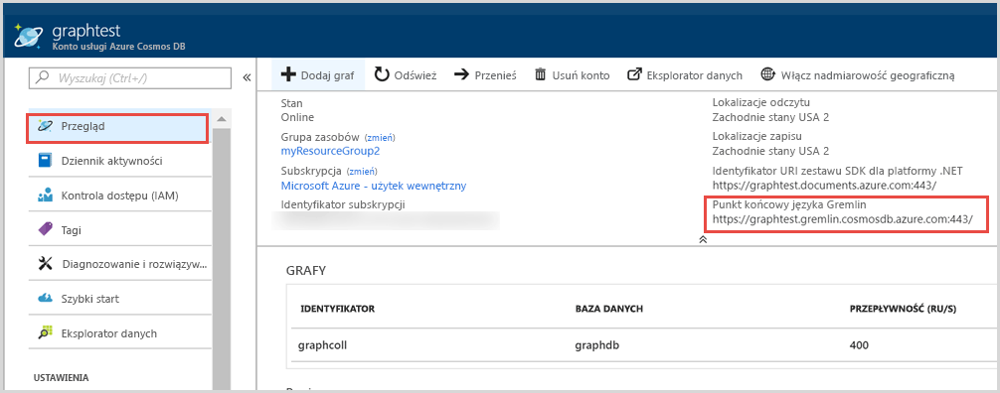
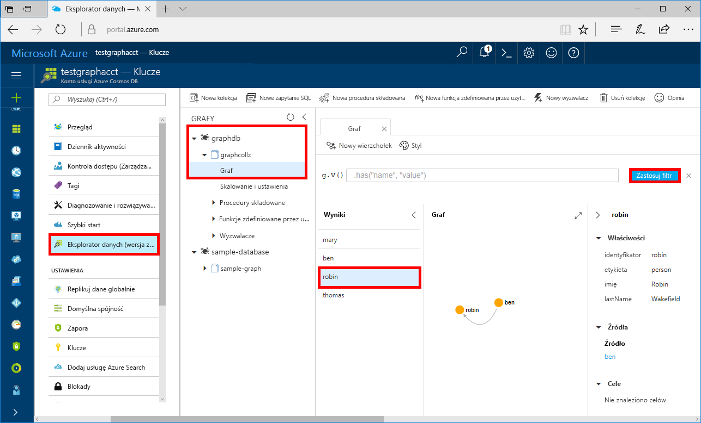

# <a name="quickstart-build-a-net-framework-or-core-application-using-the-azure-cosmos-db-gremlin-api-account"></a>Szybki start: tworzenie aplikacji .NET Framework lub Core za pomocą konta interfejsu API języka Gremlin w usłudze Azure Cosmos DB

> [!div class="op_single_selector"]
> * [Konsola Gremlin](create-graph-gremlin-console.md)
> * [.NET](create-graph-dotnet.md)
> * [Java](create-graph-java.md)
> * [Node.js](create-graph-nodejs.md)
> * [Python](create-graph-python.md)
> * [PHP](create-graph-php.md)
>  

Azure Cosmos DB to rozproszona globalnie, wielomodelowa usługa bazy danych firmy Microsoft. Dzięki dystrybucji globalnej i możliwości skalowania poziomego w usłudze Azure Cosmos DB możesz szybko tworzyć i za pomocą zapytań badać bazy danych dokumentów, par klucz/wartość oraz grafów. 

Ten przewodnik Szybki start przedstawia sposób tworzenia konta [interfejsu API języka Gremlin](graph-introduction.md), bazy danych i grafu (kontenera) usługi Azure Cosmos DB przy użyciu witryny Azure Portal. Następnie aplikacja konsoli utworzona za pomocą sterownika open source [Gremlin.Net](https://tinkerpop.apache.org/docs/3.2.7/reference/#gremlin-DotNet) zostanie skompilowana i uruchomiona.  

## <a name="prerequisites"></a>Wymagania wstępne

Jeśli nie masz jeszcze zainstalowanego programu Visual Studio 2019, możesz pobrać i korzystać **bezpłatnie** z programu [Visual Studio 2019 Community Edition](https://www.visualstudio.com/downloads/). Podczas instalacji programu Visual Studio upewnij się, że jest włączona opcja **Programowanie na platformie Azure**.

[!INCLUDE [quickstarts-free-trial-note](../../includes/quickstarts-free-trial-note.md)]

## <a name="create-a-database-account"></a>Tworzenie konta bazy danych

[!INCLUDE [cosmos-db-create-dbaccount-graph](../../includes/cosmos-db-create-dbaccount-graph.md)]

## <a name="add-a-graph"></a>Dodawanie grafu

[!INCLUDE [cosmos-db-create-graph](../../includes/cosmos-db-create-graph.md)]

## <a name="clone-the-sample-application"></a>Klonowanie przykładowej aplikacji

Teraz sklonujemy aplikację interfejsu API języka Gremlin z repozytorium GitHub, ustawimy parametry połączenia i uruchomimy ją. Zobaczysz, jak łatwo jest pracować programowo z danymi. 

1. Otwórz wiersz polecenia, utwórz nowy folder o nazwie git-samples, a następnie zamknij wiersz polecenia.

    ```bash
    md "C:\git-samples"
    ```

2. Otwórz okno terminalu usługi Git, na przykład git bash, i użyj polecenia `cd`, aby przejść do nowego folderu instalacji aplikacji przykładowej.

    ```bash
    cd "C:\git-samples"
    ```

3. Uruchom następujące polecenie w celu sklonowania przykładowego repozytorium. To polecenie tworzy kopię przykładowej aplikacji na komputerze.

    ```bash
    git clone https://github.com/Azure-Samples/azure-cosmos-db-graph-gremlindotnet-getting-started.git
    ```

4. Następnie otwórz program Visual Studio i otwórz plik rozwiązania.

5. Przywróć pakiety NuGet w projekcie. Powinny one obejmować sterownik Gremlin.Net, a także pakiet Newtonsoft.Json.


6. Sterownik Gremlin.Net możesz także zainstalować ręcznie, za pomocą menedżera pakietów NuGet lub [narzędzia wiersza polecenia nuget](https://docs.microsoft.com/nuget/install-nuget-client-tools): 

    ```bash
    nuget install Gremlin.Net
    ```

## <a name="review-the-code"></a>Przeglądanie kodu

Ten krok jest opcjonalny. Jeśli chcesz dowiedzieć się, jak zasoby bazy danych są tworzone w kodzie, możesz przejrzeć poniższe fragmenty kodu. W przeciwnym razie możesz od razu przejść do sekcji [Aktualizowanie parametrów połączenia](#update-your-connection-string). 

Wszystkie poniższe fragmenty kodu pochodzą z pliku Program.cs.

* Ustaw parametry połączenia na podstawie konta utworzonego powyżej (wiersz 19): 

    ```csharp
    private static string hostname = "your-endpoint.gremlin.cosmosdb.azure.com";
    private static int port = 443;
    private static string authKey = "your-authentication-key";
    private static string database = "your-database";
    private static string collection = "your-graph-container";
    ```

* Polecenia języka Gremlin do wykonania są wyświetlane w postaci słownika (wiersz 26):

    ```csharp
    private static Dictionary<string, string> gremlinQueries = new Dictionary<string, string>
    {
        { "Cleanup",        "g.V().drop()" },
        { "AddVertex 1",    "g.addV('person').property('id', 'thomas').property('firstName', 'Thomas').property('age', 44)" },
        { "AddVertex 2",    "g.addV('person').property('id', 'mary').property('firstName', 'Mary').property('lastName', 'Andersen').property('age', 39)" },
        { "AddVertex 3",    "g.addV('person').property('id', 'ben').property('firstName', 'Ben').property('lastName', 'Miller')" },
        { "AddVertex 4",    "g.addV('person').property('id', 'robin').property('firstName', 'Robin').property('lastName', 'Wakefield')" },
        { "AddEdge 1",      "g.V('thomas').addE('knows').to(g.V('mary'))" },
        { "AddEdge 2",      "g.V('thomas').addE('knows').to(g.V('ben'))" },
        { "AddEdge 3",      "g.V('ben').addE('knows').to(g.V('robin'))" },
        { "UpdateVertex",   "g.V('thomas').property('age', 44)" },
        { "CountVertices",  "g.V().count()" },
        { "Filter Range",   "g.V().hasLabel('person').has('age', gt(40))" },
        { "Project",        "g.V().hasLabel('person').values('firstName')" },
        { "Sort",           "g.V().hasLabel('person').order().by('firstName', decr)" },
        { "Traverse",       "g.V('thomas').out('knows').hasLabel('person')" },
        { "Traverse 2x",    "g.V('thomas').out('knows').hasLabel('person').out('knows').hasLabel('person')" },
        { "Loop",           "g.V('thomas').repeat(out()).until(has('id', 'robin')).path()" },
        { "DropEdge",       "g.V('thomas').outE('knows').where(inV().has('id', 'mary')).drop()" },
        { "CountEdges",     "g.E().count()" },
        { "DropVertex",     "g.V('thomas').drop()" },
    };
    ```


* Utwórz obiekt połączenia `GremlinServer` przy użyciu parametrów podanych powyżej (wiersz 52):

    ```csharp
    var gremlinServer = new GremlinServer(hostname, port, enableSsl: true, 
                                                    username: "/dbs/" + database + "/colls/" + collection, 
                                                    password: authKey);
    ```

* Utwórz nowy obiekt `GremlinClient` (wiersz 56):

    ```csharp
    var gremlinClient = new GremlinClient(gremlinServer, new GraphSON2Reader(), new GraphSON2Writer(), GremlinClient.GraphSON2MimeType);
    ```

* Wykonaj wszystkie zapytania języka Gremlin za pomocą obiektu `GremlinClient` przy użyciu zadania asynchronicznego (wiersz 63). Spowoduje to odczytanie zapytań języka Gremlin ze słownika zdefiniowanego powyżej (wiersz 26):

    ```csharp
    var results = await gremlinClient.SubmitAsync<dynamic>(query.Value);
    ```

* Pobierz wynik i odczytaj wartości sformatowane jako słownik przy użyciu klasy `JsonSerializer` z pakietu Newtonsoft.Json:

    ```csharp
    foreach (var result in results)
    {
        // The vertex results are formed as dictionaries with a nested dictionary for their properties
        string output = JsonConvert.SerializeObject(result);
        Console.WriteLine(String.Format("\tResult:\n\t{0}", output));
    }
    ```

## <a name="update-your-connection-string"></a>Aktualizowanie parametrów połączenia

Teraz wróć do witryny Azure Portal, aby uzyskać informacje o parametrach połączenia i skopiować je do aplikacji.

1. W witrynie [Azure Portal](https://portal.azure.com/) przejdź do swojego konta bazy danych programu Graph. Na karcie **Przegląd** są wyświetlane dwa punkty końcowe: 
 
   **Identyfikator URI zestawu .NET SDK** — ta wartość jest używana podczas łączenia się z kontem grafu przy użyciu biblioteki Microsoft. Azure. graphs. 

   **Punkt końcowy języka Gremlin** — ta wartość jest używana podczas nawiązywania połączenia z kontem programu Graph przy użyciu biblioteki Gremlin.Net.

    

   Aby uruchomić ten przykład, skopiuj wartość **punktu końcowego języka Gremlin**, usuń numer portu na końcu, otrzymując identyfikator URI `https://<your cosmos db account name>.gremlin.cosmosdb.azure.com`

2. W pliku Program.cs wklej wartość w miejsce ciągu `your-endpoint` dla zmiennej `hostname` w wierszu 19. 

    `"private static string hostname = "<your cosmos db account name>.gremlin.cosmosdb.azure.com";`

    Wartość punktu końcowego powinna wyglądać następująco:

    `"private static string hostname = "testgraphacct.gremlin.cosmosdb.azure.com";`

3. Następnie przejdź na kartę **Klucze** i skopiuj wartość **KLUCZ PODSTAWOWY** z portalu, a następnie wklej ją w zmiennej `authkey`, zastępując symbol zastępczy `"your-authentication-key"` w wierszu 21. 

    `private static string authKey = "your-authentication-key";`

4. Korzystając z informacji o bazie danych utworzonej powyżej, wklej nazwę bazy danych wewnątrz zmiennej `database` w wierszu 22. 

    `private static string database = "your-database";`

5. Podobnie, korzystając z informacji o utworzonym powyżej kontenerze, wklej nazwę kolekcji (która jest też nazwą grafu) wewnątrz zmiennej `collection` w wierszu 23. 

    `private static string collection = "your-collection-or-graph";`

6. Zapisz plik Program.cs. 

Aplikacja została zaktualizowana i zawiera teraz wszystkie informacje potrzebne do nawiązania komunikacji z usługą Azure Cosmos DB. 

## <a name="run-the-console-app"></a>Uruchamianie aplikacji konsolowej

Naciśnij klawisze CTRL + F5, aby uruchomić aplikację. Aplikacja będzie wyświetlać polecenia zapytań języka Gremlin i ich wyniki w konsoli.

   W oknie konsoli będą widoczne wierzchołki i krawędzie dodawane do grafu. Po zakończeniu działania skryptu naciśnij klawisz ENTER dwa razy, aby zamknąć okno konsoli.

## <a name="browse-using-the-data-explorer"></a>Przeglądanie za pomocą Eksploratora danych

Teraz możesz wrócić do Eksploratora danych w witrynie Azure Portal, aby przeglądać nowe dane i wykonywać zapytania względem nich.

1. W Eksploratorze danych nowa baza danych jest wyświetlana w okienku Grafy. Rozwiń węzły bazy danych i kontenera, a następnie kliknij pozycję **Graf**.

2. Kliknij polecenie **Zastosuj filtr**, aby użyć domyślnego zapytania do wyświetlenia wszystkich wierzchołków grafu. Dane wygenerowane przez przykładową aplikację zostaną wyświetlone w okienku Grafy.

    Możesz powiększać i zmniejszać graf, rozszerzać obszar wyświetlania grafu, dodawać kolejne wierzchołki oraz przenosić wierzchołki na wyświetlanej powierzchni.

    

## <a name="review-slas-in-the-azure-portal"></a>Przeglądanie umów SLA w witrynie Azure Portal

[!INCLUDE [cosmosdb-tutorial-review-slas](../../includes/cosmos-db-tutorial-review-slas.md)]

## <a name="clean-up-resources"></a>Oczyszczanie zasobów

[!INCLUDE [cosmosdb-delete-resource-group](../../includes/cosmos-db-delete-resource-group.md)]

## <a name="next-steps"></a>Następne kroki

W tym przewodniku Szybki start wyjaśniono sposób tworzenia konta usługi Azure Cosmos DB, tworzenia grafu za pomocą Eksploratora danych i uruchamiania aplikacji. Teraz możesz tworzyć bardziej złożone zapytania i implementować zaawansowaną logikę przechodzenia grafu za pomocą języka Gremlin. 

> [!div class="nextstepaction"]
> [Wykonywanie zapytań przy użyciu języka Gremlin](tutorial-query-graph.md)

