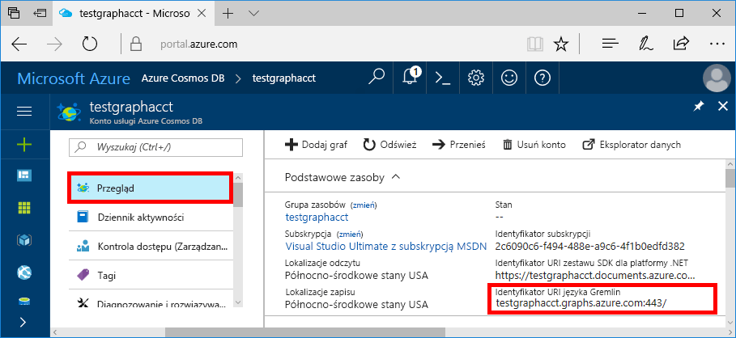
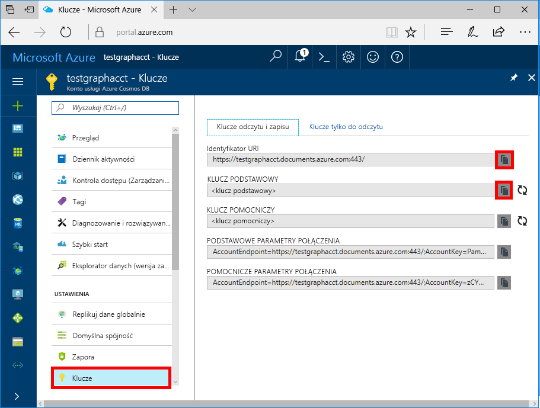

# <a name="quickstart-build-a-nodejs-application-by-using-azure-cosmos-db-gremlin-api-account"></a>Szybki start: tworzenie aplikacji Node.js za pomocą konta interfejsu API języka Gremlin dla usługi Azure Cosmos DB

> [!div class="op_single_selector"]
> * [Konsola Gremlin](create-graph-gremlin-console.md)
> * [.NET](create-graph-dotnet.md)
> * [Java](create-graph-java.md)
> * [Node.js](create-graph-nodejs.md)
> * [Python](create-graph-python.md)
> * [PHP](create-graph-php.md)
>  

Azure Cosmos DB to rozproszona globalnie wielomodelowa usługa bazy danych firmy Microsoft. Dzięki dystrybucji globalnej i możliwości skalowania poziomego w usłudze Azure Cosmos DB możesz szybko tworzyć i za pomocą zapytań badać bazy danych dokumentów, par klucz/wartość oraz grafów. 

Ten przewodnik Szybki Start przedstawia sposób Azure Cosmos DB tworzenia konta [interfejsu API Gremlin](graph-introduction.md) , bazy danych i grafu przy użyciu Azure Portal. Następnie przy użyciu sterownika open source [Node.js Gremlin](https://www.npmjs.com/package/gremlin) zostanie utworzona i uruchomiona aplikacja konsoli.

## <a name="prerequisites"></a>Wymagania wstępne

Przed uruchomieniem tego przykładu muszą być spełnione następujące wymagania wstępne:
* [Node.js](https://nodejs.org/en/) w wersji 0.10.29 lub nowszej
* [Usługa Git](https://git-scm.com/)

[!INCLUDE [quickstarts-free-trial-note](../../includes/quickstarts-free-trial-note.md)]

## <a name="create-a-database-account"></a>Tworzenie konta bazy danych

[!INCLUDE [cosmos-db-create-dbaccount-graph](../../includes/cosmos-db-create-dbaccount-graph.md)]

## <a name="add-a-graph"></a>Dodawanie grafu

[!INCLUDE [cosmos-db-create-graph](../../includes/cosmos-db-create-graph.md)]

## <a name="clone-the-sample-application"></a>Klonowanie przykładowej aplikacji

Teraz sklonujemy aplikację interfejsu API języka Gremlin z repozytorium GitHub, ustawimy parametry połączenia i uruchomimy ją. Zobaczysz, jak łatwo jest pracować programowo z danymi. 

1. Otwórz wiersz polecenia, utwórz nowy folder o nazwie git-samples, a następnie zamknij wiersz polecenia.

    ```bash
    md "C:\git-samples"
    ```

2. Otwórz okno terminalu usługi Git, na przykład git bash, i użyj polecenia `cd`, aby przejść do nowego folderu instalacji aplikacji przykładowej.

    ```bash
    cd "C:\git-samples"
    ```

3. Uruchom następujące polecenie w celu sklonowania przykładowego repozytorium. To polecenie tworzy kopię przykładowej aplikacji na komputerze.

    ```bash
    git clone https://github.com/Azure-Samples/azure-cosmos-db-graph-nodejs-getting-started.git
    ```

3. Otwórz plik rozwiązania w programie Visual Studio. 

## <a name="review-the-code"></a>Przeglądanie kodu

Ten krok jest opcjonalny. Jeśli chcesz dowiedzieć się, jak zasoby bazy danych są tworzone w kodzie, możesz przejrzeć poniższe fragmenty kodu. W przeciwnym razie możesz od razu przejść do sekcji [Aktualizowanie parametrów połączenia](#update-your-connection-string). 

Wszystkie poniższe fragmenty kodu pochodzą z pliku app.js.

* Tworzenie klienta języka Gremlin.

    ```javascript
    const authenticator = new Gremlin.driver.auth.PlainTextSaslAuthenticator(
        `/dbs/${config.database}/colls/${config.collection}`, 
        config.primaryKey
    )


    const client = new Gremlin.driver.Client(
        config.endpoint, 
        { 
            authenticator,
            traversalsource : "g",
            rejectUnauthorized : true,
            mimeType : "application/vnd.gremlin-v2.0+json"
        }
    );

    ```

  Wszystkie konfiguracje są w pliku `config.js`, który będziemy edytować w [następnej sekcji](#update-your-connection-string).

* W celu wykonywania różnych operacji języka Gremlin zdefiniowano serie funkcji. To jest jedna z nich:

    ```javascript
    function addVertex1()
    {
        console.log('Running Add Vertex1'); 
        return client.submit("g.addV(label).property('id', id).property('firstName', firstName).property('age', age).property('userid', userid).property('pk', 'pk')", {
                label:"person",
                id:"thomas",
                firstName:"Thomas",
                age:44, userid: 1
            }).then(function (result) {
                    console.log("Result: %s\n", JSON.stringify(result));
            });
    }
    ```

* Każda funkcja wykonuje metodę `client.execute` z parametrem ciągu zapytania języka Gremlin. Oto przykład wykonywania metody `g.V().count()`:

    ```javascript
    function countVertices()
    {
        console.log('Running Count');
        return client.submit("g.V().count()", { }).then(function (result) {
            console.log("Result: %s\n", JSON.stringify(result));
        });
    }
    ```

* Na końcu pliku są następnie wywoływane wszystkie metody. Powoduje wykonywanie ich jedna po drugiej:

    ```javascript
    client.open()
    .then(dropGraph)
    .then(addVertex1)
    .then(addVertex2)
    .then(addEdge)
    .then(countVertices)
    .catch((err) => {
        console.error("Error running query...");
        console.error(err)
    }).then((res) => {
        client.close();
        finish();
    }).catch((err) => 
        console.error("Fatal error:", err)
    );
    ```


## <a name="update-your-connection-string"></a>Aktualizowanie parametrów połączenia

1. Otwórz plik config.js. 

2. W pliku config.js przypisz kluczowi `config.endpoint` wartość **Identyfikator URI Gremlin** ze strony **Przegląd** w witrynie Azure Portal. 

    `config.endpoint = "https://<your_Gremlin_account_name>.gremlin.cosmosdb.azure.com:443/";`

    

3. W pliku config.js przypisz elementowi config.primaryKey wartość z pola **Klucz podstawowy** na stronie **Klucze** w witrynie Azure Portal. 

    `config.primaryKey = "PRIMARYKEY";`

   

4. Wprowadź nazwę bazy danych i nazwę grafu (kontenera) dla wartości parametrów config.database i config.collection. 

Oto przykład wypełnionego pliku config.js:

```javascript
var config = {}

// Note that this must not have HTTPS or the port number
config.endpoint = "https://testgraphacct.gremlin.cosmosdb.azure.com:443/"; 
config.primaryKey = "Pams6e7LEUS7LJ2Qk0fjZf3eGo65JdMWHmyn65i52w8ozPX2oxY3iP0yu05t9v1WymAHNcMwPIqNAEv3XDFsEg==";
config.database = "graphdb"
config.collection = "Persons"

module.exports = config;
```

## <a name="run-the-console-app"></a>Uruchamianie aplikacji konsolowej

1. Otwórz okno terminala i za pomocą polecenia `cd` przejdź do katalogu instalacyjnego pliku package.json uwzględnionego w projekcie.

2. Uruchom polecenie `npm install`, aby zainstalować wymagane moduły npm, w tym `gremlin`.

3. Uruchom polecenie `node app.js` w terminalu, aby uruchomić aplikację Node.

## <a name="browse-with-data-explorer"></a>Przeglądanie w Eksploratorze danych

Teraz możesz wrócić do Eksploratora danych w witrynie Azure Portal, aby wyświetlać nowe dane grafu, wykonywać o nie zapytania, modyfikować je i pracować z nimi.

W Eksploratorze danych nowa baza danych jest wyświetlana w okienku **Grafy**. Rozwiń bazę danych i kontener, a następnie wybierz pozycję **Graf**.

Dane generowane przez aplikację przykładową będą wyświetlane w kolejnym okienku na karcie **Graf**, gdy wybierzesz przycisk **Zastosuj filtr**.

Spróbuj uzupełnić wartość `g.V()` ciągiem `.has('firstName', 'Thomas')`, aby przetestować filtr. Pamiętaj, że w wartości jest uwzględniana wielkość liter.

## <a name="review-slas-in-the-azure-portal"></a>Przeglądanie umów SLA w witrynie Azure Portal

[!INCLUDE [cosmosdb-tutorial-review-slas](../../includes/cosmos-db-tutorial-review-slas.md)]

## <a name="clean-up-your-resources"></a>Czyszczenie zasobów

[!INCLUDE [cosmosdb-delete-resource-group](../../includes/cosmos-db-delete-resource-group.md)]

## <a name="next-steps"></a>Następne kroki

W tym artykule wyjaśniono sposób tworzenia konta usługi Azure Cosmos DB, tworzenia grafu za pomocą Eksploratora danych i uruchamiania aplikacji. Teraz możesz tworzyć bardziej złożone zapytania i implementować zaawansowaną logikę przechodzenia grafu za pomocą języka Gremlin. 

> [!div class="nextstepaction"]
> [Wykonywanie zapytań przy użyciu języka Gremlin](tutorial-query-graph.md)
