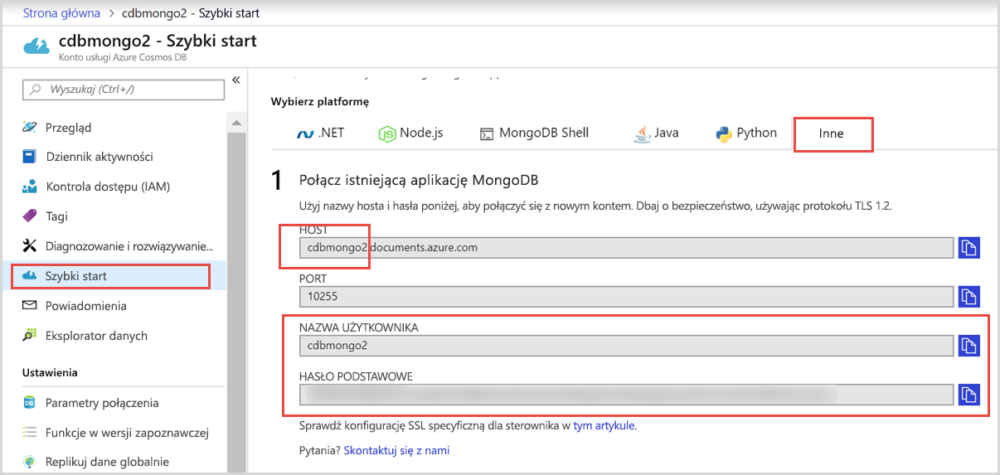
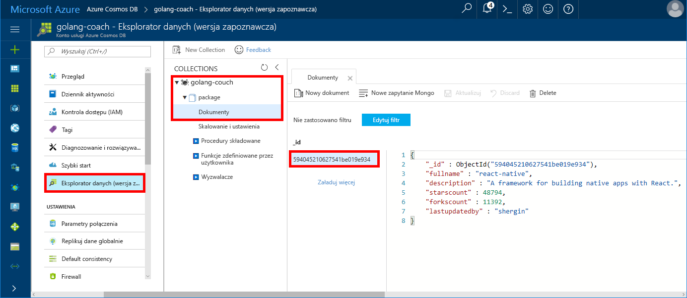

# <a name="quickstart-build-a-console-app-using-azure-cosmos-dbs-api-for-mongodb-and-golang-sdk"></a>Szybki start: Tworzenie aplikacji konsolowej za pomocą interfejsu API usługi Azure Cosmos DB dla bazy danych MongoDB i zestawu SDK języka Golang

> [!div class="op_single_selector"]
> * [.NET](create-mongodb-dotnet.md)
> * [Java](create-mongodb-java.md)
> * [Node.js](create-mongodb-nodejs.md)
> * [Python](create-mongodb-flask.md)
> * [Xamarin](create-mongodb-xamarin.md)
> * [Golang](create-mongodb-golang.md)
>  

Azure Cosmos DB to rozproszona globalnie wielomodelowa usługa bazy danych firmy Microsoft. Dzięki dystrybucji globalnej i możliwości skalowania poziomego w usłudze Cosmos DB możesz szybko tworzyć i za pomocą zapytań badać bazy danych dokumentów, par klucz/wartość oraz grafów.

Ten przewodnik Szybki start wyjaśnia, jak użyć istniejącej aplikacji MongoDB napisanej w języku [Golang](https://golang.org/) i połączyć ją z bazą danych usługi Cosmos przy użyciu interfejsu API usługi Azure Cosmos DB dla bazy danych MongoDB.

Innymi słowy, aplikacja w języku Golang wie jedynie, że łączy się przy użyciu klienta bazy danych MongoDB. Aplikacja nie wie, że dane są przechowywane w bazie danych usługi Cosmos.

## <a name="prerequisites"></a>Wymagania wstępne

- Subskrypcja platformy Azure. Jeśli nie masz subskrypcji platformy Azure, przed rozpoczęciem utwórz [bezpłatne konto](https://azure.microsoft.com/free). 

  [!INCLUDE [cosmos-db-emulator-mongodb](../../includes/cosmos-db-emulator-mongodb.md)]

- Język [Go](https://golang.org/dl/) i podstawowa wiedza o języku [Go](https://golang.org/).
- Środowisko IDE — [GoLand](https://www.jetbrains.com/go/) firmy Jetbrains, [Visual Studio Code](https://code.visualstudio.com/) firmy Microsoft lub [Atom](https://atom.io/). W tym samouczku używam środowiska GoLand.

<a id="create-account"></a>
## <a name="create-a-database-account"></a>Tworzenie konta bazy danych

[!INCLUDE [cosmos-db-create-dbaccount](../../includes/cosmos-db-create-dbaccount-mongodb.md)]

## <a name="clone-the-sample-application"></a>Klonowanie przykładowej aplikacji

Sklonuj przykładową aplikację i zainstaluj wymagane pakiety.

1. Utwórz folder o nazwie CosmosDBSample wewnątrz folderu KATALOG_GŁÓWNY_GO\src, którym domyślnie jest folder C:\Go\.
2. Uruchom następujące polecenie, używając okna terminala git, takiego jak powłoka Bash usługi git, w celu sklonowania przykładowego repozytorium do folderu CosmosDBSample. 

    ```bash
    git clone https://github.com/Azure-Samples/azure-cosmos-db-mongodb-golang-getting-started.git
    ```
3.  Uruchom następujące polecenie, aby uzyskać pakiet mgo. 

    ```
    go get gopkg.in/mgo.v2
    ```

Sterownik [mgo](https://labix.org/mgo) to sterownik bazy danych [MongoDB](https://www.mongodb.com/) dla [języka Go](https://golang.org/), który implementuje zbiór rozbudowanych i dobrze przetestowanych funkcji dostępnych przez bardzo prosty interfejs API zgodny ze standardowymi idiomami języka Go.

<a id="connection-string"></a>

## <a name="update-your-connection-string"></a>Aktualizowanie parametrów połączenia

Teraz wróć do witryny Azure Portal, aby uzyskać informacje o parametrach połączenia i skopiować je do aplikacji.

1. Kliknij pozycję **Szybki start** w menu nawigacji po lewej stronie, a następnie kliknij pozycję **Inne**, aby wyświetlić informacje o parametrach połączenia wymaganych przez aplikację języka Go.

2. W środowisku Goglang otwórz plik main.go w katalogu GOROOT\CosmosDBSample i zaktualizuj następujące wiersze kodu przy użyciu informacji o parametrach połączenia z witryny Azure Portal zgodnie z poniższym zrzutem ekranu. 

    Nazwa bazy danych to prefiks wartości **Host** w panelu parametrów połączenia witryny Azure Portal. Dla konta pokazanego na poniższej ilustracji nazwa bazy danych to golang-coach.

    ```go
    Database: "The prefix of the Host value in the Azure portal",
    Username: "The Username in the Azure portal",
    Password: "The Password in the Azure portal",
    ```

    

3. Zapisz plik main.go.

## <a name="review-the-code"></a>Przeglądanie kodu

Ten krok jest opcjonalny. Jeśli chcesz dowiedzieć się, jak zasoby bazy danych są tworzone w kodzie, możesz przejrzeć poniższe fragmenty kodu. W przeciwnym razie możesz od razu przejść do sekcji [Uruchamianie aplikacji](#run-the-app). 

Wszystkie poniższe fragmenty kodu pochodzą z pliku main.go.

### <a name="connecting-the-go-app-to-cosmos-db"></a>Łączenie aplikacji języka Go z usługą Cosmos DB

Interfejs API usługi Azure Cosmos DB dla bazy danych MongoDB obsługuje połączenie z protokołem SSL. Aby się połączyć, musisz zdefiniować funkcję **DialServer** w klasie [mgo.DialInfo](https://godoc.org/gopkg.in/mgo.v2#DialInfo) i wykorzystać funkcję [tls.*Dial*](https://golang.org/pkg/crypto/tls#Dial) do nawiązania połączenia.

Następujący fragment kodu w języku Golang łączy aplikację w języku Go z interfejsem API usługi Azure Cosmos DB dla bazy danych MongoDB. Klasa *DialInfo* przechowuje opcje do ustanowienia sesji.

```go
// DialInfo holds options for establishing a session.
dialInfo := &mgo.DialInfo{
    Addrs:    []string{"golang-couch.documents.azure.com:10255"}, // Get HOST + PORT
    Timeout:  60 * time.Second,
    Database: "database", // It can be anything
    Username: "username", // Username
    Password: "Azure database connect password from Azure Portal", // PASSWORD
    DialServer: func(addr *mgo.ServerAddr) (net.Conn, error) {
        return tls.Dial("tcp", addr.String(), &tls.Config{})
    },
}

// Create a session which maintains a pool of socket connections
// to Cosmos database (using Azure Cosmos DB's API for MongoDB).
session, err := mgo.DialWithInfo(dialInfo)

if err != nil {
    fmt.Printf("Can't connect, go error %v\n", err)
    os.Exit(1)
}

defer session.Close()

// SetSafe changes the session safety mode.
// If the safe parameter is nil, the session is put in unsafe mode, 
// and writes become fire-and-forget,
// without error checking. The unsafe mode is faster since operations won't hold on waiting for a confirmation.
// 
session.SetSafe(&mgo.Safe{})
```

Metoda **mgo.Dial()** jest używana w przypadku braku połączenia SSL. W przypadku połączenia SSL wymagana jest metoda **mgo.DialWithInfo()**.

Do utworzenia obiektu sesji używane jest wystąpienie obiektu **DialWithInfo{}**. Po ustanowieniu sesji można uzyskać dostęp do kolekcji, używając poniższego fragmentu kodu:

```go
collection := session.DB("database").C("package")
```

<a id="create-document"></a>

### <a name="create-a-document"></a>Tworzenie dokumentu

```go
// Model
type Package struct {
    Id bson.ObjectId  `bson:"_id,omitempty"`
    FullName      string
    Description   string
    StarsCount    int
    ForksCount    int
    LastUpdatedBy string
}

// insert Document in collection
err = collection.Insert(&Package{
    FullName:"react",
    Description:"A framework for building native apps with React.",
    ForksCount: 11392,
    StarsCount:48794,
    LastUpdatedBy:"shergin",

})

if err != nil {
    log.Fatal("Problem inserting data: ", err)
    return
}
```

### <a name="query-or-read-a-document"></a>Wykonywanie zapytania o dokument lub jego odczytywanie

Usługa Cosmos DB obsługuje zaawansowane zapytania o dane przechowywane w każdej kolekcji. Następujący przykładowy kod przedstawia zapytanie, które można uruchomić dla dokumentów w kolekcji.

```go
// Get a Document from the collection
result := Package{}
err = collection.Find(bson.M{"fullname": "react"}).One(&result)
if err != nil {
    log.Fatal("Error finding record: ", err)
    return
}

fmt.Println("Description:", result.Description)
```


### <a name="update-a-document"></a>Aktualizowanie dokumentu

```go
// Update a document
updateQuery := bson.M{"_id": result.Id}
change := bson.M{"$set": bson.M{"fullname": "react-native"}}
err = collection.Update(updateQuery, change)
if err != nil {
    log.Fatal("Error updating record: ", err)
    return
}
```

### <a name="delete-a-document"></a>Usuwanie dokumentu

Usługa Cosmos DB obsługuje usuwanie dokumentów.

```go
// Delete a document
query := bson.M{"_id": result.Id}
err = collection.Remove(query)
if err != nil {
   log.Fatal("Error deleting record: ", err)
   return
}
```
    
## <a name="run-the-app"></a>Uruchamianie aplikacji

1. W środowisku Golang upewnij się, że ścieżka GOPATH (dostępna po wybraniu pozycji **File** [Plik], **Settings** [Ustawienia], **Go**, **GOPATH**) uwzględnia lokalizację, w której zostało zainstalowane polecenie gopkg. Domyślnie jest to ścieżka PROFIL_UŻYTKOWNIKA\go. 
2. Przekształć w komentarz wiersze usuwające dokument (103–107), aby dokument był widoczny po uruchomieniu aplikacji.
3. W środowisku Golang kliknij pozycję **Run** (Uruchom), a następnie kliknij pozycję **Run 'Build main.go and run'** (Uruchom „Skompiluj plik main.go i uruchom”).

    Aplikacja kończy działanie i wyświetla opis dokumentu utworzonego w sekcji [Tworzenie dokumentu](#create-document).
    
    ```
    Description: A framework for building native apps with React.
    
    Process finished with exit code 0
    ```

    
    
## <a name="review-your-document-in-data-explorer"></a>Przeglądanie dokumentu w Eksploratorze danych

Wróć do witryny Azure Portal, aby zobaczyć swój dokument w Eksploratorze danych.

1. Kliknij przycisk **Eksplorator danych (wersja zapoznawcza)** w menu nawigacji po lewej stronie, rozwiń pozycje **golang-coach**, **pakiet**, a następnie kliknij pozycję **Dokumenty**. Na karcie **Dokumenty** kliknij pozycję \_id w celu wyświetlenia dokumentu w okienku po prawej stronie. 

    
    
2. Możesz wtedy pracować z dokumentem wewnątrz tego okna i kliknąć pozycję **Aktualizuj** w celu zapisania go. Możesz też usunąć dokument lub utworzyć nowe dokumenty albo zapytania.

## <a name="review-slas-in-the-azure-portal"></a>Przeglądanie umów SLA w witrynie Azure Portal

[!INCLUDE [cosmosdb-tutorial-review-slas](../../includes/cosmos-db-tutorial-review-slas.md)]

## <a name="clean-up-resources"></a>Oczyszczanie zasobów

[!INCLUDE [cosmosdb-delete-resource-group](../../includes/cosmos-db-delete-resource-group.md)]

## <a name="next-steps"></a>Kolejne kroki

W tym przewodniku Szybki start wyjaśniono sposób tworzenia konta usługi Cosmos i uruchamiania aplikacji w języku Golang. Teraz możesz zaimportować dodatkowe dane do swojej bazy danych usługi Cosmos. 

> [!div class="nextstepaction"]
> [Importowanie danych z bazy danych MongoDB do usługi Azure Cosmos DB](mongodb-migrate.md)
