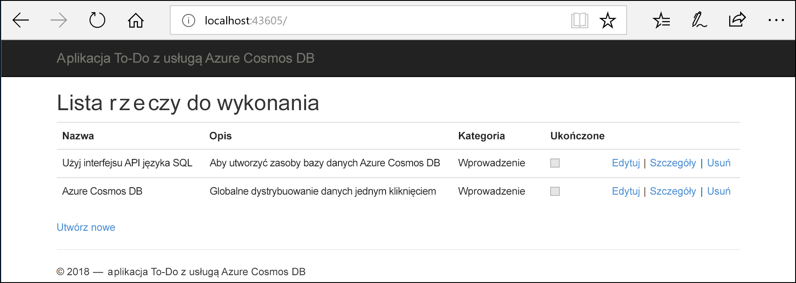
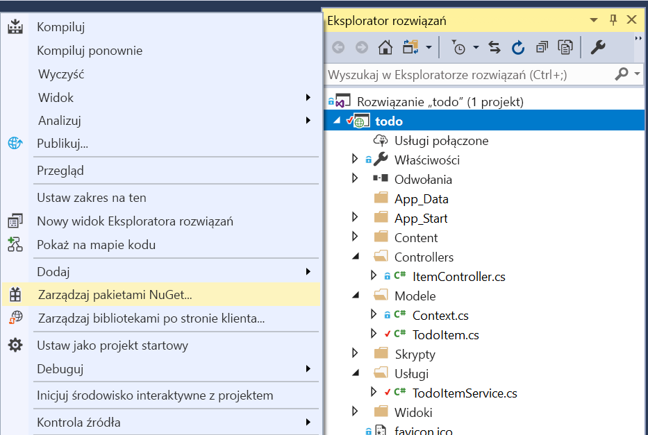

# <a name="quickstart-build-an-aspnet-web-app-using-azure-cosmos-db-sql-api-account"></a>Szybki start: Tworzenie aplikacji internetowej platformy ASP.NET przy użyciu konta interfejsu API SQL usługi Azure Cosmos DB

> [!div class="op_single_selector"]
> * [.NET (wersja zapoznawcza)](create-sql-api-dotnet-preview.md)
> * [.NET](create-sql-api-dotnet.md)
> * [Java](create-sql-api-java.md)
> * [Node.js](create-sql-api-nodejs.md)
> * [Python](create-sql-api-python.md)
> * [Xamarin](create-sql-api-xamarin-dotnet.md)
>  
> 

Azure Cosmos DB to rozproszona globalnie wielomodelowa usługa bazy danych firmy Microsoft o wysokiej dostępności. Dzięki dystrybucji globalnej i możliwości skalowania poziomego w usłudze Azure Cosmos DB możesz szybko tworzyć i za pomocą zapytań badać bazy danych dokumentów, par klucz/wartość oraz grafów. 

Ten przewodnik Szybki start pokazuje, jak utworzyć konto [interfejsu API SQL](sql-api-introduction.md) usługi Azure Cosmos DB, bazę danych i kontener przy użyciu witryny Azure Portal. Następnie utworzysz i wdrożysz aplikację internetową platformy ASP.NET z listą zadań do wykonania bazującą na [interfejsie API SQL platformy .NET](sql-api-sdk-dotnet.md), jak pokazano na poniższym zrzucie ekranu. 

W tym przewodniku Szybki start używana jest wersja 3.0+ zestawu .NET SDK usługi Azure Cosmos DB. 



## <a name="prerequisites"></a>Wymagania wstępne

Jeśli nie masz jeszcze programu Visual Studio 2019 r zainstalowany, możesz pobrać i używać **bezpłatne** [Visual Studio 2019 Community Edition](https://www.visualstudio.com/downloads/). Podczas instalacji programu Visual Studio upewnij się, że jest włączone obciążenie **Programowanie na platformie Azure**.

[!INCLUDE [quickstarts-free-trial-note](../../includes/quickstarts-free-trial-note.md)] 
[!INCLUDE [cosmos-db-emulator-docdb-api](../../includes/cosmos-db-emulator-docdb-api.md)]  

<a id="create-account"></a>
## <a name="create-an-azure-cosmos-account"></a>tworzenie konta usługi Azure Cosmos

[!INCLUDE [cosmos-db-create-dbaccount-preview](../../includes/cosmos-db-create-dbaccount-preview.md)]

<a id="create-collection"></a>
## <a name="add-a-container"></a>Dodawanie kontenera

[!INCLUDE [cosmos-db-create-collection-preview](../../includes/cosmos-db-create-collection-preview.md)]

<a id="add-sample-data"></a>
## <a name="add-sample-data"></a>Dodawanie danych przykładowych

[!INCLUDE [cosmos-db-create-sql-api-add-sample-data](../../includes/cosmos-db-create-sql-api-add-sample-data.md)]

## <a name="query-your-data"></a>Wysyłanie zapytań dotyczących danych

[!INCLUDE [cosmos-db-create-sql-api-query-data](../../includes/cosmos-db-create-sql-api-query-data.md)]

## <a name="clone-the-sample-application"></a>Klonowanie przykładowej aplikacji

Teraz przejdźmy do pracy z kodem. Sklonujmy [aplikację interfejsu API SQL z serwisu GitHub](https://github.com/Azure-Samples/cosmos-dotnet-todo-app), ustawmy parametry połączenia i uruchommy ją. 

1. Otwórz wiersz polecenia, utwórz nowy folder o nazwie git-samples, a następnie zamknij wiersz polecenia.

    ```bash
    md "C:\git-samples"
    ```

2. Otwórz okno terminalu usługi Git, na przykład git bash, i użyj polecenia `cd`, aby przejść do nowego folderu instalacji aplikacji przykładowej.

    ```bash
    cd "C:\git-samples"
    ```

3. Uruchom następujące polecenie w celu sklonowania przykładowego repozytorium. To polecenie tworzy kopię przykładowej aplikacji na komputerze.

    ```bash
    git clone https://github.com/Azure-Samples/cosmos-dotnet-todo-app.git
    ```

4. Otwórz plik rozwiązania **todo.sln** w programie Visual Studio. 

## <a name="review-the-code"></a>Przeglądanie kodu

Ten krok jest opcjonalny. Jeśli chcesz dowiedzieć się, jak zasoby bazy danych są tworzone w kodzie, możesz przejrzeć poniższe fragmenty kodu. W przeciwnym razie możesz od razu przejść do sekcji [Aktualizowanie parametrów połączenia](#update-your-connection-string). 

Osoby znające poprzednią wersję zestawu .NET SDK mogą być przyzwyczajone do terminów „kolekcja” i „dokument”. Ponieważ usługa Azure Cosmos DB obsługuje wiele modeli interfejsu API, w wersji 3.0+ zestawu .NET SDK używane są ogólne terminy „kontener” i „element”. Kontener może być kolekcją, wykresem lub tabelą. Element może być dokumentem, krawędzią/wierzchołkiem lub wierszem i stanowi zawartość znajdująca się w kontenerze. [Dowiedz się więcej na temat baz danych, kontenerów i elementów.](databases-containers-items.md)

Wszystkie poniższe fragmenty kodu pochodzą z pliku ToDoItemService.cs.

* Klient CosmosClient jest inicjowany w wierszach 68–69.

    ```csharp
    CosmosConfiguration config = new CosmosConfiguration(Endpoint, PrimaryKey);
    client = new CosmosClient(config);
    ```

* Nowa baza danych jest tworzona w wierszu 71.

    ```csharp
    CosmosDatabase database = await client.Databases.CreateDatabaseIfNotExistsAsync(DatabaseId);
    ```

* Nowy kontener jest tworzony w wierszu 72 z kluczem partycji „/category”.

    ```csharp
    CosmosContainer container = await database.Containers.CreateContainerIfNotExistsAsync(ContainerId, "/category");
    ```

## <a name="update-your-connection-string"></a>Aktualizowanie parametrów połączenia

Teraz wróć do witryny Azure Portal, aby uzyskać informacje o parametrach połączenia i skopiować je do aplikacji.

1. W witrynie [Azure Portal](https://portal.azure.com/), korzystając ze swojego konta usługi Azure Cosmos DB, wybierz na lewym panelu nawigacyjnym pozycję **Klucze**, a następnie pozycję **Klucze odczytu i zapisu**. W następnym kroku, korzystając z przycisków kopiowania dostępnych po prawej stronie ekranu, skopiujesz identyfikator URI i klucz podstawowy do pliku web.config.

    

2. W programie Visual Studio, otwórz **web.config** pliku. 

3. Skopiuj wartość identyfikatora URI z portalu (przy użyciu przycisku kopiowania) i przypisz ją do klucza ``endpoint`` w pliku web.config. 

    `<add key="endpoint" value="FILLME" />`

4. Następnie skopiuj wartość KLUCZA PODSTAWOWEGO z portalu i przypisz ją do zmiennej ``primarykey`` w pliku web.config. 

    `<add key="primaryKey" value="FILLME" />`
    
5. Następnie zaktualizuj wartość bazy danych i kontenera, tak aby była zgodna z nazwą utworzonych wcześniej bazy danych i kontenera. Aplikacja została zaktualizowana i zawiera teraz wszystkie informacje potrzebne do nawiązania komunikacji z usługą Azure Cosmos DB. 

    `<add key="database" value="Tasks" />`

    `<add key="container" value="Items" />`
    
## <a name="run-the-web-app"></a>Uruchamianie aplikacji internetowej

1. W **Eksploratorze rozwiązań** kliknij prawym przyciskiem myszy nowy projekt aplikacji konsolowej w ramach rozwiązania Visual Studio, a następnie kliknij pozycję **Zarządzaj pakietami NuGet...**
    
    
1. Na karcie **NuGet** kliknij pozycję **Przeglądaj** i wpisz ciąg **Microsoft.Azure.Cosmos** w polu wyszukiwania.
1. W wynikach znajdź pozycję **Microsoft.Azure.Cosmos**, a następnie kliknij przycisk **Zainstaluj**.
   Identyfikator pakietu biblioteki klienta interfejsu API SQL w usłudze Azure Cosmos DB to [Microsoft Azure Cosmos DB Client Library](https://www.nuget.org/packages/Microsoft.Azure.Cosmos/).

   

    Jeśli zostanie wyświetlony komunikat dotyczący przejrzenia zmian wprowadzonych w rozwiązaniu, kliknij przycisk **OK**. Jeśli wyświetlany jest komunikat o akceptacji licencji, kliknij pozycję **Akceptuję**.

1. Naciśnij klawisze CTRL+F5, aby uruchomić aplikację. Aplikacja zostanie wyświetlona w przeglądarce. 

1. Wybierz pozycję **Utwórz nowy** w przeglądarce i utwórz kilka nowych zadań w swojej aplikacji z zadaniami do wykonania. Powinny również zostać wyświetlone zadania utworzone w sekcji [Dodawanie przykładowych danych](#add-sample-data)

   

Teraz możesz wrócić do Eksploratora danych i zobaczyć, jak się pracuje z nowymi danymi, modyfikuje je i tworzy zapytania względem nich. 

## <a name="review-slas-in-the-azure-portal"></a>Przeglądanie umów SLA w witrynie Azure Portal

[!INCLUDE [cosmosdb-tutorial-review-slas](../../includes/cosmos-db-tutorial-review-slas.md)]

## <a name="clean-up-resources"></a>Oczyszczanie zasobów

[!INCLUDE [cosmosdb-delete-resource-group](../../includes/cosmos-db-delete-resource-group.md)]

## <a name="next-steps"></a>Następne kroki

W tym przewodniku Szybki start wyjaśniono sposób tworzenia konta usługi Azure Cosmos DB, tworzenia kontenera i dodawanie do niego elementów za pomocą Eksploratora danych oraz uruchamiania aplikacji internetowej. Teraz możesz zaimportować dodatkowe dane do swojego konta usługi Cosmos DB. 

> [!div class="nextstepaction"]
> [Importowanie danych do usługi Azure Cosmos DB](import-data.md)


