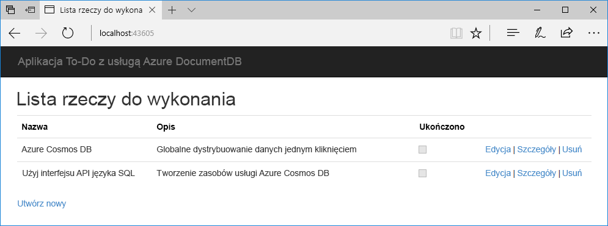

# <a name="quickstart-build-a-net-web-app-using-sql-api-account-in-azure-cosmos-db"></a>Szybki start: Tworzenie aplikacji internetowej platformy .NET przy użyciu konta interfejsu API SQL w usłudze Azure Cosmos DB

> [!div class="op_single_selector"]
> * [.NET](create-sql-api-dotnet.md)
> * [.NET (wersja zapoznawcza)](create-sql-api-dotnet-preview.md)
> * [Java](create-sql-api-java.md)
> * [Node.js](create-sql-api-nodejs.md)
> * [Python](create-sql-api-python.md)
> * [Xamarin](create-sql-api-xamarin-dotnet.md)
>  
> 

Azure Cosmos DB to rozproszona globalnie wielomodelowa usługa bazy danych firmy Microsoft. Azure Cosmos DB umożliwia szybkie tworzenie i wysyłanie zapytań do bazy danych kluczy/wartości, bazy danych dokumentów i grafowe bazy danych, z których korzystają z dystrybucji globalnej i możliwości skalowania poziomego opartego na podstawowe usługi Azure Cosmos DB. 

Ten przewodnik Szybki Start przedstawiono sposób użycia witryny Azure portal do utworzenia usługi Azure Cosmos DB [interfejsu API SQL](sql-api-introduction.md) konta, tworzenie bazy danych dokumentów i kolekcji i dodawanie danych do kolekcji. Następnie użyj [zestawu .NET SDK SQL](sql-api-sdk-dotnet.md) aplikacji sieci web, aby dodać większej ilości danych do kolekcji. 

W tym przewodniku Szybki Start używasz Eksploratora danych w witrynie Azure portal utworzyć bazę danych i kolekcję. Przy użyciu przykładowy kod .NET, można utworzyć bazę danych i kolekcję. Aby dowiedzieć się więcej, zobacz [Przegląd kodu .NET](#review-the-net-code). 

## <a name="prerequisites"></a>Wymagania wstępne

Program Visual Studio 2017 z przepływem pracy programowania dla platformy Azure zainstalowany
- Możesz pobrać i używać **bezpłatne** [Visual Studio 2017 Community Edition](https://www.visualstudio.com/downloads/). Podczas instalacji programu Visual Studio upewnij się, że jest włączona opcja **Programowanie na platformie Azure**. 

Subskrypcja platformy Azure lub bezpłatnego konta wersji próbnej usługi Azure Cosmos DB
- [!INCLUDE [quickstarts-free-trial-note](../../includes/quickstarts-free-trial-note.md)] 
- [!INCLUDE [cosmos-db-emulator-docdb-api](../../includes/cosmos-db-emulator-docdb-api.md)]  

<a id="create-account"></a>
## <a name="create-an-azure-cosmos-db-account"></a>Tworzenie konta usługi Azure Cosmos DB

[!INCLUDE [cosmos-db-create-dbaccount](../../includes/cosmos-db-create-dbaccount.md)]

<a id="create-collection-database"></a>
## <a name="add-a-database-and-a-collection"></a>Dodaj bazę danych i kolekcji 

Eksplorator danych w witrynie Azure portal służy do tworzenia bazy danych i kolekcji. 

1.  Wybierz **Eksplorator danych** w lewym obszarze nawigacji w usłudze Azure Cosmos DB konta strony, a następnie wybierz pozycję **Nowa kolekcja**. 
    
    Konieczne może być przewinięcie w prawo w celu wyświetlenia **Dodaj kolekcję** obszaru.
    
    
    
1.  Na stronie **Dodaj kolekcję** wprowadź ustawienia dla nowej kolekcji.
    
    |Ustawienie|Sugerowana wartość|Opis
    |---|---|---|
    |**Identyfikator bazy danych**|ToDoList|Wprowadź *ToDoList* jako nazwę nowej bazy danych. Nazwy baz danych muszą zawierać od 1 do 255 znaków i nie mogą zawierać znaków `/, \\, #, ?` ani mieć spacji na końcu.|
    |**Identyfikator kolekcji**|Items|Wprowadź *Elementy* jako nazwę nowej kolekcji. Identyfikatorów kolekcji obowiązują takie same wymagania dotyczące znaków, jako nazwy bazy danych.|
    |**Klucz partycji**| /category| W przykładzie opisanych w tym artykule użyto */category* jako klucza partycji.|
    |**Przepływność**|400|Pozostaw przepływność na 400 jednostek żądań na sekundę (RU/s). Jeśli chcesz zmniejszyć opóźnienie, możesz później przeskalować przepływność w górę.| 
    
    Nie dodawaj **unikatowe klucze** w tym przykładzie. Unikatowe klucze umożliwiają dodanie warstwy integralności danych w bazie danych, zapewniając zapewnić unikatowość co najmniej jedną wartość na klucz partycji. Aby uzyskać więcej informacji, zobacz [unikatowe klucze w usłudze Azure Cosmos DB](unique-keys.md).
    
1.  Kliknij przycisk **OK**. 
    W Eksploratorze danych zostanie wyświetlona nowa baza danych i kolekcja.
    
    

## <a name="add-data-to-your-database"></a>Dodawanie danych do bazy danych

Dodawanie danych do nowej bazy danych za pomocą Eksploratora danych.

1. W **Eksplorator danych**, Nowa baza danych pojawia się w **kolekcje** okienka. Rozwiń **ToDoList** bazy danych, a następnie rozwiń **elementów** kolekcji, wybierz opcję **dokumentów**, a następnie wybierz pozycję **nowy dokument**. 
   
   
   
1. Dodaj następującą strukturę dokumentu na prawej krawędzi **dokumenty** okienka:

     ```json
     {
         "id": "1",
         "category": "personal",
         "name": "groceries",
         "description": "Pick up apples and strawberries.",
         "isComplete": false
     }
     ```

1. Wybierz pozycję **Zapisz**.
   
   
   
1. Wybierz **nowy dokument** ponownie utworzyć i zapisać innego dokumentu przy użyciu unikatowego `id`i innych właściwości i wartości, które mają. Dokumenty mogą mieć dowolną strukturę, ponieważ usługi Azure Cosmos DB nie wymusza żadnego schematu na podstawie posiadanych danych.

## <a name="query-your-data"></a>Wysyłanie zapytań dotyczących danych

[!INCLUDE [cosmos-db-create-sql-api-query-data](../../includes/cosmos-db-create-sql-api-query-data.md)]

## <a name="use-the-net-web-app-to-manage-data"></a>Zarządzanie danymi za pomocą aplikacji internetowej platformy .NET

Aby zobaczyć, jak łatwo jest pracować programowo z danymi usługi Azure Cosmos DB, sklonuj przykładową aplikację sieci web .NET interfejsu API SQL z serwisu GitHub, zaktualizuj parametry połączenia, a następnie uruchom aplikację, aby zaktualizować dane. 

Przy użyciu przykładowy kod .NET, można utworzyć bazę danych i kolekcję. Aby dowiedzieć się więcej, zobacz [Przegląd kodu .NET](#review-the-net-code).

### <a name="clone-the-sample-app"></a>Klonowanie przykładowej aplikacji

Najpierw sklonuj C# [aplikacji interfejsu API SQL](https://github.com/Azure-Samples/documentdb-dotnet-todo-app) z usługi GitHub. 

1. Otwórz okno terminala usługi git, takich jak Git Bash, Utwórz nowy katalog o nazwie *git-samples*i zmień go: 
   
   ```bash
   mkdir /c/git-samples/
   cd /c/git-samples/
   ```
   
1. Uruchom następujące polecenie, aby sklonować przykładowe repozytorium i Utwórz kopię przykładowej aplikacji na komputerze:
   
   ```bash
   git clone https://github.com/Azure-Samples/documentdb-dotnet-todo-app.git
   ```

### <a name="update-the-connection-string"></a>Zaktualizuj parametry połączenia 

1. Przejdź do, a następnie otwórz *todo.sln* pliku sklonowanej aplikacji w programie Visual Studio. 

1. W programie Visual Studio **Eksploratora rozwiązań**, otwórz *web.config* pliku. 

1. Wróć do witryny Azure portal, aby skopiować swoje informacje o parametrach połączenia można wkleić do *web.config*.
   
   1. W nawigacji po lewej stronie konta usługi Azure Cosmos DB, wybierz **klucze**.
      
      
      
   1. W obszarze **klucze odczytu i zapisu**, kopia **identyfikatora URI** wartości przy użyciu przycisku kopiowania po prawej stronie, a następnie wklej go do `endpoint` w *web.config*. Na przykład: 
      
      `<add key="endpoint" value="https://mysqlapicosmosdb.documents.azure.com:443/" />`
      
   1. Kopiuj **klucza podstawowego** wartość i wklej go w `authKey` w *web.config*. Na przykład:
      
      `<add key="authKey" value="19ZDNJAiYL26tmnRvoez6hmtIfBGwjun50PWRjNYMC2ig8Ob9hYk7Fq1RYSv8FcIYnh1TdBISvCh7s6yyb0000==" />`

       
1. Upewnij się, że wartości bazy danych i kolekcji w *web.config* odpowiadać nazwom została utworzona wcześniej. 

   ```csharp
   <add key="database" value="ToDoList"/>
   <add key="collection" value="Items"/>
   ```
 
1. Zapisz *pliku web.config.* Wszystkie informacje potrzebne do komunikowania się z usługą Azure Cosmos DB zostały zaktualizowane Twojej aplikacji.

### <a name="run-the-web-app"></a>Uruchamianie aplikacji internetowej

1. W programie Visual Studio, kliknij prawym przyciskiem myszy **todo** projektu w **Eksploratora rozwiązań**, a następnie wybierz pozycję **Zarządzaj pakietami NuGet**. 

1. W polu **Przeglądaj** pakietu NuGet wpisz ciąg *DocumentDB*.

1. Na liście wyników, zainstaluj **Microsoft.Azure.DocumentDB** biblioteki, jeśli jeszcze nie zainstalowano. Spowoduje to zainstalowanie [Microsoft.Azure.DocumentDB](https://www.nuget.org/packages/Microsoft.Azure.DocumentDB/) pakietu oraz wszystkich zależności.
   
   Jeśli Menedżer pakietów NuGet jest wyświetlany komunikat, że brakuje niektórych pakietów z rozwiązania, wybierz **przywrócić** mają być instalowane z wewnętrznych źródeł. 

1. Wybierz **Ctrl**+**F5** do uruchomienia aplikacji w przeglądarce. 

1. Wybierz **Utwórz nowy** w aplikacji zadań do wykonania i Utwórz kilka nowych zadań.

   

Wróć do Eksploratora danych w witrynie Azure portal, aby wyświetlić, zapytania, modyfikować i korzystanie z nowych danych. 

## <a name="review-the-net-code"></a>Przegląd kodu platformy .NET

Ten krok jest opcjonalny. W tym przewodniku Szybki Start utworzono bazę danych i kolekcji w witrynie Azure portal i dodaje przykładowych danych, korzystając z przykładu .NET. Jednak można utworzyć bazy danych i kolekcji, korzystając z przykładu .NET. Jeśli interesuje Cię jak zasoby bazy danych są tworzone w kodzie, należy przejrzeć poniższe fragmenty kodu. Wszystkie fragmenty kodu pochodzą z *DocumentDBRepository.cs* w pliku **todo** projektu.

* Ten kod inicjalizuje `DocumentClient`: 

    ```csharp
    client = new DocumentClient(new Uri(ConfigurationManager.AppSettings["endpoint"]), ConfigurationManager.AppSettings["authKey"]);
    ```

* Ten kod tworzy nową bazę danych przy użyciu `CreateDatabaseAsync` metody:

    ```csharp
    await client.CreateDatabaseAsync(new Database { Id = DatabaseId });
    ```

* Poniższy kod tworzy nową kolekcję przy użyciu `CreateDocumentCollectionAsync` metody:

    ```csharp
    private static async Task CreateCollectionIfNotExistsAsync()
    {
        try
        {
           await client.ReadDocumentCollectionAsync(UriFactory.CreateDocumentCollectionUri(DatabaseId, CollectionId));
        }
        catch (DocumentClientException e)
        {
           if (e.StatusCode == System.Net.HttpStatusCode.NotFound)
           {
              await client.CreateDocumentCollectionAsync(
              UriFactory.CreateDatabaseUri(DatabaseId),
              new DocumentCollection
              {
                  Id = CollectionId
              },
              new RequestOptions { OfferThroughput = 400 });
           }
           else
           {
             throw;
           }
        }
    }
    ```

## <a name="clean-up-resources"></a>Oczyszczanie zasobów

[!INCLUDE [cosmosdb-delete-resource-group](../../includes/cosmos-db-delete-resource-group.md)]

## <a name="next-steps"></a>Kolejne kroki

W tym przewodniku Szybki Start przedstawiono sposób tworzenia konta usługi Azure Cosmos DB, Utwórz bazę danych i kolekcji za pomocą Eksploratora danych i uruchamiania aplikacji internetowej platformy .NET, aby zaktualizować dane. Teraz możesz zaimportować dodatkowe dane do swojego konta usługi Azure Cosmos DB. 

> [!div class="nextstepaction"]
> [Importowanie danych do usługi Azure Cosmos DB](import-data.md)

