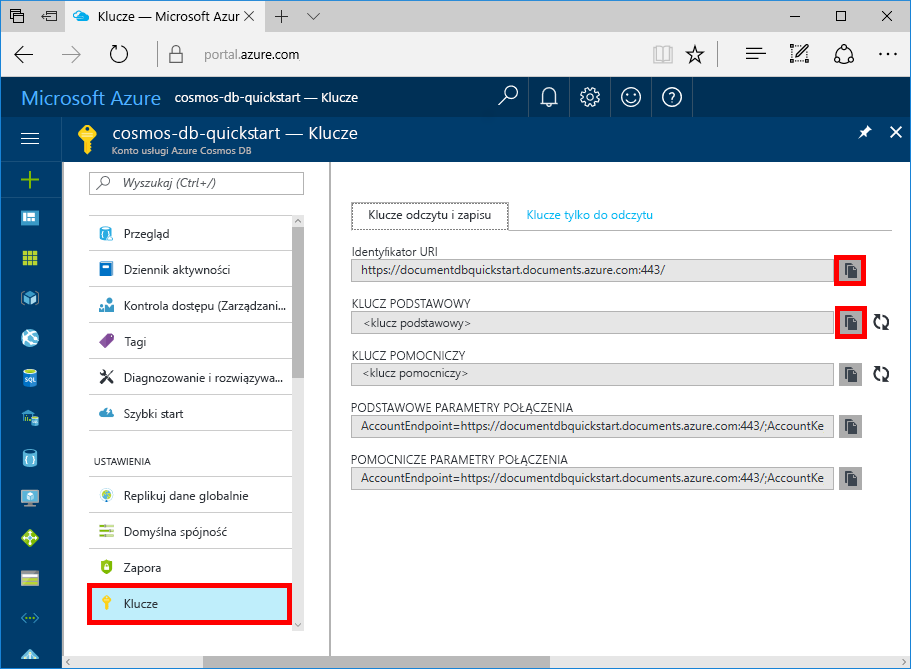

# <a name="quickstart-build-a-nodejs-app-using-azure-cosmos-db-sql-api-account"></a>Szybki start: Tworzenie aplikacji platformy Node.js przy użyciu konta interfejsu API SQL usługi Azure Cosmos DB

> [!div class="op_single_selector"]
> * [.NET](create-sql-api-dotnet.md)
> * [Java](create-sql-api-java.md)
> * [Node.js](create-sql-api-nodejs.md)
> * [Python](create-sql-api-python.md)
> * [Xamarin](create-sql-api-xamarin-dotnet.md)
>  

Azure Cosmos DB to rozproszona globalnie wielomodelowa usługa bazy danych firmy Microsoft. Dzięki dystrybucji globalnej i możliwości skalowania poziomego w usłudze Azure Cosmos DB możesz szybko tworzyć i za pomocą zapytań badać bazy danych dokumentów, par klucz/wartość oraz grafów. 

Ten przewodnik Szybki start przedstawia, jak utworzyć konto [interfejsu API SQL](sql-api-introduction.md) usługi Azure Cosmos DB, bazę danych dokumentów i kontener przy użyciu witryny Azure Portal. Następnie za pomocą [zestawu SDK SQL dla języka JavaScript](sql-api-sdk-node.md) utworzysz i uruchomisz aplikację konsoli. W tym przewodniku Szybki start jest używana wersja 2.0 [zestawu SDK dla języka JavaScript](https://www.npmjs.com/package/@azure/cosmos).

## <a name="prerequisites"></a>Wymagania wstępne

[!INCLUDE [quickstarts-free-trial-note](../../includes/quickstarts-free-trial-note.md)] 
[!INCLUDE [cosmos-db-emulator-docdb-api](../../includes/cosmos-db-emulator-docdb-api.md)]

* Ponadto:
    * [Node.js](https://nodejs.org/en/) w wersji 6.0.0 lub nowszej
    * [Usługa Git](https://git-scm.com/)

## <a name="create-a-database-account"></a>Tworzenie konta bazy danych

[!INCLUDE [cosmos-db-create-dbaccount](../../includes/cosmos-db-create-dbaccount.md)]

## <a name="add-a-container"></a>Dodawanie kontenera

[!INCLUDE [cosmos-db-create-collection](../../includes/cosmos-db-create-collection.md)]

## <a name="add-sample-data"></a>Dodawanie danych przykładowych

[!INCLUDE [cosmos-db-create-sql-api-add-sample-data](../../includes/cosmos-db-create-sql-api-add-sample-data.md)]

## <a name="query-your-data"></a>Wysyłanie zapytań dotyczących danych

[!INCLUDE [cosmos-db-create-sql-api-query-data](../../includes/cosmos-db-create-sql-api-query-data.md)]

## <a name="clone-the-sample-application"></a>Klonowanie przykładowej aplikacji

Teraz sklonujemy aplikację interfejsu API SQL z serwisu GitHub, ustawimy parametry połączenia i uruchomimy ją.

1. Otwórz wiersz polecenia, utwórz nowy folder o nazwie git-samples, a następnie zamknij wiersz polecenia.

    ```bash
    md "C:\git-samples"
    ```

2. Otwórz okno terminalu usługi Git, na przykład git bash, i użyj polecenia `cd`, aby przejść do nowego folderu instalacji aplikacji przykładowej.

    ```bash
    cd "C:\git-samples"
    ```

3. Uruchom następujące polecenie w celu sklonowania przykładowego repozytorium. To polecenie tworzy kopię przykładowej aplikacji na komputerze.

    ```bash
    git clone https://github.com/Azure-Samples/azure-cosmos-db-sql-api-nodejs-getting-started.git
    ```

## <a name="review-the-code"></a>Przeglądanie kodu

Ten krok jest opcjonalny. Jeśli chcesz dowiedzieć się, jak zasoby bazy danych są tworzone w kodzie, możesz przejrzeć poniższe fragmenty kodu. W przeciwnym razie możesz od razu przejść do sekcji [Aktualizowanie parametrów połączenia](#update-your-connection-string). 

Osoby znające poprzednią wersję zestawu SDK języka JavaScript mogą być przyzwyczajone do terminów „kolekcja” i „dokument”. Ponieważ usługa Azure Cosmos DB obsługuje [wiele modeli interfejsu API](https://docs.microsoft.com/azure/cosmos-db/introduction), w wersji 2.0 i nowszych wersjach zestawu SDK języka JavaScript są używane ogólne terminy „kontener” (może oznaczać kolekcję, graf lub tabelę) i „element” (opisuje zawartość kontenera).

Wszystkie poniższe fragmenty kodu pochodzą z pliku **app.js**.

* Inicjowanie obiektu `CosmosClient`.

    ```javascript
    const client = new CosmosClient({ endpoint, key });
    ```

* Tworzenie nowej bazy danych.

    ```javascript
    const { database } = await client.databases.createIfNotExists({ id: databaseId });
    ```

* Tworzenie nowego kontenera (kolekcji).

    ```javascript
    const { container } = await client.database(databaseId).containers.createIfNotExists({ id: containerId });
    ```

* Tworzenie elementu (dokumentu).

    ```javascript
    const { item } = await client.database(databaseId).container(containerId).items.create(itemBody);
    ```

* Wykonywanie zapytania SQL w formacie JSON.

    ```javascript
      const querySpec = {
        query: 'SELECT VALUE r.children FROM root r WHERE r.lastName = @lastName',
        parameters: [
          {
            name: '@lastName',
            value: 'Andersen'
          }
        ]
      }

      const { resources: results } = await client
        .database(databaseId)
        .container(containerId)
        .items.query(querySpec)
        .fetchAll()
      for (var queryResult of results) {
        let resultString = JSON.stringify(queryResult)
        console.log(`\tQuery returned ${resultString}\n`)
      }
    ```    

## <a name="update-your-connection-string"></a>Aktualizowanie parametrów połączenia

Teraz wróć do witryny Azure Portal, aby uzyskać informacje o parametrach połączenia i skopiować je do aplikacji.

1. W [Azure Portal](https://portal.azure.com/)na koncie usługi Azure Cosmos w lewym okienku nawigacji kliknij pozycję **klucze**, a następnie kliknij pozycję **klucze odczytu i zapisu**. W następnym kroku, korzystając z przycisków kopiowania dostępnych po prawej stronie ekranu, skopiujesz identyfikator URI i klucz podstawowy do pliku `config.js`.

    

2. Otwórz plik `config.js`. 

3. Skopiuj wartość identyfikatora URI z portalu (przy użyciu przycisku kopiowania) i przypisz ją do klucza endpoint w pliku `config.js`. 

    `config.endpoint = "https://FILLME.documents.azure.com"`

4. Następnie skopiuj wartość klucza podstawowego z portalu i przypisz ją do klucza `config.key` w pliku `config.js`. Aplikacja została zaktualizowana i zawiera teraz wszystkie informacje potrzebne do nawiązania komunikacji z usługą Azure Cosmos DB. 

    `config.key = "FILLME"`
    
## <a name="run-the-app"></a>Uruchamianie aplikacji
1. Uruchom polecenie `npm install` w terminalu, aby zainstalować wymagane moduły npm.

2. Uruchom polecenie `node app.js` w terminalu, aby uruchomić aplikację Node.

Teraz można wrócić do Eksploratora danych i zobaczyć, jak się pracuje z nowymi danymi, modyfikuje je i tworzy zapytania o nie. 

## <a name="review-slas-in-the-azure-portal"></a>Przeglądanie umów SLA w witrynie Azure Portal

[!INCLUDE [cosmosdb-tutorial-review-slas](../../includes/cosmos-db-tutorial-review-slas.md)]

## <a name="clean-up-resources"></a>Oczyszczanie zasobów

[!INCLUDE [cosmosdb-delete-resource-group](../../includes/cosmos-db-delete-resource-group.md)]

## <a name="next-steps"></a>Następne kroki

W tym przewodniku szybki start przedstawiono sposób tworzenia konta usługi Azure Cosmos, tworzenia kontenera przy użyciu Eksplorator danych i uruchamiania aplikacji. Teraz możesz zaimportować dodatkowe dane do swojego konta usługi Cosmos DB. 

> [!div class="nextstepaction"]
> [Importowanie danych do usługi Azure Cosmos DB](import-data.md)


