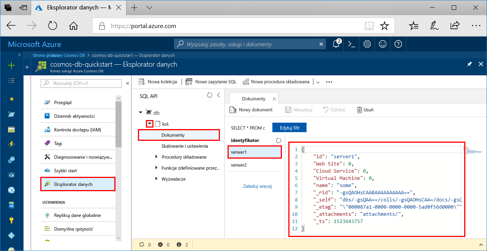

# <a name="azure-cosmos-db-build-a-python-application-using-azure-cosmos-db-sql-api-account"></a>Usługa Azure Cosmos DB Tworzenie aplikacji w języku Python przy użyciu konta interfejsu API SQL usługi Azure Cosmos DB

> [!div class="op_single_selector"]
> * [.NET](create-sql-api-dotnet.md)
> * [.NET (wersja zapoznawcza)](create-sql-api-dotnet-preview.md)
> * [Java](create-sql-api-java.md)
> * [Node.js](create-sql-api-nodejs.md)
> * [Python](create-sql-api-python.md)
> * [Xamarin](create-sql-api-xamarin-dotnet.md)
>  

Azure Cosmos DB to rozproszona globalnie wielomodelowa usługa bazy danych firmy Microsoft. Możesz szybko tworzyć i zapytania, dokumentów, klucz/wartość i grafowe bazy danych. Wszystkie te operacje skorzystać z dystrybucji i skali w usłudze Azure Cosmos DB.

Ten przewodnik Szybki start przedstawia, jak utworzyć konto [interfejsu API SQL](sql-api-introduction.md) usługi Azure Cosmos DB, bazę danych dokumentów i kontener przy użyciu witryny Azure Portal. Następnie za pomocą [interfejsu API SQL](sql-api-sdk-python.md) i zestawu Python SDK skompilujesz i uruchomisz aplikację konsolową. W tym przewodniku Szybki start jest używana wersja 3.0 zestawu [Python SDK].(https://pypi.org/project/azure-cosmos)

[!INCLUDE [quickstarts-free-trial-note](../../includes/quickstarts-free-trial-note.md)] [!INCLUDE [cosmos-db-emulator-docdb-api](../../includes/cosmos-db-emulator-docdb-api.md)]

## <a name="prerequisites"></a>Wymagania wstępne

* [Środowisko Python 3.6](https://www.python.org/downloads/), za pomocą `python` plik wykonywalny jest dostępne w Twojej `PATH`.
* [Visual Studio Code](https://code.visualstudio.com/)
* [Rozszerzenie języka Python dla programu Visual Studio Code](https://marketplace.visualstudio.com/items?itemName=ms-python.python#overview)

## <a name="create-a-database-account"></a>Tworzenie konta bazy danych

[!INCLUDE [cosmos-db-create-dbaccount](../../includes/cosmos-db-create-dbaccount.md)]

## <a name="add-a-collection"></a>Dodawanie kolekcji

[!INCLUDE [cosmos-db-create-collection](../../includes/cosmos-db-create-collection.md)]

## <a name="add-sample-data"></a>Dodawanie danych przykładowych

[!INCLUDE [cosmos-db-create-sql-api-add-sample-data](../../includes/cosmos-db-create-sql-api-add-sample-data.md)]

## <a name="query-your-data"></a>Wysyłanie zapytań dotyczących danych

[!INCLUDE [cosmos-db-create-sql-api-query-data](../../includes/cosmos-db-create-sql-api-query-data.md)]

## <a name="clone-the-sample-application"></a>Klonowanie przykładowej aplikacji

Teraz sklonujemy aplikację interfejsu API SQL z serwisu GitHub, ustawimy parametry połączenia i uruchomimy ją.

1. Otwórz wiersz polecenia, utwórz nowy folder o nazwie git-samples, a następnie zamknij wiersz polecenia.

    ```bash
    md "C:\git-samples"
    ```

2. Otwórz okno terminalu usługi Git, na przykład git bash, i użyj polecenia `cd`, aby przejść do nowego folderu instalacji aplikacji przykładowej.

    ```bash
    cd "C:\git-samples"
    ```

3. Uruchom następujące polecenie w celu sklonowania przykładowego repozytorium. To polecenie tworzy kopię przykładowej aplikacji na komputerze. 

    ```bash
    git clone https://github.com/Azure-Samples/azure-cosmos-db-python-getting-started.git
    ```  

## <a name="update-your-connection-string"></a>Aktualizowanie parametrów połączenia

Teraz wróć do witryny Azure Portal, aby uzyskać informacje o parametrach połączenia i skopiować je do aplikacji.

1. W witrynie [Azure Portal](https://portal.azure.com/), korzystając ze swojego konta usługi Azure Cosmos DB, kliknij pozycję **Klucze** w obszarze nawigacji po lewej stronie. W następnym kroku, korzystając z przycisków kopiowania dostępnych po prawej stronie ekranu, skopiujesz wartości **Identyfikator URI** i **Klucz podstawowy** do pliku `CosmosGetStarted.py`.

    

2. Otwórz plik `CosmosGetStarted.py` w lokalizacji C:\git-samples\azure-cosmos-db-python-getting-started w programie Visual Studio Code.

3. Skopiuj wartość identyfikatora **URI** z portalu (przy użyciu przycisku kopiowania) i przypisz ją do klucza **endpoint** w pliku ``CosmosGetStarted.py``. 

    `'ENDPOINT': 'https://FILLME.documents.azure.com',`

4. Następnie skopiuj wartość **KLUCZ PODSTAWOWY** z portalu i przypisz ją jako wartość klucza **config.PRIMARYKEY** w pliku ``CosmosGetStarted.py``. Aplikacja została zaktualizowana i zawiera teraz wszystkie informacje potrzebne do nawiązania komunikacji z usługą Azure Cosmos DB. 

    `'PRIMARYKEY': 'FILLME',`

5. Zapisz plik ``CosmosGetStarted.py``.

## <a name="review-the-code"></a>Przeglądanie kodu

Ten krok jest opcjonalny. Więcej informacji na temat zasobów bazy danych utworzonych w kodzie lub przejdź do sekcji [aktualizowanie parametrów połączenia](#update-your-connection-string).

Osoby znające poprzednią wersję zestawu Python SDK mogą być przyzwyczajone do terminów „kolekcja” i „dokument”. Ponieważ usługa Azure Cosmos DB obsługuje wiele modeli interfejsu API, w wersji 3.0 i nowszych wersjach zestawu Python SDK są używane ogólne terminy „kontener”, który może oznaczać kolekcję, graf lub tabelę, i „element”, który opisuje zawartość kontenera.

Wszystkie poniższe fragmenty kodu pochodzą z pliku `CosmosGetStarted.py`.

* Inicjowanie klienta CosmosClient. Pamiętaj, aby zaktualizować wartości „Endpoint” i „master key” zgodnie z opisem w sekcji [Aktualizowanie parametrów połączenia](#update-your-connection-string). 

    ```python
    # Initialize the Cosmos client
    client = cosmos_client.CosmosClient(url_connection=config['ENDPOINT'], auth={'masterKey': config['MASTERKEY']})
    ```

* Tworzenie nowej bazy danych.

    ```python
    # Create a database
    db = client.CreateDatabase({ 'id': config['DATABASE'] })
    ```

* Tworzenie nowej kolekcji.

    ```python
    # Create collection options
    options = {
        'offerThroughput': 400
    }

    # Create a container
    container = client.CreateContainer(db['_self'], container_definition, options)
    ```

* Dodawanie niektórych elementów do kontenera.

    ```python
    # Create and add some items to the container
    item1 = client.CreateItem(container['_self'], {
        'serverId': 'server1',
        'Web Site': 0,
        'Cloud Service': 0,
        'Virtual Machine': 0,
        'message': 'Hello World from Server 1!'
        }
    )

    item2 = client.CreateItem(container['_self'], {
        'serverId': 'server2',
        'Web Site': 1,
        'Cloud Service': 0,
        'Virtual Machine': 0,
        'message': 'Hello World from Server 2!'
        }
    )
    ```

* Wykonywanie zapytania przy użyciu programu SQL.

    ```python
    query = {'query': 'SELECT * FROM server s'}

    options = {}
    options['enableCrossPartitionQuery'] = True
    options['maxItemCount'] = 2

    result_iterable = client.QueryItems(container['_self'], query, options)
    for item in iter(result_iterable):
        print(item['message'])
    ```
   
## <a name="run-the-app"></a>Uruchamianie aplikacji

1. W programie Visual Studio Code wybierz pozycję **Widok**>**Paleta poleceń**. 

2. W wierszu polecenia wprowadź **Python: Select Interpreter** (Python: wybierz interpreter), a następnie wybierz wersję języka Python do użycia.

    Stopka w programie Visual Studio Code jest aktualizowana w celu wskazania wybranego interpretera. 

3. Wybierz kolejno pozycje **Widok** > **Zintegrowany terminal**, aby otworzyć zintegrowany terminal programu Visual Studio Code.

4. W oknie terminalu zintegrowanego upewnij się, znajdujesz się w folderze azure-cosmos-db-python-getting-started. Jeśli nie, uruchom poniższe polecenie, aby przejść do folderu przykładu. 

    ```
    cd "C:\git-samples\azure-cosmos-db-python-getting-started"`
    ```

5. Uruchom następujące polecenie, aby zainstalować pakiet azure-cosmos. 

    ```
    pip3 install azure-cosmos
    ```

    Jeśli podczas próby zainstalowania pakietu azure-cosmos zostanie wyświetlony błąd odmowy dostępu, będzie trzeba [uruchomić program VS Code jako administrator](https://stackoverflow.com/questions/37700536/visual-studio-code-terminal-how-to-run-a-command-with-administrator-rights).

6. Uruchom poniższe polecenie, aby uruchomić przykład i utworzyć oraz przechowywać nowe dokumenty w usłudze Azure Cosmos DB.

    ```
    python CosmosGetStarted.py
    ```

7. Aby potwierdzić utworzenie i zapisanie nowych elementów, w witrynie Azure Portal wybierz pozycję **Eksplorator danych**, rozwiń węzeł **coll**, rozwiń węzeł **Dokumenty**, a następnie wybierz dokument **server1**. Zawartość dokumentu server1 odpowiada zawartości zwróconej w oknie terminalu zintegrowanego. 

    

## <a name="review-slas-in-the-azure-portal"></a>Przeglądanie umów SLA w witrynie Azure Portal

[!INCLUDE [cosmosdb-tutorial-review-slas](../../includes/cosmos-db-tutorial-review-slas.md)]

## <a name="clean-up-resources"></a>Oczyszczanie zasobów

[!INCLUDE [cosmosdb-delete-resource-group](../../includes/cosmos-db-delete-resource-group.md)]

## <a name="next-steps"></a>Następne kroki

W tym przewodniku Szybki start wyjaśniono sposób tworzenia konta usługi Azure Cosmos DB, tworzenia kolekcji za pomocą Eksploratora danych i uruchamiania aplikacji. Teraz możesz zaimportować dodatkowe dane do swojego konta usługi Cosmos DB. 

> [!div class="nextstepaction"]
> [Importuj dane do usługi Azure Cosmos DB na potrzeby interfejsu API SQL](import-data.md)


