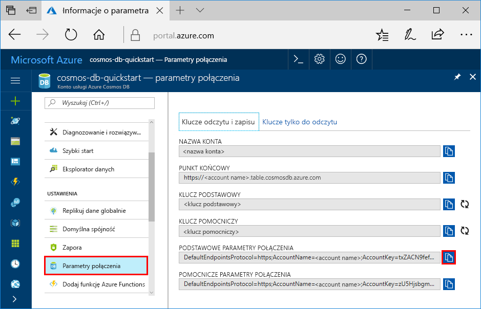

# <a name="quickstart-build-a-table-api-app-with-python-and-azure-cosmos-db"></a>Szybki start: tworzenie aplikacji interfejsu API tabel przy użyciu języka Python i usługi Azure Cosmos DB

> [!div class="op_single_selector"]
> * [.NET](create-table-dotnet.md)
> * [Java](create-table-java.md)
> * [Node.js](create-table-nodejs.md)
> * [Python](create-table-python.md)
> 

Ten przewodnik Szybki start pokazuje, jak używać języka Python i [interfejsu API tabel](table-introduction.md) usługi Azure Cosmos DB do tworzenia aplikacji przez sklonowanie przykładu z serwisu GitHub. Ten przewodnik Szybki start pokazuje również, jak utworzyć konto usługi Azure Cosmos DB i jak korzystać z Eksploratora danych do tworzenia tabel i jednostek w witrynie internetowej Azure Portal.

Azure Cosmos DB to rozproszona globalnie wielomodelowa usługa bazy danych firmy Microsoft. Dzięki wykorzystaniu dystrybucji globalnej i możliwości skalowania poziomego opartego na usłudze Azure Cosmos DB można szybko tworzyć i za pomocą zapytań badać bazy danych dokumentów, par klucz/wartość, szerokokolumnowe i grafowe. 

## <a name="prerequisites"></a>Wymagania wstępne

[!INCLUDE [quickstarts-free-trial-note](../../includes/quickstarts-free-trial-note.md)]
[!INCLUDE [cosmos-db-emulator-docdb-api](../../includes/cosmos-db-emulator-docdb-api.md)]

Ponadto:

* Jeśli nie masz jeszcze zainstalowanego programu Visual Studio 2017, możesz pobrać program [Visual Studio 2017 Community Edition](https://www.visualstudio.com/downloads/) i używać go **bezpłatnie**. Podczas instalacji programu Visual Studio upewnij się, że wybrano pakiety robocze **Programowanie na platformie Azure** i **Opracowywanie zawartości w języku Python**.
* Wybierz również opcję języka Python 2 w pakiecie roboczym **Opracowywanie zawartości w języku Python** lub pobierz środowisko Python 2.7 z witryny [python.org](https://www.python.org/downloads/release/python-2712/).

## <a name="create-a-database-account"></a>Tworzenie konta bazy danych

> [!IMPORTANT] 
> Musisz utworzyć nowe konto interfejsu API tabeli, aby pracować z ogólnie dostępnymi zestawami SDK interfejsu API tabeli. Konta interfejsu API tabeli utworzone w okresie obowiązywania wersji zapoznawczej nie są obsługiwane przez ogólnie dostępne zestawy SDK.
>

[!INCLUDE [cosmos-db-create-dbaccount-table](../../includes/cosmos-db-create-dbaccount-table.md)]

## <a name="add-a-table"></a>Dodawanie tabeli

[!INCLUDE [cosmos-db-create-table](../../includes/cosmos-db-create-table.md)]

## <a name="add-sample-data"></a>Dodawanie danych przykładowych

[!INCLUDE [cosmos-db-create-table-add-sample-data](../../includes/cosmos-db-create-table-add-sample-data.md)]

## <a name="clone-the-sample-application"></a>Klonowanie przykładowej aplikacji

Teraz sklonujemy aplikację Tabela z serwisu GitHub, ustawimy parametry połączenia i uruchomimy ją. Zobaczysz, jak łatwo jest pracować programowo z danymi. 

1. Otwórz wiersz polecenia, utwórz nowy folder o nazwie git-samples, a następnie zamknij wiersz polecenia.

    ```bash
    md "C:\git-samples"
    ```

2. Otwórz okno terminalu usługi Git, na przykład git bash, i użyj polecenia `cd`, aby przejść do nowego folderu instalacji aplikacji przykładowej.

    ```bash
    cd "C:\git-samples"
    ```

3. Uruchom następujące polecenie w celu sklonowania przykładowego repozytorium. To polecenie tworzy kopię przykładowej aplikacji na komputerze. 

    ```bash
    git clone https://github.com/Azure-Samples/storage-python-getting-started.git
    ```

3. Następnie otwórz plik rozwiązania w programie Visual Studio. 

## <a name="update-your-connection-string"></a>Aktualizowanie parametrów połączenia

Teraz wróć do witryny Azure Portal, aby uzyskać informacje o parametrach połączenia i skopiować je do aplikacji. Umożliwia to aplikacji komunikację z hostowaną bazą danych. 

1. W witrynie [Azure Portal](https://portal.azure.com/) kliknij pozycję **Parametry połączenia**. 

    

2. Skopiuj NAZWĘ KONTA przy użyciu przycisku po prawej stronie pola.

3. Otwórz plik config.py i wklej NAZWĘ KONTA z portalu do wartości STORAGE_ACCOUNT_NAME w wierszu 19.

4. Wróć do portalu i skopiuj KLUCZ PODSTAWOWY.

5. Wklej KLUCZ PODSTAWOWY z portalu do wartości STORAGE_ACCOUNT_KEY w wierszu 20.

3. Zapisz plik config.py.

## <a name="run-the-app"></a>Uruchamianie aplikacji

1. W programie Visual Studio kliknij prawym przyciskiem myszy projekt w **Eksploratorze rozwiązań**, wybierz bieżące środowisko Python, a następnie kliknij je prawym przyciskiem myszy.

2. Wybierz polecenie Zainstaluj pakiet języka Python, a następnie wpisz ciąg **azure-storage-table**.

3. Naciśnij klawisz F5, aby uruchomić aplikację. Aplikacja zostanie wyświetlona w przeglądarce. 

Teraz można wrócić do Eksploratora danych i zobaczyć, jak się pracuje z nowymi danymi, modyfikuje je i tworzy zapytania o nie. 

## <a name="review-slas-in-the-azure-portal"></a>Przeglądanie umów SLA w witrynie Azure Portal

[!INCLUDE [cosmosdb-tutorial-review-slas](../../includes/cosmos-db-tutorial-review-slas.md)]

## <a name="clean-up-resources"></a>Oczyszczanie zasobów

[!INCLUDE [cosmosdb-delete-resource-group](../../includes/cosmos-db-delete-resource-group.md)]

## <a name="next-steps"></a>Następne kroki

W tym przewodniku Szybki start wyjaśniono sposób tworzenia konta usługi Azure Cosmos DB, tworzenia tabeli za pomocą Eksploratora danych i uruchamiania aplikacji.  Teraz można tworzyć zapytania do danych przy użyciu interfejsu API tabel.  

> [!div class="nextstepaction"]
> [Importowanie danych tabeli do interfejsu API tabeli](table-import.md)
