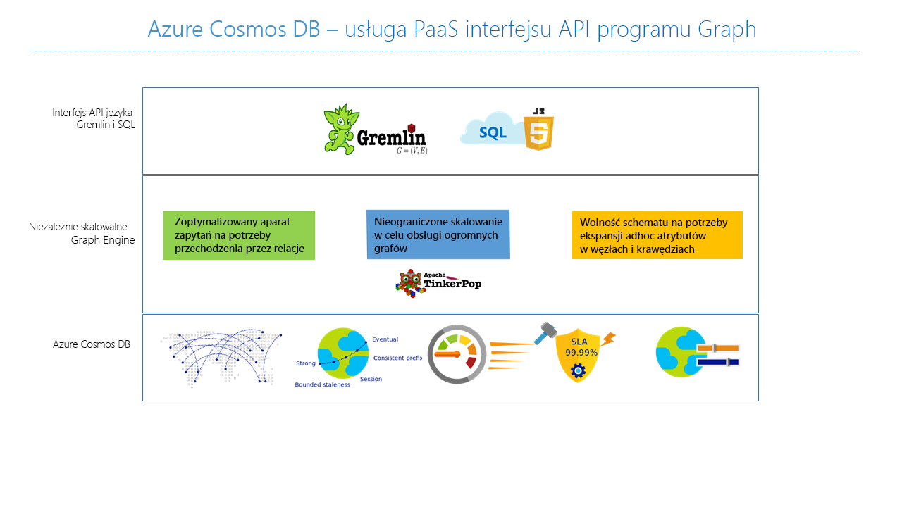

# <a name="introduction-to-azure-cosmos-db-gremlin-api"></a>Wprowadzenie do usługi Azure Cosmos DB: Interfejs API języka Gremlin

[Usługa Azure Cosmos DB](introduction.md) to usługa globalnie dystrybuowanej, wielomodelowej bazy danych firmy Microsoft dla aplikacji o kluczowym znaczeniu. Jest to wielomodelowa baza danych i obsługuje dokumentów, pary klucz wartość, wykres i modele dokumentowe. Interfejs API języka Gremlin usługi Azure Cosmos DB służy do przechowywania i obsługi danych programu graph w środowisku w pełni zarządzana baza danych w dowolnej skali.  



Ten artykuł zawiera omówienie interfejsu API języka Gremlin usługi Azure Cosmos DB i przedstawia jak można go użyć do przechowywania dużych grafów zawierających miliardy wierzchołków i krawędzi. Można wykonywać zapytania wykresy z opóźnieniem w milisekundach i łatwego rozwijania struktura grafu. Interfejs API Gremlin danych usługi Azure Cosmos DB jest oparty na [przez witrynę Apache TinkerPop](https://tinkerpop.apache.org) standardowa bazy danych grafów i używa języka Gremlin język zapytań. 

Interfejs API Gremlin danych usługi Azure Cosmos DB łączy możliwości algorytmy bazy danych programu graph z wysoce skalowalnej infrastruktury zarządzanych zapewnienie unikatowy, elastyczne rozwiązania typowych problemów danych skojarzonych z Brak metody relacyjnych i elastyczność. 

## <a name="features-of-azure-cosmos-db-graph-database"></a>Funkcje bazy danych grafów usługi Azure Cosmos DB
 
Usługa Azure Cosmos DB jest w pełni zarządzaną bazą danych grafów, która oferuje globalną dystrybucję, elastyczne skalowanie magazynu i przepływności, automatyczne indeksowanie i wykonywanie zapytań, dostosowywalne poziomy spójności oraz obsługę standardu TinkerPop. 

Poniżej przedstawiono zróżnicowane funkcje, które oferuje usługi Azure Cosmos DB — interfejs API Gremlin:

* **Elastycznie skalowalne przepływność i Magazyn**

  Skalowanie grafów w świecie rzeczywistym wymaga skalowania przekraczającego pojemność pojedynczego serwera. Usługa Azure Cosmos DB obsługuje skalowalna w poziomie grafowe bazy danych, które mogą mieć praktycznie nieograniczone miejsce rozmiar kategoriach i aprowizowanej przepływności. Wraz ze wzrostem natężenia skalowania bazy danych programu graph, dane będą automatycznie dystrybuowane przy użyciu [partycjonowanie grafu](https://docs.microsoft.com/azure/cosmos-db/graph-partitioning).

* **Replikacja w wielu regionach**

  Usługa Azure Cosmos DB automatycznie można replikować dane wykresu do dowolnego regionu systemu Azure. Replikacja upraszcza tworzenie aplikacji wymagających globalnego dostępu do danych. Oprócz minimalizuje opóźnienie odczytu, usługa Azure Cosmos DB udostępnia mechanizm rozwiązania regionalnej pracy awaryjnej, który zapewnia ciągłość działania aplikacji w rzadkich przypadkach przerw w działaniu usługi w regionie. 

* **Szybkie zapytania i przejścia ze standardem wykres najczęściej stosowanych zapytań**

  Można przechowywać heterogeniczne wierzchołki i krawędzie oraz wykonywać zapytania dla tych dokumentów przy użyciu znanej składni języka Gremlin. Język gremlin to język zapytań imperatywnego, funkcjonalności, który udostępnia interfejs zaawansowanych do zaimplementowania typowych algorytmów wykresu. 
  
  Usługa Azure Cosmos DB umożliwia zaawansowane zapytania w czasie rzeczywistym i przejścia bez konieczności określania wskazówek schematu, indeksów pomocniczych czy widoków. Więcej informacji znajduje się w temacie [Query graphs by using Gremlin](gremlin-support.md) (Wykonywanie zapytań dla grafów przy użyciu środowiska Gremlin).

* **W pełni zarządzana baza danych**

  Usługa Azure Cosmos DB eliminuje konieczność zarządzania zasobami maszyn i baz danych. Większość platform istniejącej bazy danych programu graph jest powiązana z ograniczeń infrastruktury i często wymagają wysokiego stopnia obsługi, aby zapewnić jego działania. 
  
  Jako w pełni zarządzana usługa Microsoft Azure nie ma potrzeby zarządzania maszynami wirtualnymi, aktualizacji oprogramowania w czasie wykonywania, lub zarządzać nim fragmentowania lub replikacji przeciwdziałania uaktualnień złożonych warstwy danych. Dla każdego grafu jest automatycznie tworzona kopia zapasowa w celu ochrony przed regionalnymi awariami. Gwarancje te umożliwiają deweloperom skupić się na dostarczaniu wartości aplikacji zamiast operacyjne i zarządzanie ich bazami danych. 

* **Automatyczne indeksowanie**

  Domyślnie usługa Azure Cosmos DB automatycznie indeksuje wszystkie właściwości w węzłach oraz krawędziach grafu i nie oczekuje ani nie wymaga żadnego schematu ani tworzenia indeksów pomocniczych. Dowiedz się więcej o [indeksowanie w usłudze Azure Cosmos DB](https://docs.microsoft.com/azure/cosmos-db/index-overview). 

* **Zgodność z przez witrynę Apache TinkerPop**

  Usługa Azure Cosmos DB obsługuje [typu open source Apache TinkerPop standard](http://tinkerpop.apache.org/). Standardowa Tinkerpop ma wystarczającą ekosystemu aplikacji i bibliotek, które można łatwo zintegrować z interfejsem API języka Gremlin usługi Azure Cosmos DB. 

* **Dostosowywalne poziomy spójności**

  Można wybrać spośród pięciu dobrze zdefiniowanych poziomów spójności w celu osiągnięcia optymalnego kompromisu między wydajnością a spójnością. Dla zapytań i operacji odczytu usługa Azure Cosmos DB oferuje pięć różnych poziomów spójności: „silna”, „powiązana nieaktualność”, „sesja”, „spójny prefiks” i „ostateczna”. Te szczegółowe, dokładnie zdefiniowane poziomy spójności umożliwiają ustalanie optymalnych kompromisów między spójnością, dostępnością i opóźnieniem. Więcej informacji znajduje się w temacie [Tunable data consistency levels in Azure Cosmos DB](consistency-levels.md) (Dostosowywalne poziomy spójności danych w usłudze Azure Cosmos DB).

## <a name="scenarios-that-can-use-gremlin-api"></a>Scenariusze, w których można używać interfejsu API języka Gremlin
Poniżej przedstawiono kilka scenariuszy, w których można użyć obsługi grafów w usłudze Azure Cosmos DB:

* Sieci społecznościowe

  Łącząc dane dotyczące klientów i ich interakcji z innymi osobami, można zaprojektować spersonalizowaną obsługę, przewidzieć zachowanie klientów lub umożliwić nawiązanie kontaktu z innymi osobami o podobnych zainteresowaniach. Usługa Azure Cosmos DB może służyć do zarządzania sieciami społecznościowymi oraz śledzenia preferencji i danych klientów.

* Aparaty rekomendacji

  Ten scenariusz jest powszechnie stosowany w branży sprzedaży detalicznej. Przez łączenie informacji na temat produktów, użytkowników oraz interakcji użytkownika, np. zakupów, przeglądania witryn internetowych lub oceny produktów, można tworzyć niestandardowe rekomendacje. Małe opóźnienia, elastyczne skalowanie i natywna obsługa grafów w usłudze Azure Cosmos DB nadają się idealnie do modelowania tych interakcji.

* Dane geoprzestrzenne

  Wiele aplikacji stosowanych w telekomunikacji, logistyce i planowaniu podróży musi znaleźć lokalizację będącą przedmiotem zainteresowania na danym obszarze lub zlokalizować najkrótszą/optymalną trasę między dwoma lokalizacjami. Usługa Azure Cosmos DB stanowi naturalne rozwiązanie tych problemów.

* Internet rzeczy

  Gdy sieć i połączenia między urządzeniami IoT zostają przedstawione w formie grafu, można lepiej rozumieć stan urządzeń i zasobów. Można także dowiedzieć się, jak zmiany w jednej części sieci mogą teoretycznie wpłynąć na inną część.

## <a name="introduction-to-graph-databases"></a>Wprowadzenie do baz danych programu graph
W świecie rzeczywistym dane w sposób naturalny łączą się ze sobą. Modelowanie danych tradycyjnych koncentruje się na definiowanie jednostek osobno i obliczenia ich relacje w czasie wykonywania. Chociaż ten model ma swoje zalety, dane o wysokim stopniu połączenia może być wyzwaniem zarządzać pod swoje ograniczenia.  

Podejście do baz danych programu graph opiera się na utrwalanie relacje w warstwie magazynu zamiast tego, co prowadzi do wykresu wysoko wydajnej operacjami pobierania. Interfejs API języka Gremlin danych usługi Azure Cosmos DB obsługuje [właściwość dzięki wykresowemu modelowi](https://tinkerpop.apache.org/docs/current/reference/#intro).

### <a name="property-graph-objects"></a>Właściwości obiektów grafu

Właściwość [wykres](http://mathworld.wolfram.com/Graph.html) to struktura, która składa się z [wierzchołki](http://mathworld.wolfram.com/GraphVertex.html) i [krawędzie](http://mathworld.wolfram.com/GraphEdge.html). Oba obiekty mogą mieć dowolną liczbę par klucz wartość jako właściwości. 

* **Wierzchołki** -wierzchołki oznaczają osobne jednostki, takie jak osoby, miejsca lub zdarzenia.

* **Krawędzie** — krawędzie określają relacje między wierzchołkami. Na przykład dana osoba może znać inną osobę, brać udział w wydarzeniu lub była niedawno w danej lokalizacji. 

* **Właściwości** — właściwości zawierają informacje na temat wierzchołków i krawędzi. Może to być dowolna liczba właściwości w wierzchołki i krawędzie i może służyć do opisu i obiektów w zapytaniu filtru. Przykład właściwości obejmują wierzchołek, który ma nazwę i wiek lub edge, który może mieć sygnaturę czasową i/lub wagi. 

Baz danych programu Graph często są zawarte w obrębie NoSQL, relacyjnych i nierelacyjnych, kategoria bazy danych, ponieważ nie ma żadnych zależności od schematu lub model danych ograniczone. Ten Brak schematu umożliwia modelowanie i przechowywanie struktur połączonych, naturalny i wydajne. 

### <a name="gremlin-by-example"></a>Język Gremlin w przykładach
Przykładowy graf pomoże dowiedzieć się, jak można wyrazić zapytania w języku Gremlin. Na poniższej ilustracji przedstawiono w formie grafu aplikację biznesową, która zarządza danymi o użytkownikach, zainteresowaniach i urządzeniach.  

 

Ten graf obejmuje następujące typy wierzchołków (nazywanych w języku Gremlin „label”, czyli etykieta):

- People (Osoby): graf przedstawia trzy osoby, Robina, Thomasa i Bena
- Interests (Zainteresowania): ich zainteresowaniem w tym przykładzie jest piłka nożna (football)
- Devices (Urządzenia): urządzenia używane przez osoby
- Operating Systems (Systemy operacyjne): systemy operacyjne uruchomione na urządzeniach

Przedstawiamy relacje między tymi jednostkami przy użyciu następujących typów krawędzi/etykiet:

- Knows (Zna): na przykład „Thomas zna Robina”
- Interested (Interesuje się): służy do przedstawienia zainteresowań osób znajdujących się na grafie, na przykład „Ben interesuje się piłką nożną (football)”
- RunsOS (Ma system operacyjny): na laptopie jest uruchomiony system operacyjny Windows
- Uses (Używa): służy do przedstawienia, którego urządzenia używa dana osoba. Na przykład Robin używa telefonu firmy Motorola o numerze seryjnym 77

Możemy uruchomić pewne operacje zgodnie z tym grafem przy użyciu [Konsoli Gremlin](https://tinkerpop.apache.org/docs/3.3.2/reference/#gremlin-console). Można również wykonywać te operacje przy użyciu sterowników Gremlin na wybranej platformie (Java, Node.js, Python lub .NET).  Zanim zajmiemy się tym, co jest obsługiwane w usłudze Azure Cosmos DB, przyjrzymy się kilku przykładom, aby zapoznać się ze składnią.

Najpierw zajmijmy się CRUD. Następująca instrukcja języka Gremlin wstawia do grafu wierzchołek „Thomas”:

```java
:> g.addV('person').property('id', 'thomas.1').property('firstName', 'Thomas').property('lastName', 'Andersen').property('age', 44)
```

Następnie poniższa instrukcja języka Gremlin wstawia krawędź „knows” między wierzchołkami „Thomas” i „Robin”.

```java
:> g.V('thomas.1').addE('knows').to(g.V('robin.1'))
```

Poniższe zapytanie zwraca wierzchołki „person” w porządku malejącym według ich imion:
```java
:> g.V().hasLabel('person').order().by('firstName', decr)
```

Wyjątkowość grafów docenia się, gdy trzeba odpowiedzieć na takie pytania jak: „Jakich systemów operacyjnych używają znajomi Thomasa?” Można uruchomić tego przechodzenie Gremlin, aby uzyskać te informacje z wykresu:

```java
:> g.V('thomas.1').out('knows').out('uses').out('runsos').group().by('name').by(count())
```
Teraz sprawdźmy, co oferuje usługa Azure Cosmos DB deweloperom języka Gremlin.

## <a name="next-steps"></a>Kolejne kroki
Aby dowiedzieć się więcej na temat obsługi grafów w usłudze Azure Cosmos DB, zobacz:

* Rozpocznij pracę od [samouczka dotyczącego grafów usługi Azure Cosmos DB](create-graph-dotnet.md).
* Uzyskaj informacje na temat [wykonywania zapytań dla grafów w usłudze Azure Cosmos DB przy użyciu środowiska Gremlin](gremlin-support.md).
