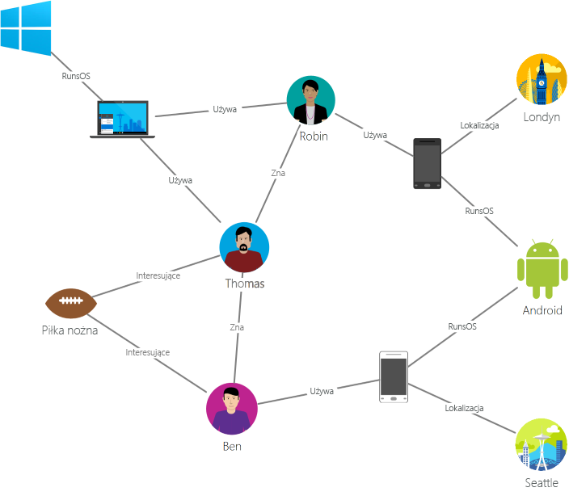

# Wprowadzenie do usługi Azure Cosmos DB: Interfejs API języka Gremlin

[Usługa Azure Cosmos DB](introduction.md) to usługa globalnie dystrybuowanej, wielomodelowej bazy danych firmy Microsoft dla aplikacji o kluczowym znaczeniu. Jest to wielomodelowa baza danych i obsługuje dokumentów, pary klucz wartość, wykres i modele dokumentowe. Interfejs API języka Gremlin usługi Azure Cosmos DB służy do przechowywania danych grafów i pracy z nimi. Interfejs API języka Gremlin obsługuje modelowanie danych programu Graph i udostępnia interfejsy API służące do przechodzenia przez dane grafu.

Ten artykuł zawiera omówienie interfejsu API języka Gremlin usługi Azure Cosmos DB i przedstawia jak można go użyć do przechowywania dużych grafów zawierających miliardy wierzchołków i krawędzi. Można wykonać zapytania dla grafów z opóźnieniem rzędu kilku milisekund i łatwo rozwinąć strukturę i schemat graf. Aby wysłać zapytanie do usługi Azure Cosmos DB, możesz użyć języka przechodzenia grafu [Apache TinkerPop](https://tinkerpop.apache.org) lub [Gremlin](https://tinkerpop.apache.org/docs/current/reference/#graph-traversal-steps).

## Co to jest baza danych grafów
W świecie rzeczywistym dane w sposób naturalny łączą się ze sobą. Tradycyjne modelowanie danych skupia się na obiektach. W przypadku wielu aplikacji również występuje potrzeba naturalnego modelowania lub modelowania zarówno obiektów, jak i relacji.

[Graf](http://mathworld.wolfram.com/Graph.html) jest strukturą składającą się z [wierzchołków](http://mathworld.wolfram.com/GraphVertex.html) i [krawędzi](http://mathworld.wolfram.com/GraphEdge.html). Zarówno wierzchołki, jak i krawędzie mogą mieć dowolną liczbę właściwości. 

* **Wierzchołki** — wierzchołki określają odrębne obiekty, takie jak osoby, miejsca lub zdarzenia. 

* **Krawędzie** — krawędzie określają relacje między wierzchołkami. Na przykład dana osoba może znać inną osobę, brać udział w wydarzeniu lub była niedawno w danej lokalizacji. 

* **Właściwości** — właściwości zawierają informacje na temat wierzchołków i krawędzi. Przykładowe właściwości obejmują wierzchołek, który ma nazwę i wiek. Krawędź, która zawiera znacznik czasowy i/lub wagę. Bardziej oficjalnie model ten jest określany jak [graf właściwości](https://tinkerpop.apache.org/docs/current/reference/#intro). Usługa Azure Cosmos DB obsługuje model grafu właściwości.

Na przykład poniższy przykładowy graf przedstawia relacje między ludźmi, urządzeniami przenośnymi, zainteresowaniami oraz systemami operacyjnymi:

Bazy danych programu Graph umożliwiają modelowanie i przechowywanie grafów w naturalny i skuteczny sposób, dzięki czemu są przydatne w wielu scenariuszach. Bazy danych programu Graph są zwykle bazami danych NoSQL, ponieważ te przypadki użycia często wymagają również elastyczności schematów i szybkiej iteracji.

Do szybkich przejść, które oferują bazy danych grafów, można dołączyć algorytmy grafów, np. wyszukiwanie pierwszej głębi, wyszukiwanie pierwszej szerokości oraz algorytm Dijkstry w celu rozwiązania różnego typu problemów, np. dotyczących sieci społecznościowych, zarządzania zawartością, danych geoprzestrzennych oraz rekomendacji.

## Funkcje bazy danych grafów usługi Azure Cosmos DB
 
Usługa Azure Cosmos DB jest w pełni zarządzaną bazą danych grafów, która oferuje globalną dystrybucję, elastyczne skalowanie magazynu i przepływności, automatyczne indeksowanie i wykonywanie zapytań, dostosowywalne poziomy spójności oraz obsługę standardu TinkerPop.

W porównaniu z innymi bazami danych grafów na rynku usługa Azure Cosmos DB oferuje następujące zróżnicowane funkcje:

* Elastycznie skalowalna przepływność i magazyn

  Skalowanie grafów w świecie rzeczywistym wymaga skalowania przekraczającego pojemność pojedynczego serwera. Za pomocą usługi Azure Cosmos DB można płynnie skalować grafy na wielu serwerach. Można również niezależnie skalować przepływność grafy w oparciu o wzorce dostępu. Usługa Azure Cosmos DB obsługuje bazy danych grafów, które można skalować do niemal nieograniczonego rozmiaru magazynu i aprowizowanej przepływności.

* Replikacja w wielu regionach

  Usługa Azure Cosmos DB w sposób niewidoczny dla użytkownika replikuje dane grafu na wszystkie regiony skojarzone z kontem. Replikacja umożliwia tworzenie aplikacji, które wymagają globalnego dostępu do danych. Doszło do kompromisu w zakresie spójności, dostępności, wydajności i odpowiednich gwarancji. Usługa Cosmos DB oferuje niewidoczne dla użytkownika regionalne przejście w tryb failover z wykorzystaniem interfejsów API podłączonych do wielu sieci. Na całym świecie można elastycznie skalować przepływność i magazyn.

* Szybkie zapytania i przejścia ze znaną składnią języka Gremlin

  Można przechowywać heterogeniczne wierzchołki i krawędzie oraz wykonywać zapytania dla tych dokumentów przy użyciu znanej składni języka Gremlin. Usługa Azure Cosmos DB wykorzystuje wysoce współbieżną, nieblokującą, opartą na strukturze dziennika technologię indeksowania do automatycznego indeksowania całej zawartości. Ta funkcja umożliwia wykonywanie zaawansowanych zapytań i przejść w czasie rzeczywistym bez konieczności określania wskazówek schematu, indeksów pomocniczych czy widoków. Więcej informacji znajduje się w temacie [Query graphs by using Gremlin](gremlin-support.md) (Wykonywanie zapytań dla grafów przy użyciu środowiska Gremlin).

* Pełne zarządzanie

  Usługa Azure Cosmos DB eliminuje konieczność zarządzania zasobami maszyn i baz danych. Ponieważ jest to w pełni zarządzana usługa platformy Microsoft Azure, nie trzeba zarządzać maszynami wirtualnymi, wdrażać ani konfigurować oprogramowania, zarządzać skalowaniem ani obsługiwać złożonych aktualizacji warstwy danych. Dla każdego grafu jest automatycznie tworzona kopia zapasowa w celu ochrony przed regionalnymi awariami. Możesz łatwo dodać konto usługi Azure Cosmos DB i aprowizować pojemność odpowiednio do potrzeb, co pozwala skupić się na aplikacji, zamiast zajmować się obsługą bazy danych i zarządzaniem nią.

* Automatyczne indeksowanie

  Domyślnie usługa Azure Cosmos DB automatycznie indeksuje wszystkie właściwości w węzłach oraz krawędziach grafu i nie oczekuje ani nie wymaga żadnego schematu ani tworzenia indeksów pomocniczych.

* Zgodność z witryną Apache TinkerPop

  Usługa Azure Cosmos DB natywnie obsługuje standard Apache TinkerPop typu open-source i można ją zintegrować z innymi systemami grafów z obsługą witryny TinkerPop. Można więc łatwo przeprowadzić migrację z innej bazy danych grafów, np. Titan lub Neo4j, lub użyć usługi Azure Cosmos DB ze strukturami analizy grafów, takimi jak Apache Spark GraphX.

* Poziomy z możliwością dostosowania spójności

  Można wybrać spośród pięciu dobrze zdefiniowanych poziomów spójności w celu osiągnięcia optymalnego kompromisu między wydajnością a spójnością. Dla zapytań i operacji odczytu usługa Azure Cosmos DB oferuje pięć różnych poziomów spójności: „silna”, „powiązana nieaktualność”, „sesja”, „spójny prefiks” i „ostateczna”. Te szczegółowe, dokładnie zdefiniowane poziomy spójności umożliwiają ustalanie optymalnych kompromisów między spójnością, dostępnością i opóźnieniem. Więcej informacji znajduje się w temacie [Tunable data consistency levels in Azure Cosmos DB](consistency-levels.md) (Dostosowywalne poziomy spójności danych w usłudze Azure Cosmos DB).

Usługa Azure Cosmos DB może również korzystać z wielu modeli, np. dokumentów lub grafów, w tych samych kontenerach/bazach danych. Kontener dokumentów służy do przechowywania danych grafów równolegle z dokumentami. Aby wykonać zapytania dla tych samych danych w formie grafu, można użyć zarówno zapytań SQL w formacie JSON, jak i zapytań Gremlin.

## Rozpoczęcie pracy

Do tworzenia kont interfejsu API języka Gremlin usługi Azure Cosmos DB i zarządzania nimi można użyć interfejsu wiersza polecenia platformy Azure, programu Azure PowerShell lub witryny Azure Portal. Po utworzeniu konta usługi można uzyskiwać dostęp do baz danych grafów w ramach tego konta, używając punktu końcowego usługi interfejsu API języka Gremlin `https://<youraccount>.gremlin.cosmosdb.azure.com`, który udostępnia fronton WebSocket dla języka Gremlin. Można skonfigurować narzędzia zgodne z witryną TinkerPop, np. [Konsolę Gremlin](https://tinkerpop.apache.org/docs/current/reference/#gremlin-console), aby podłączyć się do tego punktu końcowego i tworzyć aplikacje w środowisku Java, Node.js lub w dowolnym sterowniku klienta Gremlin.

W poniższej tabeli przedstawiono popularne sterowniki Gremlin, których można użyć do usługi Azure Cosmos DB:

| Do pobrania | Dokumentacja | Wprowadzenie | Obsługiwana wersja łącznika |
| --- | --- | --- | --- |
| [.NET](https://tinkerpop.apache.org/docs/3.3.1/reference/#gremlin-DotNet) | [Gremlin.NET w witrynie GitHub](https://github.com/apache/tinkerpop/tree/master/gremlin-dotnet) | [Tworzenie grafu przy użyciu platformy .NET](create-graph-dotnet.md) | 3.4.0-RC2 |
| [Java](https://mvnrepository.com/artifact/com.tinkerpop.gremlin/gremlin-java) | [Gremlin JavaDoc](https://tinkerpop.apache.org/javadocs/current/full/) | [Tworzenie grafu przy użyciu środowiska Java](create-graph-java.md) | 3.2.0+ |
| [Node.js](https://www.npmjs.com/package/gremlin) | [Gremlin-JavaScript w witrynie GitHub](https://github.com/jbmusso/gremlin-javascript) | [Tworzenie grafu przy użyciu platformy Node.js](create-graph-nodejs.md) | 2.6.0|
| [Python](https://tinkerpop.apache.org/docs/3.3.1/reference/#gremlin-python) | [Gremlin-Python w witrynie GitHub](https://github.com/apache/tinkerpop/tree/master/gremlin-python) | [Tworzenie grafu przy użyciu środowiska Python](create-graph-python.md) | 3.2.7 |
| [PHP](https://packagist.org/packages/brightzone/gremlin-php) | [Gremlin-PHP w witrynie GitHub](https://github.com/PommeVerte/gremlin-php) | [Tworzenie grafu przy użyciu środowiska PHP](create-graph-php.md) | 3.1.0 |
| [Konsola Gremlin](https://tinkerpop.apache.org/downloads.html) | [Dokumentacja dotycząca witryny TinkerPop](https://tinkerpop.apache.org/docs/current/reference/#gremlin-console) |  [Tworzenie grafu przy użyciu Konsoli Gremlin](create-graph-gremlin-console.md) | 3.2.0 + |

## Zagadnienia dotyczące projektowania bazy danych grafów

Podczas projektowania wykresu decyzji modelowania jednostki jako własną, w przeciwieństwie do jako właściwość innych podmiotów wierzchołka wierzchołka ma wpływ wydajności i kosztów. Głównym czynnikiem związanym z tą decyzją jest informacja na temat sposobu wykonywania zapytań o dane, a także skalowalności samego modelu.

Przed zaplanowaniem sposobu modelowania jednostki należy wziąć pod uwagę następujące kwestie:

* Które jednostki muszą zostać pobrane jako wierzchołki w większości zapytań?

* Jakie informacje są dodawane na wykresie dla celów związanych z filtrowaniem danych?

* Jakie jednostki są jedynie połączeniami z innymi obiektami, które następnie są pobierane z powodu swoich wartości?

* Jakie informacje musi pobrać zapytanie i jaka opłata za jednostkę żądania zostanie wygenerowana?

Załóżmy na przykład, że tworzymy następujący projekt grafu:

* W zależności od zapytania jest możliwe, że relacja District (Region) -> Store (Sklep) jest używana unikatowo do filtrowania wierzchołków Store (Sklep). Jeśli na przykład zapytania mają następujący format: „pobierz wszystkie sklepy znajdujące się na terenie określonego regionu”. W takiej sytuacji warto rozważyć rozwinięcie jednostki District (Region) z własnego wierzchołka do właściwości wierzchołka Store (Sklep). 

* Zaletą takiego podejścia jest możliwość obniżenia kosztu pobierania każdego wierzchołka Store (Sklep) dzięki równoczesnemu pobieraniu trzech obiektów wykresu (District, District->Store, Store) do pojedynczego wierzchołka Store (Sklep). Ta opcja oferuje ulepszenia wydajności oraz mniejszy koszt na zapytanie.

* Ponieważ wierzchołek Store (Sklep) łączy się z dwoma różnymi jednostkami — Employee (Pracownik) i Product (Produkt). Z tego powodu wierzchołek Store (Sklep) jest niezbędny, ponieważ ma dodatkowe możliwości przechodzenia.  

## Scenariusze, w których można używać interfejsu API języka Gremlin
Poniżej przedstawiono kilka scenariuszy, w których można użyć obsługi grafów w usłudze Azure Cosmos DB:

* Sieci społecznościowe

  Łącząc dane dotyczące klientów i ich interakcji z innymi osobami, można zaprojektować spersonalizowaną obsługę, przewidzieć zachowanie klientów lub umożliwić nawiązanie kontaktu z innymi osobami o podobnych zainteresowaniach. Usługa Azure Cosmos DB może służyć do zarządzania sieciami społecznościowymi oraz śledzenia preferencji i danych klientów.

* Aparaty rekomendacji

  Ten scenariusz jest powszechnie stosowany w branży sprzedaży detalicznej. Przez łączenie informacji na temat produktów, użytkowników oraz interakcji użytkownika, np. zakupów, przeglądania witryn internetowych lub oceny produktów, można tworzyć niestandardowe rekomendacje. Małe opóźnienia, elastyczne skalowanie i natywna obsługa grafów w usłudze Azure Cosmos DB nadają się idealnie do modelowania tych interakcji.

* Dane geoprzestrzenne

  Wiele aplikacji stosowanych w telekomunikacji, logistyce i planowaniu podróży musi znaleźć lokalizację będącą przedmiotem zainteresowania na danym obszarze lub zlokalizować najkrótszą/optymalną trasę między dwoma lokalizacjami. Usługa Azure Cosmos DB stanowi naturalne rozwiązanie tych problemów.

* Internet rzeczy

  Gdy sieć i połączenia między urządzeniami IoT zostają przedstawione w formie grafu, można lepiej rozumieć stan urządzeń i zasobów. Można także dowiedzieć się, jak zmiany w jednej części sieci mogą teoretycznie wpłynąć na inną część.

## Następne kroki
Aby dowiedzieć się więcej na temat obsługi grafów w usłudze Azure Cosmos DB, zobacz:

* Rozpocznij pracę od [samouczka dotyczącego grafów usługi Azure Cosmos DB](create-graph-dotnet.md).
* Uzyskaj informacje na temat [wykonywania zapytań dla grafów w usłudze Azure Cosmos DB przy użyciu środowiska Gremlin](gremlin-support.md).
