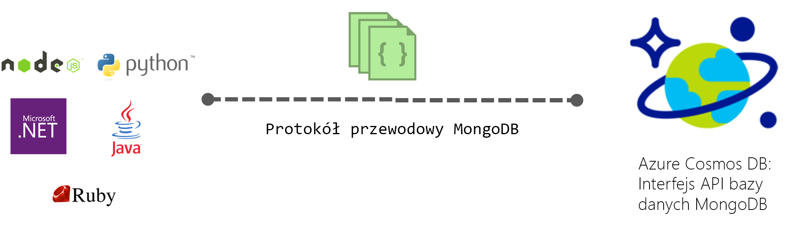

# Interfejs API usługi Azure Cosmos DB dla bazy danych MongoDB

[Azure Cosmos DB](introduction.md) to rozproszona globalnie wielomodelowa usługa bazy danych firmy Microsoft do aplikacji o krytycznym znaczeniu. Usługa Azure Cosmos DB zapewnia [kompleksową globalną dystrybucję](distribute-data-globally.md), [elastyczne skalowanie przepływności i pamięci](partition-data.md) w skali globalnej, milisekundowe opóźnienia w 99. percentylu oraz gwarantowaną wysoką dostępność, wspierane przez [wiodące w branży umowy SLA](https://azure.microsoft.com/support/legal/sla/cosmos-db/). Usługa Azure Cosmos DB [automatycznie indeksuje dane](https://www.vldb.org/pvldb/vol8/p1668-shukla.pdf) bez konieczności zarządzania schematami i indeksami. To usługa wielomodelowa, obsługująca modele dokumentowe, klucz-wartość, wykresy i kolumny. Domyślnie można korzystać z usługi Cosmos DB przy użyciu interfejsu API SQL. Ponadto usługa Cosmos DB implementuje protokoły przewodowe dla typowych interfejsów API NoSQL, w tym Cassandra, MongoDB, Gremlin i Azure Table Storage. Dzięki temu można korzystać z dobrze znanych sterowników i narzędzi klienta NoSQL do interakcji z bazą danych Cosmos.

## Zgodność z protokołem przewodowym

Usługa Cosmos DB implementuje protokoły przewodowe typowych baz danych NoSQL, w tym Cassandra, MongoDB, Gremlin i Azure Table Storage. Dzięki dostarczeniu natywnych implementacji protokołów przewodowych bezpośrednio i wydajnie w usłudze Cosmos DB możliwa jest przezroczysta interakcja istniejących zestawów SDK klienta, sterowników i narzędzi baz danych NoSQL z usługą Cosmos DB. Usługa Cosmos DB nie korzysta z żadnego kodu źródłowego baz danych w celu zapewnienia przewodowej zgodności interfejsów API baz danych NoSQL.

Interfejs API usługi Azure Cosmos DB dla bazy danych MongoDB jest domyślnie zgodny z wersją 3.2 protokołu przewodowego MongoDB. Funkcje i operatory zapytań dodane w wersji 3.4 protokołu przewodowego są obecnie dostępne w wersji zapoznawczej. Każdy sterownik klienta MongoDB, który rozumie te wersje protokołu, powinien natywnie umożliwiać połączenie z usługą Cosmos DB.

 

## Najważniejsze korzyści

Kluczowe korzyści z usługi Cosmos DB jako w pełni zarządzanej, globalnie rozproszonej bazy danych jako usługi zostały opisane [tutaj](introduction.md). Ponadto dzięki natywnej implementacji protokołów przewodowych popularnych interfejsów API NoSQL usługa Cosmos DB zapewnia następujące korzyści:

* Łatwa migracja aplikacji do usługi Cosmos DB przy jednoczesnym zachowaniu znacznej części logiki aplikacji.
* Zapewnienie, że aplikacja będzie nadal przenośna i niezależna od dostawcy chmury.
* Uzyskanie wiodących w branży zabezpieczonych finansowo umów SLA dla typowych interfejsów API NoSQL dostarczanych przez usługę Cosmos DB.
* Elastyczne skalowanie aprowizowanej przepływności i magazynu dla baz danych Cosmos zgodnie z potrzebami i płatność tylko za przepływność i magazyn, które są potrzebne. Prowadzi to do znacznych oszczędności kosztów.
* Gotowa do użycia globalna dystrybucja z replikacją wielowzorcową.

## Interfejs API usługi Cosmos DB dla bazy danych MongoDB

Wykonaj instrukcje z przewodników Szybki start, aby utworzyć konto usługi Cosmos i przeprowadzić migrację istniejącej aplikacji MongoDB do użycia usługi Azure Cosmos DB lub utworzyć nową:

* [Migrate an existing MongoDB Node.js web app](create-mongodb-nodejs.md) (Migracja istniejącej aplikacji internetowej MongoDB w środowisku Node.js).
* [Build a web app using Azure Cosmos DB's API for MongoDB and .NET SDK](create-mongodb-dotnet.md) (Tworzenie aplikacji internetowej za pomocą interfejsu API usługi Azure Cosmos DB dla bazy danych MongoDB i zestawu SDK platformy .NET)
* [Build a web app using Azure Cosmos DB's API for MongoDB and Java SDK](create-mongodb-java.md) (Tworzenie aplikacji internetowej za pomocą interfejsu API usługi Azure Cosmos DB dla bazy danych MongoDB i zestawu SDK języka Java)

## Kolejne kroki

Oto kilka wskazówek ułatwiających rozpoczęcie pracy:

* Postępuj zgodnie z instrukcjami z samouczka [Connect a MongoDB application to Azure Cosmos DB](connect-mongodb-account.md) (Łączenie aplikacji bazy danych MongoDB z usługą Azure Cosmos DB), aby dowiedzieć się, jak uzyskać informacje dotyczące parametrów połączenia konta.
* Postępuj zgodnie z instrukcjami z samouczka [Use Studio 3T with Azure Cosmos DB](mongodb-mongochef.md) (Używanie programu Studio 3T z usługą Azure Cosmos DB), aby dowiedzieć się, jak utworzyć połączenie między bazą danych Cosmos a aplikacją MongoDB w programie Studio 3T.
* Postępuj zgodnie z instrukcjami z samouczka [Import MongoDB data into Azure Cosmos DB ](mongodb-migrate.md) (Importowane danych MongoDB do usługi Azure Cosmos DB), aby zaimportować swoje dane do bazy danych Cosmos.
* Nawiąż połączenie z kontem Cosmos za pomocą programu [Robo 3T](mongodb-robomongo.md).
* Dowiedz się, jak [konfigurować preferencje odczytu dla aplikacji rozproszonych globalnie](../cosmos-db/tutorial-global-distribution-mongodb.md).

Uwaga: W tym artykule opisano funkcjonalność usługi Azure Cosmos DB, która zapewnia zgodność protokołu przewodowego z bazami danych MongoDB. Firma Microsoft nie uruchamia baz danych MongoDB w celu udostępnienia tej usługi. Usługa Azure Cosmos DB nie jest powiązana z firmą MongoDB, Inc.
