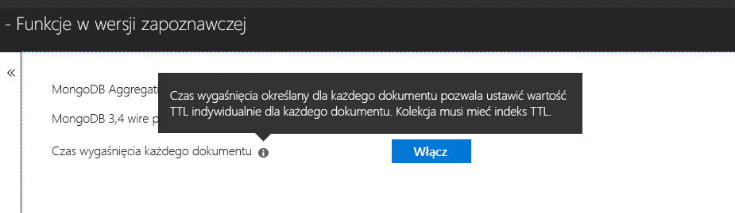

# <a name="expire-data-with-azure-cosmos-dbs-api-for-mongodb"></a>Wygasanie danych za pomocą interfejsu API usługi Azure Cosmos DB dla bazy danych MongoDB

Funkcjonalność czasu wygaśnięcia (TTL, time-to-live) umożliwia automatyczne wygasanie danych bazy danych. Interfejs API usługi Azure Cosmos DB dla bazy danych MongoDB korzysta z podstawowych możliwości czasu wygaśnięcia usługi Cosmos DB. Obsługiwane są dwa tryby: ustawianie domyślnej wartości czasu wygaśnięcia dla całej kolekcji oraz ustawianie wartości czasu wygaśnięcia dla poszczególnych dokumentów. Logika zarządzająca indeksami czasu wygaśnięcia i wartościami czasu wygaśnięcia dla poszczególnych dokumentów w interfejsie API usługi Cosmos DB dla bazy danych MongoDB jest [taka sama jak w usłudze Cosmos DB](../cosmos-db/mongodb-indexing.md).

## <a name="ttl-indexes"></a>Indeksy czasu wygaśnięcia
Aby włączyć czas wygaśnięcia dla całej kolekcji, należy utworzyć [„Indeks czasu wygaśnięcia”](../cosmos-db/mongodb-indexing.md). Indeks czasu wygaśnięcia jest indeksem dla pola _ts z wartością „expireAfterSeconds”.

Przykład:
```JavaScript
globaldb:PRIMARY> db.coll.createIndex({"_ts":1}, {expireAfterSeconds: 10})
{
        "_t" : "CreateIndexesResponse",
        "ok" : 1,
        "createdCollectionAutomatically" : true,
        "numIndexesBefore" : 1,
        "numIndexesAfter" : 4
}
```

Polecenie w powyższym przykładzie powoduje utworzenie indeksu z funkcjonalnością czasu wygaśnięcia. Po utworzeniu indeksu z bazy danych będą automatycznie usuwane wszystkie dokumenty w kolekcji, które nie zostały zmodyfikowane w ciągu ostatnich 10 sekund. 

> [!NOTE]
> **_ts** jest polem właściwym dla usługi Cosmos DB i nie można do niego uzyskać dostępu z klientów bazy danych MongoDB. Jest zastrzeżoną właściwością (systemową), która zawiera sygnaturę czasową ostatniej modyfikacji dokumentu.
>
    
Dodatkowo — przykład w języku C#: 

```csharp
var options = new CreateIndexOptions {ExpireAfter = TimeSpan.FromSeconds(10)}; 
var field = new StringFieldDefinition<BsonDocument>("_ts"); 
var indexDefinition = new IndexKeysDefinitionBuilder<BsonDocument>().Ascending(field); 
await collection.Indexes.CreateOneAsync(indexDefinition, options); 
``` 

## <a name="set-time-to-live-value-for-a-document"></a>Ustawianie czasu wygaśnięcia dla dokumentu 
Obsługiwane są również wartości czasu wygaśnięcia dla poszczególnych dokumentów. Dokumenty muszą zawierać na poziomie głównym właściwość „ttl” (małe litery), a dla danej kolekcji musi być utworzony indeks TTL, zgodnie z opisem powyżej. Wartości czasu wygaśnięcia ustawione dla poszczególnych dokumentów zastępują wartość czasu wygaśnięcia dla kolekcji.

Wartość czasu wygaśnięcia musi być typu int32. Ewentualnie może być wartością typu int64 mieszczącą się w granicach typu int32 lub typu double bez części dziesiętnej mieszczącą się w granicach typu int32. Wartości właściwości czasu wygaśnięcia, które nie są zgodne z tymi specyfikacjami, są dozwolone, ale nie są traktowane jako znaczące wartości czasu wygaśnięcia dokumentów.

Wartość czasu wygaśnięcia dokumentu jest opcjonalna. Do kolekcji można wstawiać dokumenty bez wartości czasu wygaśnięcia.  W takim przypadku stosowana jest wartość czasu wygaśnięcia kolekcji. 

Poniższe dokumenty mają prawidłowe wartości czasu wygaśnięcia. Po wstawieniu dokumentów ich wartości czasu wygaśnięcia zastępują wartości czasu wygaśnięcia kolekcji. Dokumenty zostaną więc usunięte po 20 sekundach.   

```JavaScript 
globaldb:PRIMARY> db.coll.insert({id:1, location: "Paris", ttl: 20.0}) 
globaldb:PRIMARY> db.coll.insert({id:1, location: "Paris", ttl: NumberInt(20)}) 
globaldb:PRIMARY> db.coll.insert({id:1, location: "Paris", ttl: NumberLong(20)}) 
```

Poniższe dokumenty mają nieprawidłowe wartości czasu wygaśnięcia. Dokumenty zostaną wstawione, ale ich wartości czasu wygaśnięcia nie będą stosowane. Dokumenty zostaną więc usunięte po 10 sekundach z powodu wartości czasu wygaśnięcia kolekcji. 

```JavaScript 
globaldb:PRIMARY> db.coll.insert({id:1, location: "Paris", ttl: 20.5}) //TTL value contains non-zero decimal part. 
globaldb:PRIMARY> db.coll.insert({id:1, location: "Paris", ttl: NumberLong(2147483649)}) //TTL value is greater than Int32.MaxValue (2,147,483,648). 
``` 

## <a name="how-to-activate-the-per-document-ttl-feature"></a>Jak aktywować funkcję czasu wygaśnięcia poszczególnych dokumentów

Funkcję czasu wygaśnięcia poszczególnych dokumentów można aktywować za pomocą interfejsu API usługi Azure Cosmos DB dla bazy danych MongoDB.

 

## <a name="next-steps"></a>Następne kroki
* [Expire data in Azure Cosmos DB automatically with time to live](../cosmos-db/time-to-live.md) (Automatyczne wygasanie danych w usłudze Azure Cosmos DB przy użyciu czasu wygaśnięcia)
* [Indexing your Cosmos database configured with Azure Cosmos DB's API for MongoDB](../cosmos-db/mongodb-indexing.md) (Indeksowanie bazy danych usługi Cosmos skonfigurowanej przy użyciu interfejsu API usługi Azure Cosmos DB dla bazy danych MongoDB)
