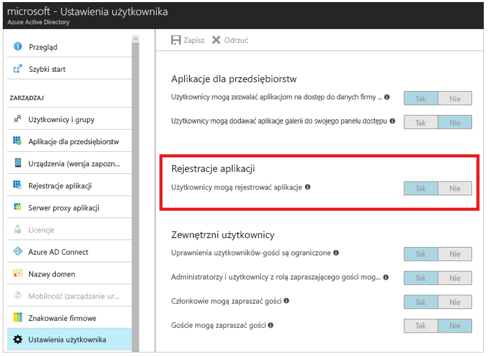
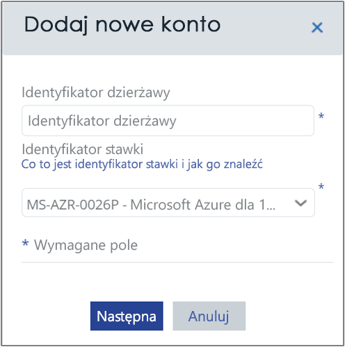
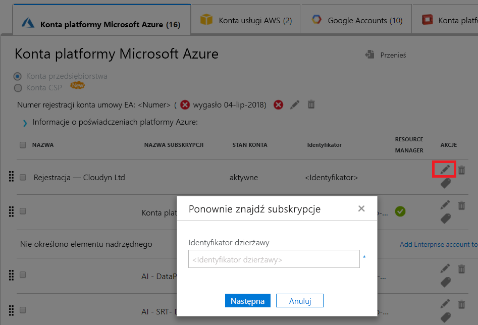

# Aktywowanie subskrypcji i kont platformy Azure za pomocą usługi Azure Cost Management

Dodawanie lub uaktualnianie poświadczeń usługi Azure Resource Manager umożliwia usłudze Azure Cost Management odnajdowanie wszystkich kont i subskrypcji w ramach dzierżawy platformy Azure. Jeśli na swoich maszynach wirtualnych masz również włączone rozszerzenie Diagnostyka Azure, usługa Azure Cost Management może zbierać metryki rozszerzone, takie jak procesor i pamięć. W tym artykule opisano sposób włączania dostępu przy użyciu interfejsów API usługi Azure Resource Manager dla nowych i istniejących kont. Zawiera on również opis rozwiązywania typowych problemów dotyczących kont.

Usługa Azure Cost Management nie może uzyskiwać dostępu do większości danych subskrypcji platformy Azure, gdy subskrypcja jest _nieaktywowana_. Aby usługa Azure Cost Management mogła uzyskiwać dostęp do kont _nieaktywowanych_, należy je edytować.

## Wymagane uprawnienia platformy Azure

Do wykonania procedur opisanych w tym artykule potrzebne są określone uprawnienia. Użytkownik lub administrator dzierżawy musi mieć obydwa poniższe uprawnienia:

- Uprawnienia do rejestrowania aplikacji CloudynCollector w dzierżawie usługi Azure AD.
- Możliwość przypisywania aplikacji do roli w swoich subskrypcjach platformy Azure.

W subskrypcjach platformy Azure konta muszą mieć dostęp `Microsoft.Authorization/*/Write`, aby przypisywanie aplikacji CloudynCollector było możliwe. Ta akcja jest wykonywana za pośrednictwem roli [Właściciel](../role-based-access-control/built-in-roles.md#owner) lub [Administrator dostępu użytkowników](../role-based-access-control/built-in-roles.md#user-access-administrator).

Jeśli konto ma przypisaną rolę **Współautor**, nie masz odpowiednich uprawnień do przypisywania tej aplikacji. W przypadku podjęcia próby przypisania aplikacji CloudynCollector do subskrypcji platformy Azure zostanie wyświetlony komunikat o błędzie.

### Sprawdzanie uprawnień usługi Azure Active Directory

1. Zaloguj się do witryny [Azure Portal](https://portal.azure.com).
2. W witrynie Azure Portal wybierz pozycję **Azure Active Directory**.
3. W usłudze Azure Active Directory wybierz pozycję **Ustawienia użytkownika**.
4. Sprawdź opcję **Rejestracje aplikacji**.
    - W przypadku ustawienia wartości na **Tak** użytkownicy inni niż administratorzy mogą rejestrować aplikacje usługi AD. To ustawienie oznacza, że każdy użytkownik w dzierżawie usługi Azure AD może zarejestrować aplikację. Możesz przejść do obszaru wymaganych uprawnień subskrypcji platformy Azure.  
    
    - W przypadku ustawienia opcji **Rejestracje aplikacji** na **Nie** tylko użytkownicy administracyjni dzierżawy mogą rejestrować aplikacje usługi Azure Active Directory. Administrator dzierżawy musi zarejestrować aplikację CloudynCollector.

## Dodawanie konta lub aktualizowanie subskrypcji

W przypadku dodawania konta lub aktualizowania subskrypcji przyznajesz usłudze Azure Cost Management dostęp do danych platformy Azure.

### Dodawanie nowego konta (subskrypcji)

1. W portalu usługi Azure Cost Management kliknij symbol koła zębatego w prawym górnym rogu, a następnie wybierz pozycję **Konta w chmurze**.
2. Kliknij pozycję **Dodaj nowe konto**. Zostanie wyświetlone okno **Dodawanie nowego konta**. Wprowadź wymagane informacje.  
    

### Aktualizowanie subskrypcji

1. Jeśli chcesz zaktualizować _nieaktywowaną_ subskrypcję, która już istnieje w usłudze Azure Cost Management w rozwiązaniu do zarządzania kontami, kliknij symbol ołówka (edycja) z prawej strony nadrzędnego _identyfikatora GUID dzierżawy_. Subskrypcje są grupowane w ramach dzierżawy nadrzędnej, należy więc unikać ich indywidualnego aktywowania.
    
2. W razie potrzeby wprowadź identyfikator dzierżawy. Jeśli nie znasz identyfikatora dzierżawy, wykonaj następujące czynności, aby go znaleźć:
    1. Zaloguj się do witryny [Azure Portal](https://portal.azure.com).
    2. W witrynie Azure Portal wybierz pozycję **Azure Active Directory**.
    3. Aby uzyskać identyfikator dzierżawy, wybierz pozycję **Właściwości** dla swojej dzierżawy usługi Azure AD.
    4. Skopiuj identyfikator GUID katalogu. Ta wartość jest Twoim identyfikatorem dzierżawy.
    Aby uzyskać więcej informacji, zobacz [Get tenant ID (Pobieranie identyfikatora dzierżawy)](../azure-resource-manager/resource-group-create-service-principal-portal.md#get-tenant-id).
3. W razie potrzeby wybierz identyfikator stawki. Jeśli nie znasz identyfikatora stawki, wykonaj następujące czynności, aby go znaleźć:
    1. W prawym górnym rogu witryny Azure Portal kliknij informacje o użytkowniku, a następnie kliknij pozycję **Wyświetl mój rachunek**.
    2. W obszarze **Konto rozliczeniowe** kliknij pozycję **Subskrypcje**.
    3. W obszarze **Moje subskrypcje** wybierz subskrypcję.
    4. Identyfikator stawki jest wyświetlany w obszarze **identyfikatora oferty**. Skopiuj identyfikator oferty dla subskrypcji.
4. W oknie Dodawanie nowego konta (lub Edytowanie subskrypcji) kliknij pozycję **Zapisz** (lub **Dalej**). Nastąpi przekierowywanie do witryny Azure Portal.
5. Zaloguj się do portalu. Kliknij pozycję **Akceptuj**, aby autoryzować moduł zbierający usługi Azure Cost Management do uzyskiwania dostępu do konta platformy Azure.

    Nastąpi przekierowanie do strony zarządzania kontami usługi Azure Cost Management, a subskrypcja zostanie zaktualizowana przy użyciu stanu konta **Aktywne**. W kolumnie Resource Manager powinien pojawić się symbol zielonego znacznika wyboru.

    Jeśli nie widzisz symbolu zielonego znacznika wyboru dla co najmniej jednej z subskrypcji, oznacza to, że nie masz uprawnień do tworzenia aplikacji czytnika (CloudynCollector) dla subskrypcji. Użytkownik z wyższymi uprawnieniami subskrypcji musi powtórzyć ten proces.

Obejrzyj film [Connecting to Azure Resource Manager with Azure Cost Management (Łączenie z usługą Azure Resource Manager przy użyciu usługi Azure Cost Management)](https://youtu.be/oCIwvfBB6kk), który przeprowadzi Cię przez proces.

>[!VIDEO https://www.youtube.com/embed/oCIwvfBB6kk?ecver=1]

## Rozwiązywanie typowych problemów z pośrednią konfiguracją przedsiębiorstwa

Przy pierwszym użyciu portalu usługi Azure Cost Management możesz zobaczyć poniższe komunikaty, jeśli jesteś użytkownikiem z umową Enterprise Agreement lub dostawcą rozwiązań w chmurze (CSP, Cloud Solution Provider):

- Komunikat *Wybrany klucz interfejsu API nie jest kluczem rejestracji najwyższego poziomu rejestrowania* wyświetlany w kreatorze **Konfigurowanie usługi Azure Cost Management**.
- Komunikat *Bezpośrednia rejestracja — nie* wyświetlany w portalu umowy Enterprise Agreement.
- *Nie znaleziono danych użycia z ostatnich 30 dni. Skontaktuj się z dystrybutorem, aby upewnić się, że dla konta platformy Azure włączono znaczniki* wyświetlany w portalu usługi Azure Cost Management.

Poprzednie komunikaty oznaczają, że umowa Azure Enterprise Agreement została zakupiona od odsprzedawcy lub dostawcy rozwiązań w chmurze. Odsprzedawca lub dostawca rozwiązań w chmurze musi włączyć _znaczniki_ dla konta platformy Azure, aby można było wyświetlać dane w usłudze Azure Cost Management.

Oto sposoby rozwiązywania tych problemów:

1. Odsprzedawca musi włączyć _znaczniki_ dla Twojego konta. Aby uzyskać instrukcje, zapoznaj się z dokumentem [Indirect Customer Onboarding Guide (Przewodnik dołączania klienta pośredniego)](https://ea.azure.com/api/v3Help/v2IndirectCustomerOnboardingGuide).
2. Wygenerujesz klucz umowy Azure Enterprise Agreement do użycia w usłudze Azure Cost Management. Aby uzyskać instrukcje, zobacz [Register an Azure Enterprise Agreement and view cost data (Rejestrowanie umowy Azure Enterprise Agreement i wyświetlanie danych kosztów)](https://docs.microsoft.com/azure/cost-management/quick-register-ea).

Tylko administrator usług platformy Azure może włączyć usługę Cost Management. Uprawnienia współadministratora są niewystarczające.

Przed wygenerowaniem klucza interfejsu API umowy Azure Enterprise Agreement w celu skonfigurowania usługi Azure Cost Management musisz włączyć interfejs API rozliczeń platformy Azure, wykonując następujące instrukcje:

- [Overview of Reporting APIs for Enterprise customers (Omówienie interfejsów API raportowania dla klientów korporacyjnych)](../billing/billing-enterprise-api.md)
- [Interfejs API raportowania w witrynie Microsoft Azure dla przedsiębiorstw](https://ea.azure.com/helpdocs/reportingAPI) w obszarze **Włączanie dostępu danych do interfejsu API**

Być może trzeba będzie również nadać administratorom działów, właścicielom kont i administratorom przedsiębiorstwa uprawnienia do _wyświetlania opłat_ przy użyciu interfejsu API rozliczeń.

## Następne kroki

- Jeśli zadania z pierwszego samouczka dotyczącego usługi Cost Management nie zostały jeszcze wykonane, zapoznaj się z nim w temacie [Review usage and costs (Przeglądanie użycia i kosztów)](tutorial-review-usage.md).
