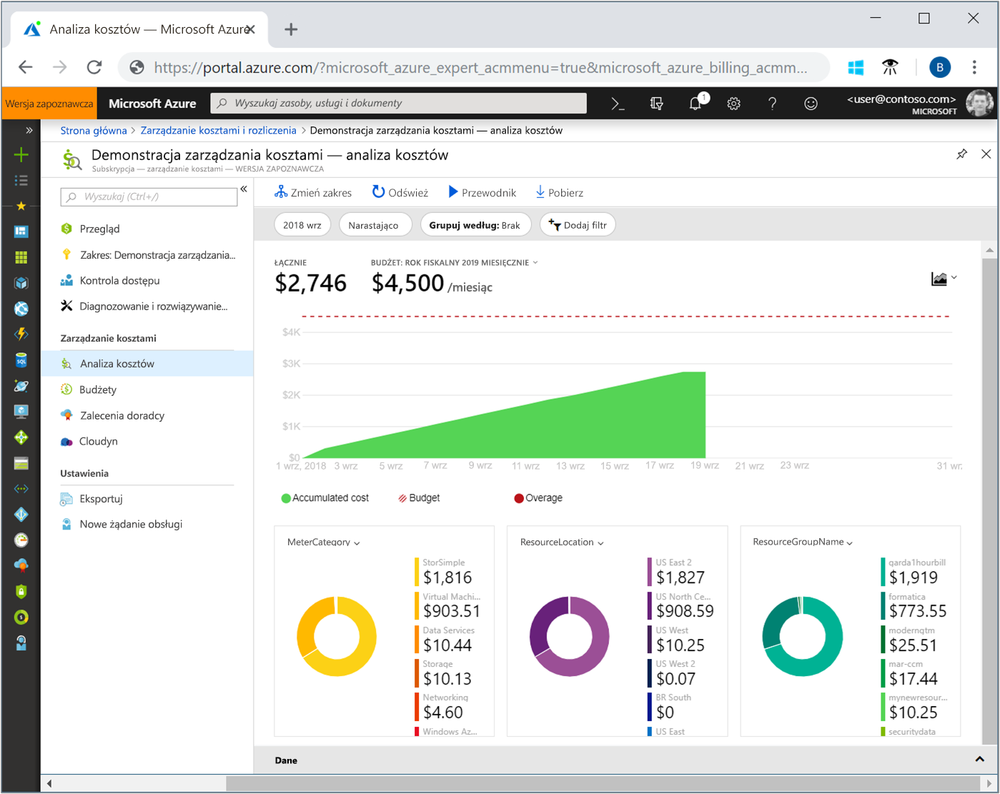
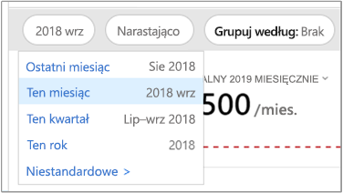
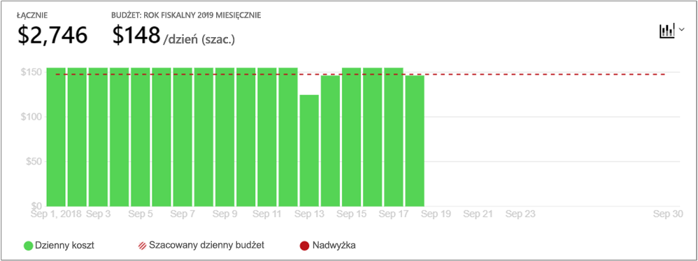
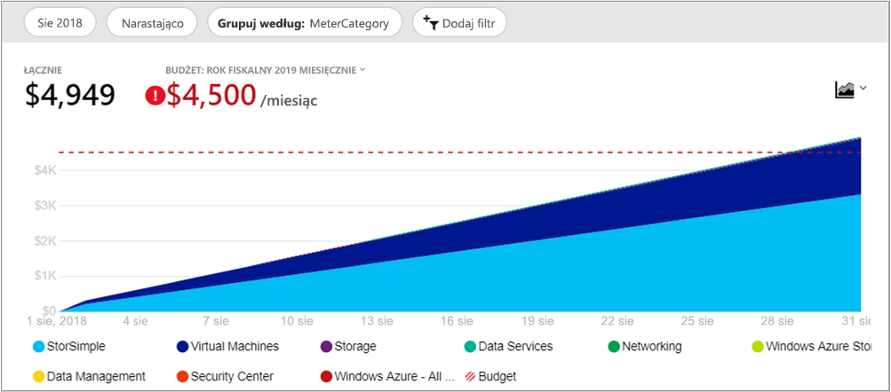
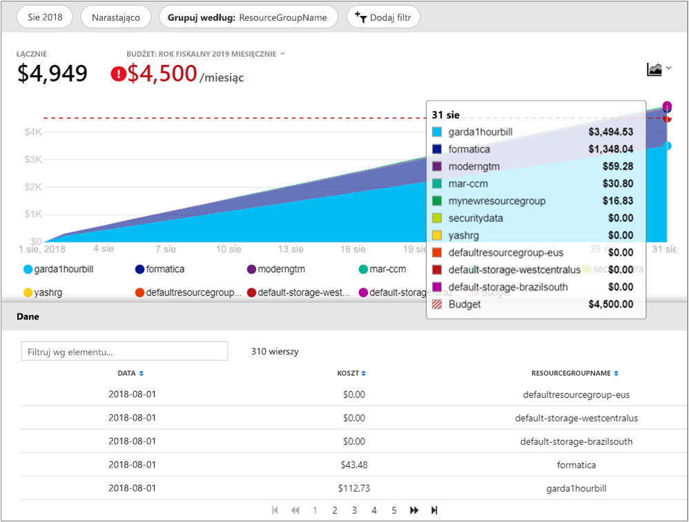
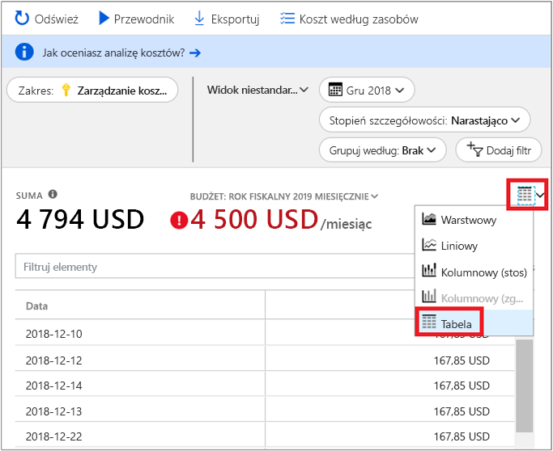

# <a name="quickstart-explore-and-analyze-costs-with-cost-analysis"></a>Szybki start: Eksploruj i Analizuj kosztów za pomocą analizy kosztów

Aby poprawnie kontrolować i optymalizować koszty platformy Azure, trzeba zrozumieć, skąd pochodzą koszty w organizacji. Jest również grupowaniu można sprawdzić, jaka kwota usługi kosztów i w celu, które środowisk i systemów. Widoczność pełnego zakresu kosztów to kluczowy element wymagany do dokładnego zrozumienia wzorca wydatków organizacji. Wzorce wydatków umożliwia wymuszanie mechanizmów kontroli kosztów, takich jak budżet.

Ten przewodnik Szybki start ułatwia eksplorowanie i analizowanie kosztów organizacyjnych przy użyciu funkcji analizy kosztów. Możesz wyświetlić zagregowane koszty według organizacji, aby dowiedzieć się, gdzie występują koszty w miarę upływu czasu, i zidentyfikować trendy wydatków. Zakumulowane koszty w czasie można wyświetlać w celu oszacowania miesięcznych, kwartalnych, a nawet rocznych trendów kosztów w odniesieniu do budżetu. Budżet pomaga działać zgodnie z ograniczeniami finansowymi. Budżet jest również używany do wyświetlania kosztów dziennych lub miesięcznych w celu odizolowania nieprawidłowości wydatków. Ponadto można pobrać dane bieżącego raportu do dalszej analizy lub do użycia w systemie zewnętrznym.

W tym przewodniku Szybki start zawarto informacje na temat wykonywania następujących czynności:

- Przeglądanie kosztów w obrębie analizy kosztów
- Dostosowywanie widoków kosztów
- Pobieranie danych analizy kosztów


## <a name="prerequisites"></a>Wymagania wstępne

Analiza kosztów obsługuje różne rodzaje typów kont platformy Azure. Aby wyświetlić pełną listę obsługiwanych typów kont, zobacz [Omówienie danych usługi Cost Management](understand-cost-mgt-data.md). Aby wyświetlić dane kosztów, potrzebujesz przynajmniej dostępu do odczytu dla Twojego konta platformy Azure.

Dla klientów [Umowy Enterprise (EA)](https://azure.microsoft.com/pricing/enterprise-agreement/) musisz mieć przynajmniej dostęp do odczytu do co najmniej jednego z poniższych zakresów, aby wyświetlić dane kosztów.

- Konto billingowe
- Dział
- Konto rejestracji
- Grupa zarządzania
- Subscription
- Resource group

Aby uzyskać więcej informacji na temat przypisywania dostępu do danych usługi Azure Cost Management, zobacz [przypisywanie dostępu do danych](assign-access-acm-data.md).

## <a name="sign-in-to-azure"></a>Logowanie do platformy Azure

- Zaloguj się do witryny Azure Portal pod adresem https://portal.azure.com.

## <a name="review-costs-in-cost-analysis"></a>Przeglądanie kosztów w obrębie analizy kosztów

Aby przejrzeć koszty analizy kosztów, otwórz zakresu w witrynie Azure portal i wybierz pozycję **analiza kosztów** w menu. Na przykład, przejdź do **subskrypcje**, wybierz subskrypcję z listy, a następnie wybierz **analiza kosztów** w menu. Użyj **zakres** skażone, aby przełączyć się do innego zasięgu analizy kosztów. Aby uzyskać więcej informacji na temat zakresów, zobacz [poznawanie i Praca z zakresami](understand-work-scopes.md).

Zakres, który wybierzesz służy w całym Cost Management do zapewnienia danych konsolidacji i kontroli dostępu do informacji o kosztach. Gdy używasz zakresów, nie wybierasz równocześnie wielu z nich. Zamiast tego wybierz większym zakresie inne osoby do wdrożenia, a następnie odfiltrowania zagnieżdżonych zakresów, które są potrzebne. To podejście jest ważne dowiedzieć się, ponieważ niektórzy użytkownicy nie mogą mieć dostęp do zakresem nadrzędnym jednej, która obejmuje wiele zagnieżdżonych zakresów.

Początkowy koszt analitycznym obejmuje następujące obszary.

**Zgromadzonych widok kosztów**: Reprezentuje konfigurację widoku analizy kosztów wstępnie zdefiniowane. Każdy widok zawiera zakres dat, poziom szczegółowości, Grupuj według, a ustawienia filtru. Widok domyślny pokazuje łączne koszty w bieżącym okresie rozliczeniowym, ale można zmienić z innymi widokami wbudowanych. Aby uzyskać więcej informacji, zobacz [Dostosuj widoki kosztów](#customize-cost-views).

**Rzeczywisty koszt**: Przedstawia całkowity koszt użytkowania i możliwości zakupu dla bieżącego miesiąca, jak są naliczane i wyświetli się na rachunku.

**Prognozowanie**: Przedstawia całkowity przewidywane koszty dla przedziału czasu, którą wybierzesz. (Prognoza jest dostępna w wersji zapoznawczej).

**Budżet**: Przedstawia planowane limit wydatków dla wybranego zakresu, jeśli jest dostępny.

**Skumulowana stopień szczegółowości**: Przedstawia łączny dzienny koszty całkowite, od początku okresu rozliczeniowego. Po [utworzeniu budżetu](tutorial-acm-create-budgets.md) subskrypcji lub konta billingowego możesz szybko wyświetlić trend wydatków w odniesieniu do budżetu. Umieść kursor nad datą, aby wyświetlić skumulowany koszt w tym dniu.

**Przestawianie (pierścieniowe)** : Zapewniają dynamiczne tabele przestawne potężne łączny koszt przez typowe zestaw właściwości standardowych. Pokazują największej do najmniejszej kosztów dla bieżącego miesiąca. Wykresy przestawne można zmieniać w dowolnym momencie, wybierając inny element przestawny. Koszty są pogrupowane według usługi (kategoria licznika), lokalizacji (regionu) i podrzędny zakres domyślnie. Na przykład konta rejestracji są objęte rozliczeniami kont, grup zasobów znajdują się w subskrypcji, a zasoby znajdują się w grupach zasobów.



## <a name="customize-cost-views"></a>Dostosowywanie widoków kosztów

Analiza kosztów zawiera cztery widoki wbudowanych, zoptymalizowane pod kątem najbardziej typowe cele:

Widok | Odpowiedz na pytania, takie jak
--- | ---
Skumulowany koszt | Ile poświęciłem do tej pory w tym miesiącu Czy wydatki zmieściły się w budżecie?
Dzienny koszt | Zostały wszystkie wzrost kosztów dziennie w ciągu ostatnich 30 dni?
Koszt według usługi | Jak czy Moje miesięczne użycie, różnią się w ciągu ostatnich trzech faktur.
Koszt według zasobu | Jakie zasoby koszt maksymalnie do tej pory w tym miesiącu?


W większości przypadków będziesz jednak potrzebować dokładniejszej analizy. Dostosowywanie rozpoczyna się od wybrania daty w górnej części strony.

Analiza kosztów domyślnie przedstawia dane z bieżącego miesiąca. Aby szybko przełączyć się do wspólnego zakresów dat, należy użyć selektora daty. Przykłady obejmują ostatnich siedmiu dni, w ciągu ostatniego miesiąca, w bieżącym roku lub niestandardowy zakres dat. Płatność za rzeczywiste użycie subskrypcje obejmują także zakresów dat na podstawie w trakcie okresu rozliczeniowego, który nie jest powiązany z miesiącem kalendarzowym, takich jak bieżącego okresu rozliczeniowego lub ostatniej faktury. Użyj **< Wstecz** i **Dalej >** łącza w górnej części menu aby przejść do poprzedniego lub następnego okresu, odpowiednio. Na przykład **< Wstecz** będzie się zmieniać z **ciągu ostatnich 7 dni** do **8 – 14 dni temu** lub **15-21 dni temu**.



Analiza kosztów domyślnie przedstawia **skumulowane** koszty. Łączne koszty obejmują wszystkie koszty dla każdego dnia, a także poprzednich dniach rosnącego widoku dziennych kosztów agregacji. Ten widok jest optymalizowany w celu pokazania trendów względem budżetu dla wybranego zakresu czasu.

Widok wykresu prognozy umożliwia zidentyfikowanie potencjalnych naruszeń budżetu. W przypadku potencjalnych zagrożeniach budżetu przekraczania przewidywany jest wyświetlane na czerwono. Symbol wskaźnika jest również wyświetlany na wykresie. Kursor symbol pokazuje szacowane daty naruszenia budżetu.


Istnieje również widok **dzienny** przedstawiający koszty danego dnia. Widok dzienny nie zawiera trendu wzrostu. Widok został zaprojektowany z myślą o wyświetlaniu nieprawidłowości, gdy koszt gwałtownie wzrasta lub spada z dnia na dzień. Jeśli wybrano budżetu codzienne widoku wyświetlane są również szacunkową liczbę budżetu dzienny.

W przypadku dziennych kosztów stale powyżej szacowany dzienny budżet, mogą oczekiwać, że będziesz przekroczenie miesięcznych budżetu. Szacowany dzienny budżet jest sposób ułatwiają wizualizowanie swój budżet na niższym poziomie. W przypadku wahań kosztów dziennych porównanie szacowanego budżetu dziennego z budżetem miesięcznym jest mniej dokładne.

Oto codzienne widok ostatnie wydatków za pomocą wydatków prognozy włączona.


Podczas wyłączania wydatków prognozy, widzisz przewidywanych wydatków na przyszłe daty. Ponadto Kiedy wyświetlasz kosztów dla ostatnich okresów prognozę kosztów nie pokazuje kosztów.

Ogólnie rzecz biorąc może pojawić się dane lub powiadomienia o wykorzystanych zasobów w ramach 8 do 12 godzin.


**Grupuj według** wspólne właściwości do podziału kosztów i identyfikowania najlepszych współautorów. Aby zgrupować według tagów zasobów, na przykład wybierz klucz tagu, które mają zostać zgrupowane według. Koszty są podzielone według każdej wartości tagu z segmentem dodatkowych zasobów, które nie mają ten tag zastosowany.

Większość [zasobów platformy Azure obsługują znakowanie](../azure-resource-manager/tag-support.md). Jednak niektóre tagi nie są dostępne w przystawce Zarządzanie kosztami i rozliczeń. Ponadto nie są obsługiwane tagi grup zasobów. Rozwiązanie Cost Management obsługuje tylko tagi zasobów od daty bezpośredniego zastosowania tagów do zasobu. Obejrzyj [jak przeglądać zasad tagów w usłudze Azure Cost Management](https://www.youtube.com/watch?v=nHQYcYGKuyw) wideo, aby dowiedzieć się więcej o korzystaniu z zasad platformy Azure tag do poprawy widoczności danych kosztów.

Oto widok kosztów usługi platformy Azure dla bieżącego miesiąca.



Domyślnie analiza kosztów zawiera wszystkie koszty użycia i możliwości zakupu, jak długo będą naliczane i zostaną wyświetlone na fakturze, znany także jako **rzeczywisty koszt**. Wyświetlanie koszt rzeczywisty jest idealny dla uzgadnianie fakturze. Jednak zakup skoków koszt może być monitów, gdy jest zachowywana oka dla wydatków anomalie i inne zmiany w kosztu. Spłaszczanie się skokom powodowanym przez koszty zakupu rezerwacji, przełącz się do **amortyzowanego kosztu**. 


Amortyzowany koszt wyeliminowane zakupu rezerwacji na codzienne fragmenty i się je w czasie trwania okresu rezerwacji. Na przykład zamiast zobaczyć 365 $ kupić 1 stycznia, zobaczysz $1 z dokonywać zakupów każdego dnia 1 stycznia do 31 grudnia. Oprócz podstawowych amortyzacji te koszty są również ponownie przydzielane i skojarzyć za pomocą określonych zasobów, które używane zastrzeżenia. Na przykład w przypadku tego $ codzienne opłata w wysokości 1 została podzielona między dwiema maszynami wirtualnymi, widział dwa opłaty 0,50 USD w ciągu dnia. W przypadku część rezerwacji nie jest wykorzystywana w przypadku dnia, widział jeden 0,50 USD, opłata w wysokości skojarzonego z maszyną wirtualną w odpowiednich i innym 0,50 USD, opłaty za pomocą typu opłaty `UnusedReservation`. Należy pamiętać, że koszty nieużywanych rezerwacji są widoczne tylko podczas wyświetlania amortyzowanego kosztu.

Z powodu zmiany, w jaki sposób kosztów są reprezentowane jest należy pamiętać, że rzeczywisty koszt i widoki zamortyzowany koszt opisano różne liczby całkowitej. Ogólnie rzecz biorąc łączny koszt w miesiącach z zakupu rezerwacji zostaną obniżone podczas wyświetlania zamortyzowany koszt i zwiększy miesięcy zakupu rezerwacji. Amortyzacja jest dostępna tylko w przypadku zakupu rezerwacji i nie ma zastosowania do zakupów w portalu Azure Marketplace w tej chwili.

Na poniższej ilustracji przedstawiono zasobu nazwy grup. Można grupować według tagów przeglądać całkowitych kosztów według tagów lub używać **koszty według zasobu** widok, aby wyświetlić wszystkie tagi dla określonego zasobu.



Koszty są grupowane według konkretnego atrybutu, najlepszych współautorów 10 kosztów są wyświetlane od najwyższego do najniższego. W przypadku więcej niż 10 pierwszych dziewięciu podziału kosztów są wyświetlane w **innych** grupy. Ta grupa obejmuje wszystkich pozostałych grup jednocześnie. Gdy są grupowane według tagów, **Untagged** grupa pojawia się koszty, które nie mają klucza tag zastosowany. **Nieoznakowany** jest zawsze ostatnio, nawet jeśli nieotagowanych kosztów są wyższe niż koszty oznakowane. Nieotagowanych kosztów będzie częścią **innych**, jeśli istnieje co najmniej 10 wartości tagów.

Klasycznych maszyn wirtualnych, sieci i zasobów magazynu nie udostępniaj szczegółowe dane rozliczeń. Są one scalane jako **Usługi klasyczne** podczas grupowania kosztów.

Wykresów przestawnych w obszarze wykresu głównego show różnych grupowania, które podają szerszy obraz koszty ogólne dla wybranego przedziału czasu i filtrów. Wybierz właściwość lub tag, aby wyświetlić zagregowane koszty według dowolnego wymiaru.


Możesz wyświetlić pełny zestaw danych dla każdego widoku. Niezależnie od opcji lub filtrów, które można zastosować wpływa na dane prezentowane. Aby wyświetlić pełny zestaw danych, wybierz **typ wykresu** listy, a następnie wybierz pozycję **tabeli** widoku.




## <a name="understanding-grouping-and-filtering-options"></a>Grupowanie zrozumienie i opcje filtrowania

Poniższa lista zawiera niektóre z najbardziej typowych grupowanie i filtrowanie opcji i kiedy należy ich używać.

| Właściwość | Kiedy stosować |
| --- | --- |
| **Okres rozliczeniowy** | Podział kosztów według miesiąca faktury. Ta opcja jest ważne w przypadku subskrypcji płatności i tworzenia/testowania, które nie są związane z miesięcy kalendarza. Konta EA/MCA służy miesięcy kalendarzowych selektora daty lub miesięczny poziom szczegółowości do osiągnięcia tego samego celu. |
| **Typ opłaty** | Podział użycia, zakupu, zwrotów i koszty nieużywanych rezerwacji. Zakup rezerwacji i zwrot kosztów są dostępne tylko wtedy, gdy za pomocą akcji kosztów, a nie przy wykorzystaniu zamortyzowany koszt. Koszty nieużywanych rezerwacji są dostępne tylko wtedy, gdy patrząc zamortyzowany koszt. |
| **Chmura** | Rozbicie kosztów według platformy AWS i Azure. Koszty usług AWS są dostępne tylko z grupy zarządzania, konta zewnętrzne, do rozliczeń i subskrypcji zewnętrznych. |
| **Dział** / **faktury sekcji** | Podział kosztów działu EA lub MCA faktury sekcji. Ta opcja jest dostępna tylko w przypadku konta rozliczeniowego EA/MCA i MCA rozliczeń profilów. |
| **Konta rejestracji** | Rozbicie kosztów według właściciela konta EA. Ta opcja jest dostępna tylko w przypadku konta rozliczeniowego EA i działów. |
| **Częstotliwość** | Podział kosztów na podstawie użycia, jednorazowe i cyklicznych. |
| **Miernik** | Podział kosztów według licznika użycia platformy Azure. Ta opcja jest dostępna tylko w przypadku użycia platformy Azure. Wszystkie zakupy i użycia witryny Marketplace, które będą widoczne jako **nieokreślonych** lub **nieprzypisane**. |
| **Typ wydawcy** | Podział kosztów usług AWS, Azure i Portal Marketplace. |
| **Rezerwacji** | Podział kosztów według rezerwacji. Każde użycie, który nie zawiera zastrzeżenie będzie wyświetlany jako **nieokreślonych**. |
| **Zasób** | Podział kosztów przez zasób. Wszystkie zakupy będą widoczne jako **nieokreślonych**, ponieważ są one stosowane na konto rozliczeniowe EA/PAYG lub MCA rozliczeń poziomie profilu.  |
| **Grupa zasobów** | Rozbicie kosztów według grupy zasobów. Ta opcja jest dostępna tylko w przypadku użycia-classic. Użycie zasobów klasycznych będzie wyświetlany jako **innych**, i zakupy będą widoczne jako **nieokreślonych**. |
| **Typ zasobu** | Rozbicie kosztów według typów zasobów. Ta opcja jest dostępna tylko w przypadku użycia-classic. Użycie zasobów klasycznych będzie wyświetlany jako **innych**, i zakupy będą widoczne jako **nieokreślonych**. |
| **Nazwa usługi** lub **kategoria licznika** | Rozbicie kosztów według usługi platformy Azure. Ta opcja jest dostępna tylko w przypadku użycia platformy Azure. Wszystkie zakupy i użycia witryny Marketplace, które będą widoczne jako **nieokreślonych** lub **nieprzypisane**. |
| **Warstwy usług** lub **Podkategoria miernika** | Podział kosztów według podrzędna Licznik użycia platformy Azure. Ta opcja jest dostępna tylko w przypadku użycia platformy Azure. Wszystkie zakupy i użycia witryny Marketplace, które będą widoczne jako **nieokreślonych** lub **nieprzypisane**. |
| **Subskrypcja** | Podział kosztów według subskrypcji. Wszystkie zakupy dokonywane jest wyświetlany jako **nieokreślonych**. |
| **Tag** | Podział kosztów według wartości tagów dla klucza określony tag. |

Aby uzyskać więcej informacji o warunkach, zobacz [Zrozumienie pojęć używanych w plików platformy Azure, użycia i opłat](../billing/billing-understand-your-usage.md).


## <a name="saving-and-sharing-customized-views"></a>Zapisywanie i udostępnianie widoków niestandardowych

Zapisywanie i udostępnianie niestandardowych widoków z innymi osobami, przypinając analiza kosztów na pulpicie nawigacyjnym witryny Azure portal lub kopiując łącze do analizy kosztów. 

Aby przypiąć analiza kosztów, wybierz ikonę pinezki w prawym górnym rogu. Przypinanie analiza kosztów zapisze tylko główne widoku Wykres lub tabelę. Udostępnianie pulpitu nawigacyjnego w celu Zezwól na dostęp do kafelka. Pamiętaj, że to udostępnia tylko konfigurację pulpitu nawigacyjnego nie są przyznawane osobom dostęp do danych bazowych. Jeśli nie masz dostępu do kosztów, ale mają dostęp do udostępnionego pulpitu nawigacyjnego, zobaczysz komunikat "odmowa dostępu".

Aby udostępnić łącze do analiza kosztów, wybierz **udostępnianie** w górnej części bloku. Niestandardowy adres URL będzie wyświetlana, która otwiera ten widok określonego dla tego określonego zakresu. Jeśli nie masz koszty dostępu i uzyskać ten adres URL, zostanie wyświetlony komunikat "odmowa dostępu". 

Aby dowiedzieć się więcej na temat udzielania dostępu do kosztów dla każdej z obsługiwanych zakresów, zapoznaj się z [poznawanie i Praca z zakresami](understand-work-scopes.md).

## <a name="automation-and-offline-analysis"></a>Automatyzacja i przeprowadzenia analizy offline

Istnieją terminy, gdy potrzebujesz podczas pobierania danych w celu dalszej analizy scalić je z użyciem własnych danych lub zintegrować ją z Twoimi własnymi systemami. Usługa Cost Management oferuje kilka różnych opcji. Jako punktu wyjścia Jeśli potrzebujesz ad-hoc podsumowanie wysokiego poziomu, takie jak pobieranie w ramach analizy kosztów tworzenia widoku, których potrzebujesz. Pobierz go, wybierając **wyeksportować** i wybierając polecenie **pobierania danych do formatu CSV** lub **pobierania danych do programu Excel**. Pobieranie programu Excel zawiera dodatkowy kontekst, w widoku, który umożliwia generowanie pobierania, takich jak zakres, zapytań konfiguracji total, oraz datę wygenerowany.

Jeśli potrzebujesz pełnego, unaggregated zestawu danych, pobierz ją z konta rozliczeniowego. Następnie z listy usług w okienku nawigacji po lewej stronie w witrynie portal, przejdź do **Zarządzanie kosztami i rozliczenia**. Wybierz konta rozliczeniowego, jeśli ma to zastosowanie. Przejdź do **użycie i opłaty za**, a następnie wybierz pozycję **Pobierz** ikonę dla żądanego okresu rozliczeniowego.

Przyjmij podejście podobne do zautomatyzowania odbierania danych kosztów. Użyj [interfejsu API zapytań](/rest/api/cost-management/query) bardziej rozbudowane analizy za pomocą filtrowania dynamicznego, grupowania i agregacji lub użyj [UsageDetails API](/rest/api/consumption/usageDetails) pełnych unaggregated zestawu danych. Te interfejsy API w wersji ogólnodostępnej (GA) jest 2019-01-01. Użyj **2019-04-01-preview** do uzyskania dostępu do rezerwacji i zakupów w portalu Marketplace w ramach tych interfejsów API w wersji zapoznawczej. 

Na przykład poniżej przedstawiono zagregowany widok zamortyzowany koszt podzielone według opłaty typu (użycia, zakupów lub refundacji) typu wydawcy (Azure lub portalu Marketplace), grupy zasobów (pusty w przypadku zakupów) i rezerwację (pusty, jeśli nie ma to zastosowanie).

```
POST https://management.azure.com/{scope}/providers/Microsoft.CostManagement/query?api-version=2019-04-01-preview
Content-Type: application/json
 
{
  "type": "AmortizedCost",
  "timeframe": "Custom",
  "timePeriod": { "from": "2019-04-01", "to": "2019-04-30" },
  "dataset": {
    "granularity": "None",
    "aggregation": {
      "totalCost": { "name": "PreTaxCost", "function": "Sum" }
    },
    "grouping": [
      { "type": "dimension", "name": "ChargeType" },
      { "type": "dimension", "name": "PublisherType" },
      { "type": "dimension", "name": "Frequency" },
      { "type": "dimension", "name": "ResourceGroup" },
      { "type": "dimension", "name": "SubscriptionName" },
      { "type": "dimension", "name": "SubscriptionId" },
      { "type": "dimension", "name": "ReservationName" },
      { "type": "dimension", "name": "ReservationId" },
    ]
  },
}
```

A jeśli nie potrzebujesz agregacji i wolisz surowy, pełny zestaw danych:

```
GET https://management.azure.com/{scope}/providers/Microsoft.Consumption/usageDetails?metric=AmortizedCost&$filter=properties/usageStart+ge+'2019-04-01'+AND+properties/usageEnd+le+'2019-04-30'&api-version=2019-04-01-preview
```

Jeśli potrzebujesz faktyczne koszty, aby wyświetlić zakupów, ponieważ są one naliczane, zmień **typu**/**metryki** do **ActualCost**. Aby uzyskać więcej informacji na temat tych interfejsów API, zobacz [zapytania](/rest/api/cost-management/query) i [UsageDetails](/rest/api/consumption/usageDetails) dokumentacji interfejsu API. Należy zauważyć, że dokumentacja opublikowanej wersji Ogólnodostępnej. Jednak obie działają takie same dla *2019-04-01-preview* wersji interfejsu API poza nowy atrybut typu/metryki i nazwy właściwości zmienione. (Więcej informacji o poniżej nazwy właściwości.)
 
Koszt pracy interfejsów API zarządzania we wszystkich zakresów powyżej zasobów: Grupa zasobów, subskrypcji i grupie zarządzania za pośrednictwem Azure RBAC dostępu, EA konta rozliczeniowego (rejestracji), działów i kont rejestracji za pośrednictwem dostępu do portalu EA. Dowiedz się więcej o zakresach, jak określić swój identyfikator zakresu lub zarządzania dostępem, w tym [poznawanie i Praca z zakresami](understand-work-scopes.md).

## <a name="next-steps"></a>Następne kroki

Przejdź do pierwszego samouczka, aby dowiedzieć się, jak tworzyć budżety i nimi zarządzać.

> [!div class="nextstepaction"]
> [Tworzenie budżetów i zarządzanie nimi](tutorial-acm-create-budgets.md)
