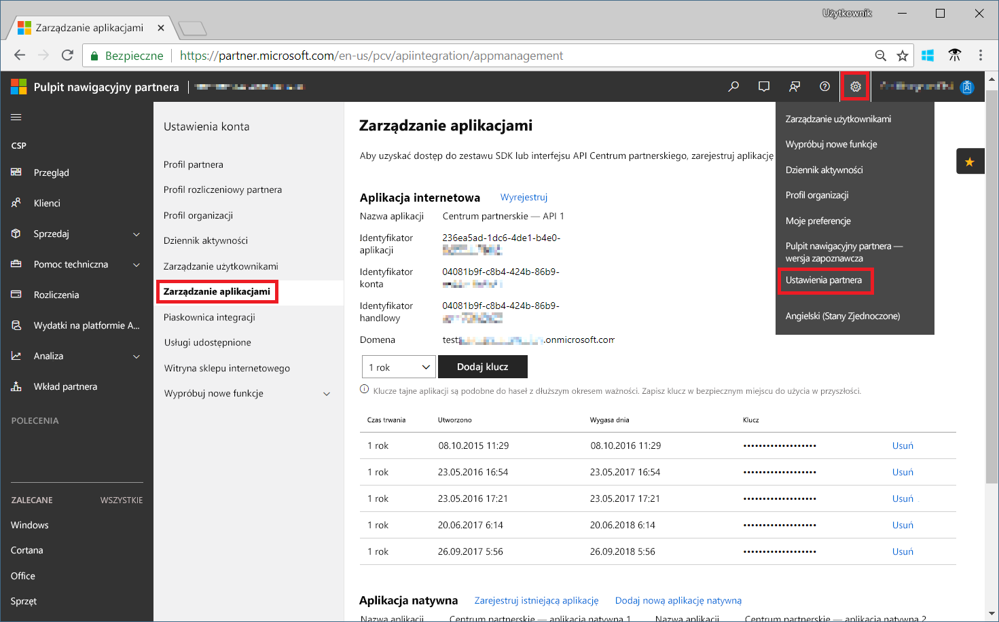

# Rejestrowanie w programie partnerskim programu CSP i wyświetlanie danych kosztów

Jako partner programu CSP możesz zarejestrować się w rozwiązaniu Cloudyn. Rejestracja zapewnia dostęp do portalu firmy Cloudyn. W tym przewodniku Szybki start opisano szczegółowo proces rejestracji niezbędny do utworzenia subskrypcji wersji próbnej rozwiązania Cloudyn i zalogowania w portalu Cloudyn. Przedstawiono w nim także, jak od razu rozpocząć wyświetlanie danych kosztów.

> [!NOTE]
>
> Rejestracji w rozwiązaniu Cloudyn mogą dokonać tylko partnerzy programu CSP Direct i dostawcy programu CSP Indirect.
>
> W przypadku uwierzytelniania i dostępu do danych wymagana jest konfiguracja interfejsu API Centrum partnerskiego. Do aprowizowania dostępu przez interfejs API potrzebne jest konto administratora globalnego Centrum partnerskiego.
> Aby uzyskać więcej informacji, zobacz [Nawiązywanie połączenia z interfejsem API Centrum partnerskiego](https://msdn.microsoft.com/library/partnercenter/mt709136.aspx).
>
> Dostęp do rozwiązania Cloudyn można zapewnić odsprzedawcom programu CSP Indirect po ich zarejestrowaniu w rozwiązaniu Cloudyn przez dostawcę programu CSP Indirect. Odsprzedawcy programu CSP Indirect mogą wtedy zapewniać dostęp do rozwiązania Cloudyn posiadaczom subskrypcji oraz klientom platformy Azure.
>
>Chmura jest skargą modelu bezpiecznego aplikacji firmy Microsoft. Aby uzyskać więcej informacji, zobacz [Włączanie struktury bezpiecznego modelu aplikacji](/partner-center/develop/enable-secure-app-model).

## Logowanie do platformy Azure

- Zaloguj się do witryny Azure Portal pod adresem https://portal.azure.com.

## Rejestrowanie w rozwiązaniu Cloudyn

1. W witrynie Azure Portal kliknij pozycję **Zarządzanie kosztami i rozliczenia** na liście usług.
2. W obszarze **Przegląd** kliknij pozycję **Cloudyn**.  
    
3. Na stronie **Cloudyn** kliknij pozycję **Przejdź do rozwiązania Cloudyn**, aby otworzyć stronę rejestracji rozwiązania Cloudyn w nowym oknie.
4. Na stronie rejestracji wersji próbnej rozwiązania Cloudyn wpisz nazwę swojej firmy, wybierz pozycję **Microsoft CSP Partner Program Administrator** (Administrator programu partnerskiego programu Microsoft CSP), a następnie kliknij przycisk **Next** (Dalej).  
5. Wypełnij pola **Application ID** (Identyfikator aplikacji), **Commerce ID** (Identyfikator handlowy) i **Application Secret key**(Klucz tajny aplikacji), a następnie wybierz pozycję **Default Pricing Plan** (Domyślny plan cenowy). Jeśli w tej chwili nie masz tych informacji, zaloguj się do portalu Centrum partnerskiego na stronie [https://partnercenter.microsoft.com](https://partnercenter.microsoft.com) za pomocą głównego konta administratora i wykonaj następujące czynności:
   1. Przejdź do obszaru **Pulpit nawigacyjny**, kliknij symbol **Ustawienia**, kliknij pozycję **Ustawienia partnera**, a następnie kliknij pozycję **Zarządzanie aplikacjami**.
   2. Jeśli poprzednio utworzono aplikację internetową, pomiń ten krok. W przeciwnym razie kliknij pozycję **Dodaj nową aplikację internetową** w sekcji **Aplikacja internetowa**.
   3. Skopiuj identyfikator GUID **Identyfikator aplikacji** aplikacji internetowej.
   4. Skopiuj identyfikator GUID **Identyfikator handlowy** aplikacji internetowej.
   5. Wybierz 1-roczny lub 2-letni okres ważności klucza, zgodnie z potrzebami. Wybierz pozycję **Dodaj klucz**, następnie skopiuj i zapisz wartość klucza tajnego.  
    
   6. Wróć do strony rejestracji rozwiązania Cloudyn i wklej skopiowane informacje.  
      
6. Zaakceptuj warunki użytkowania i zweryfikuj swoje informacje. Kliknij przycisk **Next** (Dalej), aby autoryzować rozwiązanie Cloudyn do zbierania danych zasobów platformy Azure. Te dane obejmują dane dotyczące użycia, wydajności, rozliczeń i tagów z Twoich subskrypcji.  
7. W obszarze **Invite other stakeholders** (Zaproś innych uczestników projektu) możesz dodać użytkowników, wpisując ich adresy e-mail. Po zakończeniu kliknij przycisk **Next** (Dalej). Dodanie wszystkich danych dotyczących rozliczeń do rozwiązania Cloudyn potrwa około 2 godzin.
8. Kliknij pozycję **Go to Cloudyn** (Przejdź do rozwiązania Cloudyn), aby otworzyć portal Cloudyn, a następnie na stronie **Cloud Accounts Management** (Zarządzanie kontami w chmurze) powinny zostać wyświetlone dane Twojego zarejestrowanego konta programu CSP.

## Konfigurowanie dostępu do pośredniego programu CSP w rozwiązaniu Cloudyn

Domyślnie interfejs API Centrum partnerskiego jest dostępny tylko dla bezpośrednich programów CSP. Jednak dostawca bezpośredniego programu CSP może skonfigurować dostęp dla swoich klientów lub partnerów pośredniego programu CSP, używając grup jednostek w rozwiązaniu Cloudyn.

Aby umożliwić dostęp pośrednim klientom lub partnerom programu CSP, wykonaj kroki opisane w temacie [Rejestrowanie w usłudze Cloudyn](#register-with-cloudyn) , aby skonfigurować rejestrację próbną. Następnie wykonaj następujące czynności, aby posegmentować dane pośredniego programu CSP przy użyciu grup jednostek rozwiązania Cloudyn. Przypisz odpowiednie uprawnienia użytkowników do grup jednostek.

1. Utwórz grupę jednostek, korzystając z informacji zawartych w sekcji [Tworzenie jednostek](tutorial-user-access.md#create-and-manage-entities).
2. Wykonaj czynności opisane w artykule [Przypisywanie subskrypcji do jednostek kosztów](https://www.youtube.com/watch?v=d9uTWSdoQYo). Skojarz konto klienta pośredniego programu CSP i jego subskrypcje z uprzednio utworzoną jednostką.
3. Wykonaj czynności opisane w sekcji [Tworzenie użytkownika z dostępem administratora](tutorial-user-access.md#create-a-user-with-admin-access), aby utworzyć konto użytkownika z dostępem administratora. Następnie upewnij się, że konto użytkownika ma dostęp administratora do określonych jednostek, które utworzono wcześniej dla konta pośredniego.

Partnerzy pośredniego programu CSP mogą logować się do portalu Cloudyn przy użyciu utworzonych dla nich kont.

[!INCLUDE [cost-management-create-account-view-data](../../includes/cost-management-create-account-view-data.md)]

## Następne kroki

W tym przewodniku Szybki start opisano rejestrację w rozwiązaniu Cloudyn przy użyciu informacji programu CSP. Przedstawiono także logowanie się do portalu Cloudyn i rozpoczęcie wyświetlania danych kosztów. Aby dowiedzieć się więcej na temat rozwiązania Cloudyn, przejdź do samouczka dotyczącego rozwiązania Cloudyn.

> [!div class="nextstepaction"]
> [Przeglądanie użycia i kosztów](./tutorial-review-usage.md)
