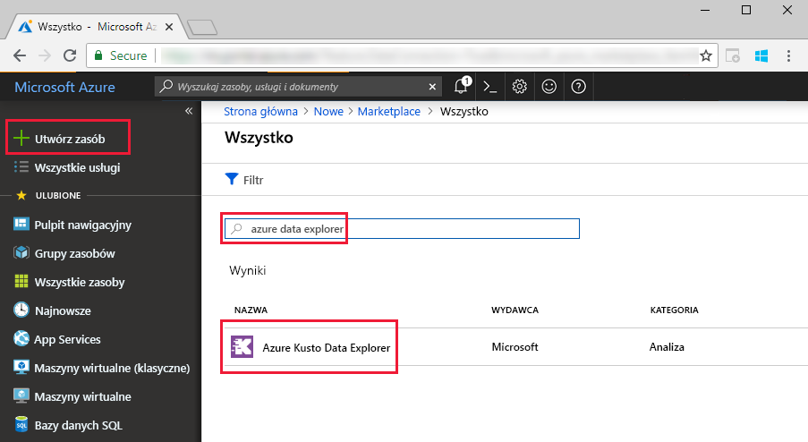
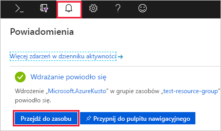
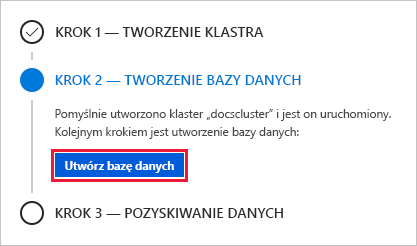
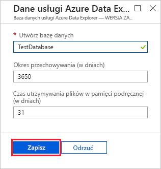
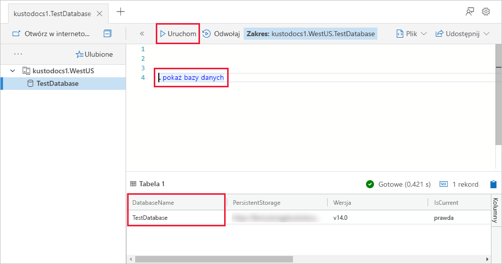

# Szybki start: Tworzenie klastra i bazy danych usługi Azure Data Explorer

> [!div class="op_single_selector"]
> * [Portal](create-cluster-database-portal.md)
> * [Interfejs wiersza polecenia](create-cluster-database-cli.md)
> * [PowerShell](create-cluster-database-powershell.md)
> * [C#](create-cluster-database-csharp.md)
> * [Python](create-cluster-database-python.md)
> * [Szablon usługi ARM](create-cluster-database-resource-manager.md)

Azure Data Explorer to szybka i wysoce skalowalna usługa eksploracji danych na potrzeby danych dziennika i telemetrycznych. Aby używać usługi Azure Data Explorer, najpierw utwórz klaster, a następnie utwórz w tym klastrze co najmniej jedną bazę danych. Następnie pozyskaj (załaduj) dane do bazy danych, aby uruchamiać w niej zapytania. W tym przewodniku Szybki start utworzysz klaster i bazę danych.

Jeśli nie masz subskrypcji platformy Azure, przed rozpoczęciem utwórz [bezpłatne konto platformy Azure](https://azure.microsoft.com/free/).

## Logowanie się do witryny Azure Portal

Zaloguj się w witrynie [Azure Portal](https://portal.azure.com/).

## Tworzenie klastra

W grupie zasobów platformy Azure utwórz klaster usługi Azure Data Explorer, korzystając ze zdefiniowanego zestawu zasobów obliczeniowych i magazynowych.

1. Wybierz przycisk **Utwórz zasób** (+) w lewym górnym rogu portalu.

1. Wyszukaj pozycję *Azure Data Explorer*.

   

1. W obszarze **Azure Data Explorer** w dolnej części ekranu wybierz pozycję **Utwórz**.

1. Wypełnij podstawowe szczegóły klastra, korzystając z poniższych informacji.

   

    **Ustawienie** | **Sugerowana wartość** | **Opis pola**
    |---|---|---|
    | Subscription | Twoja subskrypcja | Wybierz subskrypcję platformy Azure, która ma być używana dla klastra.|
    | Resource group | Twoja grupa zasobów | Użyj istniejącej grupy zasobów lub utwórz nową. |
    | Nazwa klastra | Unikatowa nazwa klastra | Wybierz unikatową nazwę, która identyfikuje Twój klaster. Do podanej nazwy klastra jest dołączana nazwa domeny *[region].kusto.windows.net*. Nazwa może zawierać tylko małe litery i cyfry. Musi zawierać od 4 do 22 znaków.
    | Region | *Zachodnie stany USA* lub *zachodnie stany USA 2* | Wybierz pozycję *zachodnie stany USA* lub *zachodnie stany USA 2* (Jeśli używane są strefy dostępności) dla tego przewodnika Szybki Start. W przypadku systemu produkcyjnego wybierz region, który najlepiej odpowiada Twoim potrzebom.
    | Strefy dostępności | *1*, *2*i/lub *3* | Umieść wystąpienia klastra w różnych strefach dostępności w tym samym regionie (opcjonalnie). [Strefy dostępności platformy Azure](/azure/availability-zones/az-overview) są unikatowymi lokalizacjami fizycznymi w tym samym regionie świadczenia usługi Azure. Chronią one klaster Eksplorator danych platformy Azure i dane ze względu na awarię części regionu. Węzły klastra są tworzone domyślnie w tym samym centrum danych. Wybierając kilka stref dostępności, można wyeliminować single point of failure i zapewnić wysoką dostępność. Wdrożenie w strefach dostępności jest możliwe tylko podczas tworzenia klastra i nie można go modyfikować w późniejszym czasie.
    | Specyfikacje obliczeń | *D13_v2* | Na potrzeby tego przewodnika Szybki start wybierz najtańszą specyfikację. W przypadku systemu produkcyjnego wybierz specyfikację, która najlepiej odpowiada Twoim potrzebom.
    | | | |

1. Wybierz pozycję **Przeglądanie + tworzenie**, aby przejrzeć szczegóły swojego klastra, a następnie wybierz pozycję **Utwórz**, aby aprowizować klaster. Aprowizacja zazwyczaj trwa około 10 minut.

1. Po zakończeniu wdrażania wybierz pozycję **Przejdź do zasobu**.

    

## Tworzenie bazy danych

Teraz możesz przystąpić do wykonania drugiego kroku w procesie — do utworzenia bazy danych.

1. Na karcie **Przegląd** wybierz pozycję **Utwórz bazę danych**.

    

1. Wypełnij formularz, używając poniższych informacji.

    

    **Ustawienie** | **Sugerowana wartość** | **Opis pola**
    |---|---|---|
    | Nazwa bazy danych | *TestDatabase* | Nazwa bazy danych musi być unikatowa w obrębie klastra.
    | Okres przechowywania | *3650* | Przedział czasu (w dniach), w którym gwarantowana jest dostępność danych dla zapytania. Przedział czasu jest mierzony od momentu pozyskania danych.
    | Okres pamięci podręcznej | *31* | Przedział czasu (w dniach), w którym często używane w zapytaniach dane mają być dostępne na dysku SSD lub w pamięci RAM zamiast w magazynie długoterminowym.
    | | | |

1. Wybierz pozycję **Utwórz**, aby utworzyć bazę danych. Tworzenie zazwyczaj zajmuje mniej niż minutę. Po zakończeniu procesu wrócisz na kartę **Przegląd** klastra.

## Uruchamianie podstawowych poleceń w bazie danych

Gdy masz już klaster i bazę danych, możesz uruchamiać zapytania i polecenia. W bazie danych nie ma jeszcze żadnych danych, ale mimo to możesz zobaczyć, jak działają narzędzia.

1. W obszarze klastra wybierz pozycję **Zapytanie**. W oknie zapytania wklej polecenie `.show databases`, a następnie wybierz pozycję **Uruchom**.

    

    W zestawie wyników zostanie wyświetlona pozycja **TestDatabase** — jedyna baza danych w klastrze.

1. W oknie zapytania wklej polecenie `.show tables`, a następnie wybierz pozycję **Uruchom**.

    To polecenie zwraca pusty zestaw wyników, ponieważ nie masz jeszcze żadnych tabel. Tabelę dodasz w następnym artykule w tej serii.

## Zatrzymywanie i ponowne uruchamianie klastra

W zależności od Twoich potrzeb biznesowych możesz zatrzymywać i ponownie uruchamiać klaster.

1. Aby zatrzymać klaster, w górnej części karty **Przegląd** wybierz pozycję **Zatrzymaj**.

    Po zatrzymaniu klastra dane są niedostępne dla zapytań i nie można pozyskiwać nowych danych.

1. Aby ponownie uruchomić klaster, w górnej części karty **Przegląd** wybierz pozycję **Uruchom**.

    Po ponownym uruchomieniu klastra jego udostępnienie trwa około 10 minut (podobnie jak podczas pierwotnej aprowizacji). Dodatkowy czas zajmuje załadowanie danych do pamięci podręcznej w warstwie magazynowania Gorąca.  

## Oczyszczanie zasobów

Jeśli zamierzasz skorzystać z pozostałych przewodników Szybki start i samouczków, zachowaj utworzone zasoby. W przeciwnym razie wyczyść swoją grupę zasobów, aby uniknąć ponoszenia kosztów.

1. W witrynie Azure Portal wybierz pozycję **Grupy zasobów** z lewej strony, a następnie grupę zasobów zawierającą Twój klaster usługi Data Explorer.  

1. Wybierz pozycję **Usuń grupę zasobów**, aby usunąć całą grupę zasobów. Jeśli używasz istniejącej grupy zasobów, możesz usunąć tylko klaster usługi Data Explorer.

## Następne kroki

> [!div class="nextstepaction"]
> [Szybki start: Pozyskiwanie danych z centrum zdarzeń do usługi Azure Data Explorer](ingest-data-event-hub.md)

