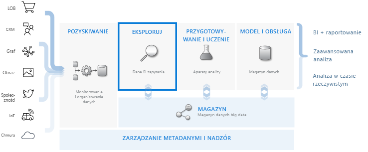
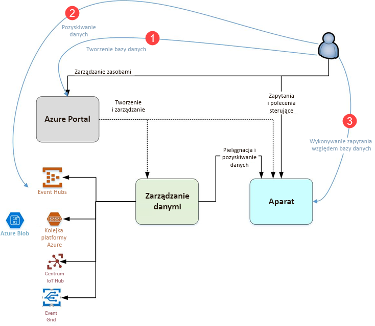

# Co to jest usługa Azure Data Explorer?

Azure Data Explorer to szybka i wysoce skalowalna usługa eksploracji danych na potrzeby danych dziennika i telemetrycznych. Pomaga ona w obsłudze wielu strumieni danych emitowanych przez nowoczesne oprogramowanie, dlatego można zbierać, przechowywać i analizować dane. Usługa Azure Data Explorer to idealne rozwiązanie do analizowania dużych ilości zróżnicowanych danych z dowolnego źródła danych, takiego jak witryny internetowe, aplikacje, urządzenia IoT i inne. Te dane są używane na potrzeby diagnostyki, monitorowania, raportowania, uczenia maszynowego i dodatkowych możliwości analizy. Eksplorator danych usługi Azure upraszcza to pozyskiwanie i umożliwia wykonywanie złożonych zapytań ad hoc dotyczące danych w ciągu kilku sekund.

## Co sprawia, że usługa Azure Data Explorer jest unikatowa?

- Szybko skaluje do terabajtów danych w ciągu kilku minut, umożliwiając szybkie iteracje podczas eksplorowania danych, co pozwala na odnajdowanie właściwych szczegółowych informacji.

- Oferuje innowacyjny język zapytań zoptymalizowany pod kątem analizy danych o wysokiej wydajności.

- Obsługuje analizę dużych ilości danych heterogenicznych (ze strukturą i bez struktury).

- Umożliwia kompilowanie i wdrażanie dokładnie tych elementów, których potrzebujesz, łącząc się z innymi usługami w celu udostępnienia kompleksowego, zaawansowanego i interaktywnego rozwiązania do analizy danych.

## Przepływ pracy podczas magazynowania danych

Usługa Azure Data Explorer integruje się z innymi usługami głównymi w celu udostępnienia kompleksowego rozwiązania, które obejmuje następujące czynności związane z danymi: zbieranie, pozyskiwanie, magazynowanie, indeksowanie, wykonywanie zapytań i wizualizacja. Odgrywa ona zasadniczą rolę w przepływie magazynowania danych, wykonując krok **EKSPLOROWANIE** przepływu na terabajtach różnych danych pierwotnych.

Usługa Azure Data Explorer obsługuje kilka metod pozyskiwania, w tym łączniki z typowymi usługami, takimi jak Event Hubs, pozyskiwanie programowe za pomocą zestawów SDK, takich jak .NET i Python, oraz bezpośredni dostęp do aparatu dla celów eksploracji. Usługa Azure Data Explorer integruje się z funkcją analizy i usługami modelowania w celu przeprowadzania dodatkowej analizy i wizualizacji danych.

## Przepływ w usłudze Azure Data Explorer

Poniższy diagram przedstawia różne aspekty pracy z usługą Azure Data Explorer.

Ogólnie praca z usługą Azure Data Explorer odbywa się zgodnie z następującym wzorcem:

1. **Tworzenie bazy danych:** Utwórz *klaster*, a następnie utwórz w nim co najmniej jedną *bazę danych*. [Szybki start: Tworzenie klastra i bazy danych usługi Azure Data Explorer](create-cluster-database-portal.md)

1. **Pozyskiwanie danych:** Ładowanie danych do tabel bazy danych, co pozwala na wykonywanie związanych z nimi zapytań. [Szybki start: Pozyskiwanie danych z centrum zdarzeń do usługi Azure Data Explorer](ingest-data-event-hub.md)

1. **Wykonywanie zapytań dotyczących bazy danych:** Uruchamianie, przeglądanie i udostępnianie zapytań oraz wyników przy użyciu aplikacji internetowej. Jest ona dostępna w witrynie Azure Portal oraz jako aplikacja autonomiczna. Ponadto można wysyłać zapytania programowo (przy użyciu zestawu SDK) lub do punktu końcowego interfejsu API REST. [Szybki start: wykonywanie zapytań o dane w usłudze Azure Data Explorer](web-query-data.md)

## Środowisko pracy z zapytaniami

Zapytanie w usłudze Azure Data Explorer to przeznaczone tylko do odczytu żądanie przetwarzające dane i zwracające wyniki tego przetwarzania bez modyfikowania danych lub metadanych. Zapytania można uściślać do momentu ukończenia analizy. Eksplorator danych usługi Azure ułatwia ten proces ze względu na swoje doświadczenie kwerend bardzo szybko ad hoc.

Usługa Azure Data Explorer równie efektywnie obsługuje duże ilości danych ze strukturą, częściową strukturą (zagnieżdżone typy w notacji JSON) oraz bez struktury (dowolny tekst). Umożliwia ona wyszukiwanie terminów z określonym tekstem, lokalizowanie konkretnych zdarzeń i wykonywanie obliczeń w stylu metryk na danych strukturalnych. Usługa Azure Data Explorer łączy światy dzienników tekstowych bez struktury oraz numerów i wymiarów ze strukturą, wyodrębniając wartości w czasie wykonywania z pól tekstowych w dowolnej postaci. Eksplorowanie danych jest upraszczane przez połączenie szybkiego indeksowania tekstu, magazynu kolumn i operacje na szeregach czasowych.

Możliwości usługi Azure Data Explorer zostały rozszerzone o inne usługi stworzone w oparciu o zaawansowany język zapytań, w tym [dzienniki usługi Azure Monitor](/azure/log-analytics/), usługi [Application Insights](/azure/application-insights/) i [Time Series Insights](/azure/time-series-insights/) oraz [zaawansowaną ochronę przed zagrożeniami w usłudze Windows Defender](/windows/security/threat-protection/windows-defender-atp/windows-defender-advanced-threat-protection/).

## Opinia

Bardzo chcemy poznać Twoją opinię na temat usługi Azure Data Explorer oraz jej języku zapytań:

- Zadawaj pytania
  - [Stack Overflow](https://stackoverflow.com/questions/tagged/azure-data-explorer)
  - [Społeczność techniczna firmy Microsoft](https://techcommunity.microsoft.com/t5/Azure-Data-Explorer/bd-p/Kusto)
  - [MSDN](https://social.msdn.microsoft.com/Forums/en-US/home?forum=AzureKusto)
- [Przedstaw sugestie dotyczące produktów w witrynie User Voice](https://aka.ms/AzureDataExplorer.UserVoice)

## Kolejne kroki

[Szybki start: Tworzenie klastra i bazy danych usługi Azure Data Explorer](create-cluster-database-portal.md)

[Szybki start: Pozyskiwanie danych z centrum zdarzeń do usługi Azure Data Explorer](ingest-data-event-hub.md)

[Szybki start: wykonywanie zapytań o dane w usłudze Azure Data Explorer](web-query-data.md)
