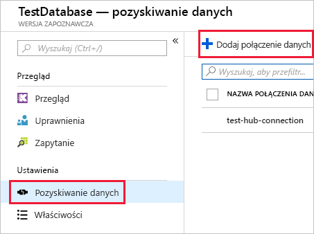

# <a name="quickstart-ingest-azure-blobs-into-azure-data-explorer-by-subscribing-to-event-grid-notifications"></a>Szybki start: Pozyskiwanie obiektów blob platformy Azure do usługi Azure Data Explorer za pomocą subskrybowania powiadomień usługi Event Grid

Azure Data Explorer to szybka i wysoce skalowalna usługa eksploracji danych na potrzeby danych dziennika i telemetrycznych. Usługa Azure Data Explorer oferuje ciągłe pozyskiwanie (ładowanie danych) z obiektów blob zapisanych w kontenerach obiektów blob. Można to osiągnąć, ustawiając subskrypcję usługi [Azure Event Grid](/azure/event-grid/overview) dla zdarzeń tworzenia obiektów blob i kierując te zdarzenia do usługi Kusto za pośrednictwem centrum zdarzeń. Ten przewodnik Szybki start wymaga konta magazynu z subskrypcją usługi Event Grid, która wysyła powiadomienia do centrum zdarzeń. Możesz utworzyć połączenie danych usługi Event Grid i sprawdzić przepływ danych przez cały system.

## <a name="prerequisites"></a>Wymagania wstępne

1. Jeśli nie masz subskrypcji platformy Azure, [utwórz bezpłatne konto platformy Azure](https://azure.microsoft.com/free/)
1. [Klaster i baza danych](create-cluster-database-portal.md)
1. [Konto magazynu](https://docs.microsoft.com/azure/storage/common/storage-quickstart-create-account?tabs=azure-portal)
1. [Centrum zdarzeń](https://docs.microsoft.com/azure/event-hubs/event-hubs-create)

## <a name="create-an-event-grid-subscription-in-your-storage-account"></a>Tworzenie subskrypcji usługi Event Grid na koncie magazynu

1. W witrynie Azure Portal przejdź do swojego konta magazynu.
1. Kliknij kartę **Zdarzenia**, a następnie pozycję **Subskrypcja zdarzeń**

    

1. W oknie **Utwórz subskrypcję zdarzeń** na karcie **Podstawowe** podaj następujące wartości:

    **Ustawienie** | **Sugerowana wartość** | **Opis pola**
    |---|---|---|
    | Name (Nazwa) | *test-grid-connection* | Nazwa siatki zdarzeń, którą chcesz utworzyć.|
    | Schemat zdarzeń | *Schemat usługi Event Grid* | Schemat, który będzie używany w usłudze Event Grid. |
    | Typ tematu | *Konto magazynu* | Typ tematu siatki zdarzeń. |
    | Zasób tematu | *gridteststorage* | Nazwa konta magazynu. |
    | Subskrybuj wszystkie typy zdarzeń | *Usuń zaznaczenie* | Nie będziesz otrzymywać powiadomień o wszystkich zdarzeniach. |
    | Zdefiniowane typy zdarzeń | *Utworzony obiekt blob* | O jakich konkretnych zdarzeniach chcesz otrzymywać powiadomienia. |
    | Typ punktu końcowego | *Event Hubs* | Typ punktu końcowego, do którego wysyłasz zdarzenia. |
    | Endpoint | *test-hub* | Utworzone przez Ciebie centrum zdarzeń. |
    | | |

1. Wybierz kartę **Dodatkowe funkcje**, jeśli chcesz śledzić pliki z określonego kontenera. Filtry dla powiadomień ustaw w następujący sposób:
    * **Temat zaczyna się od** — to pole jest prefiksem *literału* kontenera obiektów blob (jeśli zastosowany wzorzec to *startswith*, może to obejmować wiele kontenerów). Symbole wieloznaczne nie są dozwolone.
     Ustawienie *musi* wyglądać następująco: *`/blobServices/default/containers/`*[prefiks kontenera]
    * **Temat kończy się na** — to pole jest sufiksem *literału* obiektu blob. Symbole wieloznaczne nie są dozwolone.

## <a name="create-a-target-table-in-azure-data-explorer"></a>Tworzenie tabeli docelowej w usłudze Azure Data Explorer

Utwórz tabelę w usłudze Azure Data Explorer, do której będą wysyłane dane z usługi Event Hubs. Tabela zostanie utworzona w klastrze i bazie danych, które zostały przygotowane w sekcji **Wymagania wstępne**.

1. W witrynie Azure Portal w obszarze klastra wybierz pozycję **Zapytanie**.

    

1. Skopiuj poniższe polecenie w oknie, a następnie wybierz pozycję **Uruchom**, aby utworzyć tabelę (TestTable), w której będą umieszczane pozyskiwane dane.

    ```Kusto
    .create table TestTable (TimeStamp: datetime, Value: string, Source:string)
    ```

    

1. Skopiuj poniższe polecenie w oknie, a następnie wybierz pozycję **Uruchom**, aby zamapować przychodzące dane w formacie JSON na nazwy kolumn i typy danych tabeli (TestTable).

    ```Kusto
    .create table TestTable ingestion json mapping 'TestMapping' '[{"column":"TimeStamp","path":"$.TimeStamp"},{"column":"Value","path":"$.Value"},{"column":"Source","path":"$.Source"}]'
    ```

## <a name="create-an-event-grid-data-connection-in-azure-data-explorer"></a>Tworzenie połączenie danych usługi Event Grid w usłudze Azure Data Explorer

Teraz połączysz się z usługą Event Grid z usługi Azure Data Explorer, aby dane trafiające do kontenera obiektów blob były przesyłane strumieniowo do tabeli testowej.

1. Wybierz pozycję **Powiadomienia** na pasku narzędzi, aby sprawdzić, czy wdrożenie centrum zdarzeń zakończyło się pomyślnie.

1. W obszarze utworzonego klastra wybierz pozycję **Bazy danych**, a następnie pozycję **TestDatabase**.

    

1. Wybierz pozycję **Pozyskiwanie danych**, a następnie pozycję **Dodaj połączenie danych**.

    

1. Wybierz typ połączenia: **Blob Storage**.

1. Wypełnij formularz, używając poniższych informacji, a następnie kliknij pozycję **Utwórz**.

    

     Źródło danych:

    **Ustawienie** | **Sugerowana wartość** | **Opis pola**
    |---|---|---|
    | Nazwa połączenia danych | *test-hub-connection* | Nazwa połączenia, które chcesz utworzyć w usłudze Azure Data Explorer.|
    | Subskrypcja konta magazynu | Identyfikator Twojej subskrypcji | Identyfikator subskrypcji, w której znajduje się konto magazynu.|
    | Konto magazynu | *gridteststorage* | Nazwa utworzonego wcześniej konta magazynu.|
    | Event Grid | *test-grid-connection* | Nazwa utworzonej usługi Event Grid. |
    | Nazwa centrum zdarzeń | *test-hub* | Utworzone przez Ciebie centrum zdarzeń. To pole jest wypełniane automatycznie po wybraniu usługi Event Grid. |
    | Grupa konsumentów | *test-group* | Grupa konsumentów zdefiniowana w utworzonym przez Ciebie centrum zdarzeń. |
    | | |

    Tabela docelowa:

     **Ustawienie** | **Sugerowana wartość** | **Opis pola**
    |---|---|---|
    | Tabela | *TestTable* | Tabela utworzona przez Ciebie w obszarze **TestDatabase**. |
    | Format danych | *JSON* | Obsługiwane są formaty JSON i CSV. |
    | Mapowanie kolumn | *TestMapping* | Mapowanie utworzone przez Ciebie w obszarze **TestDatabase**, które mapuje przychodzące dane JSON na nazwy kolumn i typy danych tabeli **TestTable**.|
    | | |

## <a name="generate-sample-data"></a>Generowanie danych przykładowych

Teraz, gdy usługa Azure Data Explorer i konto magazynu są połączone, możesz utworzyć przykładowe dane i przekazać je do magazynu obiektów blob.

Będziemy pracować z krótkim skryptem powłoki, który wykona kilka podstawowych poleceń interfejsu wiersza polecenia platformy Azure umożliwiających interakcje z zasobami usługi Azure Storage. Skrypt najpierw tworzy nowy kontener na koncie magazynu, a następnie przekazuje do tego kontenera istniejący plik (jako obiekt blob). Następnie wyświetla listę wszystkich obiektów blob w kontenerze. Możesz użyć programu [Cloud Shell](https://docs.microsoft.com/azure/cloud-shell/overview), aby wykonać skrypt bezpośrednio w portalu.

Zapisz następujące dane w pliku, a następnie użyj ich wraz z poniższym skryptem:

```Json
{"TimeStamp": "1987-11-16 12:00","Value": "Hello World","Source": "TestSource"}
```

```bash
#!/bin/bash
### A simple Azure Storage example script

    export AZURE_STORAGE_ACCOUNT=<storage_account_name>
    export AZURE_STORAGE_KEY=<storage_account_key>

    export container_name=<container_name>
    export blob_name=<blob_name>
    export file_to_upload=<file_to_upload>
    export destination_file=<destination_file>

    echo "Creating the container..."
    az storage container create --name $container_name

    echo "Uploading the file..."
    az storage blob upload --container-name $container_name --file $file_to_upload --name $blob_name

    echo "Listing the blobs..."
    az storage blob list --container-name $container_name --output table

    echo "Done"
```

## <a name="review-the-data-flow"></a>Przeglądanie przepływu danych

> [!NOTE]
> W systemie ADX istnieją zasady agregacji (dzielenie na partie) dotyczące pozyskiwania danych opracowane w celu optymalizacji procesu pozyskiwania.
Domyślna zasada jest skonfigurowana na 5 minut.
Później będzie można zmienić tę zasadę zgodnie z potrzebami. W tym przewodniku Szybki start można spodziewać się opóźnienia trwającego kilka minut.

1. W witrynie Azure Portal w obszarze siatki zdarzeń zobaczysz wzrost aktywności, gdy aplikacja jest uruchomiona.

    

1. Aby sprawdzić, ile komunikatów zostało przekazanych do tej pory do bazy danych, uruchom poniższe zapytanie w testowej bazie danych.

    ```Kusto
    TestTable
    | count
    ```

1. Aby sprawdzić zawartość komunikatów, uruchom następujące zapytanie w swojej testowej bazie danych.

    ```Kusto
    TestTable
    ```

    Zestaw wyników powinien wyglądać tak jak na poniższej ilustracji.

    

## <a name="clean-up-resources"></a>Oczyszczanie zasobów

Jeśli nie zamierzasz ponownie używać siatki zdarzeń, wyczyść grupę zasobów **test-hub-rg**, aby uniknąć ponoszenia kosztów.

1. W witrynie Azure Portal wybierz **grupy zasobów** daleko po lewej stronie, a następnie wybierz utworzoną grupę zasobów.  

    Jeśli menu po lewej stronie jest zwinięte, wybierz  aby je rozwinąć.

   

1. W obszarze **test-resource-group** wybierz pozycję **Usuń grupę zasobów**.

1. W nowym oknie wpisz nazwę grupy zasobów do usunięcia (*test-hub-rg*), a następnie wybierz pozycję **Usuń**.

## <a name="next-steps"></a>Następne kroki

> [!div class="nextstepaction"]
> [Szybki start: wykonywanie zapytań o dane w usłudze Azure Data Explorer](web-query-data.md)