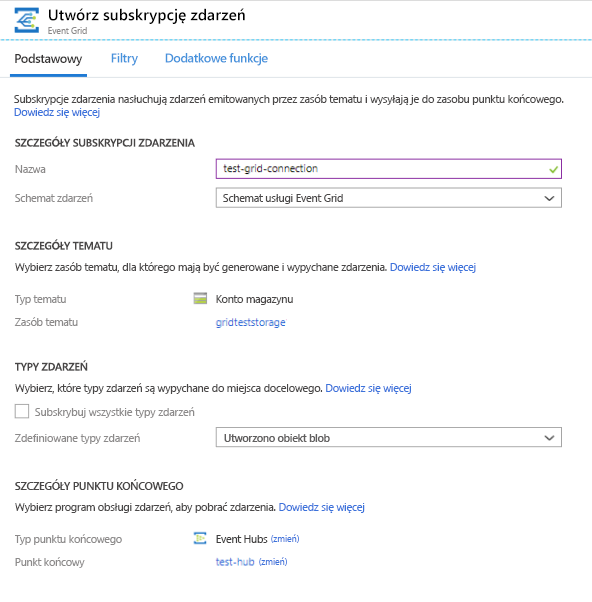
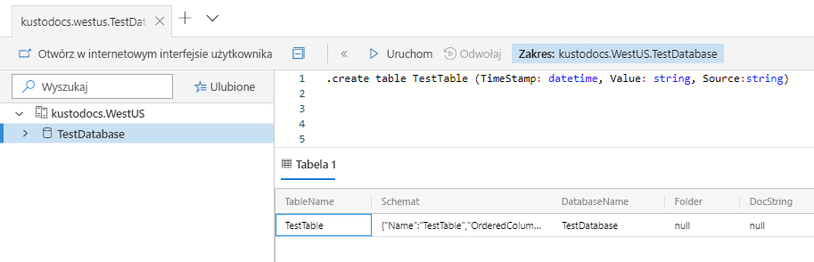
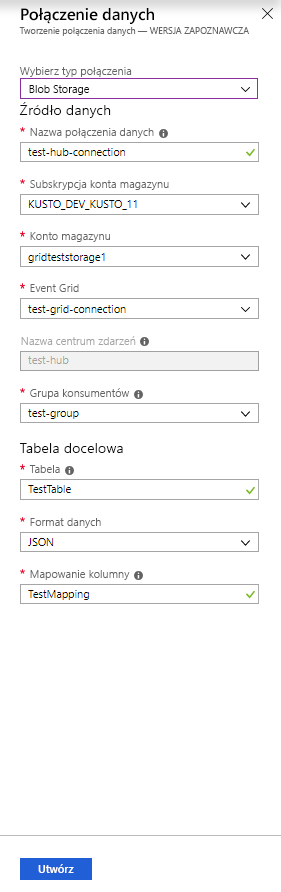
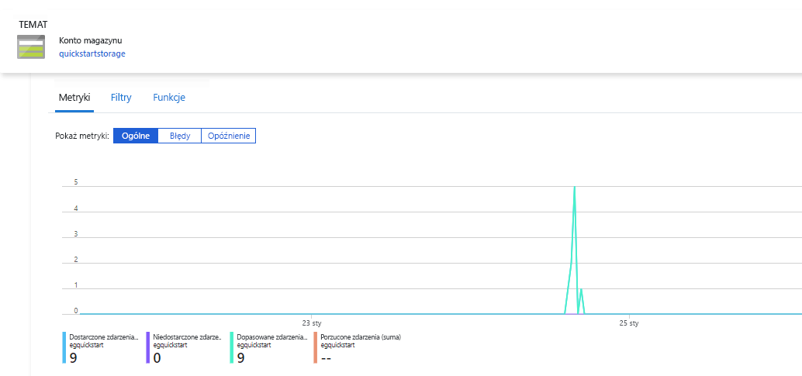
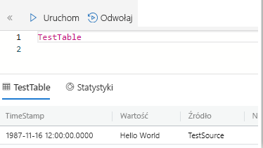

# <a name="ingest-blobs-into-azure-data-explorer-by-subscribing-to-event-grid-notifications"></a>Pozyskiwanie obiektów BLOB na platformie Azure Eksplorator danych przez Subskrybowanie powiadomień Event Grid

> [!div class="op_single_selector"]
> * [Portal](ingest-data-event-grid.md)
> * [C#](data-connection-event-grid-csharp.md)
> * [Python](data-connection-event-grid-python.md)
> * [Szablon usługi Azure Resource Manager](data-connection-event-grid-resource-manager.md)

Azure Eksplorator danych to szybka i skalowalna usługa eksploracji danych dla danych dzienników i telemetrii. Oferuje ciągłe pozyskiwanie (ładowanie danych) z obiektów blob, które są zapisywane do kontenerów obiektów BLOB. 

W tym artykule dowiesz się, jak ustawić subskrypcję [Azure Event Grid](/azure/event-grid/overview) i kierować zdarzenia do usługi Azure Eksplorator danych za pośrednictwem centrum zdarzeń. Aby rozpocząć, musisz mieć konto magazynu z subskrypcją usługi Event Grid, która wysyła powiadomienia do Event Hubs platformy Azure. Następnie utworzysz połączenie danych Event Grid i przepływ danych zostanie wyświetlony w całym systemie.

## <a name="prerequisites"></a>Wymagania wstępne

* Subskrypcja platformy Azure. Utwórz [bezpłatne konto platformy Azure](https://azure.microsoft.com/free/).
* [Klaster i baza danych](create-cluster-database-portal.md).
* [Konto magazynu](https://docs.microsoft.com/azure/storage/common/storage-quickstart-create-account?tabs=azure-portal).
* [Centrum zdarzeń](https://docs.microsoft.com/azure/event-hubs/event-hubs-create).

## <a name="create-an-event-grid-subscription-in-your-storage-account"></a>Tworzenie subskrypcji usługi Event Grid na koncie magazynu

1. W Azure Portal Znajdź konto magazynu.
1. Wybierz pozycję **zdarzenia** > **subskrypcją zdarzeń**.

    

1. W oknie **Utwórz subskrypcję zdarzeń** na karcie **Podstawowe** podaj następujące wartości:

    **Ustawienie** | **Sugerowana wartość** | **Opis pola**
    |---|---|---|
    | Nazwa | *test-grid-connection* | Nazwa siatki zdarzeń, która ma zostać utworzona.|
    | Schemat zdarzeń | *Schemat Event Grid* | Schemat, który ma być używany dla usługi Event Grid. |
    | Typ tematu | *Konto magazynu* | Typ tematu siatki zdarzeń. |
    | Zasób tematu | *gridteststorage* | Nazwa konta magazynu. |
    | Subskrybuj wszystkie typy zdarzeń | *Wyczyść* | Nie będziesz otrzymywać powiadomień o wszystkich zdarzeniach. |
    | Zdefiniowane typy zdarzeń | *Utworzono obiekt BLOB* | O jakich konkretnych zdarzeniach chcesz otrzymywać powiadomienia. |
    | Typ punktu końcowego | *Centra zdarzeń* | Typ punktu końcowego, do którego wysyłasz zdarzenia. |
    | Punkt końcowy | *test-hub* | Utworzone przez Ciebie centrum zdarzeń. |
    | | |

1. Wybierz kartę **filtry** , jeśli chcesz śledzić pliki z określonego kontenera. Filtry dla powiadomień ustaw w następujący sposób:
    * **Temat rozpoczyna się od** pola jest prefiksem *literału* kontenera obiektów BLOB. Ponieważ stosowany wzorzec to *StartsWith*, może on obejmować wiele kontenerów. Symbole wieloznaczne nie są dozwolone.
     Ustawienie *musi* wyglądać następująco: *`/blobServices/default/containers/`* [prefiks kontenera]
    * **Temat kończy się na** — to pole jest sufiksem *literału* obiektu blob. Symbole wieloznaczne nie są dozwolone.

## <a name="create-a-target-table-in-azure-data-explorer"></a>Tworzenie tabeli docelowej w usłudze Azure Data Explorer

Utwórz tabelę w usłudze Azure Eksplorator danych, w której Event Hubs będą wysyłać dane. Utwórz tabelę w klastrze i bazie danych przygotowanej w wymaganiach wstępnych.

1. W witrynie Azure Portal w obszarze klastra wybierz pozycję **Zapytanie**.

    

1. Skopiuj następujące polecenie do okna i wybierz polecenie **Uruchom** , aby utworzyć tabelę (Tester), która będzie odbierać dane pozyskiwane.

    ```Kusto
    .create table TestTable (TimeStamp: datetime, Value: string, Source:string)
    ```

    

1. Skopiuj poniższe polecenie w oknie, a następnie wybierz pozycję **Uruchom**, aby zamapować przychodzące dane w formacie JSON na nazwy kolumn i typy danych tabeli (TestTable).

    ```Kusto
    .create table TestTable ingestion json mapping 'TestMapping' '[{"column":"TimeStamp","path":"$.TimeStamp"},{"column":"Value","path":"$.Value"},{"column":"Source","path":"$.Source"}]'
    ```

## <a name="create-an-event-grid-data-connection-in-azure-data-explorer"></a>Tworzenie połączenie danych usługi Event Grid w usłudze Azure Data Explorer

Teraz Połącz się z Event Grid z poziomu usługi Azure Eksplorator danych, aby dane przepływające do kontenera obiektów BLOB były przesyłane strumieniowo do tabeli testów. 

1. Wybierz pozycję **Powiadomienia** na pasku narzędzi, aby sprawdzić, czy wdrożenie centrum zdarzeń zakończyło się pomyślnie.

1. W obszarze utworzonego klastra wybierz pozycję **bazy danych** > **TestDatabase**.

    

1. Wybierz pozycję pozyskiwanie **danych** > **Dodaj połączenie danych**.

    

1.  Wybierz typ połączenia: **BLOB Storage**.

1. Wypełnij formularz poniższymi informacjami, a następnie wybierz pozycję **Utwórz**.

    

     Źródło danych:

    **Ustawienie** | **Sugerowana wartość** | **Opis pola**
    |---|---|---|
    | Nazwa połączenia danych | *test-hub-connection* | Nazwa połączenia, które ma zostać utworzone w usłudze Azure Eksplorator danych.|
    | Subskrypcja konta magazynu | Identyfikator Twojej subskrypcji | Identyfikator subskrypcji, w której znajduje się konto magazynu.|
    | Konto magazynu | *gridteststorage* | Nazwa konta magazynu, które zostało utworzone wcześniej.|
    | Event Grid | *test-grid-connection* | Nazwa utworzonej siatki zdarzeń. |
    | Nazwa centrum zdarzeń | *test-hub* | Utworzone centrum zdarzeń. To pole jest wypełniane automatycznie po wybraniu siatki zdarzeń. |
    | Grupa konsumentów | *test-group* | Grupa odbiorców zdefiniowana w utworzonym centrum zdarzeń. |
    | | |

    Tabela docelowa:

     **Ustawienie** | **Sugerowana wartość** | **Opis pola**
    |---|---|---|
    | Tabela | *TestTable* | Tabela utworzona przez Ciebie w obszarze **TestDatabase**. |
    | Format danych | *JSON* | Obsługiwane formaty to: Avro, CSV, JSON, MULTILINE JSON, PSV, SOH, SCSV, TSV i TXT. Obsługiwane opcje kompresji: zip i GZip |
    | Mapowanie kolumn | *TestMapping* | Mapowanie utworzone przez Ciebie w obszarze **TestDatabase**, które mapuje przychodzące dane JSON na nazwy kolumn i typy danych tabeli **TestTable**.|
    | | |
    
## <a name="generate-sample-data"></a>Generowanie danych przykładowych

Teraz, gdy usługa Azure Eksplorator danych i konto magazynu są połączone, można utworzyć przykładowe dane i przekazać je do magazynu obiektów BLOB.

Będziemy pracować z krótkim skryptem powłoki, który wykona kilka podstawowych poleceń interfejsu wiersza polecenia platformy Azure umożliwiających interakcje z zasobami usługi Azure Storage. Ten skrypt tworzy nowy kontener na koncie magazynu, przekazuje istniejący plik (jako obiekt BLOB) do tego kontenera, a następnie wyświetla listę obiektów BLOB w kontenerze. Za pomocą [Azure Cloud Shell](https://docs.microsoft.com/azure/cloud-shell/overview) można wykonać skrypt bezpośrednio w portalu.

Zapisz dane w pliku i przekaż je za pomocą tego skryptu:

```Json
{"TimeStamp": "1987-11-16 12:00","Value": "Hello World","Source": "TestSource"}
```

```bash
#!/bin/bash
### A simple Azure Storage example script

    export AZURE_STORAGE_ACCOUNT=<storage_account_name>
    export AZURE_STORAGE_KEY=<storage_account_key>

    export container_name=<container_name>
    export blob_name=<blob_name>
    export file_to_upload=<file_to_upload>
    export destination_file=<destination_file>

    echo "Creating the container..."
    az storage container create --name $container_name

    echo "Uploading the file..."
    az storage blob upload --container-name $container_name --file $file_to_upload --name $blob_name

    echo "Listing the blobs..."
    az storage blob list --container-name $container_name --output table

    echo "Done"
```

## <a name="review-the-data-flow"></a>Przeglądanie przepływu danych

> [!NOTE]
> Usługa Azure Eksplorator danych ma zasady agregacji (wsadowe) na potrzeby pozyskiwania danych, które pozwalają zoptymalizować proces pozyskiwania.
Domyślna zasada jest skonfigurowana na 5 minut.
W razie potrzeby będzie można zmienić zasady w późniejszym czasie. W tym artykule można oczekiwać opóźnienia kilku minut.

1. W witrynie Azure Portal w obszarze siatki zdarzeń zobaczysz wzrost aktywności, gdy aplikacja jest uruchomiona.

    

1. Aby sprawdzić, ile komunikatów zostało przekazanych do tej pory do bazy danych, uruchom poniższe zapytanie w testowej bazie danych.

    ```Kusto
    TestTable
    | count
    ```

1. Aby sprawdzić zawartość komunikatów, uruchom następujące zapytanie w swojej testowej bazie danych.

    ```Kusto
    TestTable
    ```

    Zestaw wyników powinien wyglądać tak jak na poniższej ilustracji.

    

## <a name="clean-up-resources"></a>Oczyszczanie zasobów

Jeśli nie zamierzasz ponownie używać siatki zdarzeń, wyczyść grupę zasobów **test-hub-rg**, aby uniknąć ponoszenia kosztów.

1. W witrynie Azure Portal wybierz **grupy zasobów** daleko po lewej stronie, a następnie wybierz utworzoną grupę zasobów.  

    Jeśli menu po lewej stronie jest zwinięte, wybierz  aby je rozwinąć.

   

1. W obszarze **test-resource-group** wybierz pozycję **Usuń grupę zasobów**.

1. W nowym oknie wprowadź nazwę grupy zasobów do usunięcia (*test-Hub-RG*), a następnie wybierz pozycję **Usuń**.

## <a name="next-steps"></a>Następne kroki

* [Wykonywanie zapytań dotyczących danych w usłudze Azure Eksplorator danych](web-query-data.md)
