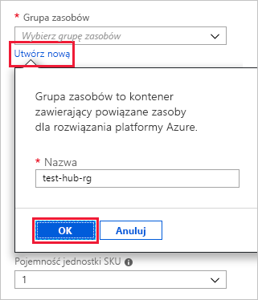
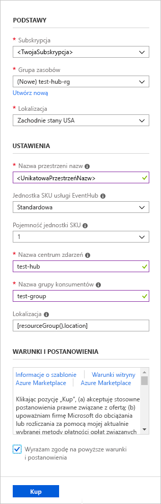
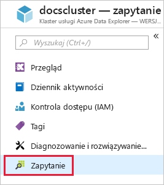
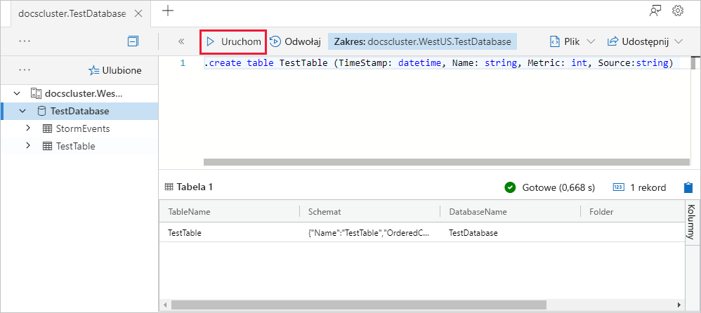
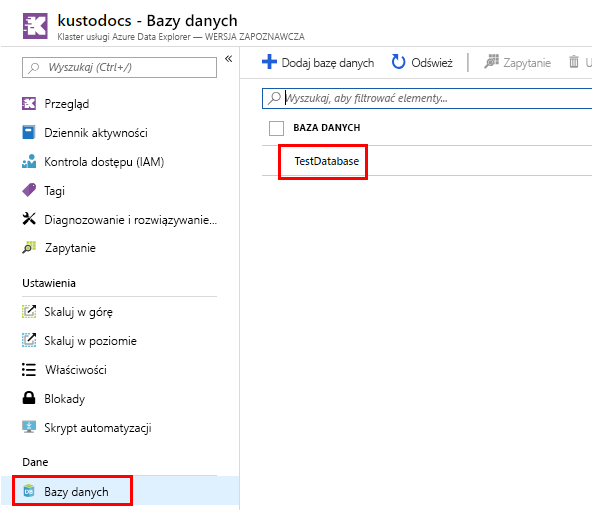
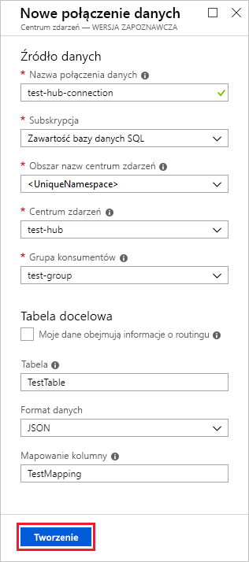
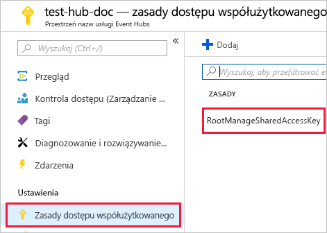
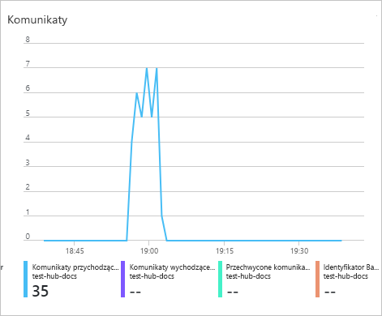
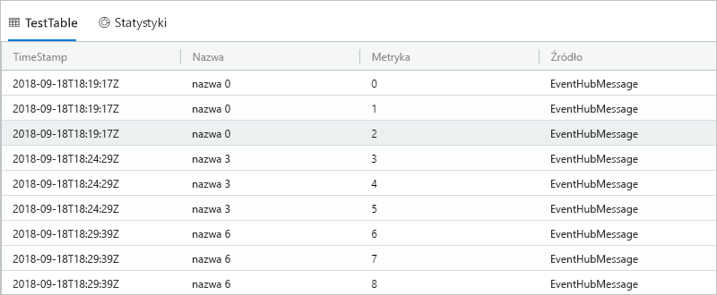
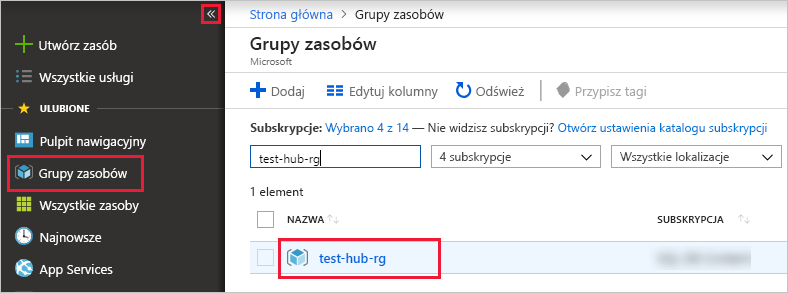

# <a name="quickstart-ingest-data-from-event-hub-into-azure-data-explorer"></a>Szybki start: pozyskiwanie danych z centrum zdarzeń do usługi Azure Data Explorer

Azure Data Explorer to szybka i wysoce skalowalna usługa eksploracji danych na potrzeby danych dziennika i telemetrycznych. Usługa Azure Data Explorer umożliwia pozyskiwanie (ładowanie) danych z usługi Event Hubs — platformy do strumieniowego przesyłania dużych ilości danych i usługi pozyskiwania zdarzeń. Usługa [Event Hubs](/azure/event-hubs/event-hubs-about) może przetwarzać miliony zdarzeń na sekundę niemal w czasie rzeczywistym. W tym przewodniku Szybki start utworzysz centrum zdarzeń, nawiążesz z nim połączenie z usługi Azure Data Explorer i sprawdzisz przepływ danych w systemie.

## <a name="prerequisites"></a>Wymagania wstępne

* Jeśli nie masz subskrypcji platformy Azure, przed rozpoczęciem utwórz [bezpłatne konto platformy Azure](https://azure.microsoft.com/free/).

* [Klaster testowy i bazy danych](create-cluster-database-portal.md).

* [Przykładowa aplikacja](https://github.com/Azure-Samples/event-hubs-dotnet-ingest), która generuje dane i wysyła je do centrum zdarzeń. Pobierz przykładową aplikację w systemie.

* [Visual Studio 2019](https://visualstudio.microsoft.com/vs/) uruchamianie przykładowej aplikacji.

## <a name="sign-in-to-the-azure-portal"></a>Logowanie się do witryny Azure Portal

Zaloguj się w witrynie [Azure Portal](https://portal.azure.com/).

## <a name="create-an-event-hub"></a>Tworzenie centrum zdarzeń

W tym przewodniku Szybki start wygenerujesz przykładowe dane i wyślesz je do centrum zdarzeń. Pierwszym krokiem jest utworzenie centrum zdarzeń. Możesz to zrobić, używając szablonu usługi Azure Resource Manager w witrynie Azure Portal.

1. Aby utworzyć centrum zdarzeń, użyj poniższego przycisku w celu rozpoczęcia wdrażania. Kliknij prawym przyciskiem myszy i wybierz pozycję **Utwórz w nowym oknie**, aby wykonać pozostałe kroki w tym artykule.

    [](https://portal.azure.com/#create/Microsoft.Template/uri/https%3A%2F%2Fraw.githubusercontent.com%2FAzure%2Fazure-quickstart-templates%2Fmaster%2F201-event-hubs-create-event-hub-and-consumer-group%2Fazuredeploy.json)

    Przycisk **Wdróż na platformie Azure** powoduje przejście do witryny Azure Portal w celu wypełnienia formularza wdrożenia.

    

1. Wybierz subskrypcję, w której chcesz utworzyć centrum zdarzeń, i utwórz grupę zasobów o nazwie *test-hub-rg*.

    

1. Wypełnij formularz, używając poniższych informacji.

    

    W przypadku wszystkich ustawień, które nie są wymienione w poniższej tabeli, użyj ustawień domyślnych.

    **Ustawienie** | **Sugerowana wartość** | **Opis pola**
    |---|---|---|
    | Subskrypcja | Twoja subskrypcja | Wybierz subskrypcję platformy Azure, która ma być używana dla centrum zdarzeń.|
    | Grupa zasobów | *test-hub-rg* | Utwórz nową grupę zasobów. |
    | Lokalizacja | *Zachodnie stany USA* | Na potrzeby tego przewodnika Szybki start wybierz wartość *Zachodnie stany USA*. W przypadku systemu produkcyjnego wybierz region, który najlepiej odpowiada Twoim potrzebom. Utwórz przestrzeń nazw centrum zdarzeń w tej samej lokalizacji co klaster Kusto w celu zapewnienia najlepszej wydajności (jest to szczególnie ważne w przypadku przestrzeni nazw centrum zdarzeń o dużej przepływności).
    | Nazwa przestrzeni nazw | Unikatowa nazwa przestrzeni nazw | Wybierz unikatową nazwę, która identyfikuje Twoją przestrzeń nazw. Na przykład *mytestnamespace*. Do podanej nazwy jest dołączana nazwa domeny *servicebus.windows.net*. Nazwa może zawierać tylko litery, cyfry i łączniki. Nazwa musi zaczynać się literą i kończyć literą lub cyfrą. Nazwa musi mieć długość od 6 do 50 znaków.
    | Nazwa centrum zdarzeń | *test-hub* | Centrum zdarzeń znajduje się w przestrzeni nazw, która zapewnia unikatowy kontener określania zakresu. Nazwa centrum zdarzeń musi być unikatowa w obrębie przestrzeni nazw. |
    | Nazwa grupy konsumentów | *test-group* | Dzięki grupom konsumentów każda z wielu aplikacji korzystających z danych może mieć osobny widok strumienia zdarzeń. |
    | | |

1. Wybierz pozycję **Zakup**, która potwierdza, że tworzysz zasoby w ramach swojej subskrypcji.

1. Wybierz pozycję **Powiadomienia** na pasku narzędzi, aby monitorować proces aprowizacji. Pomyślne zakończenie wdrożenia może zająć kilka minut, ale możesz teraz przejść do następnego kroku.

    

## <a name="create-a-target-table-in-azure-data-explorer"></a>Tworzenie tabeli docelowej w usłudze Azure Data Explorer

Teraz w usłudze Azure Data Explorer utworzysz tabelę, do której będą wysyłane dane z usługi Event Hubs. Tabela zostanie utworzona w klastrze i bazie danych, które były aprowizowane w sekcji **Wymagania wstępne**.

1. W witrynie Azure Portal przejdź do klastra, a następnie wybierz pozycję **Zapytanie**.

    

1. Skopiuj poniższe polecenie w oknie, a następnie wybierz pozycję **Uruchom**, aby utworzyć tabelę (TestTable), w której będą umieszczane pozyskiwane dane.

    ```Kusto
    .create table TestTable (TimeStamp: datetime, Name: string, Metric: int, Source:string)
    ```

    

1. Skopiuj poniższe polecenie w oknie, a następnie wybierz pozycję **Uruchom**, aby zamapować przychodzące dane w formacie JSON na nazwy kolumn i typy danych tabeli (TestTable).

    ```Kusto
    .create table TestTable ingestion json mapping 'TestMapping' '[{"column":"TimeStamp","path":"$.timeStamp","datatype":"datetime"},{"column":"Name","path":"$.name","datatype":"string"},{"column":"Metric","path":"$.metric","datatype":"int"},{"column":"Source","path":"$.source","datatype":"string"}]'
    ```

## <a name="connect-to-the-event-hub"></a>Łączenie z centrum zdarzeń

Teraz połączysz się z centrum zdarzeń z usługi Azure Data Explorer. Po nawiązaniu tego połączenia dane trafiające do centrum zdarzeń będą przesyłane strumieniowo do tabeli testowej utworzonej we wcześniejszej części tego artykułu.

1. Wybierz pozycję **Powiadomienia** na pasku narzędzi, aby sprawdzić, czy wdrożenie centrum zdarzeń zakończyło się pomyślnie.

1. W obszarze utworzonego klastra wybierz pozycję **Bazy danych**, a następnie pozycję **TestDatabase**.

    

1. Wybierz kolejno pozycje **Pozyskiwanie danych** i **Dodaj połączenie danych**. Następnie wypełnij formularz, używając poniższych informacji. Po zakończeniu wybierz pozycję **Utwórz**.

    

    Źródło danych:

    **Ustawienie** | **Sugerowana wartość** | **Opis pola**
    |---|---|---|
    | Nazwa połączenia danych | *test-hub-connection* | Nazwa połączenia, które chcesz utworzyć w usłudze Azure Data Explorer.|
    | Przestrzeń nazw centrum zdarzeń | Unikatowa nazwa przestrzeni nazw | Wybrana wcześniej nazwa, która identyfikuje Twoją przestrzeń nazw. |
    | Centrum zdarzeń | *test-hub* | Utworzone przez Ciebie centrum zdarzeń. |
    | Grupa konsumentów | *test-group* | Grupa konsumentów zdefiniowana w utworzonym przez Ciebie centrum zdarzeń. |
    | | |

    Tabela docelowa:

    Dostępne są dwie opcje dla routingu pozyskiwanych danych: *statyczne* i *dynamiczne*. 
    W tym artykule możesz użyć routing statyczny, gdzie Określ nazwę tabeli, formatu danych i mapowania. W związku z tym pozostaw pole **Moje dane zawierają informacje o routingu** niezaznaczone.

     **Ustawienie** | **Sugerowana wartość** | **Opis pola**
    |---|---|---|
    | Tabela | *TestTable* | Tabela utworzona przez Ciebie w obszarze **TestDatabase**. |
    | Format danych | *JSON* | Obsługiwane formaty to: Avro, CSV, JSON, MULTILINE JSON, PSV, SOH, SCSV, TSV i TXT. |
    | Mapowanie kolumn | *TestMapping* | Mapowanie utworzone przez Ciebie w obszarze **TestDatabase**, które mapuje przychodzące dane JSON na nazwy kolumn i typy danych tabeli **TestTable**. Wymagane dla formatu JSON, WIELOWIERSZOWE JSON lub AVRO i opcjonalny w przypadku innych formatów.|
    | | |

    > [!NOTE]
    > Wybierz **Moje dane zawierają informacji o routingu** używają routingu dynamicznego, gdzie dane obejmuje niezbędne informacje routingu w [przykładową aplikację](https://github.com/Azure-Samples/event-hubs-dotnet-ingest) komentarzy. Jeśli ustawiono wartość właściwości statyczne i dynamiczne, właściwości dynamicznych przesłonięte przez statyczne. 

## <a name="copy-the-connection-string"></a>Kopiowanie parametrów połączenia

Gdy uruchamiasz [przykładową aplikację](https://github.com/Azure-Samples/event-hubs-dotnet-ingest) wymienioną w sekcji Wymagania wstępne, potrzebujesz parametrów połączenia dla przestrzeni nazw centrum zdarzeń.

1. W obszarze utworzonej przez Ciebie przestrzeni nazw centrum zdarzeń wybierz pozycję **Zasady dostępu współużytkowanego**, a następnie pozycję **RootManageSharedAccessKey**.

    

1. Skopiuj zawartość pola **Parametry połączenia — klucz podstawowy**. Wkleisz ją w następnej sekcji.

    

## <a name="generate-sample-data"></a>Generowanie danych przykładowych

Użyj pobranej [przykładowej aplikacji](https://github.com/Azure-Samples/event-hubs-dotnet-ingest) do wygenerowania danych.

1. Otwórz przykładowe rozwiązanie aplikacji w programie Visual Studio.

1. W pliku *program.cs* zaktualizuj stałą `connectionString` tak, aby zawierała parametry połączenia skopiowane z przestrzeni nazw centrum zdarzeń.

    ```csharp
    const string eventHubName = "test-hub";
    // Copy the connection string ("Connection string-primary key") from your Event Hub namespace.
    const string connectionString = @"<YourConnectionString>";
    ```

1. Skompiluj i uruchom aplikację. Aplikacja wysyła komunikaty do centrum zdarzeń i co dziesięć sekund wyświetla stan.

1. Po wysłaniu przez aplikację kilku komunikatów przejdź do następnego kroku: przeglądania przepływu danych do centrum zdarzeń i tabeli testowej.

## <a name="review-the-data-flow"></a>Przeglądanie przepływu danych

Kiedy aplikacja generuje dane, możesz teraz zobaczyć przepływ tych danych z centrum zdarzeń do tabeli w klastrze.

1. W witrynie Azure Portal w obszarze centrum zdarzeń zobaczysz wzrost aktywności, gdy aplikacja jest uruchomiona.

    

1. Aby sprawdzić, ile komunikatów zostało przekazanych do tej pory do bazy danych, uruchom poniższe zapytanie w testowej bazie danych.

    ```Kusto
    TestTable
    | count
    ```

1. Aby sprawdzić zawartość komunikatów, uruchom następujące zapytanie:

    ```Kusto
    TestTable
    ```

    Zestaw wyników powinien wyglądać podobnie do następującego:

    

    > [!NOTE]
    > W systemie Azure Data Explorer istnieją zasady agregacji (dzielenie na partie) dotyczące pozyskiwania danych opracowane w celu optymalizacji procesu pozyskiwania. Zasady są skonfigurowane na wartość 5 minut, więc mogą wystąpić opóźnienia.

## <a name="clean-up-resources"></a>Oczyszczanie zasobów

Jeśli nie zamierzasz ponownie używać centrum zdarzeń, wyczyść grupę zasobów **test-hub-rg**, aby uniknąć ponoszenia kosztów.

1. W witrynie Azure Portal wybierz **grupy zasobów** daleko po lewej stronie, a następnie wybierz utworzoną grupę zasobów.  

    Jeśli menu po lewej stronie jest zwinięte, wybierz  aby je rozwinąć.

   

1. W obszarze **test-resource-group** wybierz pozycję **Usuń grupę zasobów**.

1. W nowym oknie wpisz nazwę grupy zasobów do usunięcia (*test-hub-rg*), a następnie wybierz pozycję **Usuń**.

## <a name="next-steps"></a>Kolejne kroki

> [!div class="nextstepaction"]
> [Szybki start: wykonywanie zapytań o dane w usłudze Azure Data Explorer](web-query-data.md)
