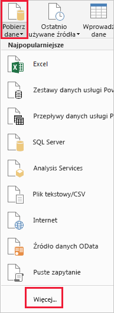
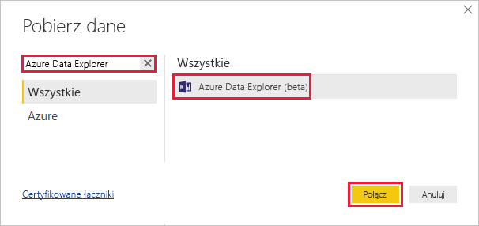
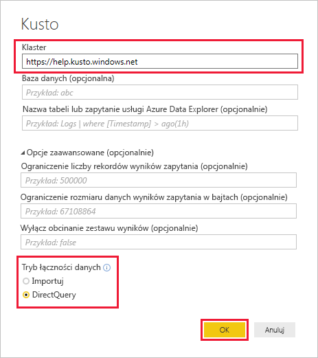
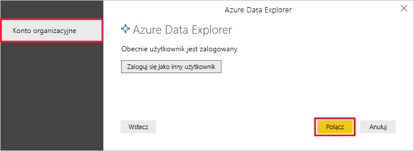
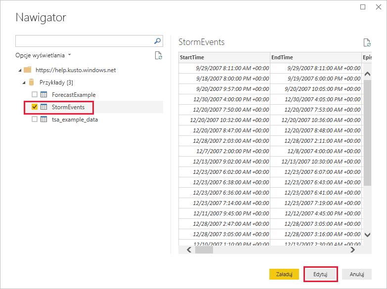
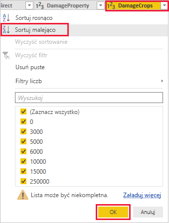
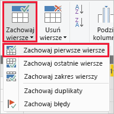
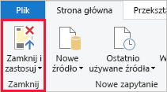

# Wizualizuj dane przy użyciu łącznika Eksplorator danych platformy Azure dla usługi Power BI

Azure Data Explorer to szybka i wysoce skalowalna usługa eksploracji danych na potrzeby danych dziennika i telemetrycznych. Usługa Power BI to rozwiązanie do analizy biznesowej, które pozwala wizualizować dane i udostępniać wyniki w organizacji.

Usługa Azure Data Explorer oferuje trzy opcje łączenia się z danymi w usłudze Power BI: za pomocą wbudowanego łącznika, przez zaimportowanie zapytania z usługi Azure Data Explorer lub za pomocą zapytania SQL. W tym artykule pokazano, jak za pomocą wbudowanego łącznika danych i wizualizacji w raporcie usługi Power BI.

Jeśli nie masz subskrypcji platformy Azure, przed rozpoczęciem utwórz [bezpłatne konto platformy Azure](https://azure.microsoft.com/free/).

## Wymagania wstępne

Potrzebne są następujące polecenie, aby zakończyć w tym artykule:

* Konto e-mail organizacji należące do usługi Azure Active Directory, aby możliwe było łączenie się z [klastrem pomocy usługi Azure Data Explorer](https://dataexplorer.azure.com/clusters/help/databases/samples).

* Program [Power BI Desktop](https://powerbi.microsoft.com/get-started/) (wybierz pozycję **POBIERZ BEZPŁATNIE**)

## Pobieranie danych z usługi Azure Data Explorer

Najpierw nawiąż połączenie z klastrem pomocy usługi Azure Data Explorer, a następnie wprowadź podzestaw danych z tabeli *StormEvents*. [!INCLUDE [data-explorer-storm-events](../../includes/data-explorer-storm-events.md)]

1. W programie Power BI Desktop na karcie **Narzędzia główne** wybierz pozycję **Pobierz dane**, a następnie pozycję **Więcej**.

    

1. Wyszukaj *Eksploratora danych usługi Azure*, wybierz opcję **Eksploratora danych usługi Azure** następnie **Connect**.

    

1. Na **Eksplorator danych platformy Azure (Kusto)** ekranu, wypełnij formularz z poniższymi informacjami.

    

    **Ustawienie** | **Wartość** | **Opis pola**
    |---|---|---|
    | Klaster | *https://help.kusto.windows.net* | Adres URL klastra pomocy. W przypadku innych klastrów adres URL ma postać *https://\<Nazwa_klastra\>.\<Region\>.kusto.windows.net*. |
    | Database (Baza danych) | Pozostaw puste | Baza danych hostowana w klastrze, z którą nawiązujesz połączenie. Wybierzemy ją w późniejszym kroku. |
    | Nazwa tabeli | Pozostaw puste | Jedną z tabel w bazie danych lub zapytanie, takich jak <code>StormEvents \| take 1000</code>. Wybierzemy ją w późniejszym kroku. |
    | Opcje zaawansowane | Pozostaw puste | Opcje zapytań, na przykład rozmiar zestawu wyników. |
    | Tryb łączności danych | Tryb *DirectQuery* | Określa, czy usługa Power BI importuje dane, czy łączy się bezpośrednio ze źródłem danych. Korzystając z tego łącznika, możesz wybrać dowolną z tych opcji. |
    | | | |

1. Jeśli jeszcze nie masz połączenia z klastrem pomocy, zaloguj się. Zaloguj się przy użyciu konta organizacyjnego, a następnie wybierz pozycję **Połącz**.

    

1. Na ekranie **Nawigator** rozwiń bazę danych **Samples**, wybierz pozycję **StormEvents**, a następnie pozycję **Edytuj**.

    

    W edytorze Power Query zostanie otwarta tabela, w której przed zaimportowaniem danych można edytować wiersze i kolumny.

1. W edytorze Power Query wybierz strzałkę obok kolumny **DamageCrops**, a następnie wybierz pozycję **Sortuj malejąco**.

    

1. Na karcie **Narzędzia główne** wybierz pozycję **Zachowaj wiersze**, a następnie pozycję **Zachowaj początkowe wiersze**. Wprowadź wartość *1000*, aby uzyskać pierwszych 1000 wierszy posortowanej tabeli.

    

1. Na karcie **Narzędzia główne** wybierz pozycję **Zamknij i zastosuj**.

    

## Wizualizacja danych w raporcie

[!INCLUDE [data-explorer-power-bi-visualize-basic](../../includes/data-explorer-power-bi-visualize-basic.md)]

## Oczyszczanie zasobów

Jeśli nie potrzebujesz już raportu, który został utworzony w tym artykule, usuń plik programu Power BI Desktop (pbix).

## Kolejne kroki

[Wizualizuj dane przy użyciu importowanych zapytania w usłudze Power BI](power-bi-imported-query.md)
