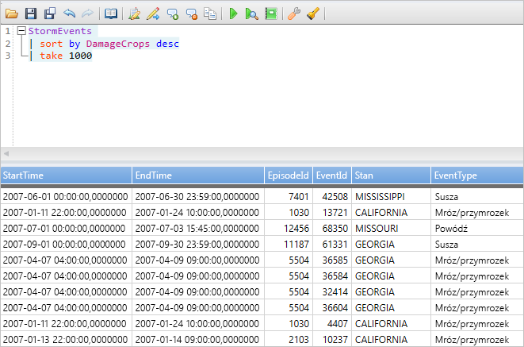
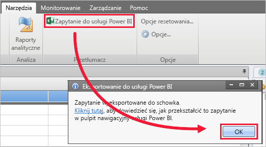
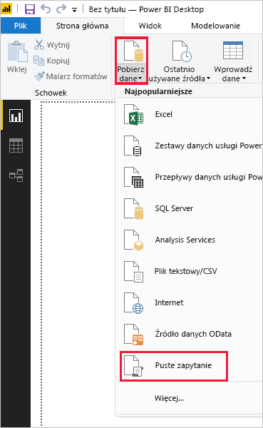
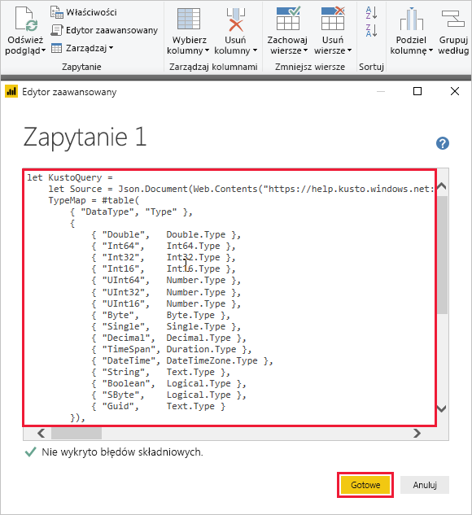
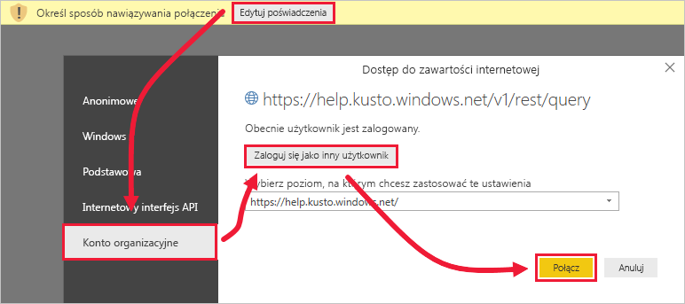
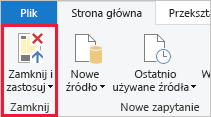

# <a name="quickstart-visualize-data-using-a-query-imported-into-power-bi"></a>Szybki start: Wizualizuj dane przy użyciu zapytań, importowany do usługi Power BI

Azure Data Explorer to szybka i wysoce skalowalna usługa eksploracji danych na potrzeby danych dziennika i telemetrycznych. Usługa Power BI to rozwiązanie do analizy biznesowej, które pozwala wizualizować dane i udostępniać wyniki w organizacji.

Usługa Azure Data Explorer oferuje trzy opcje łączenia się z danymi w usłudze Power BI: za pomocą wbudowanego łącznika, przez zaimportowanie zapytania z usługi Azure Data Explorer lub za pomocą zapytania SQL. W tym przewodniku Szybki start pokazano, jak zaimportować zapytanie, aby uzyskać dane i zwizualizować je w raporcie usługi Power BI.

Jeśli nie masz subskrypcji platformy Azure, przed rozpoczęciem utwórz [bezpłatne konto platformy Azure](https://azure.microsoft.com/free/).

## <a name="prerequisites"></a>Wymagania wstępne

Do wykonania kroków tego przewodnika Szybki start potrzebne są następujące elementy:

* Konto e-mail organizacji należące do usługi Azure Active Directory, aby możliwe było łączenie się z [klastrem pomocy usługi Azure Data Explorer](https://dataexplorer.azure.com/clusters/help/databases/samples).

* Program [Power BI Desktop](https://powerbi.microsoft.com/get-started/) (wybierz pozycję **POBIERZ BEZPŁATNIE**)

* [Aplikacja klasyczna Azure Data Explorer](/azure/kusto/tools/kusto-explorer)

## <a name="get-data-from-azure-data-explorer"></a>Pobieranie danych z usługi Azure Data Explorer

Najpierw utwórz zapytanie w aplikacji klasycznej Azure Data Explorer i wyeksportuj je do użycia w usłudze Power BI. Następnie nawiąż połączenie z klastrem pomocy usługi Azure Data Explorer i wprowadź podzestaw danych z tabeli *StormEvents*. [!INCLUDE [data-explorer-storm-events](../../includes/data-explorer-storm-events.md)]

1. W przeglądarce przejdź do witryny [https://help.kusto.windows.net/](https://help.kusto.windows.net/), aby uruchomić aplikację klasyczną Azure Data Explorer.

1. W aplikacji klasycznej skopiuj poniższe zapytanie do okna zapytania w prawym górnym rogu, a następnie uruchom je.

    ```Kusto
    StormEvents
    | sort by DamageCrops desc
    | take 1000
    ```

    Kilka pierwszych wierszy zestawu wyników powinno wyglądać podobnie jak na poniższej ilustracji.

    

1. Na karcie **Narzędzia** wybierz pozycję **Zapytanie do usługi Power BI**, a następnie pozycję **OK**.

    

1. W programie Power BI Desktop na karcie **Narzędzia główne** wybierz pozycję **Pobierz dane**, a następnie pozycję **Puste zapytanie**.

    

1. W edytorze Power Query na karcie **Narzędzia główne** wybierz pozycję **Edytor zaawansowany**.

1. W oknie **Edytor zaawansowany** wklej wyeksportowane zapytanie, a następnie wybierz pozycję **Gotowe**.

    

1. W głównym oknie edytora Power Query wybierz pozycję **Edytuj poświadczenia**. Wybierz pozycję **Konto organizacyjne**, zaloguj się, a następnie wybierz pozycję **Połącz**.

    

1. Na karcie **Narzędzia główne** wybierz pozycję **Zamknij i zastosuj**.

    

## <a name="visualize-data-in-a-report"></a>Wizualizacja danych w raporcie

[!INCLUDE [data-explorer-power-bi-visualize-basic](../../includes/data-explorer-power-bi-visualize-basic.md)]

## <a name="clean-up-resources"></a>Oczyszczanie zasobów

Jeśli nie potrzebujesz już raportu, który został utworzony na potrzeby tego przewodnika Szybki start, usuń plik programu Power BI Desktop (pbix).

## <a name="next-steps"></a>Kolejne kroki

> [!div class="nextstepaction"]
> [Szybki start: Wizualizuj dane przy użyciu importowanych zapytania w usłudze Power BI](power-bi-sql-query.md)