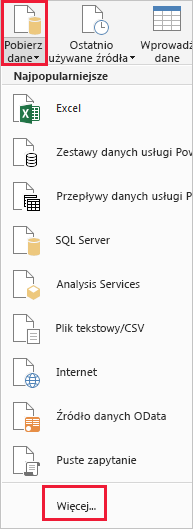
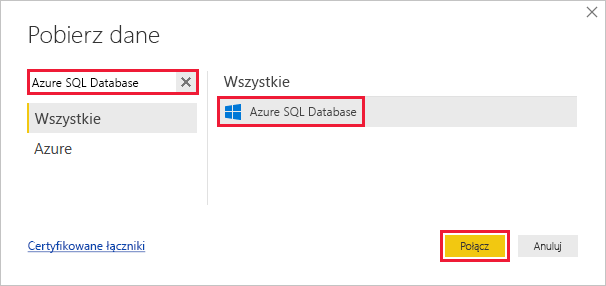
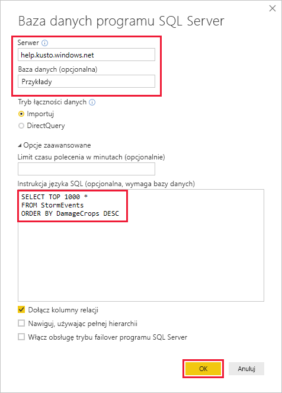
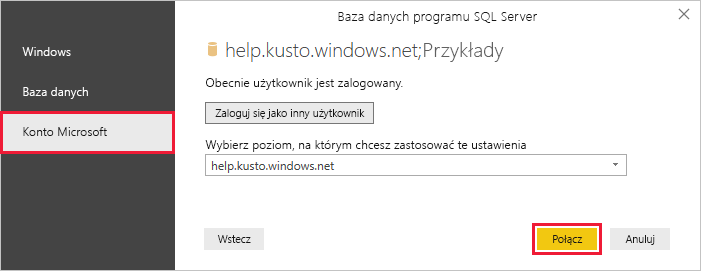
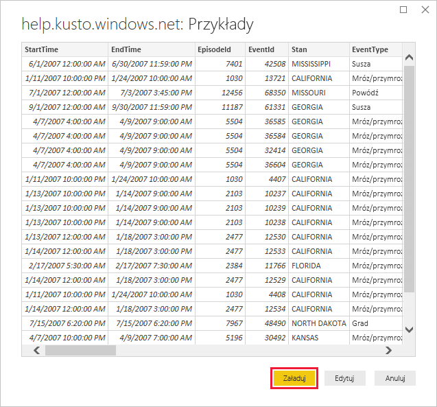

# <a name="visualize-data-from-azure-data-explorer-using-a-sql-query-in-power-bi"></a>Wizualizuj dane z Eksploratora danych platformy Azure przy użyciu kwerendy SQL w usłudze Power BI

Azure Data Explorer to szybka i wysoce skalowalna usługa eksploracji danych na potrzeby danych dziennika i telemetrycznych. Usługa Power BI to rozwiązanie do analizy biznesowej, które pozwala wizualizować dane i udostępniać wyniki w organizacji.

Usługa Azure Data Explorer oferuje trzy opcje łączenia się z danymi w usłudze Power BI: za pomocą wbudowanego łącznika, przez zaimportowanie zapytania z usługi Azure Data Explorer lub za pomocą zapytania SQL. W tym artykule pokazano, jak używać kwerendy SQL do pobierania danych i wizualizowania ich w raporcie usługi Power BI.

Jeśli nie masz subskrypcji platformy Azure, utwórz [bezpłatne konto platformy Azure](https://azure.microsoft.com/free/) przed rozpoczęciem.

## <a name="prerequisites"></a>Wymagania wstępne

Aby ukończyć ten artykuł, potrzebujesz następujących czynności:

* Konto e-mail organizacji należące do usługi Azure Active Directory, aby możliwe było łączenie się z [klastrem pomocy usługi Azure Data Explorer](https://dataexplorer.azure.com/clusters/help/databases/samples).

* Program [Power BI Desktop](https://powerbi.microsoft.com/get-started/) (wybierz pozycję **POBIERZ BEZPŁATNIE**)

## <a name="get-data-from-azure-data-explorer"></a>Pobieranie danych z usługi Azure Data Explorer

Najpierw nawiąż połączenie z klastrem pomocy usługi Azure Data Explorer, a następnie wprowadź podzestaw danych z tabeli *StormEvents*. [!INCLUDE [data-explorer-storm-events](../../includes/data-explorer-storm-events.md)]

Zazwyczaj w usłudze Azure Data Explorer używasz natywnego języka zapytań, ale ta usługa obsługuje również zapytania SQL, których użyjemy tutaj. Usługa Azure Data Explorer automatycznie tłumaczy zapytanie SQL na zapytanie natywne.

1. W programie Power BI Desktop na karcie **Narzędzia** główne wybierz pozycję **Pobierz dane,** a następnie **pozycję Więcej**.

    

1. Wyszukaj ciąg *Azure SQL Database*, wybierz usługę **Azure SQL Database**, a następnie przycisk **Połącz**.

    

1. Na ekranie **Baza danych programu SQL Server** wypełnij formularz, używając poniższych informacji.

    

    **Ustawienie** | **Wartość** | **Opis pola**
    |---|---|---|
    | Serwer | *help.kusto.windows.net* | Adres URL klastra pomocy (bez *https://*). W przypadku innych klastrów adres URL znajduje się w postaci * \<ClusterName\>.\< Region\>.kusto.windows.net*. |
    | baza danych | *Próbki* | Przykładowa baza danych hostowana w klastrze, z którą nawiązujesz połączenie. |
    | Tryb łączności danych | *Import* | Określa, czy usługa Power BI importuje dane, czy łączy się bezpośrednio ze źródłem danych. Korzystając z tego łącznika, możesz wybrać dowolną z tych opcji. |
    | Limit czasu polecenia | Pozostaw puste | Czas działania zapytania, po jakim zgłaszany jest błąd przekroczenia limitu czasu. |
    | Instrukcja SQL | Skopiuj zapytanie znajdujące się pod tą tabelą | Instrukcja SQL, którą usługa Azure Data Explorer tłumaczy na zapytanie natywne. |
    | Inne opcje | Pozostaw wartości domyślne | Te opcje nie mają zastosowania w klastrach usługi Azure Data Explorer. |
    | | | |

    ```SQL
    SELECT TOP 1000 *
    FROM StormEvents
    ORDER BY DamageCrops DESC
    ```

1. Jeśli jeszcze nie masz połączenia z klastrem pomocy, zaloguj się. Zaloguj się przy użyciu konta Microsoft, a następnie wybierz przycisk **Połącz**.

    

1. Na ekranie **help.kusto.windows.net: Samples** wybierz przycisk **Załaduj**.

    

    Tabela otwiera się w głównym oknie usługi Power BI w widoku raportu, w którym można tworzyć raporty na podstawie przykładowych danych.

## <a name="visualize-data-in-a-report"></a>Wizualizacja danych w raporcie

[!INCLUDE [data-explorer-power-bi-visualize-basic](../../includes/data-explorer-power-bi-visualize-basic.md)]

## <a name="clean-up-resources"></a>Oczyszczanie zasobów

Jeśli raport utworzony dla tego artykułu nie jest już potrzebny, usuń plik programu Power BI Desktop (pbix).

## <a name="next-steps"></a>Następne kroki

[Wizualizuj dane przy użyciu łącznika Usługi Azure Data Explorer dla usługi Power BI](power-bi-connector.md)