# <a name="quickstart-query-data-in-azure-data-explorer"></a>Szybki start: wykonywanie zapytań o dane w usłudze Azure Data Explorer

Azure Data Explorer to szybka i wysoce skalowalna usługa eksploracji danych na potrzeby danych dziennika i telemetrycznych. Usługa Azure Data Explorer udostępnia aplikację internetową, która umożliwia uruchamianie i udostępnianie zapytań. Aplikacja jest dostępna w witrynie Azure Portal oraz jako autonomiczna aplikacja internetowa. W tym artykule będziesz pracować w wersji autonomicznej, która pozwala łączyć się z wieloma klastrami i udostępniać linki bezpośrednie do zapytań.

Jeśli nie masz subskrypcji platformy Azure, przed rozpoczęciem utwórz [bezpłatne konto platformy Azure](https://azure.microsoft.com/free/).

## <a name="prerequisites"></a>Wymagania wstępne

Aby ukończyć ten przewodnik Szybki start, oprócz subskrypcji platformy Azure potrzebujesz [klastra testowego i bazy danych](create-cluster-database-portal.md).

## <a name="sign-in-to-the-application"></a>Logowanie się do aplikacji

Zaloguj się do [aplikacji](https://dataexplorer.azure.com/).

## <a name="add-clusters"></a>Dodawanie klastrów

Przy pierwszym otwarciu aplikacji nie ma żadnych połączeń.


Zanim zaczniesz uruchamiać zapytania, musisz dodać połączenie do co najmniej jednego klastra. W tej sekcji dodasz połączenia do *klastra help* usługi Azure Data Explorer, który skonfigurowaliśmy na potrzeby nauki, i do klastra testowego utworzonego w poprzednim przewodniku Szybki start.

1. W lewym górnym rogu aplikacji wybierz pozycję **Dodaj klaster**.

1. W **klastra Dodaj** okno dialogowe, wprowadź identyfikator URI, a następnie wybierz **Dodaj**.

   Może używać klastrze help identyfikatora URI, `https://help.kusto.windows.net`. Jeśli masz własny klaster, podaj identyfikator URI klastra. Na przykład `https://mydataexplorercluster.westus.kusto.windows.net` jak na poniższej ilustracji:

    

1. W okienku po lewej stronie powinien być teraz wyświetlany klaster **help**. Rozwiń bazę danych **Samples**, aby wyświetlić przykładowe tabele, do których masz dostęp.

    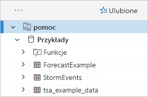

    Tabeli **StormEvents** będziemy używać w dalszej części tego przewodnika Szybki start oraz w innych artykułach dotyczących usługi Azure Data Explorer.

Teraz dodaj utworzony przez siebie klaster testowy.

1. Wybierz pozycję **Dodaj klaster**.

1. W oknie dialogowym **Dodawanie klastra** wprowadź adres URL klastra testowego w postaci `https://<ClusterName>.<Region>.kusto.windows.net/`, a następnie wybierz pozycję **Dodaj**.

    W poniższym przykładzie widać klaster **help** i nowy klaster **docscluster.westus** (pełny adres URL to `https://docscluster.westus.kusto.windows.net/`).

    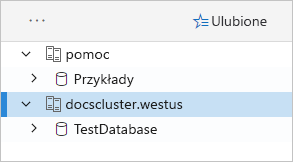

## <a name="run-queries"></a>Uruchamianie zapytań

Teraz możesz uruchamiać zapytania w każdym klastrze, z którym masz połączenie (zakładając, że klaster testowy zawiera dane). Skupimy się na klastrze **help**.

1. W okienku po lewej stronie w obszarze klastra **help** wybierz bazę danych **Samples**.

1. Skopiuj i wklej poniższe zapytanie w oknie zapytania. W górnej części okna wybierz pozycję **Uruchom**.

    ```Kusto
    StormEvents
    | sort by StartTime desc
    | take 10
    ```
    To zapytanie zwraca dziesięć najnowszych rekordów w tabeli **StormEvents**. Lewa strona wyniku powinna wyglądać tak jak poniższa tabela.

    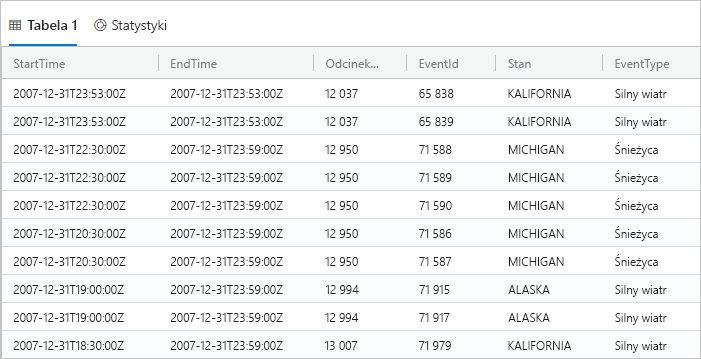

    Poniższa ilustracja przedstawia stan, w który powinna być teraz aplikacja z dodanymi klastrami, oraz zapytanie z wynikami.

    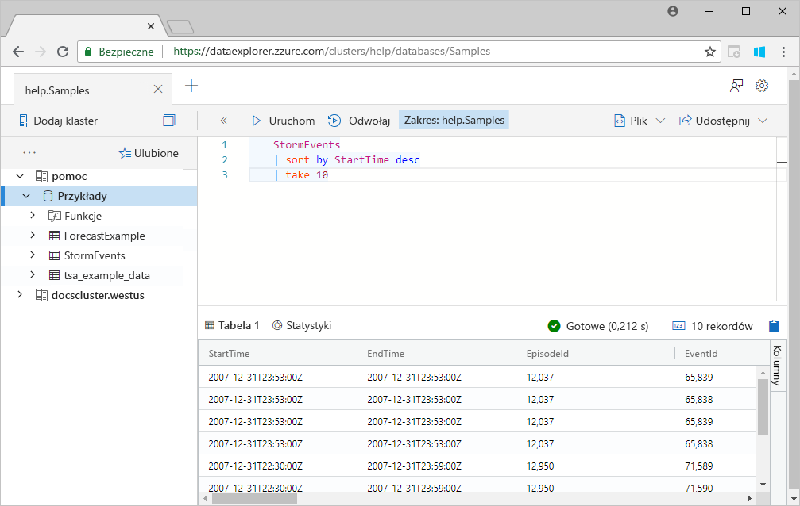

1. Skopiuj i wklej poniższe zapytanie w oknie zapytania poniżej pierwszego zapytania. Zwróć uwagę, że nie jest ono sformatowane w osobnych wierszach jak pierwsze zapytanie.

    ```Kusto
    StormEvents | sort by StartTime desc | project StartTime, EndTime, State, EventType, DamageProperty, EpisodeNarrative | take 10
    ```

1. Kliknij nowe zapytanie w oknie, aby je zaznaczyć. Naciśnij klawisze Shift+Alt+F w celu sformatowania zapytania tak, aby wyglądało jak poniższe.

    

1. Naciśnij klawisze Shift+Enter, czyli skrót do uruchamiania zapytania.

   To zapytanie zwraca te same rekordy co pierwsze, ale zawiera wyłącznie kolumny określone w instrukcji `project`. Wynik powinien wyglądać tak jak poniższa tabela.

    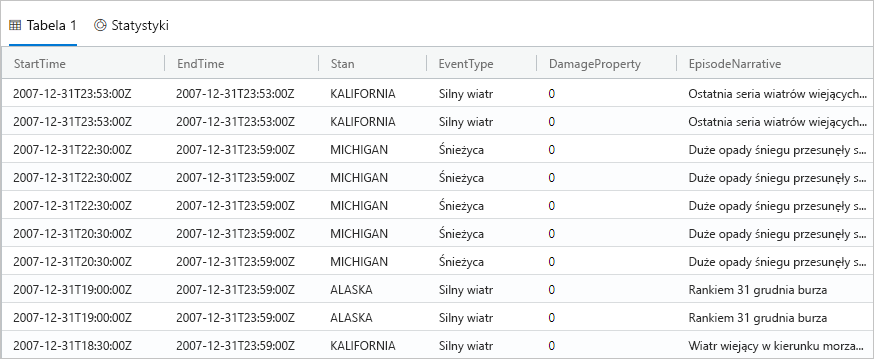

1. W górnej części okna zapytania wybierz pozycję **Odwołaj**.

    Okno zapytania zawiera teraz zestaw wyników z pierwszego zapytania bez konieczności ponownego uruchamiania zapytania. Często podczas analizy uruchamiasz wiele zapytań, a polecenie **Odwołaj** pozwala wrócić do wyników poprzedniego zapytania.

1. Wykonajmy jeszcze jedno zapytanie, aby wyświetlić inny typ danych wyjściowych.

    ```Kusto
    StormEvents
    | summarize event_count=count(), mid = avg(BeginLat) by State
    | sort by mid
    | where event_count > 1800
    | project State, event_count
    | render columnchart
    ```
    Wynik powinien wyglądać tak jak poniższy wykres.

    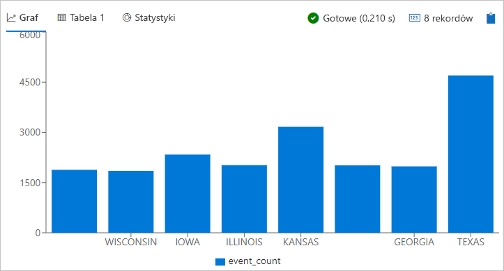

## <a name="work-with-the-table-grid"></a>Praca z siatką tabeli

Gdy już znasz sposób działania podstawowych zapytań, zobaczmy, jak możesz dostosowywać wyniki i wykonywać dalsze analizy, używając siatki tabeli.

1. Uruchom ponownie pierwsze zapytanie. Zatrzymaj wskaźnik myszy na kolumnie **State**, wybierz menu, a następnie wybierz pozycję **Grupuj według stanu**.

    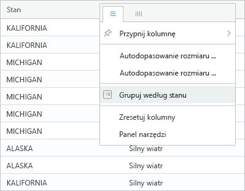

1. W siatce rozwiń węzeł **California**, aby wyświetlić rekordy dla tego stanu.

    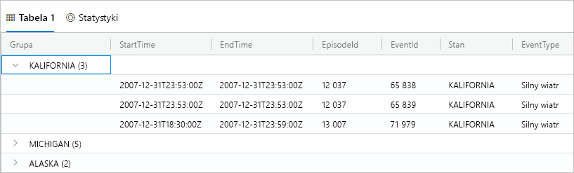

    Ten typ grupowania może być przydatny podczas wykonywania analizy eksploracyjnej.

1. Zatrzymaj wskaźnik myszy na kolumnie **Group**, a następnie wybierz pozycję **Resetuj kolumny**.

    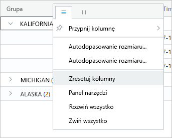

    Spowoduje to przywrócenie pierwotnego stanu siatki.

1. Uruchom poniższe zapytanie.

    ```Kusto
    StormEvents
    | sort by StartTime desc
    | where DamageProperty > 5000
    | project StartTime, State, EventType, DamageProperty, Source
    | take 10
    ```

1. Po prawej stronie siatki wybierz pozycję **Kolumny**, aby wyświetlić panel narzędzi.

    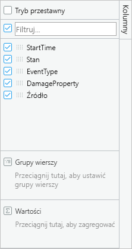

    Ten panel działa podobnie jak lista pól tabeli przestawnej w programie Excel, umożliwiając wykonywanie dodatkowych analiz w samej siatce.

1. Wybierz opcję **Tryb przestawny**, a następnie przeciągnij kolumny w następujący sposób: kolumnę **State** do pola **Grupy wierszy**, kolumnę **DamageProperty** do pola **Wartości** i kolumnę **EventType** do pola **Etykiety kolumn**.  

    

    Wynik powinien wyglądać tak jak poniższa tabela przestawna.

    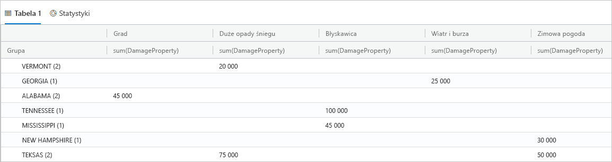

    Zwróć uwagę, że stany Vermont i Alabama mają po dwa zdarzenia w tej samej kategorii, podczas gdy Texas ma dwa zdarzenia w różnych kategoriach. Tabele przestawne umożliwiają szybkie wychwytywanie takich sytuacji. Są one doskonałym narzędziem do szybkiej analizy.

## <a name="share-queries"></a>Udostępnianie zapytań

Wielokrotnie zdarza się, że chcesz udostępnić utworzone przez siebie zapytania. Możesz w tym celu podać link bezpośredni, aby inni użytkownicy mający dostęp do klastra mogli uruchamiać zapytania.

1. W oknie zapytania wybierz pierwsze skopiowane zapytanie.

1. W górnej części okna zapytania wybierz pozycję **Udostępnij**.

1. Wybierz pozycję **Link, zapytanie do schowka**.

1. Skopiuj link i zapytanie do pliku tekstowego.

1. Wklej link w nowym oknie przeglądarki. Po uruchomieniu zapytania wynik powinien wyglądać tak jak na poniższej ilustracji.

    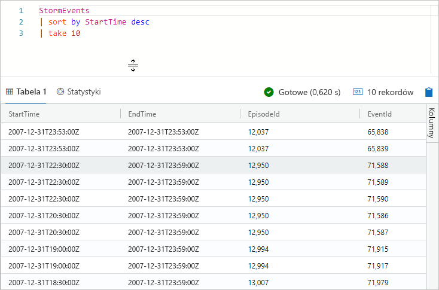

## <a name="provide-feedback"></a>Przekazywanie opinii

Usługa Data Explorer jest obecnie w wersji zapoznawczej, dlatego chętnie poznamy Twoją opinię na jej temat. Opinię możesz przekazać teraz lub zaczekać, aż spędzisz więcej czasu z usługą.

1. W prawym górnym rogu aplikacji wybierz ikonę opinii: .

1. Wprowadź swoją opinię, a następnie wybierz pozycję **Prześlij**.

## <a name="clean-up-resources"></a>Oczyszczanie zasobów

W tym przewodniku Szybki start nie zostały utworzone żadne zasoby, ale jeśli chcesz usunąć jeden lub oba klastry z aplikacji, kliknij klaster prawym przyciskiem myszy, a następnie wybierz pozycję **Usuń połączenie**.

## <a name="next-steps"></a>Kolejne kroki

> [!div class="nextstepaction"]
> [Pisanie zapytań dla usługi Azure Data Explorer](write-queries.md)
