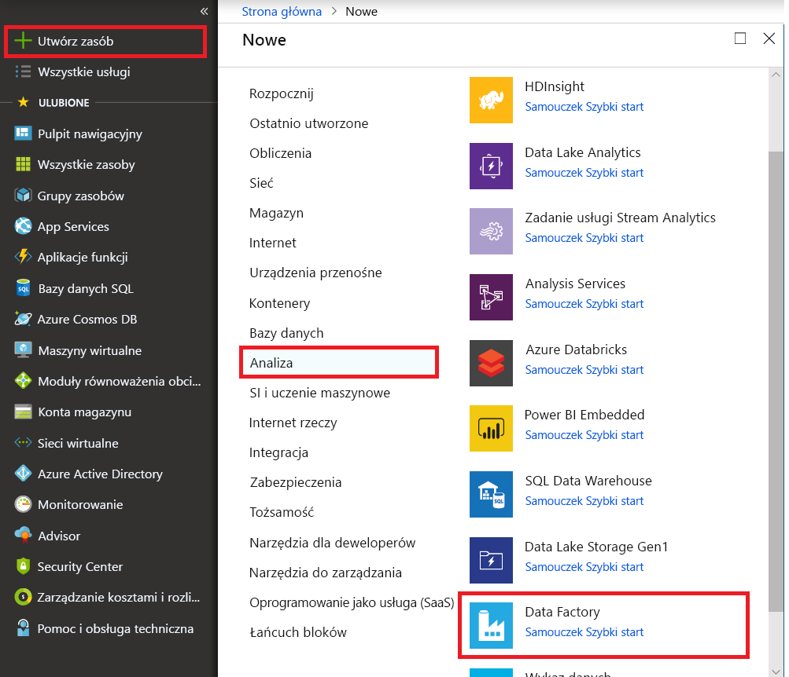
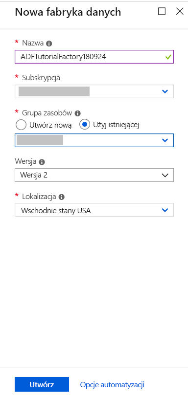
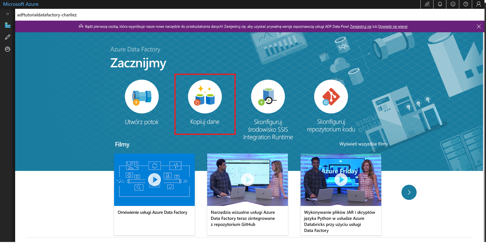

# Szybki start: Kopiowanie danych przy użyciu narzędzia do kopiowania danych

> [!div class="op_single_selector" title1="Select the version of Data Factory service that you are using:"]
> * [Wersja 1](v1/data-factory-copy-data-from-azure-blob-storage-to-sql-database.md)
> * [Bieżąca wersja](quickstart-create-data-factory-copy-data-tool.md)

W tym przewodniku Szybki start utworzysz fabrykę danych przy użyciu witryny Azure Portal. Następnie za pomocą narzędzia do kopiowania danych utworzysz potok służący do kopiowania danych z folderu w magazynie Azure Blob Storage do innego folderu. 

> [!NOTE]
> Jeśli jesteś nowym użytkownikiem usługi Azure Data Factory, przed wykonaniem kroków zawartych w tym przewodniku Szybki start zobacz [Wprowadzenie do usługi Azure Data Factory](data-factory-introduction.md). 

[!INCLUDE [data-factory-quickstart-prerequisites](../../includes/data-factory-quickstart-prerequisites.md)] 

## Tworzenie fabryki danych

1. Wybierz pozycję **Nowy** w menu po lewej stronie, wybierz pozycję **Dane + analiza**, a następnie wybierz pozycję **Data Factory**. 
   
   
1. Na stronie **Nowa fabryka danych** wprowadź wartość **ADFTutorialDataFactory** w polu **Nazwa**. 
      
   
 
   Nazwa fabryki danych platformy Azure musi być *globalnie unikatowa*. Jeśli wystąpi poniższy błąd, zmień nazwę fabryki danych (na przykład **&lt;twojanazwa&gt;ADFTutorialDataFactory**) i spróbuj utworzyć ją ponownie. Artykuł [Usługa Data Factory — reguły nazewnictwa](naming-rules.md) zawiera reguły nazewnictwa artefaktów usługi Data Factory.
  
   
1. W obszarze **Subskrypcja** wybierz subskrypcję platformy Azure, w której chcesz utworzyć fabrykę danych. 
1. W obszarze **Grupa zasobów** wykonaj jedną z następujących czynności:
     
   - Wybierz pozycję **Użyj istniejącej**, a następnie wybierz istniejącą grupę zasobów z listy. 
   - Wybierz pozycję **Utwórz nową**, a następnie wprowadź nazwę grupy zasobów.   
         
   Informacje na temat grup zasobów znajdują się w artykule [Using resource groups to manage your Azure resources](../azure-resource-manager/resource-group-overview.md) (Używanie grup zasobów do zarządzania zasobami platformy Azure).  
1. W obszarze **Wersja** wybierz pozycję **V2**.
1. W obszarze **Lokalizacja** wybierz lokalizację fabryki danych. 

   Ta lista zawiera tylko lokalizacje, które są obsługiwane przez usługę Data Factory i w których będą przechowywane metadane usługi Azure Data Factory. Pamiętaj, że skojarzone magazyny danych (na przykład Azure Storage lub Azure SQL Database) i jednostki obliczeniowe (na przykład HDInsight) używane przez tę usługę Data Factory mogą być uruchomione w innych regionach.

1. Wybierz pozycję **Utwórz**.
1. Po zakończeniu tworzenia zostanie wyświetlona strona **Fabryka danych**. Wybierz kafelek **Tworzenie i monitorowanie**, aby na osobnej karcie uruchomić aplikację interfejsu użytkownika usługi Azure Data Factory.
   
   

## Uruchamianie narzędzia do kopiowania danych

1. Na stronie **Wprowadzenie** wybierz kafelek **Kopiowanie danych**, aby uruchomić narzędzie do kopiowania danych. 

   

1. Na stronie **Właściwości** narzędzia do kopiowania danych możesz określić nazwę potoku i jego opis, a następnie wybrać przycisk **Dalej**. 

   
1. Na stronie **Źródłowy magazyn danych** wykonaj następujące czynności:

    a. Kliknij pozycję **+Utwórz nowe połączenie**, aby dodać połączenie.

    

    b. Z galerii wybierz pozycję **Azure Blob Storage**, a następnie wybierz przycisk **Dalej**.

    

    c. Na stronie **Określanie konta usługi Azure Blob Storage** wybierz swoje konto magazynu z listy **Nazwa konta magazynu**, a następnie wybierz przycisk **Zakończ**. 

   

   d. Wybierz nowo utworzoną połączoną usługę jako źródło, a następnie kliknij pozycję **Dalej**.

   

1. Na stronie **Wybieranie pliku lub folderu wejściowego** wykonaj następujące czynności:

   a. Kliknij pozycję **Przeglądaj**, aby przejść do folderu **adftutorial/input**, wybierz plik **emp.txt**, a następnie kliknij przycisk **Wybierz**. 

   

   d. Zaznacz opcję **Kopiowanie binarne**, aby skopiować plik w jego bieżącej postaci, a następnie wybierz przycisk **Dalej**. 

   

1. Na stronie **Docelowy magazyn danych** wybierz połączoną usługę **Azure Blob Storage**, która właśnie została utworzona, a następnie wybierz przycisk **Dalej**. 

   

1. Na stronie **Wybieranie wyjściowego pliku lub folderu** wprowadź wartość **adftutorial/output** jako ścieżkę do folderu, a następnie wybierz przycisk **Dalej**. 

    

1. Na stronie **Ustawienia** wybierz przycisk **Dalej**, aby użyć konfiguracji domyślnych. 

1. Sprawdź wszystkie ustawienia na stronie **Podsumowanie**, a następnie wybierz przycisk **Dalej**. 

    

1. Na stronie **Zakończono wdrożenie** wybierz pozycję **Monitoruj**, aby monitorować utworzony potok. 

    

1. Aplikacja zostanie przełączona na kartę **Monitorowanie**. Na tej karcie wyświetlany jest stan potoku. Wybierz pozycję **Odśwież**, aby odświeżyć listę. 
    
    

1. Wybierz link **Wyświetl uruchomienia działania** w kolumnie **Akcje**. Potok ma tylko jedno działanie typu **Kopiowanie**. 

    
    
1. Aby wyświetlić szczegółowe informacje na temat operacji kopiowania, wybierz link **Szczegóły** (obraz okularów) w kolumnie **Akcje**. Aby uzyskać więcej informacji o właściwościach, zobacz [Omówienie działania kopiowania](copy-activity-overview.md).

    

1. Sprawdź, czy plik **emp.txt** został utworzony w folderze **output** w kontenerze **adftutorial**. Jeśli folder wyjściowy nie istnieje, usługa Data Factory automatycznie go utworzy. 

1. Przejdź do karty **Tworzenie** powyżej karty **Monitorowanie** na lewym panelu, aby móc edytować połączone usługi, zestawy danych i potoki. Aby dowiedzieć się więcej o edytowaniu tych elementów w interfejsie użytkownika usługi Data Factory, zobacz [Tworzenie fabryki danych za pomocą witryny Azure Portal](quickstart-create-data-factory-portal.md).

## Kolejne kroki
Potok w tym przykładzie kopiuje dane z jednej lokalizacji do innej lokalizacji w usłudze Azure Blob Storage. Zapoznaj się z [samouczkami](tutorial-copy-data-portal.md), aby dowiedzieć się więcej o korzystaniu z usługi Data Factory w dalszych scenariuszach. 