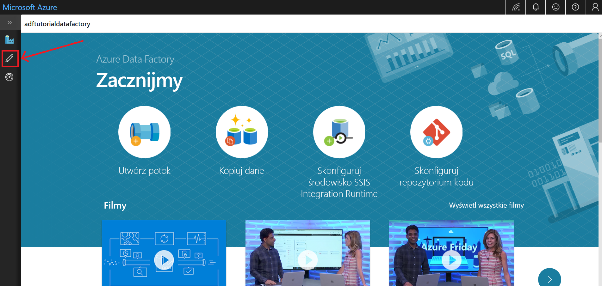

# Szybki Start: Tworzenie fabryki danych przy użyciu interfejsu użytkownika Azure Data Factory

> [!div class="op_single_selector" title1="Wybierz używaną wersję usługi Data Factory:"]
> * [Wersja 1](v1/data-factory-copy-data-from-azure-blob-storage-to-sql-database.md)
> * [Bieżąca wersja](quickstart-create-data-factory-portal.md)

W tym przewodniku Szybki start opisano sposób używania interfejsu użytkownika usługi Azure Data Factory w celu tworzenia i monitorowania fabryki danych. Potok tworzony w tej fabryce danych *kopiuje* dane z jednego folderu do innego folderu w usłudze Azure Blob Storage. Aby zapoznać się z samouczkiem dotyczącym *przekształcania* danych za pomocą usługi Azure Data Factory, zobacz [Tutorial: Transform data by using Spark (Samouczek: przekształcanie danych przy użyciu usługi Spark)](tutorial-transform-data-spark-portal.md).

> [!NOTE]
> Jeśli jesteś nowym użytkownikiem usługi Azure Data Factory, przed wykonaniem kroków zawartych w tym przewodniku Szybki start zobacz [Wprowadzenie do usługi Azure Data Factory](data-factory-introduction.md). 

[!INCLUDE [data-factory-quickstart-prerequisites](../../includes/data-factory-quickstart-prerequisites.md)] 

### Wideo 
Obejrzenie tego filmu wideo ułatwi zapoznanie się z interfejsem użytkownika usługi Data Factory: 
>[!VIDEO https://channel9.msdn.com/Shows/Azure-Friday/Visually-build-pipelines-for-Azure-Data-Factory-v2/Player]

## Tworzenie fabryki danych

1. Uruchom przeglądarkę internetową **Microsoft Edge** lub **Google Chrome**. Obecnie interfejs użytkownika usługi Data Factory jest obsługiwany tylko przez przeglądarki internetowe Microsoft Edge i Google Chrome.
1. Przejdź do witryny [Azure Portal](https://portal.azure.com). 
1. Z menu Azure Portal wybierz pozycję **Utwórz zasób**.
   
   
1. Wybierz pozycję **Analiza**, a następnie wybierz pozycję **Data Factory**. 
   
   
1. Na stronie **Nowa fabryka danych** wprowadź wartość **ADFTutorialDataFactory** w polu **Nazwa**. 
 
   Nazwa fabryki danych platformy Azure musi być *globalnie unikatowa*. Jeśli wystąpi poniższy błąd, zmień nazwę fabryki danych (na przykład **&lt;twojanazwa&gt;ADFTutorialDataFactory**) i spróbuj utworzyć ją ponownie. Artykuł [Usługa Data Factory — reguły nazewnictwa](naming-rules.md) zawiera reguły nazewnictwa artefaktów usługi Data Factory.
  
   
1. W obszarze **Subskrypcja** wybierz subskrypcję platformy Azure, w której chcesz utworzyć fabrykę danych. 
1. W obszarze **Grupa zasobów** wykonaj jedną z następujących czynności:
     
   - Wybierz pozycję **Użyj istniejącej**, a następnie wybierz istniejącą grupę zasobów z listy. 
   - Wybierz pozycję **Utwórz nową**, a następnie wprowadź nazwę grupy zasobów.   
         
   Informacje na temat grup zasobów znajdują się w artykule [Using resource groups to manage your Azure resources](../azure-resource-manager/resource-group-overview.md) (Używanie grup zasobów do zarządzania zasobami platformy Azure).  
1. W obszarze **Wersja** wybierz pozycję **V2**.
1. W obszarze **Lokalizacja** wybierz lokalizację fabryki danych.

   Ta lista zawiera tylko lokalizacje, które są obsługiwane przez usługę Data Factory i w których będą przechowywane metadane usługi Azure Data Factory. Skojarzone magazyny danych (np. usługi Azure Storage i Azure SQL Database) i usługi obliczeniowe (np. usługa Azure HDInsight) używane przez Data Factory mogą działać w innych regionach.

1. Wybierz pozycję **Utwórz**.

1. Po zakończeniu tworzenia zostanie wyświetlona strona **Fabryka danych**. Wybierz kafelek **Tworzenie i monitorowanie**, aby na osobnej karcie uruchomić aplikację interfejsu użytkownika usługi Azure Data Factory.
   
   
1. Na stronie **Wprowadzenie** przejdź do karty **Tworzenie** na lewym panelu. 

    

## Tworzenie usługi połączonej
Podczas tej procedury utworzysz połączoną usługę służącą do łączenia konta usługi Azure Storage z fabryką danych. Połączona usługa ma informacje o połączeniu, których usługa Data Factory używa w środowisku uruchomieniowym do nawiązywania z nią połączenia.

1. Wybierz pozycję **połączenia**, a następnie wybierz przycisk **Nowy** na pasku narzędzi (przycisk**połączenia** znajduje się u dołu lewej kolumny w obszarze **zasoby fabryki**). 

1. Na stronie **Nowa połączona usługa** wybierz pozycję **Azure Blob Storage**, a następnie wybierz pozycję **Dalej**. 

   
1. Na stronie Nowa połączona usługa (Azure Blob Storage) wykonaj następujące czynności: 

   a. Wprowadź wartość **AzureStorageLinkedService** w polu **Nazwa**.

   b. W polu **Nazwa konta magazynu** wybierz nazwę konta usługi Azure Storage.

   d. Wybierz pozycję **Testuj połączenie**, aby sprawdzić, czy usługa Data Factory może nawiązać połączenie z kontem magazynu. 

   d. Aby zapisać połączoną usługę, wybierz pozycję **Zakończ**. 

## Utwórz zestawy danych
W tej procedurze tworzone są dwa zestawy danych: **InputDataset** i **OutputDataset**. Te zestawy danych są typu **AzureBlob**. Odwołują się one do połączonej usługi Azure Storage utworzonej w poprzedniej sekcji. 

Wejściowy zestaw danych reprezentuje dane źródłowe w folderze wejściowym. W definicji wejściowego zestawu danych określany jest kontener obiektów blob (**adftutorial**), folder (**input**) i plik (**emp.txt**), który zawiera dane źródłowe. 

Wyjściowy zestaw danych reprezentuje dane, które są kopiowane do lokalizacji docelowej. W definicji wyjściowego zestawu danych określany jest kontener obiektów blob (**adftutorial**), folder (**output**) i plik, do którego kopiowane są dane. Każde uruchomienie potoku ma skojarzony ze sobą unikatowy identyfikator. Aby uzyskać dostęp do tego identyfikatora, skorzystaj ze zmiennej systemowej **RunId**. Nazwa pliku wyjściowego jest dynamicznie obliczana na podstawie identyfikatora uruchomienia potoku.   

W ustawieniach połączonej usługi określono konto usługi Azure Storage, które zawiera dane źródłowe. W ustawieniach zestawu danych źródłowych należy określić, gdzie dokładnie znajduje się źródło danych (kontener obiektów blob, folder i plik). W ustawieniach zestawu danych ujścia należy określić, gdzie kopiowane są dane (kontener obiektów blob, folder i plik). 
 
1. Wybierz przycisk **+** (znak plus), a następnie wybierz pozycję **Zestaw danych**.

   
1. Na stronie **Nowy zestaw danych** wybierz pozycję **Azure Blob Storage**, a następnie wybierz pozycję **Kontynuuj**. 

   
1. Na stronie **Wybierz format** wybierz typ formatu danych, a następnie wybierz pozycję **Kontynuuj**. W takim przypadku wybierz opcję **plik binarny** , jeśli kopiujesz pliki jako-is bez analizy zawartości.

    

1. Na stronie **Ustawianie właściwości** wykonaj następujące czynności:

    a. W polu **Nazwa**wprowadź **InputDataset**. 

    b. Wybierz pozycję **AzureStorageLinkedService** w polu **Połączona usługa**.

    d. Kliknij przycisk **Przeglądaj** w polu **Ścieżka pliku**.

    d. W oknie **Wybieranie pliku lub folderu** przejdź do folderu **input** w kontenerze **adftutorial**, wybierz plik **emp.txt**, a następnie wybierz przycisk **Zakończ**.
    
    e. Wybierz przycisk **Kontynuuj**.   

    
1. Powtórz kroki, aby utworzyć wyjściowy zestaw danych:  

    a. Wybierz przycisk **+** (znak plus), a następnie wybierz pozycję **Zestaw danych**.

    b. Na stronie **Nowy zestaw danych** wybierz pozycję **Azure Blob Storage**, a następnie wybierz pozycję **Kontynuuj**.

    d. Na stronie **Wybierz format** wybierz typ formatu danych, a następnie wybierz pozycję **Kontynuuj**.

    d. Na stronie **Ustawianie właściwości** Określ **OutputDataset** dla nazwy. Wybierz pozycję **AzureStorageLinkedService** jako połączoną usługę.

    e. W obszarze **ścieżka pliku**wprowadź **adftutorial/Output**. Jeśli folder **wyjściowy** nie istnieje, działanie kopiowania tworzy je w czasie wykonywania.

    f. Wybierz przycisk **Kontynuuj**.   

## Tworzenie potoku 
Podczas tej procedury utworzysz potok i zweryfikujesz go za pomocą działania kopiowania, które korzysta z wejściowego i wyjściowego zestawu danych. Działanie kopiowania służy do kopiowania danych z pliku określonego w ustawieniach wejściowego zestawu danych do pliku określonego w ustawieniach wyjściowego zestawu danych. Jeśli wejściowy zestaw danych określa tylko folder (a nie nazwę pliku), działanie kopiowania kopiuje wszystkie pliki w folderze źródłowym do lokalizacji docelowej. 

1. Wybierz przycisk **+** (znak plus), a następnie wybierz pozycję **Potok**. 

1. Na karcie **Ogólne** określ wartość **CopyPipeline** w polu **Nazwa**. 

1. W przyborniku **Działania** rozwiń pozycję **Przenoszenie i przekształcanie**. Przeciągnij działanie **Kopiowanie danych** z przybornika **działania** na powierzchnię projektanta potoku. Możesz również wyszukać działania w przyborniku **Działania**. Wprowadź wartość **CopyFromBlobToBlob** w polu **Nazwa**.

1. Przejdź do karty **Źródło** w ustawieniach działania kopiowania, a następnie wybierz wartość **InputDataset** w polu **Zestaw danych źródłowych**.

1. Przejdź do karty **Ujście** w ustawieniach działania kopiowania, a następnie wybierz wartość **OutputDataset** w polu **Zestaw danych ujścia**.

1. Aby sprawdzić poprawność ustawień potoku, kliknij pozycję **Weryfikuj** na pasku narzędzi potoku powyżej kanwy. Sprawdź, czy potok został pomyślnie zweryfikowany. Wybierz przycisk **>>** (strzałka w prawo), aby zamknąć dane wyjściowe weryfikacji. 

## Debugowanie potoku
W tym kroku przeprowadzisz debugowanie potoku przed jego wdrożeniem w usłudze Data Factory. 

1. Na pasku narzędzi nad kanwą potoku kliknij pozycję **Debugowanie**, aby wyzwolić przebieg testu. 
    
1. Sprawdź, czy w dolnej części karty **Dane wyjściowe** ustawień potoku wyświetlany jest stan przebiegu potoku. 

1. Sprawdź, czy w folderze **output** kontenera **adftutorial** znajduje się plik wyjściowy. Jeśli folder wyjściowy nie istnieje, Usługa Data Factory automatycznie go utworzy. 

## Ręczne wyzwalanie potoku
Podczas tej procedury wdrożysz jednostki (połączone usługi, zestawy danych i potoki) w usłudze Azure Data Factory. Następnie ręcznie wyzwolisz przebieg potoku. 

1. Przed wyzwoleniem potoku należy opublikować jednostki w usłudze Data Factory. Aby przeprowadzić publikowanie, w górnej części wybierz przycisk **Opublikuj wszystkie**. 

   
1. Aby wyzwolić potok ręcznie, wybierz pozycję **Dodaj wyzwalacz** na pasku narzędzi potoku, a następnie wybierz pozycję **Wyzwól teraz**. Na stronie **Uruchomienie potoku** wybierz przycisk **Zakończ**.

## Monitorowanie potoku

1. Przejdź do karty **Monitorowanie** po lewej stronie. Kliknij przycisk **Odśwież**, aby odświeżyć listę.

   
1. Wybierz link **Wyświetl uruchomienia działania** w obszarze **Akcje**. Na tej stronie zostanie wyświetlony stan uruchomienia działania kopiowania. 

1. Aby wyświetlić szczegółowe informacje na temat operacji kopiowania, wybierz link **Szczegóły** (obraz okularów) w kolumnie **Akcje**. Aby uzyskać więcej informacji o właściwościach, zobacz [Omówienie działania kopiowania](copy-activity-overview.md). 

   
1. Sprawdź, czy nowy plik jest widoczny w folderze **output**. 
1. Możesz przełączyć się z powrotem do widoku **uruchomienia potoków** z widoku **uruchomienia działania** , wybierając link **uruchomienia potoku** . 

## Wyzwalanie potoku zgodnie z harmonogramem
W tym samouczku ta procedura jest opcjonalna. Możesz utworzyć *wyzwalacz harmonogramu*, aby zaplanować okresowe uruchamianie potoku (co godzinę, codziennie itd.). Podczas tej procedury utworzysz wyzwalacz, który będzie uruchamiany co minutę, aż do daty/godziny określonej jako data zakończenia. 

1. Przejdź do karty **Tworzenie**. 

1. Przejdź do potoku, wybierz pozycję **Dodaj wyzwalacz** na pasku narzędzi potoku, a następnie wybierz pozycję **Nowy/Edytuj**. 

1. Na stronie **Dodawanie wyzwalaczy** wybierz pozycję **Wybierz wyzwalacz**, a następnie wybierz przycisk **Nowy**. 

1. Na stronie **Nowy wyzwalacz** w polu **Koniec** wybierz pozycję **W dniu**, określ czas zakończenia jako kilka minut późniejszy niż czas bieżący, a następnie wybierz pozycję **Zastosuj**. 

   Za poszczególne uruchomienia potoku są naliczane opłaty, zatem określ czas zakończenia jako późniejszy tylko o kilka minut od czasu rozpoczęcia. Upewnij się, że przypada on tego samego dnia. Należy jednak upewnić się, że jest wystarczająco dużo czasu na uruchomienie potoku między czasem publikacji a czasem zakończenia. Wyzwalacz zaczyna obowiązywać dopiero po opublikowaniu rozwiązania w fabryce Data Factory, a nie po zapisaniu go w interfejsie użytkownika. 

1. Na stronie **Nowy wyzwalacz** zaznacz pole wyboru **aktywowane** , a następnie wybierz pozycję **Zapisz**. 

   
1. Zapoznaj się z komunikatem ostrzegawczym, a następnie wybierz przycisk **Zakończ**.

1. Wybierz pozycję **Opublikuj wszystkie**, aby opublikować zmiany w usłudze Data Factory. 

1. Przejdź do karty **Monitorowanie** po lewej stronie. Wybierz pozycję **Odśwież**, aby odświeżyć listę. Potok będzie uruchamiany raz na minutę od czasu opublikowania do czasu zakończenia. 

   Zwróć uwagę na wartości w kolumnie **Wyzwolone przez**. Ręczne uruchomienie wyzwalacza pochodzi z kroku wykonanego wcześniej (**Wyzwól teraz**). 

1. Przełącz się do widoku **Uruchomienia wyzwalacza**. 

1. Sprawdź, czy plik wyjściowy jest tworzony w folderze **output** dla każdego uruchomienia potoku aż do określonej daty/godziny zakończenia. 

## Następne kroki
Potok w tym przykładzie kopiuje dane z jednej lokalizacji do innej lokalizacji w usłudze Azure Blob Storage. Zapoznaj się z [samouczkami](tutorial-copy-data-portal.md), aby dowiedzieć się więcej o korzystaniu z usługi Data Factory w dalszych scenariuszach. 
