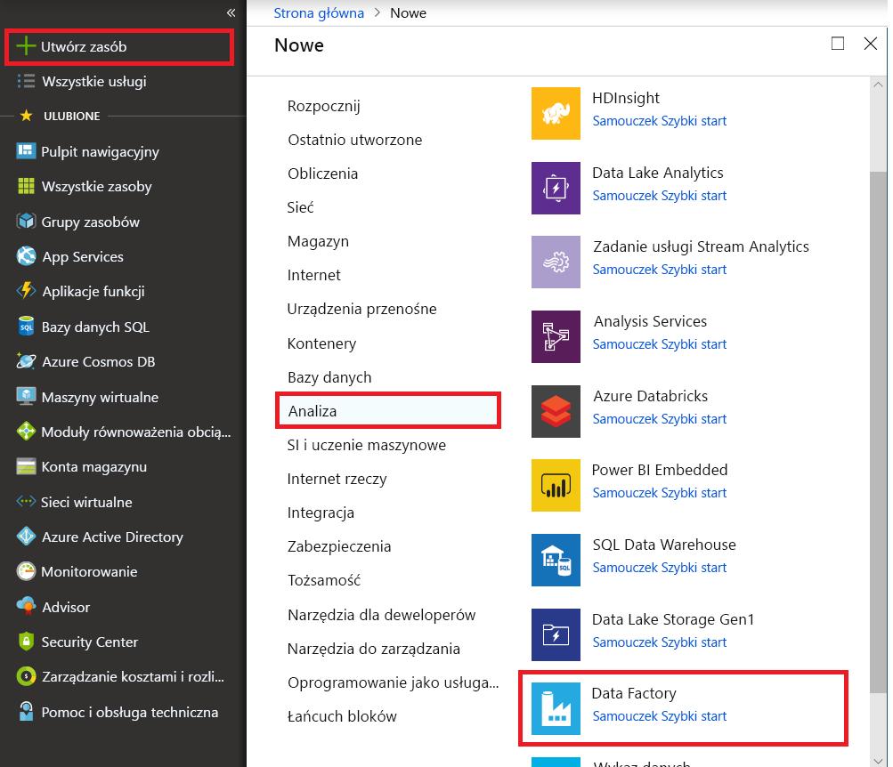

# Przyrostowe kopiowanie nowych i zmienionych plików, w oparciu o Data ostatniej modyfikacji przy użyciu narzędzia do kopiowania danych

W tym samouczku użyjesz witryny Azure portal do utworzenia fabryki danych. Następnie użyjemy narzędzia do kopiowania danych utworzysz potok, który przyrostowo kopiuje nowych i zmienionych plików, na podstawie ich **Data ostatniej modyfikacji** z usługi Azure Blob storage do usługi Azure Blob storage.

> [!NOTE]
> Jeśli jesteś nowym użytkownikiem usługi Azure Data Factory, zobacz [Wprowadzenie do usługi Azure Data Factory](introduction.md).

W tym samouczku wykonasz następujące zadania:

> [!div class="checklist"]
> * Tworzenie fabryki danych.
> * Tworzenie potoku za pomocą narzędzia do kopiowania danych.
> * Monitorowanie uruchomień potoku i działań.

## Wymagania wstępne

* **Subskrypcja platformy Azure**: Jeśli nie masz subskrypcji platformy Azure, przed rozpoczęciem utwórz [bezpłatne konto](https://azure.microsoft.com/free/).
* **Konto usługi Azure Storage**: Użyj usługi Blob storage jako _źródła_ i _ujścia_ magazynu danych. Jeśli nie masz konta usługi Azure Storage, zobacz instrukcje podane w temacie [Tworzenie konta magazynu](../storage/common/storage-quickstart-create-account.md).

### Utworzenia dwóch kontenerów w magazynie obiektów Blob

Przygotuj usługi Blob storage na potrzeby samouczka, wykonując następujące kroki.

1. Utwórz kontener o nazwie **źródła**. Można użyć różnych narzędzi do wykonania tego zadania, takie jak [Eksploratora usługi Azure Storage](https://storageexplorer.com/).

2. Utwórz kontener o nazwie **docelowy**. 

## Tworzenie fabryki danych

1. W menu po lewej stronie wybierz **Utwórz zasób** > **dane + analiza** > **usługi Data Factory**: 
   
   

2. Na stronie **Nowa fabryka danych** w polu **Nazwa** wprowadź wartość **ADFTutorialDataFactory**. 
      
     
 
   Nazwa Twojej fabryki danych musi być _globalnie unikatowa_. Może zostać wyświetlony następujący komunikat o błędzie:
   
   

   Jeśli zostanie wyświetlony komunikat o błędzie dotyczącym wartości nazwy, wprowadź inną nazwę dla fabryki danych. Na przykład użyj nazwy _**twojanazwa**_**ADFTutorialDataFactory**. Artykuł [Data Factory naming rules (Zasady nazewnictwa fabryki danych)](naming-rules.md) zawiera zasady nazewnictwa artefaktów usługi Data Factory.
3. Wybierz pozycję Azure **subskrypcji** , w której utworzysz nową fabrykę danych. 
4. W obszarze **Grupa zasobów** wykonaj jedną z następujących czynności:
     
    * Wybierz pozycję **Użyj istniejącej**, a następnie wybierz istniejącą grupę zasobów z listy rozwijanej.

    * Wybierz pozycję **Utwórz nową**, a następnie wprowadź nazwę grupy zasobów. 
         
    Informacje na temat grup zasobów znajdują się w artykule [Using resource groups to manage your Azure resources (Używanie grup zasobów do zarządzania zasobami platformy Azure)](../azure-resource-manager/resource-group-overview.md).

5. W obszarze **wersji**, wybierz opcję **V2**.
6. W obszarze **lokalizacja** wybierz lokalizację fabryki danych. Na liście rozwijanej są wyświetlane tylko obsługiwane lokalizacje. Magazyny danych (na przykład Azure Storage i SQL Database) oraz jednostki obliczeniowe (na przykład, Azure HDInsight) używane przez fabrykę danych mogą być w innych lokalizacjach i regionach.
7. Wybierz opcję **Przypnij do pulpitu nawigacyjnego**. 
8. Wybierz pozycję **Utwórz**.
9. Na pulpicie nawigacyjnym dotyczą **wdrażanie fabryki danych** Kafelek, aby wyświetlić stan procesu.

    
10. Po zakończeniu tworzenia zostanie wyświetlona strona główna usługi **Data Factory**.
   
    
11. Aby otworzyć Interfejs użytkownika usługi Azure Data Factory (UI) na osobnej karcie, wybierz **tworzenie i monitorowanie** kafelka. 

## Tworzenie potoku za pomocą narzędzia do kopiowania danych

1. Na **zaczynajmy** wybierz opcję **kopiowania danych** tytuł, aby otworzyć narzędzie do kopiowania danych. 

   
   
2. Na **właściwości** strony, wykonaj następujące czynności:

    a. W obszarze **Nazwa zadania**, wprowadź **DeltaCopyFromBlobPipeline**.

    b. W obszarze **tempa zadań** lub **harmonogramu zadań**, wybierz opcję **regularnie uruchamiana zgodnie z harmonogramem**.

    c. W obszarze **typu wyzwalacza**, wybierz opcję **okno wirowania**.
    
    d. W obszarze **cyklu**, wprowadź **15 min**. 
    
    e. Wybierz opcję **Dalej**. 
    
    Interfejs użytkownika usługi Data Factory tworzy potok o określonej nazwie zadania. 

    
    
3. Na stronie **Źródłowy magazyn danych** wykonaj następujące czynności:

    a. Wybierz **+ Utwórz nowe połączenie**, aby dodać połączenie.
    
    

    b. Wybierz **usługi Azure Blob Storage** z galerii, a następnie wybierz **Kontynuuj**.
    
    

    c. Na **nowa połączona usługa** stronie, wybierz konto magazynu z **nazwa konta magazynu** listy, a następnie wybierz pozycję **Zakończ**.
    
    
    
    d. Wybierz nowo utworzony połączoną usługę, a następnie wybierz pozycję **dalej**. 
    
   

4. Na stronie **Wybieranie pliku lub folderu wejściowego** wykonaj następujące czynności:
    
    a. Wyszukaj i wybierz **źródła** folder, a następnie wybierz **wybierz**.
    
    
    
    b. W obszarze **zachowanie podczas ładowania pliku**, wybierz opcję **ładowanie przyrostowe: LastModifiedDate**.
    
    
    
    c. Sprawdź **kopia binarna** i wybierz **dalej**.
    
     
     
5. Na **docelowego magazynu danych** wybierz opcję **usłudze Azure blob Storage**. To samo konto magazynu do przechowywania danych źródłowych. Następnie wybierz przycisk **Dalej**.

    
    
6. Na stronie **Wybieranie pliku lub folderu wyjściowego** wykonaj następujące czynności:
    
    a. Wyszukaj i wybierz **docelowy** folder, a następnie wybierz **wybierz**.
    
    
    
    b. Wybierz opcję **Dalej**.
    
     
    
7. Na stronie **Ustawienia** wybierz przycisk **Dalej**. 

    
    
8. Na **Podsumowanie** strony, przejrzyj ustawienia a następnie wybierz **dalej**.

    
    
9. Na **stronie Wdrażanie** wybierz pozycję **Monitorowanie**, aby monitorować potok (zadanie).

    
    
10. Zwróć uwagę, że karta **Monitor** po lewej stronie jest automatycznie wybrana. Kolumna **Akcje** zawiera linki służące do wyświetlania szczegółów działań i ponownego uruchamiania potoku. Wybierz **Odśwież** Aby odświeżyć listę, a następnie wybierz **Wyświetl uruchomienia działania** łącze w **akcje** kolumny. 

    

11. Potok jest tylko jedno działanie (działanie kopiowania), tak aby było widać tylko jedna pozycja. Aby uzyskać szczegółowe informacje na temat operacji kopiowania, wybierz link **Szczegóły** (ikona okularów) w kolumnie **Akcje**. 

    
    
    Ponieważ nie ma pliku w **źródła** kontenera na koncie magazynu obiektów Blob, nie będzie mógł przeglądać dowolnego pliku skopiowane do **docelowy** kontenera na koncie usługi Blob storage.
    
    
    
12. Utwórz pusty plik tekstowy i nadaj mu **więc Plik1.txt**. Przekazywanie pliku tekstowego **źródła** kontenera na koncie magazynu. Do wykonania tych zadań możesz użyć różnych narzędzi, takich jak [Eksplorator usługi Azure Storage](https://storageexplorer.com/).   

    
    
13. Aby wrócić do **uruchomienia potoku** widoku, wybierz opcję **wszystkie uruchomienia potoków**i poczekaj na tym samym potoku ponownie automatyczne wyzwolenie.  

    

14. Wybierz **uruchamiania działania widoku** do drugiego potoku uruchamiać, gdy zostanie wyświetlony. Następnie przejrzyj szczegóły w taki sam sposób jak dla pierwszego uruchomienia potoku.  

    

    Dowiesz się, że zobacz jeden plik (więc Plik1.txt) został skopiowany z **źródła** kontener **docelowy** kontenera konta magazynu obiektów Blob.
    
    
    
15. Utwórz inny pusty plik tekstowy i nadaj mu **Plik2.txt**. Przekazywanie pliku tekstowego **źródła** kontenera na koncie usługi Blob storage.   
    
16. Powtórz kroki od 13 i 14 ten drugi plik tekstowy. Zobaczysz, że tylko nowy plik (Plik2.txt) zostały skopiowane z **źródła** kontener **docelowy** kontenera konta magazynu w ramach następnego uruchomienia potoku.  
    
    

    Można również sprawdzić to za pomocą [Eksploratora usługi Azure Storage](https://storageexplorer.com/) skanowanie plików.
    
    

    
## Kolejne kroki
Przejdź do poniższego samouczka, aby dowiedzieć się więcej na temat przekształcania danych przy użyciu klastra Apache Spark na platformie Azure:

> [!div class="nextstepaction"]
>[Przekształcanie danych w chmurze przy użyciu klastra Apache Spark](tutorial-transform-data-spark-portal.md)