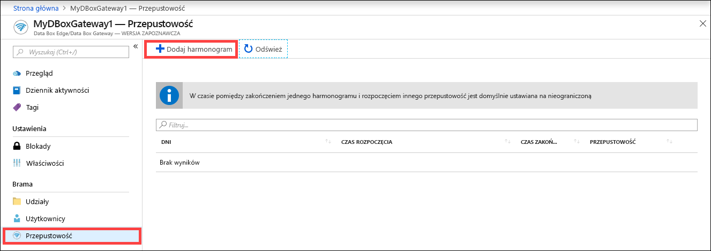
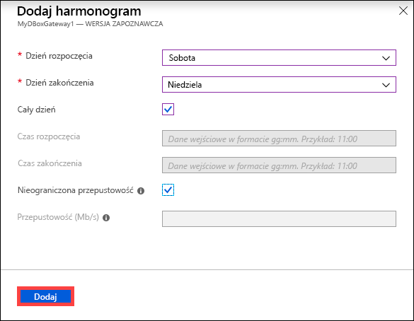
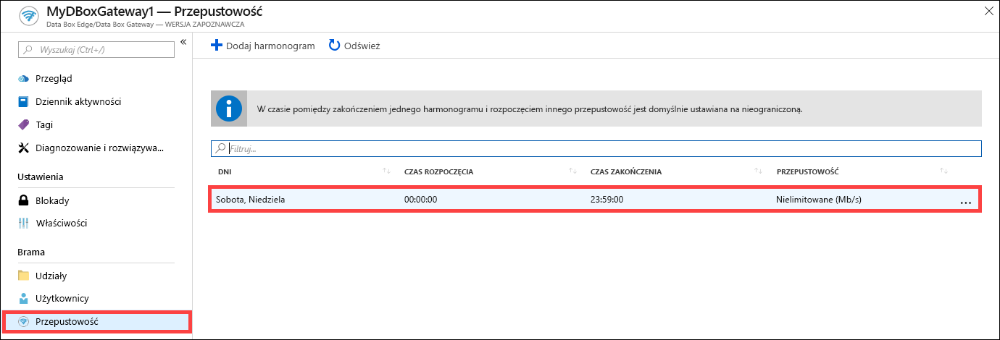
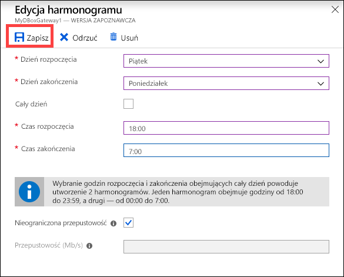
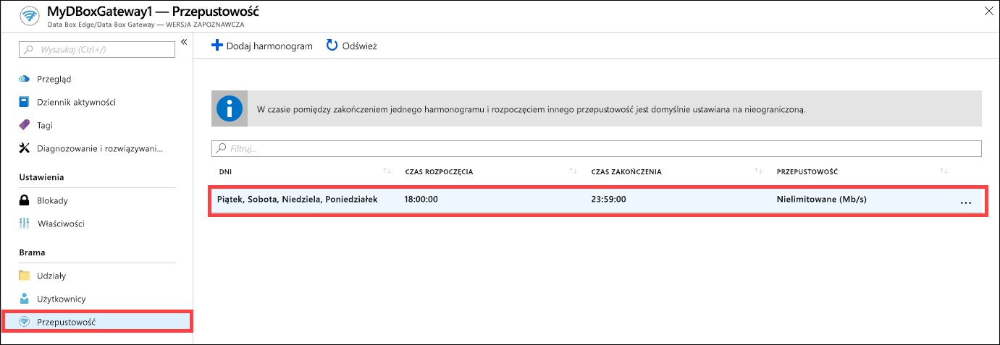
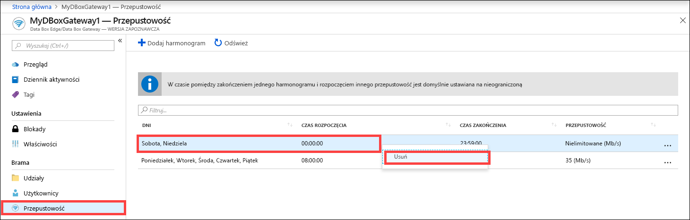

# Zarządzanie harmonogramami przepustowości w usłudze Azure Data Box Gateway przy użyciu witryny Azure Portal  

W tym artykule opisano sposób zarządzania użytkownikami w usłudze Azure Data Box Gateway. Harmonogramy przepustowości pozwalają konfigurować użycie przepustowości sieci w wielu harmonogramach dotyczących pory dnia. Te harmonogramy można zastosować do operacji przekazywania i pobierania wykonywanych z urządzenia do chmury. 

Harmonogramy przepustowości w usłudze Data Box Gateway można dodawać, modyfikować lub usuwać za pomocą witryny Azure Portal.

W tym artykule omówiono sposób wykonywania następujących zadań:

> [!div class="checklist"]
> * Dodawanie harmonogramu
> * Modyfikowanie harmonogramu
> * Usuwanie harmonogramu 

## Dodawanie harmonogramu

Wykonaj następujące czynności w witrynie Azure Portal, aby dodać użytkownika.

1. W witrynie Azure Portal przejdź do zasobu usługi Data Box Gateway, a następnie do sekcji **Przepustowość**.
2. W okienku po prawej stronie kliknij przycisk **+ Dodaj harmonogram**.

    

3. W obszarze **Dodaj harmonogram**: 

   1. Podaj **Dzień rozpoczęcia**, **Dzień zakończenia**, **Godzinę rozpoczęcia** i **Godzinę zakończenia** uruchomienia harmonogramu. 
   2. Jeśli ten harmonogram jest uruchamiany przez cały dzień, możesz zaznaczyć opcję **Cały dzień**. 
   3. **Współczynnik przepustowości** określa w megabitach na sekundę (Mb/s) przepustowość wykorzystywaną przez urządzenie w operacjach dotyczących chmury — zarówno przekazywania, jak i pobierania danych. W tym polu podaj liczbę z zakresu od 1 do 1000. 
   4. Zaznacz pole **Nieograniczona** przepustowość, jeśli nie chcesz ustalać czasu przekazywania i pobierania. 
   5. Kliknij przycisk **Dodaj**.

      

3. Harmonogram zostanie utworzony przy użyciu wybranych parametrów. Następnie harmonogram zostanie wyświetlony w portalu na liście harmonogramów przepustowości.

## Edytowanie harmonogramu

Wykonaj poniższe czynności, aby edytować harmonogram przepustowości. 

1. W witrynie Azure Portal przejdź do zasobu usługi Data Box Gateway, a następnie do sekcji Przepustowość. 
2. Na liście harmonogramów przepustowości kliknij harmonogram, który chcesz zmodyfikować.
    

3. Wprowadź i zapisz odpowiednie zmiany.

    

4. Lista harmonogramów zostanie zaktualizowana w celu uwzględnienia zmodyfikowanego harmonogramu.

    

## Usuwanie harmonogramu

Wykonaj następujące czynności, aby usunąć harmonogram przepustowości skojarzony z urządzeniem Data Box Gateway.

1. W witrynie Azure Portal przejdź do zasobu usługi Data Box Gateway, a następnie do sekcji **Przepustowość**.  

2. Na liście harmonogramów przepustowości wybierz harmonogram, który chcesz usunąć. Kliknij prawym przyciskiem myszy, aby wyświetlić menu kontekstowe, a następnie kliknij polecenie **Usuń**. 

   

3.  Po usunięciu harmonogramu lista harmonogramów zostanie zaktualizowana.

## Następne kroki

- Dowiedz się, jak [zarządzać przepustowością](data-box-gateway-manage-bandwidth-schedules.md).
