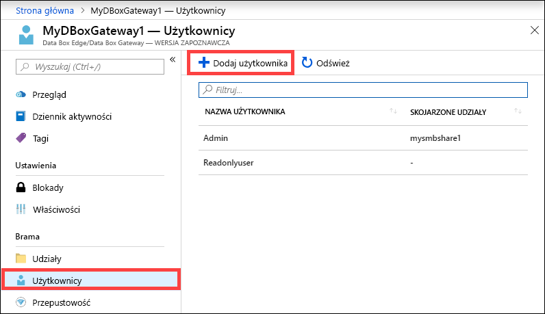
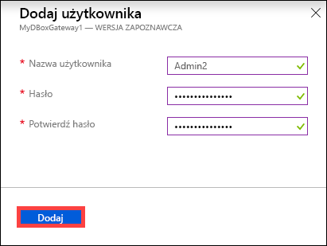
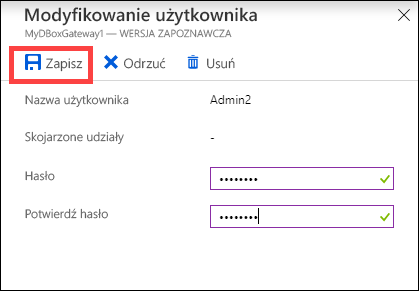
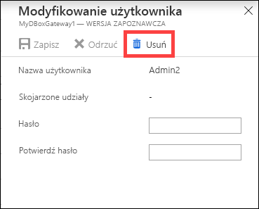
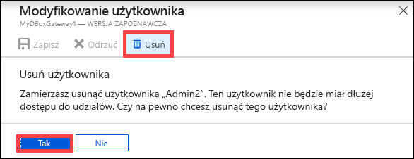
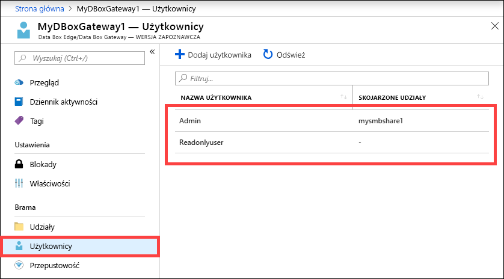

# Zarządzanie użytkownikami w usłudze Azure Data Box Gateway przy użyciu witryny Azure Portal 

W tym artykule opisano sposób zarządzania użytkownikami w usłudze Azure Data Box Gateway. Usługą Azure Data Box Gateway można zarządzać w witrynie Azure Portal lub za pomocą lokalnego internetowego interfejsu użytkownika. Witryna Azure Portal umożliwia dodawanie, modyfikowanie i usuwanie użytkowników.

W tym artykule omówiono sposób wykonywania następujących zadań:

> [!div class="checklist"]
> * Dodawanie użytkownika
> * Modyfikowanie harmonogramu
> * Usuwanie użytkownika 

## Informacje o użytkownikach

Użytkownicy mogą mieć prawo tylko do odczytu lub pełne uprawnienia. Jak sugerują nazwy, użytkownicy z prawem tylko do odczytu mogą wyłącznie wyświetlać dane udziału. Użytkownicy z pełnymi uprawnieniami mogą odczytywać dane udziału, dokonywać zapisu w tych udziałach oraz modyfikować lub usuwać dane udziału. 

 - **Użytkownik z pełnymi uprawnieniami** — użytkownik lokalny z pełnym dostępem. 
 - **Użytkownik z prawem tylko do odczytu** — użytkownik lokalny z dostępem tylko do odczytu. Ci użytkownicy są powiązani z udziałami, które umożliwiają wykonywanie operacji tylko do odczytu.

Uprawnienia użytkownika są definiowane podczas jego tworzenia w czasie tworzenia udziału. Po zdefiniowaniu uprawnień związanych z użytkownikiem można je zmodyfikować za pomocą Eksploratora plików. 

## Dodawanie użytkownika

Wykonaj następujące czynności w witrynie Azure Portal, aby dodać użytkownika.

1. W witrynie Azure Portal przejdź do zasobu usługi Data Box Gateway, a następnie do sekcji **Przegląd**. Na pasku poleceń kliknij przycisk **+ Dodaj użytkownika**.

    

2. Określ nazwę i hasło użytkownika, którego chcesz dodać. Potwierdź hasło, a następnie kliknij przycisk **Dodaj**.

    

    > [!IMPORTANT] 
    > Ci użytkownicy są zastrzeżone przez system i nie powinny być używane: Administrator, EdgeUser EdgeSupport, HcsSetupUser, WDAGUtilityAccount, CLIUSR, konta domyślnego, gościa.  

3. Otrzymasz powiadomienie, gdy tworzenie użytkownika zostanie rozpoczęte i zakończone. Po utworzeniu użytkownika na pasku poleceń kliknij przycisk **Odśwież**, aby wyświetlić zaktualizowaną listę użytkowników.

## Modyfikowanie użytkownika

Po utworzeniu użytkownika możesz zmienić przypisane do niego hasło. Kliknij wybraną pozycję na liście użytkowników. Podaj i potwierdź nowe hasło. Zapisz zmiany.
 

## Usuwanie użytkownika

Wykonaj następujące czynności w witrynie Azure Portal, aby usunąć użytkownika.

1. Kliknij wybranego użytkownika na liście, a następnie kliknij przycisk **Usuń**.  

   

2. Po wyświetleniu monitu potwierdź usunięcie. 

   

Lista użytkowników zostanie zaktualizowana w celu uwzględnienia usuniętego użytkownika.

## Kolejne kroki

- Dowiedz się, jak [zarządzać przepustowością](data-box-gateway-manage-bandwidth-schedules.md).
