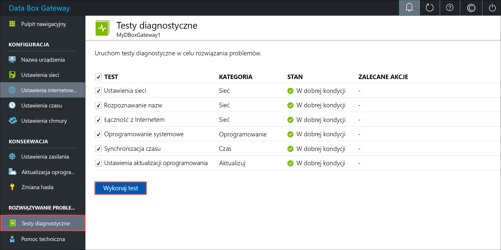
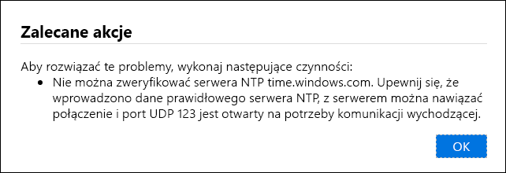
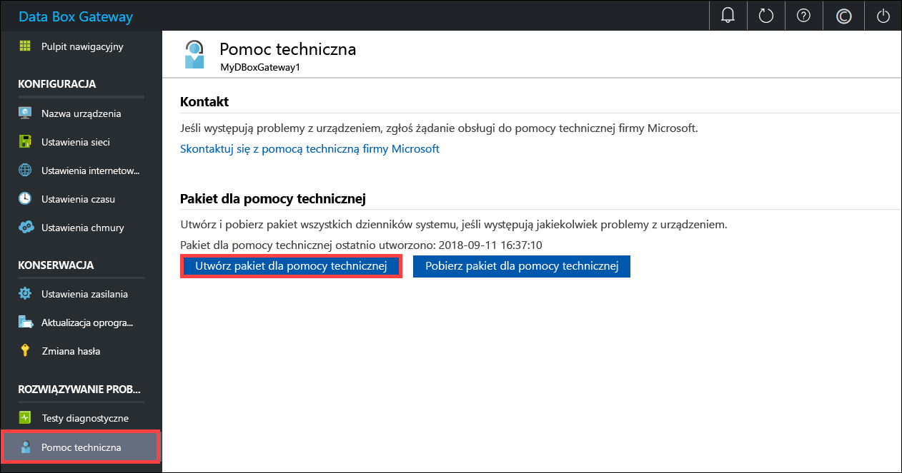
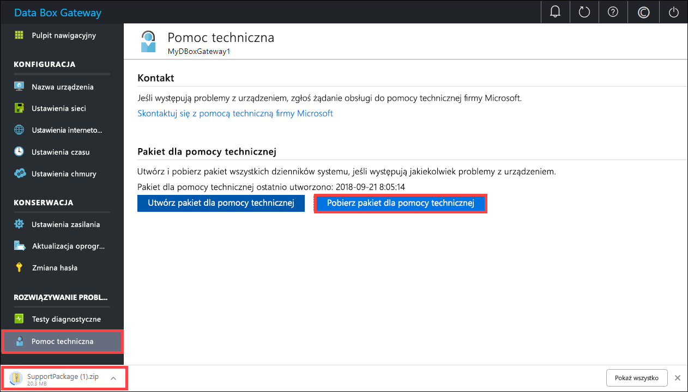
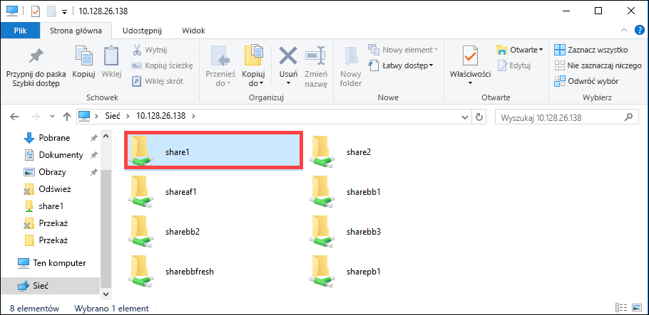

# <a name="troubleshoot-your-azure-data-box-gateway-issues"></a>Rozwiązywanie problemów związanych z usługą Azure Data Box Gateway 

W tym artykule opisano sposoby rozwiązywania problemów z usługą Azure Data Box Gateway. W tym artykule omówiono sposób wykonywania następujących zadań:

> [!div class="checklist"]
> * Uruchamianie diagnostyki
> * Zbieranie pakietu dla pomocy technicznej
> * Rozwiązywanie problemów przy użyciu dzienników


## <a name="run-diagnostics"></a>Uruchamianie diagnostyki

Diagnozowanie i rozwiązywanie problemów związanych z błędami urządzenia jest możliwe dzięki testom diagnostycznym. Wykonaj następujące czynności w lokalnym internetowym interfejsie użytkownika, aby uruchomić testy diagnostyczne.

1. W lokalnym internetowym interfejsie użytkownika wybierz kolejno pozycje **Rozwiązywanie problemów > Testy diagnostyczne**. Wybierz test, który chcesz uruchomić, a następnie kliknij przycisk **Uruchom test**. To spowoduje uruchomienie testów pozwalających zdiagnozować wszelkie możliwe problemy z siecią, urządzeniem, internetowym serwerem proxy, czasem lub ustawieniami chmury. Otrzymasz powiadomienie, że urządzenie wykonuje testy.

    
 
2. Po zakończeniu wykonywania testów zostaną wyświetlone wyniki. Jeśli test zakończy się niepowodzeniem, zostanie wyświetlony adres URL zalecanej akcji. Możesz kliknąć adres URL, aby wyświetlić zalecaną akcję. 
 
    


## <a name="collect-support-package"></a>Zbieranie pakietu dla pomocy technicznej

Pakiet dziennika składa się ze wszystkich odpowiednich dzienników, które mogą okazać się przydatne dla pomocy technicznej firmy Microsoft podczas rozwiązywania różnego rodzaju problemów z urządzeniami. Pakiet dziennika można wygenerować za pomocą lokalnego internetowego interfejsu użytkownika.

Wykonaj następujące czynności, aby zebrać pakiet dla pomocy technicznej. 

1. W lokalnym internetowym interfejsie użytkownika wybierz kolejno pozycje **Rozwiązywanie problemów > Pomoc techniczna**. Kliknij przycisk **Utwórz pakiet dla pomocy technicznej**. System rozpoczyna zbieranie pakietu dla pomocy technicznej. Zbieranie pakietu może potrwać kilka minut.

    
 
2. Po utworzeniu pakietu dla pomocy technicznej kliknij przycisk **Pobierz pakiet dla pomocy technicznej**. Skompresowany pakiet zostanie pobrany w wybranej ścieżce. Można rozpakować pakiet.

    

## <a name="use-logs-to-troubleshoot"></a>Rozwiązywanie problemów przy użyciu dzienników

Wszelkie błędy występujące podczas procesów przekazywania i odświeżania są uwzględniane w odpowiednich plikach błędów.

1. Aby wyświetlić pliki błędów, przejdź do udziału i kliknij go w celu wyświetlenia jego zawartości. 

      

2. Kliknij folder _Microsoft Data Box Gateway_. Ten folder zawiera dwa podfoldery:

   - Folder przekazywania zawierający pliki dziennika w przypadku błędów przekazywania.
   - Folder odświeżania dla błędów podczas odświeżania.

     Oto przykładowy plik dziennika, który ma zostać odświeżony.

     ```
     <root container="brownbag1" machine="VM15BS020663" timestamp="07/18/2018 00:11:10" />
     <file item="test.txt" local="False" remote="True" error="16001" />
     <summary runtime="00:00:00.0945320" errors="1" creates="2" deletes="0" insync="3" replaces="0" pending="9" />
     ``` 

3. W razie pojawienia się w tym pliku błędu (zaznaczonego w próbce), zanotuj jego kod — w tym przypadku jest to 16001. Sprawdź opis dla tego kodu błędu w odniesieniu do następujących informacji o błędzie.

    |     Kod błędu     |     Nazwa wyjątku                                         |     Opis błędu                                                                                                                                                                                                                     |
    |--------------------|------------------------------------------------------------|-------------------------------------------------------------------------------------------------------------------------------------------------------------------------------------------------------------------------------------------|
    |    100             |    ERROR_CONTAINER_OR_SHARE_NAME_LENGTH                    |    Nazwa kontenera lub udziału musi mieć długość od 3 do 63 znaków.                                                                                                                                                                     |
    |    101             |    ERROR_CONTAINER_OR_SHARE_NAME_ALPHA_NUMERIC_DASH        |    Nazwa kontenera lub udziału musi zawierać wyłącznie litery, cyfry lub łączniki.                                                                                                                                                       |
    |    102             |    ERROR_CONTAINER_OR_SHARE_NAME_IMPROPER_DASH             |    Nazwa kontenera lub udziału musi zawierać wyłącznie litery, cyfry lub łączniki.                                                                                                                                                       |
    |    103             |    ERROR_BLOB_OR_FILE_NAME_CHARACTER_CONTROL               |    Nazwa obiektu blob lub pliku zawiera nieobsługiwane znaki kontrolne.                                                                                                                                                                       |
    |    104             |    ERROR_BLOB_OR_FILE_NAME_CHARACTER_ILLEGAL               |    Nazwa obiektu blob lub pliku zawiera niedozwolone znaki.                                                                                                                                                                                   |
    |    105             |    ERROR_BLOB_OR_FILE_NAME_SEGMENT_COUNT                   |    Nazwa obiektu blob lub pliku zawiera zbyt wiele segmentów (każdy segment jest oddzielony kreską ukośną /).                                                                                                                                              |
    |    106             |    ERROR_BLOB_OR_FILE_NAME_AGGREGATE_LENGTH                |    Nazwa obiektu blob lub pliku jest za długa.                                                                                                                                                                                                     |
    |    107             |    ERROR_BLOB_OR_FILE_NAME_COMPONENT_LENGTH                |    Jeden z segmentów w nazwie obiektu blob lub pliku jest zbyt długi.                                                                                                                                                                            |
    |    108             |    ERROR_BLOB_OR_FILE_SIZE_LIMIT                           |    Rozmiar pliku przekracza maksymalny rozmiar pliku do przekazania.                                                                                                                                                                              |
    |    109             |    ERROR_BLOB_OR_FILE_SIZE_ALIGNMENT                       |    Obiekt blob lub plik jest nieprawidłowo wyrównany.                                                                                                                                                                                               |
    |    110             |    ERROR_NAME_NOT_VALID_UNICODE                            |    Nazwa pliku lub obiektu blob w formacie Unicode jest nieprawidłowa.                                                                                                                                                                                  |
    |    111             |    ERROR_RESERVED_NAME_NOT_ALLOWED                         |    Nazwa lub prefiks pliku bądź obiektu blob jest nazwą zarezerwowaną, która nie jest obsługiwana (np. COM1).                                                                                                                             |
    |    2000            |    ERROR_ETAG_MISMATCH                                     |    Niezgodność elementu etag wskazuje na konflikt między blokowym obiektem blob w chmurze i na urządzeniu. Aby rozwiązać ten konflikt, należy usunąć jeden z tych plików — wersję w chmurze lub wersję na urządzeniu.    |
    |    2001            |    ERROR_UNEXPECTED_FINALIZE_FAILURE                       |    Wystąpił nieoczekiwany problem podczas przetwarzania pliku po jego przekazaniu.    Jeśli zostanie wyświetlony ten błąd i utrzymuje się on dłużej niż 24 godziny, należy skontaktować się z pomocą techniczną.                                                      |
    |    2002            |    ERROR_ALREADY_OPEN                                      |    Plik jest już otwarty w innym procesie i nie można go przekazać, dopóki proces ten nie zostanie zakończony.                                                                                                                                       |
    |    2003            |    ERROR_UNABLE_TO_OPEN                                    |    Nie można otworzyć pliku przeznaczonego do przekazania. Jeśli zostanie wyświetlony ten błąd, skontaktuj się z pomocą techniczną firmy Microsoft.                                                                                                                                                |
    |    2004            |    ERROR_UNABLE_TO_CONNECT                                 |    Nie można nawiązać połączenia z kontenerem w celu przekazania do niego danych.                                                                                                                                                                             |
    |    2005            |    ERROR_INVALID_CLOUD_CREDENTIALS                         |    Nie można nawiązać połączenia z kontenerem, ponieważ uprawnienia konta są nieprawidłowe lub nieaktualne. Sprawdź dostęp.                                                                                                               |
    |    2006            |    ERROR_CLOUD_ACCOUNT_DISABLED                            |    Nie można przekazać danych do konta, ponieważ konto lub udział jest wyłączony.                                                                                                                                                            |
    |    2007            |    ERROR_CLOUD_ACCOUNT_PERMISSIONS                         |    Nie można nawiązać połączenia z kontenerem, ponieważ uprawnienia konta są nieprawidłowe lub nieaktualne. Sprawdź dostęp.                                                                                                               |
    |    2008            |    ERROR_CLOUD_CONTAINER_SIZE_LIMIT_REACHED                |    Nie można dodać nowych danych, ponieważ kontener jest pełny. Sprawdź specyfikacje dotyczące platformy Azure pod kątem obsługiwanych rozmiarów kontenerów na podstawie ich typu. Na przykład maksymalny rozmiar dla plików platformy Azure wynosi 5 TB.                                     |
    |    2009            |    ERROR_CLOUD_CONTAINER_MISSING                |     Nie można przekazać danych, ponieważ nie istnieje kontener skojarzony z udziałem.                                     |    
    |    2997            |    ERROR_ITEM_CANCELED                                     |    Wystąpił nieoczekiwany błąd. Jest to błąd przejściowy, który zostanie naprawiony automatycznie.                                                                           |
    |    2998            |    ERROR_UNMAPPED_FAILURE                                  |    Wystąpił nieoczekiwany błąd. Ten błąd może zostać rozwiązany automatycznie, ale jeśli utrzymuje się przez więcej niż 24 godziny, należy skontaktować się z pomocą techniczną firmy Microsoft.                                                                                                     |
    |    16000           |    RefreshException                                        |    Nie można pobrać tego pliku.                                                                                                                                                                                                        |
    |    16001           |    RefreshAlreadyExistsException                           |    Nie można pobrać tego pliku, ponieważ już istnieje w systemie lokalnym.                                                                                                                                                         |
    |    16002           |    RefreshWorkNeededException                              |    Nie można odświeżyć tego pliku, ponieważ nie został on w całości przekazany.                                                                                                                                                                          | 


## <a name="next-steps"></a>Kolejne kroki

- Dowiedz się więcej o [znanych problemach w tej wersji](data-box-gateway-release-notes.md).
