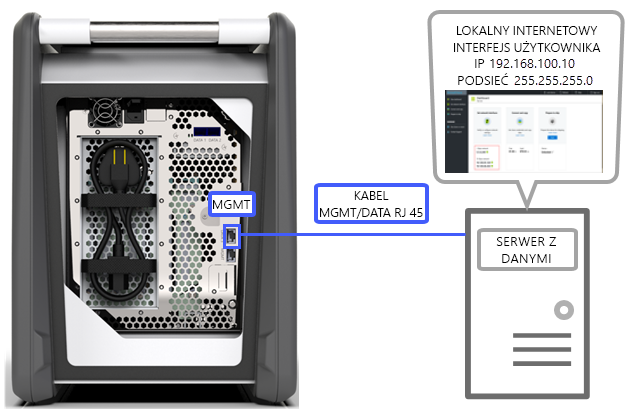
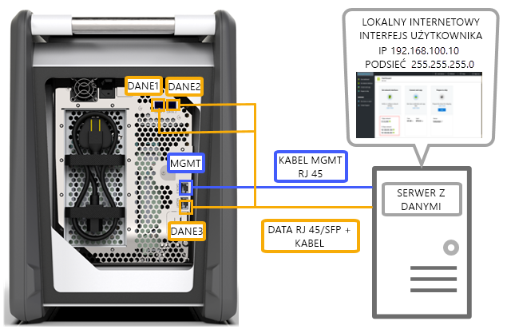
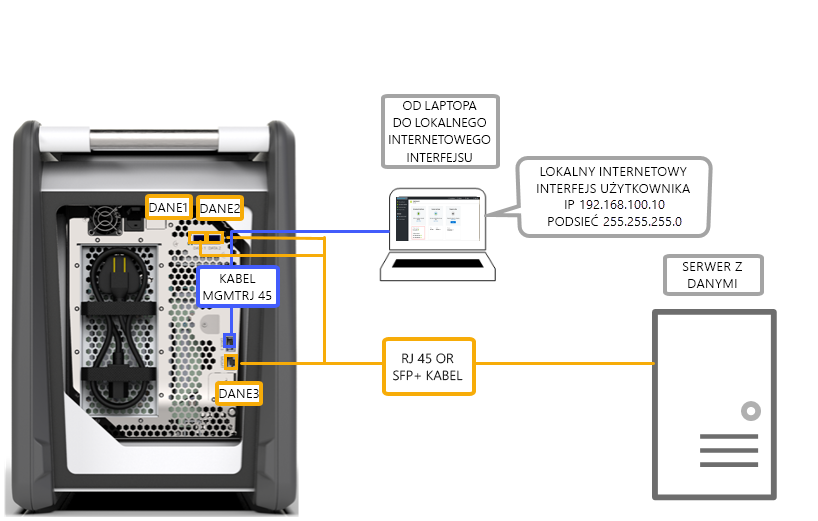
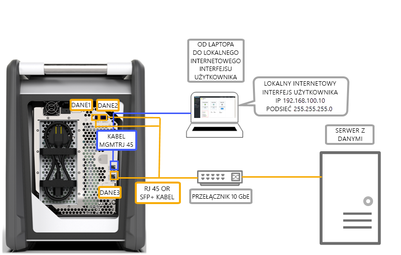
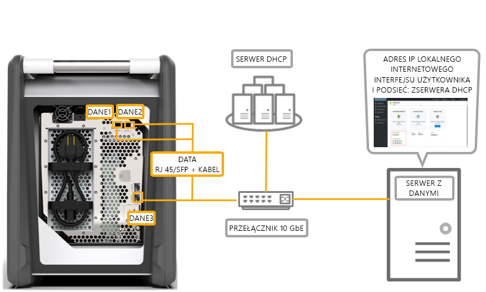

# Opcje okablowania urządzenia Azure Data Box

W tym artykule opisano różne sposoby okablowania urządzenia Azure Data Box na potrzeby transferu danych.

## Transfer za pośrednictwem portu MGMT

Ta opcja jest absolutnie minimalną konfiguracją dla usługi Data Box. Możesz skonfigurować tylko port MGMT na potrzeby zarówno zarządzania, jak i danych.

Przed rozpoczęciem upewnij się, że masz następujące elementy:

- Kabel Ethernet RJ-45 dla portu MGMT.
- Źródło danych z [obsługiwanym systemem operacyjnym](data-box-system-requirements.md#supported-operating-systems-for-clients).

Wykonaj poniższe kroki, aby okablować urządzenie.

1. Za pomocą kabla RJ-45 podłącz port MGMT do serwera, na którym znajdują się dane.

    

2. Na serwerze ustaw:

    - **Adres IP** na 192.168.100.5
    - **Podsieć** na 255.255.255.0

3. Dostęp do lokalnego interfejsu użytkownika sieci Web urządzenia w: 192.168.100.10. Zaloguj się i odblokuj urządzenie Data Box przy użyciu hasła odblokowania z witryny Azure Portal.

## Transfer za pośrednictwem portu DATA przy użyciu statycznych adresów IP

Na urządzeniu Data Box możesz skonfigurować dwa porty: port MGMT na potrzeby ruchu związanego z zarządzaniem i jeden z portów danych (DATA) na potrzeby danych. Portami danych mogą być porty DATA 1, DATA 2 lub DATA 3.

W przypadku konfigurowania tylko jednego portu zdecydowanie zaleca się, aby był to port 10 GbE, taki jak DATA 1 lub DATA 2. Użycie portu 1 GbE może znacznie wydłużyć czas potrzebny na transfer danych.

Przed rozpoczęciem upewnij się, że masz następujące elementy:

- Kabel Ethernet RJ-45 dla portu MGMT.
- Kabel miedziany SFP+ Twinax 10 GbE dla każdego portu danych 10 GbE, który chcesz podłączyć.
- Co najmniej jedno źródło danych z [obsługiwanym systemem operacyjnym](data-box-system-requirements.md#supported-operating-systems-for-clients).

### Opcja 1 — Konfiguracja początkowa za pomocą serwera

Wykonaj poniższe kroki, aby okablować urządzenie.

1. Za pomocą kabla Ethernet RJ-45 podłącz serwer bezpośrednio do portu MGMT na potrzeby konfiguracji.
2. Za pomocą kabla RJ-45 (w przypadku portu DATA 3) lub kabla SFP+ (w przypadku portu DATA 1 lub DATA 2) podłącz urządzenie do serwera działającego jako źródło danych. Zalecamy użycie portów 10 GbE DATA 1 lub DATA 2 w celu uzyskania dobrej wydajności.
3. Na serwerze ustaw:

   - **Adres IP** na 192.168.100.5
   - **Podsieć** na 255.255.255.0

     

3. Dostęp do lokalnego interfejsu użytkownika sieci Web urządzenia w: 192.168.100.10. Zaloguj się i odblokuj urządzenie Data Box przy użyciu hasła odblokowania z witryny Azure Portal.
4. Przypisz statyczne adresy IP do skonfigurowanych portów danych.

### Opcja 2 — Konfiguracja początkowa za pomocą oddzielnego komputera

Wykonaj poniższe kroki, aby okablować urządzenie.

1. Aby skonfigurować konfigurację, użyj kabla Ethernet RJ45 z osobnego komputera bezpośrednio do portu zarządzania.
2. Za pomocą kabla RJ-45 (w przypadku portu DATA 3) lub kabla SFP+ (w przypadku portu DATA 1 lub DATA 2) podłącz urządzenie do serwera. Zalecamy użycie portów 10 GbE DATA 1 lub DATA 2 w celu uzyskania dobrej wydajności. Porty danych są połączone z serwerem zawierającym dane za pośrednictwem przełącznika 10 GbE.
3. Skonfiguruj kartę Ethernet na komputerze przenośnym używanym do nawiązywania połączenia z urządzeniem za pomocą następujących ustawień:

   - **Adres IP** 192.168.100.5
   - **Podsieć** 255.255.255.0.

     

3. Dostęp do lokalnego interfejsu użytkownika sieci Web urządzenia w: 192.168.100.10. Zaloguj się i odblokuj urządzenie Data Box przy użyciu hasła odblokowania z witryny Azure Portal.
4. Zidentyfikuj adresy IP przypisane przez serwer DHCP.

## Transfer za pośrednictwem portu DATA z użyciem przełącznika 

Tej konfiguracji należy użyć w przypadku wielu źródeł danych w sieciach 1 GbE i 10 GbE.

Przed rozpoczęciem upewnij się, że masz następujące elementy:

- Kabel Ethernet RJ-45 dla portu MGMT.
- Kabel miedziany SFP+ Twinax 10 GbE dla każdego portu danych 10 GbE, który chcesz podłączyć.
- Co najmniej jedno źródło danych z [obsługiwanym systemem operacyjnym](data-box-system-requirements.md#supported-operating-systems-for-clients). Te źródła danych mogą znajdować się w różnych sieciach, takich jak sieci 1 GbE lub 10 GbE.

Wykonaj poniższe kroki, aby okablować urządzenie.

1. Za pomocą kabla Ethernet RJ-45 podłącz serwer bezpośrednio do portu MGMT na potrzeby konfiguracji.
2. Za pomocą kabla RJ-45 (w przypadku portu DATA 3) lub kabla SFP+ (w przypadku portu DATA 1 lub DATA 2) podłącz urządzenie do serwera. Zalecamy użycie portów 10 GbE DATA 1 lub DATA 2 w celu uzyskania dobrej wydajności.
3. Skonfiguruj kartę Ethernet na komputerze przenośnym używanym do nawiązywania połączenia z urządzeniem za pomocą następujących ustawień:

   - **Adres IP** 192.168.100.5
   - **Podsieć** 255.255.255.0.

     

3. Dostęp do lokalnego interfejsu użytkownika sieci Web urządzenia w: 192.168.100.10. Zaloguj się i odblokuj urządzenie Data Box przy użyciu hasła odblokowania z witryny Azure Portal.
4. Przypisz statyczne adresy IP do skonfigurowanych portów danych.

## Transfer za pośrednictwem portu DATA w środowisku DHCP

Użyj tej konfiguracji, jeśli urządzenie będzie pracować w środowisku DHCP.

Przed rozpoczęciem upewnij się, że masz następujące elementy:

- Kabel RJ-45, jeśli chcesz podłączyć port DATA 1.
- Kabel miedziany SFP+ Twinax 10 GbE dla każdego portu danych 10 GbE, który chcesz podłączyć.
- Co najmniej jedno źródło danych z [obsługiwanym systemem operacyjnym](data-box-system-requirements.md#supported-operating-systems-for-clients). Te źródła danych mogą znajdować się w różnych sieciach, takich jak sieci 1 GbE lub 10 GbE.

Wykonaj poniższe kroki, aby okablować urządzenie.

1. Użyj kabla RJ-45 lub SFP+ za pośrednictwem przełącznika (jeżeli serwer DHCP jest dostępny) do serwera.

    
2. Użyj serwera DHCP lub serwera DNS, aby zidentyfikować adres IP.
3. Z serwera w tej samej sieci uzyskaj dostęp do lokalnego interfejsu użytkownika urządzenia przy użyciu adresu IP przypisanego przez serwer DHCP. Zaloguj się i odblokuj urządzenie Data Box przy użyciu hasła odblokowania z witryny Azure Portal.

## Następne kroki

- Po okablowaniu urządzenia przejdź do samouczka [Copy data to your Azure Data Box (Kopiowanie danych na urządzenie Azure Data Box)](data-box-deploy-copy-data.md).
