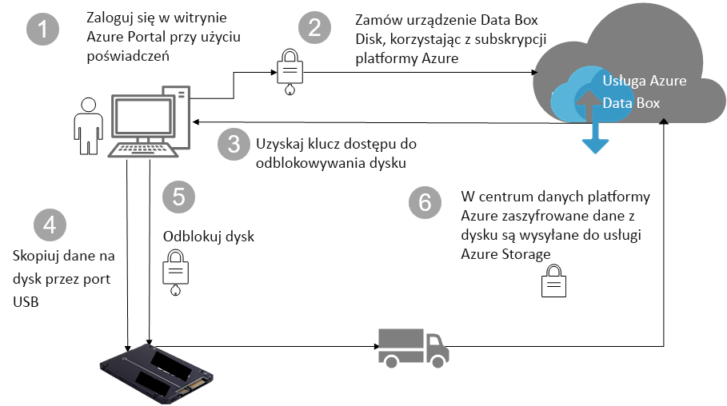

# Zabezpieczenia i ochrona danych w usłudze Azure Data Box Disk

W tym artykule opisano funkcje zabezpieczeń usługi Azure Data Box Disk, które pomagają chronić poszczególne składniki rozwiązania Data Box i przechowywane w nich dane. 

## Przepływ danych za pośrednictwem składników

Rozwiązanie Microsoft Azure Data Box obejmuje cztery główne składniki, które wzajemnie ze sobą współdziałają:

- **Usługa Azure Data Box hostowana na platformie Azure** — usługa do zarządzania, umożliwiająca zamówienie dysków, skonfigurowanie ich oraz śledzenie realizacji zamówienia.
- **Urządzenia Data Box Disk** — dyski fizyczne dostarczane w celu zaimportowania danych lokalnych na platformę Azure. 
- **Klienci/hosty, do których podłączane są dyski** — klienci w infrastrukturze lokalnej, do których za pośrednictwem portu USB podłącza się urządzenie Data Box Disk, i które zawierają dane wymagające ochrony.
- **Magazyn w chmurze** — lokalizacja w chmurze platformy Azure, w której są przechowywane dane. Zazwyczaj jest to konto magazynu połączone z utworzonym zasobem usługi Azure Data Box.

Poniższy diagram przedstawia przepływ danych z infrastruktury lokalnej na platformę Azure za pośrednictwem rozwiązania Azure Data Box Disk.

## Funkcje zabezpieczeń

Data Box Disk to bezpieczne rozwiązanie do ochrony danych, które gwarantuje, że wyłącznie upoważnione podmioty będą mogły uzyskać dostęp do danych, zmodyfikować je lub usunąć. Zabezpieczenia rozwiązania obejmują zabezpieczenia urządzenia i powiązanej usługi, zapewniające bezpieczeństwo przechowywanych danych. 

### Ochrona urządzenia Data Box Disk

Urządzenie Data Box Disk jest chronione przez następujące funkcje:

- Stałe szyfrowanie dysku funkcją BitLocker z użyciem 128-bitowego algorytmu AES.
- Funkcja bezpiecznych aktualizacji dysków.
- Dyski są dostarczane w stanie zablokowanym i można je odblokować wyłącznie za pomocą narzędzia do odblokowywania dysków Data Box. Narzędzie do odblokowywania jest dostępne w portalu usługi Data Box Disk.

### Ochrona danych na urządzeniu Data Box Disk

Dane przesyłane do i z rozwiązania Data Box Disk są chronione przez następujące funkcje:

- Stałe szyfrowanie danych funkcją BitLocker. 
- Bezpieczne usunięcie danych z dysku po zakończeniu przekazywania danych na platformę Azure. Dane są usuwane zgodnie z normą NIST 800-88r1.

### Ochrona usługi Data Box

Usługa Data Box jest chroniona przez następujące funkcje.

- Aby uzyskać dostęp do usługi Data Box Disk, organizacja musi mieć subskrypcję platformy Azure obejmującą usługę Data Box Disk. Subskrypcja określa funkcje, do których masz dostęp w witrynie Azure Portal.
- Ponieważ usługa Data Box jest hostowana na platformie Azure, chronią ją funkcje zabezpieczeń platformy Azure. Aby uzyskać więcej informacji na temat funkcji zabezpieczeń platformy Microsoft Azure, zobacz [Centrum zaufania Microsoft Azure](https://www.microsoft.com/TrustCenter/Security/default.aspx). 
- Na urządzeniu Data Box Disk jest przechowywany klucz dostępu używany do odblokowania dysku w usłudze. 
- W usłudze Data Box Disk są przechowywane szczegóły zamówienia i jego stan. Te informacje są usuwane po usunięciu zamówienia. 

## Zarządzanie danymi osobowymi

[!INCLUDE [GDPR-related guidance](../../includes/gdpr-intro-sentence.md)]

W usłudze Azure Data Box Disk dane osobowe są zbierane i wyświetlane w następujących kluczowych przypadkach:

- **Ustawienia powiadomień** — podczas tworzenia zamówienia w ustawieniach powiadomień są wprowadzane adresy e-mail użytkowników. Te informacje są widoczne dla administratora. Te informacje są usuwane z usługi, gdy zadanie zmieni stan na końcowy lub gdy zamówienie zostanie usunięte.

- **Szczegóły zamówienia** — po utworzeniu zamówienia na platformie Azure zostaną zapisane dane kontaktowe użytkowników, adres wysyłki, adres e-mail. Zapisane informacje obejmują:

  - Nazwisko osoby kontaktowej
  - Numer telefonu
  - Email
  - Adres
  - Miasto
  - Kod pocztowy
  - Stan
  - Kraj/Województwo/Region
  - Identyfikator dysku
  - Numer konta operatora
  - Numer śledzenia dostawy

    Szczegóły zamówienia są usuwane z usługi Data Box po zakończeniu zadania lub usunięciu zamówienia.

- **Adres wysyłkowy** — po złożeniu zamówienia usługa Data Box przekazuje adres wysyłkowy operatorom zewnętrznym, na przykład firmie UPS lub DHL. 

Aby uzyskać więcej informacji, zapoznaj się z Zasadami ochrony prywatności firmy Microsoft w [Centrum zaufania](https://www.microsoft.com/trustcenter).

## Kolejne kroki

- Zapoznaj się z [wymaganiami rozwiązania Data Box Disk](data-box-disk-system-requirements.md).
- Zapoznaj się z [limitami usługi Data Box Disk](data-box-disk-limits.md).
- Szybko wdróż usługę [Azure Data Box Disk](data-box-disk-quickstart-portal.md) w witrynie Azure Portal.
