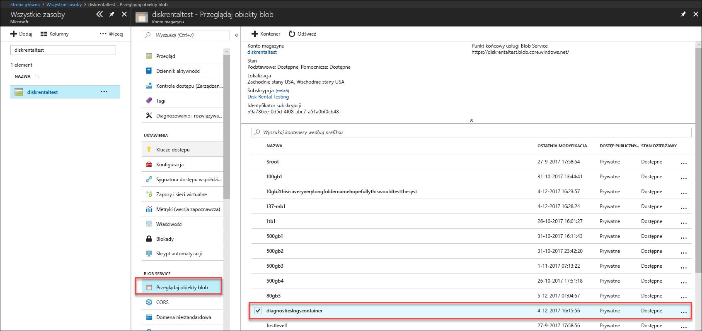
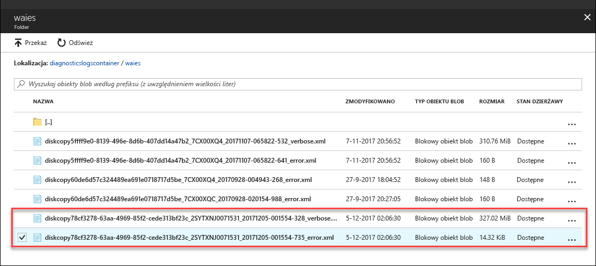

# <a name="troubleshoot-issues-in-azure-data-box-disk"></a>Rozwiązywanie problemów z dysku Azure Data Box

Ten artykuł ma zastosowanie do dysku systemu Microsoft Azure Data Box i opisano przepływy pracy, umożliwia rozwiązanie wszelkich problemów, które zobaczysz podczas wdrażania tego rozwiązania. 

Ten artykuł zawiera następujące sekcje:

- Pobieranie dzienników diagnostycznych
- Wykonywanie zapytań dotyczących dzienników aktywności
- Błędy narzędzia do odblokowywania dysków Data Box Disk
- Błędy narzędzia do dzielenia skopiowanych dysków Data Box Disk

## <a name="download-diagnostic-logs"></a>Pobieranie dzienników diagnostycznych

Jeśli podczas kopiowania danych wystąpi błąd, w portalu zostanie wyświetlona ścieżka do folderu zawierającego dzienniki diagnostyczne. 

Dostępne są następujące rodzaje dzienników diagnostycznych:
- Dzienniki błędów
- Dzienniki szczegółowe  

Aby przejść do ścieżki dziennika kopiowania, przejdź do konta magazynu skojarzonego z zamówieniem urządzenia Data Box. 

1.  Przejdź do pozycji **Ogólne > Szczegóły zamówienia** i zapisz konto magazynu skojarzone z zamówieniem.
 

2.  W obszarze **Wszystkie zasoby** wyszukaj konto magazynu określone w poprzednim kroku. Wybierz i kliknij konto magazynu.

    

3.  Przejdź do pozycji **Blob Service > Przeglądaj obiekty blob** i wyszukaj obiekt blob odpowiadający kontu magazynu. Przejdź do pozycji **diagnosticslogcontainer > waies**. 

    

    Powinny zostać wyświetlone zarówno dzienniki błędów, jak i dzienniki szczegółowe dotyczące kopiowania danych. Wybierz i kliknij każdy z plików, a następnie pobierz kopię lokalną.

## <a name="query-activity-logs"></a>Wykonywanie zapytań dotyczących dzienników aktywności

Możesz użyć dzienników aktywności do znalezienia błędu podczas rozwiązywania problemów lub do monitorowania sposobu, w jaki zasób został zmodyfikowany przez użytkownika w organizacji. Za pomocą dzienników aktywności można określić:

- Jakie operacje zostały wykonane na zasobach w subskrypcji.
- Użytkownik, który zainicjował operację.
- Kiedy została wykonana operacja.
- Stan operacji.
- Wartości innych właściwości, które mogą ułatwić zbadanie operacji.

Dziennik aktywności zawiera informacje o wszystkich operacjach zapisu (takich jak PUT, POST, DELETE) wykonywanych względem zasobów, ale nie zawiera informacji dotyczących operacji odczytu (na przykład GET).

Dzienniki aktywności są przechowywane przez 90 dni. Możesz wykonać zapytanie dotyczące dowolnego zakresu dat, jednak data początkowa nie może być wcześniejsza od daty bieżącej o więcej niż 90 dni. Możesz również filtrować dane, używając jednej z wbudowanych opcji zapytań w sekcji Szczegółowe informacje. Możesz na przykład kliknąć błąd, a następnie wybrać i kliknąć konkretne rodzaje błędów, aby określić główną przyczynę.

## <a name="data-box-disk-unlock-tool-errors"></a>Błędy narzędzia do odblokowywania dysków Data Box Disk


| Komunikat o błędzie/działanie narzędzia      | Zalecenia                                                                                               |
|-------------------------------------------------------------------------------------------------------------------------------------|------------------------------------------------------------------------------------------------------|
| Brak<br><br>Narzędzie do odblokowywania dysków Data Box ulega awarii.                                                                            | Funkcja BitLocker nie jest zainstalowany. Upewnij się, że na komputerze hosta, na którym uruchomiono narzędzie do odblokowywania dysków Data Box, zainstalowano funkcję BitLocker.                                                                            |
| The current .NET Framework is not supported. The supported versions are 4.5 and later.<br><br>Narzędzie kończy działanie, wyświetlając komunikat.  | Program .NET 4.5 nie jest zainstalowany. Zainstaluj program .NET 4.5 lub nowszą wersję na komputerze hosta, na którym uruchomiono narzędzie do odblokowywania dysków Data Box.                                                                            |
| Could not unlock or verify any volumes. Contact Microsoft Support.  <br><br>Za pomocą narzędzia nie można odblokować lub sprawdzić żadnego zablokowanego dysku. | Narzędzie nie mogło odblokować żadnego z zablokowanych dysków przy użyciu podanego klucza dostępu. Skontaktuj się z pomocą techniczną firmy Microsoft, aby uzyskać informacje o kolejnych krokach.                                                |
| Following volumes are unlocked and verified. <br>Litery dysku woluminu: E:<br>Could not unlock any volumes with the following passkeys: werwerqomnf, qwerwerqwdfda <br><br>Narzędzie odblokowało niektóre dyski i wyświetla listę liter dysków, które udało się odblokować, i tych, których nie udało się odblokować.| Częściowe powodzenie. Nie udało się odblokować niektórych dysków przy użyciu podanego klucza dostępu. Skontaktuj się z pomocą techniczną firmy Microsoft, aby uzyskać informacje o kolejnych krokach. |
| Could not find locked volumes. Verify disk received from Microsoft is connected properly and is in locked state.          | Narzędzie nie odnajduje żadnych zablokowanych dysków. Dyski są już odblokowane lub nie zostały wykryte. Upewnij się, że dyski są podłączone i zablokowane.                                                           |
| Błąd krytyczny: Nieprawidłowy parametr<br>Parameter name: invalid_arg<br>USAGE:<br>DataBoxDiskUnlock /PassKeys:<passkey_list_separated_by_semicolon><br><br>Przykład: DataBoxDiskUnlock /PassKeys:passkey1;passkey2;passkey3<br>Przykład: DataBoxDiskUnlock /SystemCheck<br>Przykład: DataBoxDiskUnlock /Help<br><br>/ Klucze dostępu:       Pobierz ten klucz dostępu z usługi Azure DataBox Disk zamówienia. The passkey unlocks your disks.<br>/ Help:           Ta opcja zapewnia pomoc na użycie polecenia cmdlet i przykładów.<br>/SystemCheck:    Ta opcja sprawdza, czy system spełnia wymagania, aby uruchomić narzędzie.<br><br>Press any key to exit. | Wprowadzono nieprawidłowy parametr. Tylko parametry dozwolone są /SystemCheck /PassKey i/Help.                                                                            |

## <a name="data-box-disk-split-copy-tool-errors"></a>Błędy narzędzia do dzielenia skopiowanych dysków Data Box Disk

|Komunikat o błędzie/ostrzeżenia  |Zalecenia |
|---------|---------|
|[Informacje o] Trwa pobieranie hasła funkcji BitLocker dla woluminu: m <br>[Błąd] Wystąpił wyjątek podczas pobierania klucza funkcji BitLocker dla woluminu m:<br> Sekwencja nie zawiera elementów.|Ten błąd jest zwracany, jeśli docelowe dyski Data Box Disk są w trybie offline. <br> W przypadku dysków w trybie online należy użyć narzędzia `diskmgmt.msc`.|
|[Błąd] Zgłoszono wyjątek: Nie można wykonać operacji usługi WMI:<br> Method = UnlockWithNumericalPassword, ReturnValue = 2150694965, <br>Win32Message = format podanego hasła odzyskiwania jest nieprawidłowy. <br>Hasła odzyskiwania funkcji BitLocker są 48-cyfrowe. <br>Sprawdź, czy hasło odzyskiwania ma poprawny format, a następnie spróbuj ponownie.|Użyj narzędzia do odblokowywania dysków Data Box Disk, aby odblokować dyski i ponowić próbę wykonania polecenia. Aby uzyskać więcej informacji, przejdź na stronę <li> [Odblokowywanie dysków Data Box Disk dla klientów systemu Windows](data-box-disk-deploy-set-up.md#unlock-disks-on-windows-client). </li><li> [Odblokowywanie dysków Data Box Disk dla klientów systemu Linux](data-box-disk-deploy-set-up.md#unlock-disks-on-linux-client). </li>|
|[Błąd] Zgłoszono wyjątek: Plik DriveManifest.xml istnieje na dysku docelowego. <br> Oznacza to, że dysk docelowy został prawdopodobnie przygotowany przy użyciu innego pliku dziennika. <br>Aby dodać więcej danych do tego samego dysku, użyj poprzedniego pliku dziennika. Aby usunąć istniejące dane i ponownie użyć dysku docelowego dla nowego zadania importu, usuń plik DriveManifest.xml z dysku. Ponownie uruchom to polecenie, używając nowego pliku dziennika.| Ten błąd zostanie wyświetlony podczas próby użycia tego samego zestawu dysków w wielu sesjach importowania. <br> Z jedną sesją dzielenia i kopiowania można użyć tylko jednego zestawu dysków.|
|[Błąd] Zgłoszono wyjątek: CopySessionId dane importowania września test-1 odwołuje się do poprzedniej sesji kopii i nie można użyć ponownie dla nowej sesji kopiowania.|Ten błąd jest zgłaszany w przypadku próby użycia tej samej nazwy zadania dla nowego zadania, które zostało poprzednio pomyślnie ukończone.<br> Należy przypisać unikatową nazwę dla nowego zadania.|
|[Informacje] Nazwa pliku lub katalogu docelowego przekracza limit długości dla systemu plików NTFS. |Ten komunikat jest zgłaszany, gdy nazwa pliku docelowego została zmieniona z powodu długiej ścieżki pliku.<br> Aby sterować tym zachowaniem, należy zmodyfikować opcję dyspozycji w pliku `config.json`.|
|[Błąd] Zgłoszono wyjątek: Nieprawidłowa sekwencja ucieczki JSON. |Ten komunikat jest zgłaszany, gdy format pliku config.json jest nieprawidłowy. <br> Przed zapisaniem pliku `config.json` zweryfikuj go przy użyciu narzędzia [JSONlint](https://jsonlint.com/).|

## <a name="deployment-issues-for-linux"></a>Problemy z wdrażaniem w systemie Linux

W tej sekcji przedstawiono niektóre najważniejsze problemy sterowaną podczas wdrażania dysku Data Box za pomocą klienta systemu Linux do kopiowania danych.

### <a name="issue-drive-getting-mounted-as-read-only"></a>Problem: Dysk wprowadzenie zainstalowany jako tylko do odczytu
 
**Przyczyna** 

Może to być spowodowane system nieczyste plików. 

Woluminom dysk w trybie odczytu i zapisu nie działa z dyskami pola danych. Ten scenariusz nie jest obsługiwany z stacje odszyfrować dislocker. Użytkownik może mieć pomyślnie ponownej instalacji urządzenia przy użyciu następującego polecenia:

    `# mount -o remount, rw /mnt/DataBoxDisk/mountVol1`

Chociaż woluminom zakończyło się pomyślnie, dane nie będą zachowywane.

**Rozdzielczość**

Wykonaj następujące kroki w systemie Linux:

1. Zainstaluj `ntfsprogs` pakietów dla narzędzia ntfsfix.
2. Odinstaluj udostępniane na potrzeby dysku narzędzia unlock punktów instalacji. Liczba punktów instalacji różnią się dla dysków.

    ```
    unmount /mnt/DataBoxDisk/mountVol1
    ```

3. Uruchom `ntfsfix` odpowiedniej ścieżki. Wyróżnione liczba może być taki sam jak krok 2.

    ```
    ntfsfix /mnt/DataBoxDisk/bitlockerVol1/dislocker-file
    ```

4. Uruchom następujące polecenie, aby usunąć metadane hibernacji, które mogą być przyczyną problemu instalacji.

    ```
    ntfs-3g -o remove_hiberfile /mnt/DataBoxDisk/bitlockerVol1/dislocker-file /mnt/DataBoxDisk/mountVol1
    ```

5. Czy czyste odinstalowanie.

    ```
    ./DataBoxDiskUnlock_x86_64 /unmount
    ```

6. Wykonaj czystą unlock i instalacji.
7. Testowanie punktu instalacji przez napisanie pliku.
8. Odinstaluj i zainstaluj, aby sprawdzić stan trwały plik.
9. Przejdź do kopiowania danych.
 
### <a name="issue-error-with-data-not-persisting-after-copy"></a>Problem: Błąd nie utrzymuje się po kopiowania danych
 
**Przyczyna** 

Jeśli widzisz, że dysk nie znajdują się dane po odinstalować (chociaż dane zostały skopiowane do niej), a następnie można ponownie zainstalowany dysk jako odczytu / zapisu po dysk został zainstalowany jako tylko do odczytu.

**Rozdzielczość**
 
Jeśli tak jest rzeczywiście, zobacz Rozpoznawanie dla [dyskach Rozpoczynanie zainstalowanego jako tylko do odczytu](#issue-drive-getting-mounted-as-read-only).

Jeśli nie było tak, skopiuj dzienniki z folderu, który zawiera dane pole dysku odblokować narzędzie i [skontaktuj się z Microsoft Support](data-box-disk-contact-microsoft-support.md).

## <a name="deployment-issues-for-windows"></a>Problemy z wdrażaniem dla Windows

Tej sekcji opisano szczegółowo niektóre najważniejsze problemy sterowaną podczas wdrażania dysku Data Box przy użyciu klienta Windows do kopiowania danych

### <a name="issue-could-not-unlock-drive-from-bitlocker"></a>Problem: Nie można odblokować dysk z funkcją BitLocker
 
**Przyczyna** 

Wykorzystano hasło w oknie dialogowym funkcji BitLocker i próby odblokowania dysku za pomocą funkcji BitLocker odblokowania stacji okna dialogowego. Nie będzie działać. 

**Rozdzielczość**

Aby odblokować dyski Data Box, należy za pomocą narzędzia Data Box dysku odblokowania i podaj hasło w witrynie Azure portal. Aby uzyskać więcej informacji, zobacz [Samouczek: Rozpakowywanie, łączenie i odblokować dysku Azure Data Box](data-box-disk-deploy-set-up.md#connect-to-disks-and-get-the-passkey).
 
### <a name="issue-could-not-unlock-or-verify-some-volumes-contact-microsoft-support"></a>Problem: Nie można odblokować lub sprawdzić niektóre woluminy. Contact Microsoft Support.
 
**Przyczyna** 

Może zostać wyświetlony następujący błąd w dzienniku błędów, a nie są w stanie odblokować lub sprawdzić niektóre woluminy.

`Exception System.IO.FileNotFoundException: Could not load file or assembly 'Microsoft.Management.Infrastructure, Version=1.0.0.0, Culture=neutral, PublicKeyToken=31bf3856ad364e35' or one of its dependencies. The system cannot find the file specified.`
 
Oznacza to, że prawdopodobnie brakuje odpowiednią wersję programu Windows PowerShell na komputerze klienckim Windows.

**Rozdzielczość**

Możesz zainstalować [v programu Windows PowerShell 5.0](https://www.microsoft.com/download/details.aspx?id=54616) i spróbuj ponownie wykonać operację.
 
Jeśli nadal nie można odblokować woluminy, skopiuj dzienniki z folderu, który zawiera dane pole dysku odblokować narzędzie i [skontaktuj się z Microsoft Support](data-box-disk-contact-microsoft-support.md).

## <a name="next-steps"></a>Kolejne kroki

- Dowiedz się, w jaki sposób [zarządzać usługą Data Box Disk w witrynie Azure Portal](data-box-portal-ui-admin.md).
