# <a name="use-the-local-web-ui-to-administer-your-data-box-and-data-box-heavy"></a>Użyj lokalnego internetowego interfejsu użytkownika na potrzeby administrowania urządzenia Data Box i duże pole danych

W tym artykule opisano niektóre z zadań konfiguracji i zarządzania, które mogą być wykonywane na urządzenia Data Box i duże pole danych. Możesz zarządzać urządzenia Data Box i duże pole danych, za pośrednictwem interfejsu użytkownika witryny Azure portal i lokalnego internetowego interfejsu użytkownika dla tego urządzenia. Ten artykuł dotyczy zadań, które można wykonywać za pomocą lokalnego internetowego interfejsu użytkownika.

Lokalnego internetowego interfejsu użytkownika do urządzenia Data Box i duże pole danych jest używany dla początkowej konfiguracji urządzenia. Można również użyć lokalnego Interfejsu w przeglądarce zamknięty lub ponownie uruchomić urządzenie, wykonaj testy diagnostyczne, aktualizacji oprogramowania, wyświetlić dzienniki kopiowania i wygenerować pakiet dziennika dla Microsoft Support. Na urządzeniu duże pole danych z dwoma węzłami niezależne są dostępne dwa oddzielne lokalnego internetowego interfejsów użytkownika odpowiadającego do każdego węzła urządzenia.

W tym artykule zawarto następujące samouczki:

- Generowanie pakietu dla pomocy technicznej
- Zamykanie lub ponowne uruchamianie urządzenia
- Pobieranie zestawienia komponentów lub plików manifestu
- Wyświetlanie dostępnej pojemności urządzenia
- Pomijanie weryfikacji sumy kontrolnej

## <a name="generate-support-package"></a>Generowanie pakietu dla pomocy technicznej

Jeśli napotkasz jakiekolwiek problemy z urządzeniem, możesz utworzyć pakiet dla pomocy technicznej z dzienników systemu. Pomoc techniczna firmy Microsoft korzysta z tego pakietu podczas rozwiązywania problemów. Aby wygenerować pakiet dla pomocy technicznej, wykonaj następujące czynności:

1. W lokalnym internetowym interfejsie użytkownika przejdź do pozycji **Kontakt z pomocą techniczną** i kliknij przycisk **Tworzenie pakietu pomocy technicznej**.

    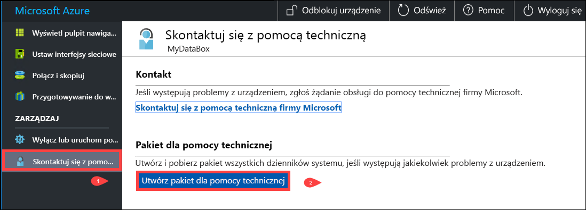

2. Następuje zbieranie danych do pakietu dla pomocy technicznej. Ta operacja trwa kilka minut.

    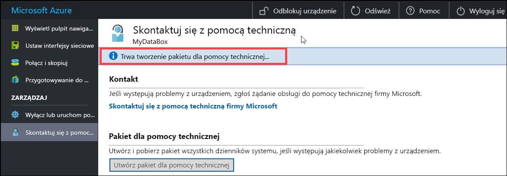

3. Po zakończeniu tworzenia pakietu dla pomocy technicznej kliknij przycisk **Pobierz pakiet dla pomocy technicznej**. 

    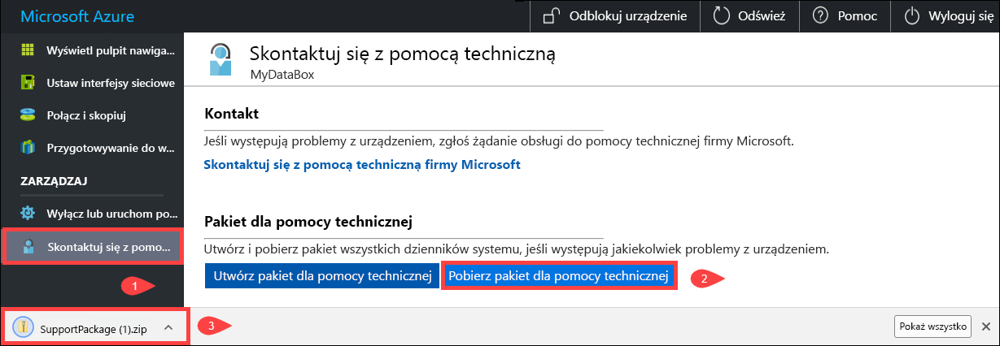

4. Przejrzyj i wybierz lokalizację pobierania. Otwórz folder, aby wyświetlić jego zawartość.

    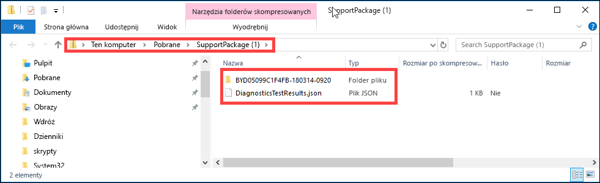


## <a name="shut-down-or-restart-your-device"></a>Zamykanie lub ponowne uruchamianie urządzenia

Można zamknąć lub ponownie urządzenie przy użyciu lokalnego Interfejsu w przeglądarce. Zaleca się, aby przed ponownym uruchomieniem przełączyć udziały w tryb offline na hoście, a następnie na urządzeniu. Minimalizuje to ryzyko uszkodzenia danych. Upewnij się, że kopiowanie danych nie jest w toku podczas wyłączania urządzenia.

Aby wyłączyć urządzenie, wykonaj następujące kroki.

1. W lokalnym internetowym interfejsie użytkownika przejdź do pozycji **Zamknij lub uruchom ponownie**.
2. Kliknij przycisk **Zamknij**.

    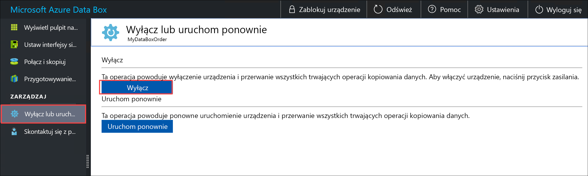

3. Po wyświetleniu monitu o potwierdzenie kliknij przycisk **OK**, aby kontynuować.

    

Aby ponownie włączyć wyłączone urządzenie, użyj przycisku zasilania na panelu przednim.

Aby ponownie uruchomić urządzenie Data Box, wykonaj następujące czynności.

1. W lokalnym internetowym interfejsie użytkownika przejdź do pozycji **Zamknij lub uruchom ponownie**.
2. Kliknij przycisk **Uruchom ponownie**.

    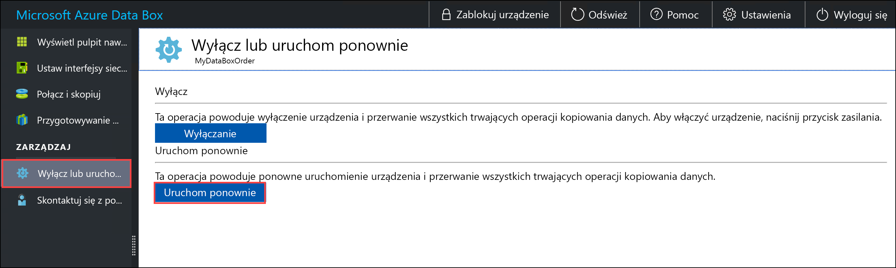

3. Po wyświetleniu monitu o potwierdzenie kliknij przycisk **OK**, aby kontynuować.

   Urządzenie zostaje wyłączone i uruchomione ponownie.

## <a name="download-bom-or-manifest-files"></a>Pobieranie zestawienia komponentów lub plików manifestu

Zestawienie materiałów (BOM) lub pliki manifestu zawierają listę plików, które są kopiowane do urządzenia Data Box lub duże pole danych. Pliki te są generowane podczas przygotowywania urządzenia do wysłania.

Przed rozpoczęciem upewnij się, że urządzenie zostało zakończone **przygotowywanie do wysłania** kroku. Wykonaj następujące kroki, aby pobrać zestawienie komponentów lub pliki manifestu:

1. Przejdź do lokalnego internetowego interfejsu użytkownika dla danego urządzenia. Zobaczysz, że urządzenie zostało zakończone przygotowanie do wysłania. Po zakończeniu przygotowywania urządzenia stan urządzenia ma wartość **Gotowe do wysyłki**.

    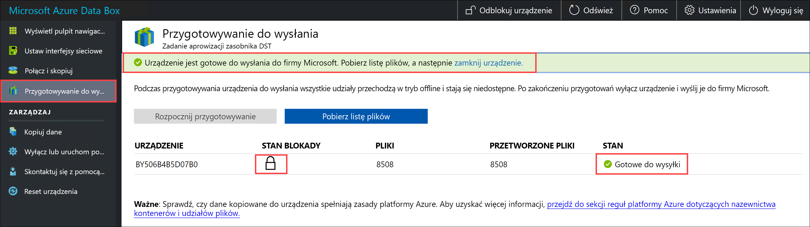

2. Kliknij pozycję **Pobierz listę plików**, aby pobrać listę plików, które zostały skopiowane na urządzenie Data Box.

    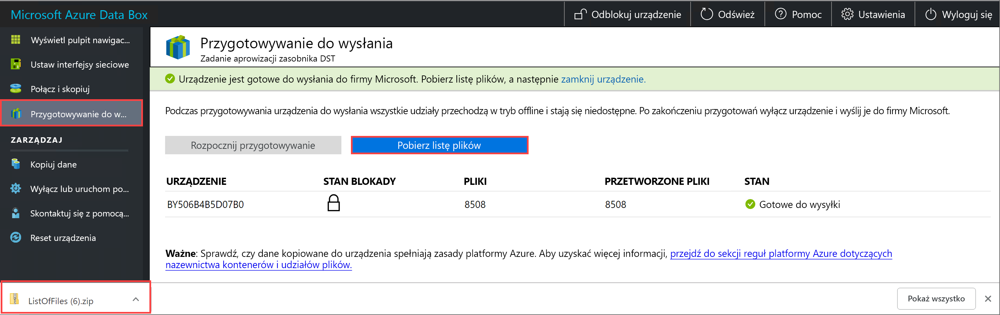

3. W Eksploratorze plików zauważysz, że jest generowana oddzielna lista plików w zależności od protokołu użytego do nawiązania połączenia z urządzeniem i od użytego typu magazynu usługi Azure Storage.

    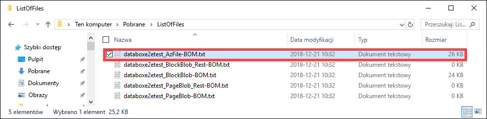

   Poniższa tabela zawiera mapowanie nazw plików na typ magazynu usługi Azure Storage i użyty protokół połączenia.

    |Nazwa pliku  |Typ magazynu usługi Azure Storage  |Użyty protokół połączenia |
    |---------|---------|---------|
    |databoxe2etest_BlockBlob.txt     |Blokowe obiekty blob         |SMB/NFS         |
    |databoxe2etest_PageBlob.txt     |Stronicowe obiekty blob         |SMB/NFS         |
    |databoxe2etest_AzFile-BOM.txt    |Azure Files         |SMB/NFS         |
    |databoxe2etest_PageBlock_Rest-BOM.txt     |Stronicowe obiekty blob         |REST        |
    |databoxe2etest_BlockBlock_Rest-BOM.txt    |Blokowe obiekty blob         |REST         |
    |mydbmdrg1_MDisk-BOM.txt    |Dysk zarządzany         |SMB/NFS         |
    |mydbmdrg2_MDisk-BOM.txt     |Dysk zarządzany         |SMB/NFS         |

Ta lista umożliwia weryfikację plików przekazanych do konta usługi Azure Storage po powrocie urządzenia Data Box do centrum danych platformy Azure. Poniżej przedstawiono przykładowy plik manifestu.

> [!NOTE]
> W danych pole bardzo duże dwa zestawy listy plików (BOM) są obecne, odpowiadający z dwoma węzłami na urządzeniu.

```xml
<file size="52689" crc64="0x95a62e3f2095181e">\databox\media\data-box-deploy-copy-data\prepare-to-ship2.png</file>
<file size="22117" crc64="0x9b160c2c43ab6869">\databox\media\data-box-deploy-copy-data\connect-shares-file-explorer2.png</file>
<file size="57159" crc64="0x1caa82004e0053a4">\databox\media\data-box-deploy-copy-data\verify-used-space-dashboard.png</file>
<file size="24777" crc64="0x3e0db0cd1ad438e0">\databox\media\data-box-deploy-copy-data\prepare-to-ship5.png</file>
<file size="162006" crc64="0x9ceacb612ecb59d6">\databox\media\data-box-cable-options\cabling-dhcp-data-only.png</file>
<file size="155066" crc64="0x051a08d36980f5bc">\databox\media\data-box-cable-options\cabling-2-port-setup.png</file>
<file size="150399" crc64="0x66c5894ff328c0b1">\databox\media\data-box-cable-options\cabling-with-switch-static-ip.png</file>
<file size="158082" crc64="0xbd4b4c5103a783ea">\databox\media\data-box-cable-options\cabling-mgmt-only.png</file>
<file size="148456" crc64="0xa461ad24c8e4344a">\databox\media\data-box-cable-options\cabling-with-static-ip.png</file>
<file size="40417" crc64="0x637f59dd10d032b3">\databox\media\data-box-portal-admin\delete-order1.png</file>
<file size="33704" crc64="0x388546569ea9a29f">\databox\media\data-box-portal-admin\clone-order1.png</file>
<file size="5757" crc64="0x9979df75ee9be91e">\databox\media\data-box-safety\japan.png</file>
<file size="998" crc64="0xc10c5a1863c5f88f">\databox\media\data-box-safety\overload_tip_hazard_icon.png</file>
<file size="5870" crc64="0x4aec2377bb16136d">\databox\media\data-box-safety\south-korea.png</file>
<file size="16572" crc64="0x05b13500a1385a87">\databox\media\data-box-safety\taiwan.png</file>
<file size="999" crc64="0x3f3f1c5c596a4920">\databox\media\data-box-safety\warning_icon.png</file>
<file size="1054" crc64="0x24911140d7487311">\databox\media\data-box-safety\read_safety_and_health_information_icon.png</file>
<file size="1258" crc64="0xc00a2d5480f4fcec">\databox\media\data-box-safety\heavy_weight_hazard_icon.png</file>
<file size="1672" crc64="0x4ae5cfa67c0e895a">\databox\media\data-box-safety\no_user_serviceable_parts_icon.png</file>
<file size="3577" crc64="0x99e3d9df341b62eb">\databox\media\data-box-safety\battery_disposal_icon.png</file>
<file size="993" crc64="0x5a1a78a399840a17">\databox\media\data-box-safety\tip_hazard_icon.png</file>
<file size="1028" crc64="0xffe332400278f013">\databox\media\data-box-safety\electrical_shock_hazard_icon.png</file>
<file size="58699" crc64="0x2c411d5202c78a95">\databox\media\data-box-deploy-ordered\data-box-ordered.png</file>
<file size="46816" crc64="0x31e48aa9ca76bd05">\databox\media\data-box-deploy-ordered\search-azure-data-box1.png</file>
<file size="24160" crc64="0x978fc0c6e0c4c16d">\databox\media\data-box-deploy-ordered\select-data-box-option1.png</file>
<file size="115954" crc64="0x0b42449312086227">\databox\media\data-box-disk-deploy-copy-data\data-box-disk-validation-tool-output.png</file>
<file size="6093" crc64="0xadb61d0d7c6d4deb">\databox\data-box-cable-options.md</file>
<file size="6499" crc64="0x080add29add367d9">\databox\data-box-deploy-copy-data-via-nfs.md</file>
<file size="11089" crc64="0xc3ce6b13a4fe3001">\databox\data-box-deploy-copy-data-via-rest.md</file>
<file size="9126" crc64="0x820856b5a54321ad">\databox\data-box-overview.md</file>
<file size="10963" crc64="0x5e9a14f9f4784fd8">\databox\data-box-safety.md</file>
<file size="5941" crc64="0x8631d62fbc038760">\databox\data-box-security.md</file>
<file size="12536" crc64="0x8c8ff93e73d665ec">\databox\data-box-system-requirements-rest.md</file>
<file size="3220" crc64="0x7257a263c434839a">\databox\data-box-system-requirements.md</file>
<file size="2823" crc64="0x63db1ada6fcdc672">\databox\index.yml</file>
<file size="4364" crc64="0x62b5710f58f00b8b">\databox\data-box-local-web-ui-admin.md</file>
<file size="3603" crc64="0x7e34c25d5606693f">\databox\TOC.yml</file>
```

Ten plik zawiera listę wszystkich plików, które zostały skopiowane na urządzenie Data Box lub duże pole danych. W tym pliku wartość *crc64* odnosi się do sumy kontrolnej wygenerowanej dla odpowiadającego jej pliku.

## <a name="view-available-capacity-of-the-device"></a>Wyświetlanie dostępnej pojemności urządzenia

Aby wyświetlić dostępną i używaną pojemność urządzenia, można użyć jego pulpitu nawigacyjnego.

1. W lokalnym internetowym interfejsie użytkownika przejdź do pozycji **Wyświetl pulpit nawigacyjny**.
2. W obszarze **Połącz i skopiuj** jest wyświetlane wolne i zajęte miejsce na urządzeniu.

    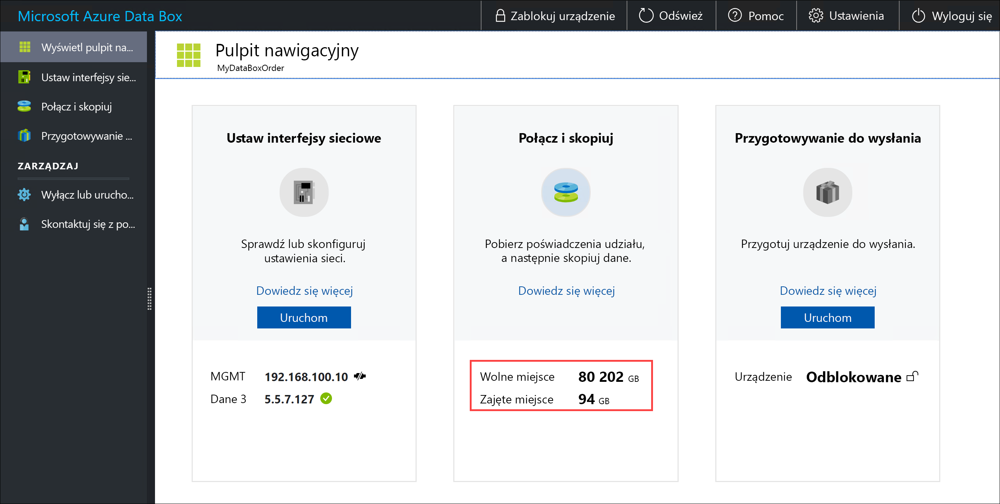

## <a name="skip-checksum-validation"></a>Pomijanie weryfikacji sumy kontrolnej

Suma kontrolna jest generowana domyślnie dla danych podczas przygotowywania do wysłania. W niektórych rzadkich przypadkach, w zależności od typu danych (małe rozmiary plików), wydajność może zostać zmniejszona. W takich przypadkach można pominąć generowanie sumy kontrolnej.

Zdecydowanie zaleca się, aby nie wyłączać sumy kontrolnej, chyba że jej generowanie ma znaczny wpływ na wydajność.

1. W prawym górnym rogu lokalnego internetowego interfejsu użytkownika urządzenia, przejdź do **ustawienia**.

    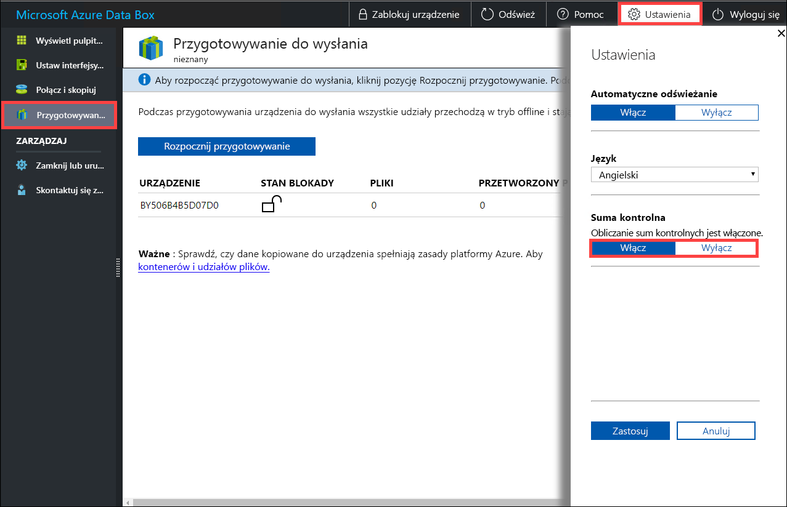

2. **Wyłącz** weryfikację sumy kontrolnej.
3. Kliknij przycisk **Zastosuj**.

## <a name="next-steps"></a>Kolejne kroki

- Dowiedz się, jak [zarządzania urządzenia Data Box i duże pole danych za pośrednictwem witryny Azure portal](data-box-portal-admin.md).

