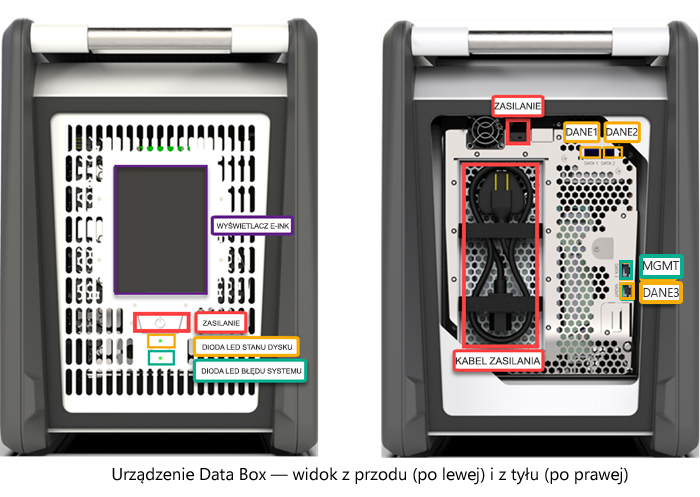
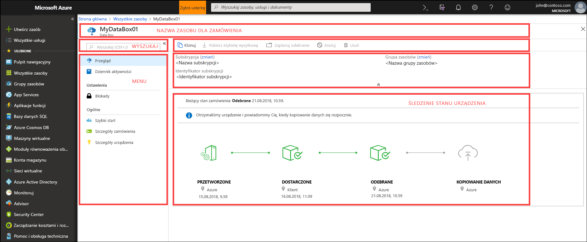
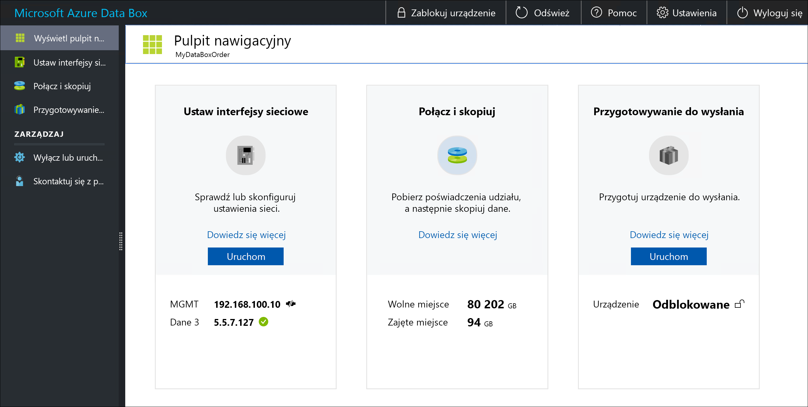

# Co to jest usługa Azure Data Box?

Rozwiązanie chmurowe Microsoft Azure Data Box umożliwia wysyłanie terabajtów danych lokalnych na platformę Azure w szybki, niedrogi i niezawodny sposób. Bezpieczny transfer danych jest przyspieszany przez wysłanie do Ciebie należącego do firmy Microsoft urządzenia magazynującego Data Box. Każde urządzenie ma dostępną pojemność wynoszącą 80 TB i jest dostarczane do Twojego centrum danych przez regionalnego przewoźnika. Urządzenie ma odporną na wstrząsy obudowę chroniącą i zabezpieczającą dane w czasie transportu.

Urządzenie Data Box można zamówić w witrynie Azure Portal. Po otrzymaniu urządzenia możesz szybko je skonfigurować przy użyciu lokalnego internetowego interfejsu użytkownika. Skopiuj dane z serwerów na urządzenie, a następnie wyślij urządzenie z powrotem do centrum danych platformy Azure. W centrum danych platformy Azure Twoje dane są automatycznie przekazywane z urządzenia na platformę Azure. Cały proces można śledzić przez usługę Data Box w witrynie Azure Portal.

## Przypadki zastosowań

Urządzenie Data Box doskonale nadaje się do przesyłania danych o rozmiarze przekraczającym 40 TB w scenariuszach z ograniczoną łącznością lub bez łączności z siecią. Przenoszenie danych może być jednorazowe lub okresowe. Może być to również początkowy transfer danych zbiorczych, po którym następują transfery okresowe. Poniżej przedstawiono różne scenariusze, w których można wykorzystać urządzenie Data Box do transferu danych.

 - **Migracja jednorazowa** — przenoszenie dużej ilości danych lokalnych na platformę Azure. 
     - Przenoszenie biblioteki multimediów przechowywanej offline na taśmach na platformę Azure w celu utworzenia biblioteki multimediów w trybie online.
     - Migrowanie farmy maszyn wirtualnych, programu SQL Server i aplikacji na platformę Azure.
     - Przenoszenie danych historycznych na platformę Azure na potrzeby szczegółowej analizy i raportowania za pomocą usługi HDInsight.

 - **Początkowy transfer zbiorczy** — po zakończeniu początkowego transferu zbiorczego przeprowadzonego za pomocą rozwiązania Data Box (inicjatora) następują transfery przyrostowe za pośrednictwem sieci. 
     - Na przykład przeniesienie dużych początkowych kopii zapasowych danych historycznych na platformę Azure następuje za pośrednictwem partnerów rozwiązań do tworzenia kopii zapasowych, takich jak Commvault, i urządzenia Data Box. Po zakończeniu tego procesu dane przyrostowe są przekazywane za pośrednictwem sieci do usługi Azure Storage.

- **Okresowe operacje przekazywania** — gdy duże ilości danych są generowane okresowo i trzeba je przenosić na platformę Azure. Może to dotyczyć na przykład scenariusza eksploracji zasobów energii, w którym jest generowana zawartość wideo przeznaczona dla platform wiertniczych i elektrowni wiatrowych.      

## Korzyści

Rozwiązanie Data Box jest przeznaczone do przenoszenia dużych ilości danych na platformę Azure bez wpływu na sieć lub przy niewielkim wpływie na sieć. Oferuje ono następujące korzyści:

- **Szybkość** — urządzenie Data Box umożliwia przeniesienie do 80 TB danych na platformę Azure za pomocą interfejsu sieciowego 1 Gb/s lub 10 Gb/s.

- **Bezpieczeństwo** — rozwiązanie Data Box ma wbudowane zabezpieczenia urządzenia, danych i usługi.
  - Urządzenie ma odporną na wstrząsy obudowę zabezpieczoną antywłamaniowymi śrubami i nalepkami umożliwiającymi wykrycie manipulacji. 
  - Dane na urządzeniu są przez cały czas zabezpieczane za pomocą 256-bitowego szyfrowania AES.
  - Urządzenie można odblokować tylko przy użyciu hasła podanego w witrynie Azure Portal.
  - Usługa jest chroniona przy użyciu funkcji zabezpieczeń platformy Azure.
  - Po przekazaniu danych na platformę Azure dyski urządzenia są czyszczone zgodnie ze standardami NIST 800-88r1.
    
    Aby uzyskać więcej informacji, przejdź do tematu [Zabezpieczenia i ochrona danych w usłudze Azure Data Box](data-box-security.md).

## Funkcje i specyfikacje

Urządzenie Data Box ma w tej wersji następujące cechy.

| Specyfikacje                                          | Opis              |
|---------------------------------------------------------|--------------------------|
| Waga                                                  | Poniżej 50 funtów                |
| Wymiary                                              | Urządzenie — Szerokość: 309,0 mm; Wysokość: 430,4 mm; Głębokość: 502,0 mm |            
| Miejsce w stojaku                                              | 7 U po umieszczeniu w stojaku na boku (nie może być montowane w stojaku)|
| Wymagane przewody                                         | 1 przewód zasilający (dołączony)   2 przewody RJ-45   2 przewody miedziane SFP+ Twinax|
| Pojemność magazynu                                        | Urządzenie o pojemności 100 TB ma 80 TB dostępnej pojemności po zastosowaniu ochrony RAID 5|
| Moc znamionowa                                            | Zasilacz jest przystosowany do mocy 700 W.   Na ogół zasilacz pobiera 375 W.|
| Interfejsy sieciowe                                      | 2 interfejsy 1 GbE — MGMT, DATA 3.   Interfejs MGMT — do zarządzania, bez możliwości konfigurowania przez użytkownika, używany do konfiguracji początkowej.   Interfejs DATA 3 — do danych, z możliwością konfigurowania przez użytkownika, domyślnie dynamiczny.   Interfejsy MGMT i DATA 3 mogą być również interfejsami 10 GbE.   2 interfejsy 10 GbE — DATA 1, DATA 2.   Oba interfejsy są przeznaczone do danych, mogą być skonfigurowane jako dynamiczne (domyślnie) lub statyczne. |
| Nośniki do transferu danych                                     | Przewody 10 GbE Ethernet, RJ45 i miedziany SFP+  |
| Bezpieczeństwo                                                | Wytrzymała obudowa urządzenia z antywłamaniowymi śrubami.   Nalepki umożliwiające wykrycie naruszenia umieszczone w dolnej części urządzenia.|
| Szybkość transferu danych                                      | Do 80 TB w ciągu jednego dnia przy zastosowaniu interfejsu sieciowego 10 GbE.        |
| Zarządzanie                                              | Lokalny internetowy interfejs użytkownika — jednorazowa konfiguracja początkowa.   Witryna Azure Portal — bieżące zarządzanie urządzeniem.        |

## Składniki rozwiązania Data Box

Rozwiązanie Data Box składa się z następujących składników:

* **Urządzenie Data Box** — urządzenie fizyczne zapewniające pierwotny magazyn danych, odpowiadające za komunikację z magazynem w chmurze oraz zapewniające bezpieczeństwo i poufność danych. Urządzenie Data Box ma 80 TB pojemności magazynu do wykorzystania. 

    

    
* **Usługa Data Box** — rozszerzenie witryny Azure Portal, które pozwala na zarządzanie urządzeniem Data Box za pomocą internetowego interfejsu umożliwiającego uzyskiwanie dostępu z różnych lokalizacji geograficznych. Usługa Data Box umożliwia wykonywanie bieżących zadań administracyjnych na urządzeniu Data Box. Zadania usługi obejmują tworzenie zamówień i zarządzanie nimi, wyświetlanie alertów i zarządzanie nimi oraz zarządzanie udziałami.  

    

    Aby uzyskać więcej informacji, przejdź do tematu [Administrowanie urządzeniem Data Box za pomocą usługi Data Box](data-box-portal-ui-admin.md).

* **Lokalny internetowy interfejs użytkownika** — internetowy interfejs użytkownika używany do konfigurowania urządzenia (dzięki czemu może ono nawiązać połączenie z siecią lokalną) oraz do rejestrowania urządzenia w usłudze Data Box. Lokalny internetowy interfejs użytkownika umożliwia również wyłączanie i ponowne uruchamianie urządzenia Data Box, wyświetlanie dzienników kopiowania oraz kontaktowanie się z pomocą techniczną firmy Microsoft w celu zgłoszenia żądania obsługi.

    

    Aby uzyskać informacje na temat korzystania z internetowego interfejsu użytkownika, przejdź do tematu [Administrowanie rozwiązaniem Data Box za pomocą internetowego interfejsu użytkownika](data-box-portal-ui-admin.md).

## Przepływ pracy

Typowy przepływ obejmuje następujące kroki:

1. **Zamawianie** — utwórz zamówienie w witrynie Azure Portal oraz podaj informacje wysyłkowe i docelowe konto magazynu platformy Azure dla danych. Jeśli urządzenie jest dostępne, platforma Azure przygotowuje i wysyła urządzenie z identyfikatorem śledzenia przesyłki.

2. **Odbieranie** — gdy urządzenie zostanie dostarczone, podłącz je do sieci i zasilania przy użyciu wskazanych przewodów. Włącz urządzenie i nawiąż z nim połączenie. Skonfiguruj sieć urządzenia i zainstaluj udziały na komputerze-hoście, z którego chcesz skopiować dane.

3. **Kopiowanie danych** — skopiuj dane do udziałów urządzenia Data Box.

4. **Zwracanie** — przygotuj, wyłącz i odeślij urządzenie z powrotem do centrum danych platformy Azure.

5. **Przekazywanie** — dane są automatycznie kopiowane z urządzenia na platformę Azure. Dyski urządzenia są bezpiecznie wymazywane zgodnie z wytycznymi Narodowego Instytutu Standaryzacji i Technologii (NIST, National Institute of Standards and Technology).

W trakcie tego procesu będziesz otrzymywać powiadomienia e-mail o wszystkich zmianach stanu. Aby uzyskać więcej informacji na temat szczegółowego przepływu, przejdź do tematu [Deploy Data Box in Azure portal (Wdrażanie usługi Data Box w witrynie Azure Portal)](data-box-deploy-ordered.md).

## Dostępność w danym regionie

Rozwiązanie Data Box umożliwia przesyłanie danych w zależności od regionu, w którym wdrożono usługę, kraju, do którego wysłano urządzenie, oraz docelowego konta usługi Azure Storage, do którego przekazano dane. 

- **Dostępność usługi** — w tej wersji usługa Data Box jest dostępna w następujących regionach:
    - Wszystkie regiony w Stanach Zjednoczonych — Zachodnio-środkowe stany USA, Zachodnie stany USA 2, Zachodnie stany USA, Południowo-środkowe stany USA, Środkowe stany USA, Północno-środkowe stany USA, Wschodnie stany USA i Wschodnie stany USA 2.
    - Unia Europejska — Europa Zachodnia i Europa Północna.
    - Zjednoczone Królestwo — Południowe Zjednoczone Królestwo i Zachodnie Zjednoczone Królestwo.
    - Francja — Francja Środkowa i Francja Południowa.

- **Docelowe konta magazynu** — konta magazynu do przechowywania danych są dostępne we wszystkich regionach świadczenia usługi Azure, w których ta usługa jest dostępna.  

## Kolejne kroki

- Przejrzyj [wymagania systemowe usługi Data Box](data-box-system-requirements.md).
- Poznaj [ograniczenia usługi Data Box](data-box-limits.md).
- Szybko wdróż usługę [Azure Data Box](data-box-quickstart-portal.md) w witrynie Azure Portal.

