# <a name="use-the-azure-portal-to-administer-your-azure-data-box-and-azure-data-box-heavy"></a>Użyj Azure Portal, aby administrować Azure Data Box i Azure Data Box Heavy

Ten artykuł dotyczy zarówno Azure Data Box, jak i Azure Data Box Heavy. W tym artykule opisano niektóre złożone przepływy pracy i zadania zarządzania, które można wykonać na urządzeniu Azure Data Box. Urządzeniem urządzenie Data Box można zarządzać za pośrednictwem Azure Portal lub za pośrednictwem lokalnego interfejsu użytkownika sieci Web.

Ten artykuł dotyczy zadań, które można wykonywać w witrynie Azure Portal. Użyj Azure Portal, aby zarządzać zamówieniami, zarządzać urządzeniem urządzenie Data Box i śledzić stan zamówienia w miarę ich kończenia.


## <a name="cancel-an-order"></a>Anulowanie zamówienia

Może się zdarzyć, że z różnych powodów będzie konieczne anulowanie złożonego zamówienia. Zamówienie można anulować tylko przed rozpoczęciem jego przetwarzania. Gdy zamówienie zostanie przetworzone i urządzenie Data Box urządzenie jest przygotowywane, nie będzie możliwe anulowanie zamówienia.

Aby anulować zamówienie, wykonaj poniższe czynności.

1.  Przejdź do pozycji **Przegląd > Anuluj**.

    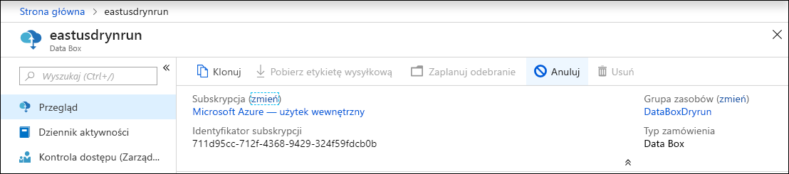

2.  Wprowadź przyczynę anulowania zamówienia.  

    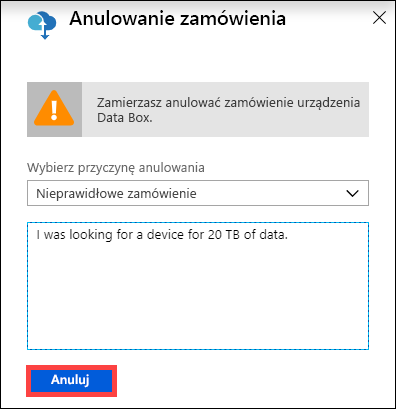

3.  Po anulowaniu zamówienia jego stan w portalu zostanie zmieniony na **Anulowane**.

## <a name="clone-an-order"></a>Klonowanie zamówienia

Klonowanie jest przydatne w pewnych sytuacjach. Załóżmy na przykład, że użytkownik skorzystał z usługi Data Box do transferu danych. Po wygenerowaniu większej ilości danych istnieje potrzeba, aby inne urządzenie urządzenie Data Box przetransferować te dane na platformę Azure. W takim przypadku można po prostu sklonować to samo zamówienie.

Aby sklonować zamówienie, wykonaj następujące czynności.

1.  Przejdź do pozycji **Przegląd > Klonuj**. 

    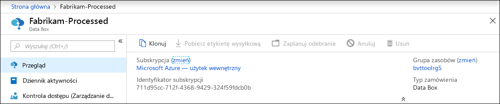

2.  Wszystkie szczegóły zamówienia pozostaną takie same. Nazwa zamówienia będzie taka jak nazwa oryginalnego zamówienia z dodaną końcówką *— klon*. Zaznacz pole wyboru, aby potwierdzić zapoznanie się z informacjami dotyczącymi prywatności. Kliknij przycisk **Utwórz**.

W ciągu kilku minut sklonowanie zamówienie zostanie utworzone i wyświetlone w portalu.


## <a name="delete-order"></a>Usuwanie zamówienia

Możesz usunąć zamówienie, gdy zostanie zakończone. Zamówienie zawiera dane osobowe, takie jak imię i nazwisko, adres i dane kontaktowe. Te dane osobowe są usuwane po usunięciu zamówienia.

Można usuwać tylko zamówienia, które zostały zakończone lub anulowane. Aby usunąć zamówienie, wykonaj następujące czynności.

1. Przejdź do sekcji **Wszystkie zasoby**. Wyszukaj zamówienie.

2. Kliknij zamówienie, które chcesz usunąć, i przejdź do sekcji **Przegląd**. Na pasku poleceń kliknij pozycję **Usuń**.

    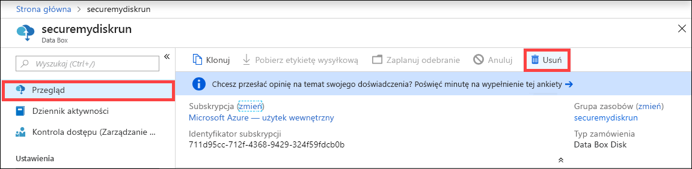

3. Gdy pojawi się monit o potwierdzenie usunięcia zamówienia, podaj nazwę zamówienia. Kliknij przycisk **Usuń**.

## <a name="download-shipping-label"></a>Pobierz etykietę wysyłkową

Jeśli wyświetlacz E-ink urządzenia Data Box nie działa i nie wyświetla zwrotnej etykiety wysyłkowej, może być konieczne pobranie etykiety wysyłkowej. Na Data Box Heavy nie ma wyświetlania pisma odręcznego, dlatego ten przepływ pracy nie ma zastosowania do Data Box Heavy.

Aby pobrać etykietę wysyłkową, wykonaj następujące czynności.

1.  Przejdź do pozycji **Przegląd > Pobierz etykietę wysyłkową**. Ta opcja jest dostępna tylko po wysłaniu urządzenia. 

    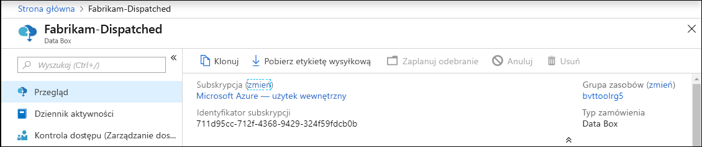

2.  To spowoduje pobranie następującej zwrotnej etykiety wysyłkowej. Zapisz i wydrukuj etykietę. Złóż etykietę i włóż ją do przezroczystej koszulki na urządzeniu. Upewnij się, że etykieta jest widoczna. Usuń wszystkie znajdujące się na urządzeniu nalepki z poprzedniej wysyłki.

    

## <a name="edit-shipping-address"></a>Edytowanie adresu wysyłkowego

Może się zdarzyć, że po złożeniu zamówienia konieczne będzie edytowanie adresu wysyłkowego. Jest to możliwe tylko przed wysłaniem urządzenia. Po wysłaniu urządzenia ta opcja nie jest już dostępna.

Aby edytować zamówienie, wykonaj następujące czynności.

1. Przejdź do pozycji **Szczegóły zamówienia > Edytuj adres wysyłkowy**.

    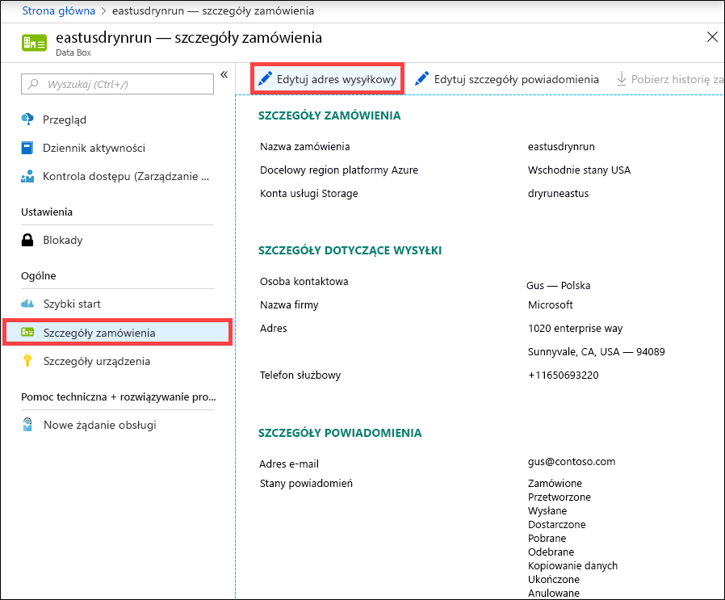

2. Przeprowadź edycję adresu wysyłkowego i sprawdź jego poprawność, a następnie zapisz zmiany.

    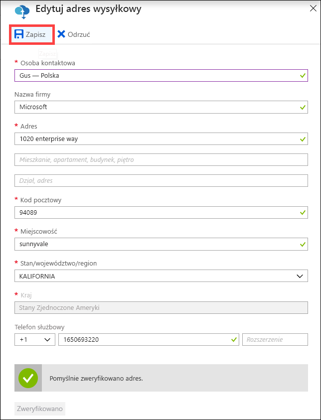

## <a name="edit-notification-details"></a>Edytowanie szczegółów powiadomienia

Może być konieczna zmiana danych użytkowników, którzy mają otrzymywać wiadomości e-mail z powiadomieniami o stanie zamówienia. Na przykład określony użytkownik może potrzebować informacji o dostarczeniu lub odebraniu urządzenia. Może być konieczne uzyskanie informacji o innym użytkowniku, gdy kopia danych zostanie ukończona, aby można było sprawdzić, czy dane znajdują się na koncie usługi Azure Storage, przed usunięciem go ze źródła. W takich przypadkach można edytować szczegóły powiadomień.

Aby edytować szczegóły powiadomień, wykonaj następujące czynności.

1. Przejdź do pozycji **Szczegóły zamówienia > Edytowanie szczegółów powiadomienia**.

    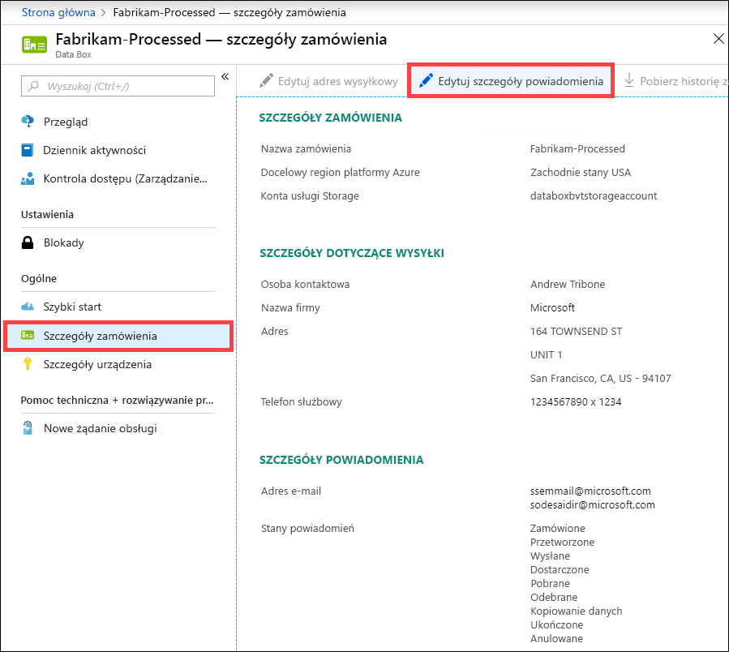

2. Możesz teraz edytować szczegóły powiadomień. Następnie zapisz zmiany.
 
    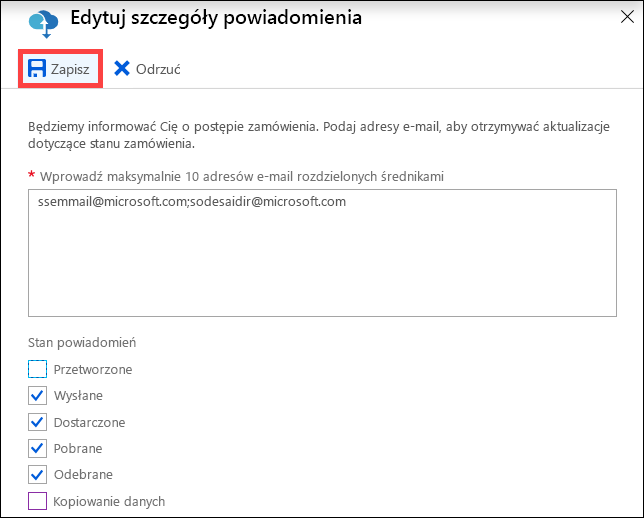


## <a name="download-order-history"></a>Pobierz historię zamówień

Po zakończeniu zamówienia dotyczącego urządzenia Data Box dane na dyskach urządzenia są wymazywane. Po zakończeniu czyszczenia urządzenia możesz pobrać historię zamówienia w witrynie Azure Portal.

Aby pobrać historię zamówienia, wykonaj poniższe kroki.

1. W swoim zamówieniu dotyczącym urządzenia Data Box przejdź na kartę **Przegląd**. Upewnij się, że zamówienie jest zakończone. Jeśli zamówienie jest zakończone i czyszczenie urządzenia zostało ukończone, przejdź do pozycji **Szczegóły zamówienia**. Opcja **Pobieranie historii zamówienia** jest dostępna.

    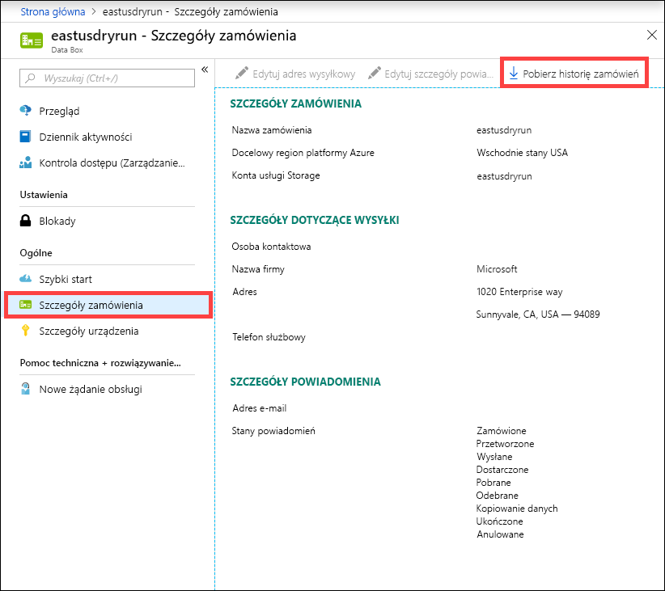

2. Kliknij pozycję **Pobierz historię zamówienia**. W pobranej historii zostanie wyświetlony rekord dzienników śledzenia przewoźnika. Dostępne są dwa zestawy dzienników odpowiadające dwóm węzłom na Data Box Heavy. Po przewinięciu do dołu tego dziennika możesz zobaczyć linki do następujących obiektów:
    
   - **Dzienniki kopiowania** — lista plików, które wygenerowały błędy podczas kopiowania danych z urządzenia Data Box do Twojego konta usługi Azure Storage.
   - **Dzienniki inspekcji** — zawierają informacje dotyczące włączania i uzyskiwania dostępu do udziałów w urządzenie Data Box, gdy jest on poza centrum danych platformy Azure.
   - **Pliki BOM** — uzyskaj listę plików (nazywaną także manifestem plików), które można pobrać podczas **przygotowania do wysłania**, zawierająca nazwy plików, rozmiary plików i sumy kontrolne plików.

       ```
       -------------------------------
       Microsoft Data Box Order Report
       -------------------------------
       Name                                               : DataBoxTestOrder                              
       StartTime(UTC)                                     : 10/31/2018 8:49:23 AM +00:00                       
       DeviceType                                         : DataBox                                           
       -------------------
       Data Box Activities
       -------------------
       Time(UTC)                 | Activity                       | Status          | Description  
       
       10/31/2018 8:49:26 AM     | OrderCreated                   | Completed       |                                                   
       11/2/2018 7:32:53 AM      | DevicePrepared                 | Completed       |                                                   
       11/3/2018 1:36:43 PM      | ShippingToCustomer             | InProgress      | Shipment picked up. Local Time : 11/3/2018 1:36:43        PM at AMSTERDAM-NLD                                                                                
       11/4/2018 8:23:30 PM      | ShippingToCustomer             | InProgress      | Processed at AMSTERDAM-NLD. Local Time : 11/4/2018        8:23:30 PM at AMSTERDAM-NLD                                                                        
       11/4/2018 11:43:34 PM     | ShippingToCustomer             | InProgress      | Departed Facility in AMSTERDAM-NLD. Local Time :          11/4/2018 11:43:34 PM at AMSTERDAM-NLD                                                               
       11/5/2018 1:38:20 AM      | ShippingToCustomer             | InProgress      | Arrived at Sort Facility LEIPZIG-DEU. Local Time :        11/5/2018 1:38:20 AM at LEIPZIG-DEU                                                                
       11/5/2018 2:31:07 AM      | ShippingToCustomer             | InProgress      | Processed at LEIPZIG-DEU. Local Time : 11/5/2018          2:31:07 AM at LEIPZIG-DEU                                                                            
       11/5/2018 4:05:58 AM      | ShippingToCustomer             | InProgress      | Departed Facility in LEIPZIG-DEU. Local Time :            11/5/2018 4:05:58 AM at LEIPZIG-DEU                                                                    
       11/5/2018 4:35:43 AM      | ShippingToCustomer             | InProgress      | Transferred through LUTON-GBR. Local Time :              11/5/2018 4:35:43 AM at LUTON-GBR                                                                         
       11/5/2018 4:52:15 AM      | ShippingToCustomer             | InProgress      | Departed Facility in LUTON-GBR. Local Time :              11/5/2018 4:52:15 AM at LUTON-GBR                                                                        
       11/5/2018 5:47:58 AM      | ShippingToCustomer             | InProgress      | Arrived at Sort Facility LONDON-HEATHROW-GBR.            Local Time : 10/5/2018 5:47:58 AM at LONDON-HEATHROW-GBR                                                
       11/5/2018 6:27:37 AM      | ShippingToCustomer             | InProgress      | Processed at LONDON-HEATHROW-GBR. Local Time :            11/5/2018 6:27:37 AM at LONDON-HEATHROW-GBR                                                            
       11/5/2018 6:39:40 AM      | ShippingToCustomer             | InProgress      | Departed Facility in LONDON-HEATHROW-GBR. Local          Time : 11/5/2018 6:39:40 AM at LONDON-HEATHROW-GBR                                                    
       11/5/2018 8:13:49 AM      | ShippingToCustomer             | InProgress      | Arrived at Delivery Facility in LAMBETH-GBR. Local        Time : 11/5/2018 8:13:49 AM at LAMBETH-GBR                                                         
       11/5/2018 9:13:24 AM      | ShippingToCustomer             | InProgress      | With delivery courier. Local Time : 11/5/2018            9:13:24 AM at LAMBETH-GBR                                                                               
       11/5/2018 12:03:04 PM     | ShippingToCustomer             | Completed       | Delivered - Signed for by. Local Time : 11/5/2018        12:03:04 PM at LAMBETH-GBR                                                                          
       1/25/2019 3:19:25 PM      | ShippingToDataCenter           | InProgress      | Shipment picked up. Local Time : 1/25/2019 3:19:25        PM at LAMBETH-GBR                                                                                       
       1/25/2019 8:03:55 PM      | ShippingToDataCenter           | InProgress      | Processed at LAMBETH-GBR. Local Time : 1/25/2019          8:03:55 PM at LAMBETH-GBR                                                                            
       1/25/2019 8:04:58 PM      | ShippingToDataCenter           | InProgress      | Departed Facility in LAMBETH-GBR. Local Time :            1/25/2019 8:04:58 PM at LAMBETH-GBR                                                                    
       1/25/2019 9:06:09 PM      | ShippingToDataCenter           | InProgress      | Arrived at Sort Facility LONDON-HEATHROW-GBR.            Local Time : 1/25/2019 9:06:09 PM at LONDON-HEATHROW-GBR                                                
       1/25/2019 9:48:54 PM      | ShippingToDataCenter           | InProgress      | Processed at LONDON-HEATHROW-GBR. Local Time :            1/25/2019 9:48:54 PM at LONDON-HEATHROW-GBR                                                            
       1/25/2019 10:30:20 PM     | ShippingToDataCenter           | InProgress      | Departed Facility in LONDON-HEATHROW-GBR. Local          Time : 1/25/2019 10:30:20 PM at LONDON-HEATHROW-GBR                                                   
       1/26/2019 2:17:10 PM      | ShippingToDataCenter           | InProgress      | Arrived at Sort Facility BRUSSELS-BEL. Local Time        : 1/26/2019 2:17:10 PM at BRUSSELS-BEL                                                              
       1/26/2019 2:31:57 PM      | ShippingToDataCenter           | InProgress      | Processed at BRUSSELS-BEL. Local Time : 1/26/2019        2:31:57 PM at BRUSSELS-BEL                                                                          
       1/26/2019 3:37:53 PM      | ShippingToDataCenter           | InProgress      | Processed at BRUSSELS-BEL. Local Time : 1/26/2019        3:37:53 PM at BRUSSELS-BEL                                                                          
       1/27/2019 11:01:45 AM     | ShippingToDataCenter           | InProgress      | Departed Facility in BRUSSELS-BEL. Local Time :          1/27/2019 11:01:45 AM at BRUSSELS-BEL                                                                 
       1/28/2019 7:11:35 AM      | ShippingToDataCenter           | InProgress      | Arrived at Delivery Facility in AMSTERDAM-NLD.            Local Time : 1/28/2019 7:11:35 AM at AMSTERDAM-NLD                                                     
       1/28/2019 9:07:57 AM      | ShippingToDataCenter           | InProgress      | With delivery courier. Local Time : 1/28/2019            9:07:57 AM at AMSTERDAM-NLD                                                                             
       1/28/2019 1:35:56 PM      | ShippingToDataCenter           | InProgress      | Scheduled for delivery. Local Time : 1/28/2019            1:35:56 PM at AMSTERDAM-NLD                                                                            
       1/28/2019 2:57:48 PM      | ShippingToDataCenter           | Completed       | Delivered - Signed for by. Local Time : 1/28/2019        2:57:48 PM at AMSTERDAM-NLD                                                                         
       1/29/2019 2:18:43 PM      | PhysicalVerification           | Completed       |                                              
       1/29/2019 3:49:50 PM      | DeviceBoot                     | Completed       | Appliance booted up successfully                  
       1/29/2019 3:49:51 PM      | AnomalyDetection               | Completed       | No anomaly detected.                               
       1/29/2019 4:55:00 PM      | DataCopy                       | Started         |                                                 
       2/2/2019 7:07:34 PM       | DataCopy                       | Completed       | Copy Completed.                                   
       2/4/2019 7:47:32 PM       | SecureErase                    | Started         |                                                  
       2/4/2019 8:01:10 PM      | SecureErase                    | Completed       | Azure Data Box:DEVICESERIALNO has been sanitized          according to NIST 800-88 Rev 1.                                                                       

       ------------------
       Data Box Log Links
       ------------------

       Account Name         : Gus                                                       
       Copy Logs Path       : databoxcopylog/DataBoxTestOrder_CHC533180024_CopyLog_73a81b2d613547a28ecb7b1612fe93ca.xml
       Audit Logs Path      : azuredatabox-chainofcustodylogs\7fc6cac9-9cd6-4dd8-ae22-1ce479666282\chc533180024
       BOM Files Path       : azuredatabox-chainofcustodylogs\7fc6cac9-9cd6-4dd8-ae22-1ce479666282\chc533180024      
       ```
     Następnie możesz przejść do swojego konta magazynu i wyświetlić dzienniki kopiowania.

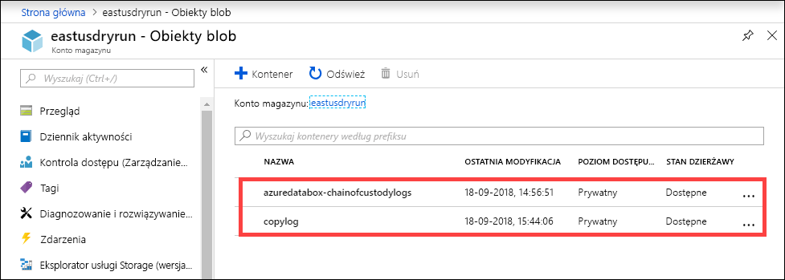

Możesz również wyświetlić łańcuch dzienników nadzoru, które zawierają dzienniki inspekcji oraz pliki BOM.

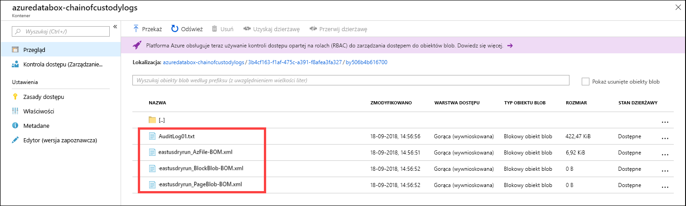

## <a name="view-order-status"></a>Wyświetlanie stanu zamówienia

Po zmianie stanu urządzenia w portalu otrzymasz powiadomienie pocztą e-mail.

|Stan zamówienia |Opis |
|---------|---------|
|Zamówione     | Pomyślnie złożono zamówienie. <br>Jeśli urządzenie jest dostępne, firma Microsoft identyfikuje i przygotowuje urządzenie do wysłania. <br> Jeśli urządzenie nie jest dostępne natychmiast, zamówienie zostanie przetworzone, gdy urządzenie stanie się dostępne. Przetworzenie zamówienia może potrwać od kilku dni do kilku miesięcy. Jeśli zamówienia nie można zrealizować w ciągu 90 dni, zostanie ono anulowane, a Ty otrzymasz powiadomienie.         |
|Przetworzone     | Zakończono przetwarzanie zamówienia. Zgodnie z Twoim zamówieniem urządzenie jest gotowe do wysyłki w centrum danych.         |
|Wysłane     | Zamówienie zostało wysłane. Skorzystaj z identyfikatora śledzenia wyświetlanego w zamówienia w portalu, aby śledzić wysyłkę.        |
|Dostarczono     | Wysyłka została dostarczona na adres wskazany w zamówieniu.        |
|Pobrane     |Twoja wysyłka zwrotna została pobrana i zeskanowana przez operatora.         |
|Odebrane     | Twoje urządzenie zostało odebrane i zeskanowane w centrum danych platformy Azure. <br> Po sprawdzeniu wysyłki rozpocznie się przekazywanie urządzenia.      |
|Kopiowanie danych     | Kopiowanie danych jest w toku. Śledź postęp kopiowania w ramach Twojego zamówienia w witrynie Azure Portal. <br> Poczekaj na zakończenie kopiowania danych. |
|Zakończone       |Zamówienie zostało pomyślnie zrealizowane.<br> Przed usunięciem danych lokalnych z serwerów upewnij się, że Twoje dane znajdują się na platformie Azure.         |
|Zakończone z błędami| Kopiowanie danych zostało ukończone, ale podczas kopiowania wystąpiły błędy. <br> Przejrzyj dzienniki kopiowania, używając ścieżki wskazanej w witrynie Azure Portal. Zobacz [przykłady kopiowania dzienników, gdy przekazywanie zostało zakończone z błędami](https://docs.microsoft.com/azure/databox/data-box-logs#upload-completed-with-errors).   |
|Zakończone z ostrzeżeniami| Kopiowanie danych zostało ukończone, ale dane zostały zmodyfikowane. Dane mają Niekrytyczne błędy obiektów blob lub nazw plików, które zostały naprawione przez zmianę nazw plików lub obiektów BLOB. <br> Przejrzyj dzienniki kopiowania, używając ścieżki wskazanej w witrynie Azure Portal. Zanotuj modyfikacje danych. Zobacz [przykłady kopiowania dzienników po zakończeniu przekazywania z ostrzeżeniami](https://docs.microsoft.com/azure/databox/data-box-logs#upload-completed-with-warnings).   |
|Anulowane            |Twoje zamówienie zostało anulowane. <br> Zamówienie mogło zostać anulowane przez Ciebie lub, w przypadku wystąpienia błędu, przez usługę. Jeśli zamówienia nie można zrealizować w ciągu 90 dni, także zostanie ono anulowane, a Ty otrzymasz powiadomienie.     |
|Czyszczenie | Dane na dyskach urządzenia zostaną usunięte. Czyszczenie urządzenia uważa się za ukończone, gdy historia zamówienia jest dostępna do pobrania w witrynie Azure Portal.|


## <a name="next-steps"></a>Następne kroki

- Dowiedz się [, jak rozwiązywać problemy urządzenie Data Box i Data Box Heavy](data-box-troubleshoot.md).
